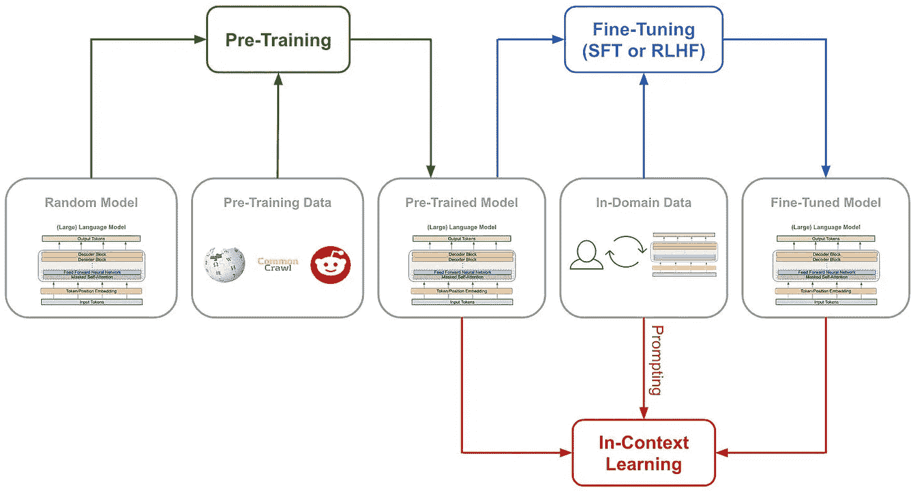

# 使用大语言模型的监督微调（SFT）

> 原文：[`towardsdatascience.com/supervised-fine-tuning-sft-with-large-language-models-0c7d66a26788?source=collection_archive---------5-----------------------#2024-01-16`](https://towardsdatascience.com/supervised-fine-tuning-sft-with-large-language-models-0c7d66a26788?source=collection_archive---------5-----------------------#2024-01-16)

## 了解 SFT 如何从理念到实际实现……

 [Cameron R. Wolfe, Ph.D.](https://wolfecameron.medium.com/?source=post_page---byline--0c7d66a26788--------------------------------)

·发表于[Towards Data Science](https://towardsdatascience.com/?source=post_page---byline--0c7d66a26788--------------------------------) ·15 分钟阅读·2024 年 1 月 16 日

--

（照片由[Chris Ried](https://unsplash.com/@cdr6934?utm_content=creditCopyText&utm_medium=referral&utm_source=unsplash)提供，来源于[Unsplash](https://unsplash.com/photos/a-computer-screen-with-a-bunch-of-code-on-it-ieic5Tq8YMk?utm_content=creditCopyText&utm_medium=referral&utm_source=unsplash)）

大语言模型（LLMs）通常经过几个阶段的训练，包括预训练和多个微调阶段；见下文。尽管[预训练成本高](https://www.mosaicml.com/blog/gpt-3-quality-for-500k)（即需要数十万美元的计算资源），与之相比，微调 LLM（或进行上下文学习）的成本要低得多（即几百美元，甚至更低）。鉴于高质量的预训练 LLM（如 MPT、Falcon 或 LLAMA-2）已经广泛可用并且免费使用（即使是商业用途），我们可以通过在相关任务上微调 LLM 来构建各种强大的应用。

训练 LLM 的不同阶段（由作者创建）

最近 AI 研究中最广泛使用的微调方法之一是监督微调（SFT）。这种方法通过整理一组高质量的 LLM 输出数据集，使用标准的语言建模目标对模型进行直接微调。SFT 简单且廉价，并且是对齐语言模型的有用工具，这使得它在开源 LLM 研究社区及更广泛的领域中变得非常流行。在本概述中，我们将概述 SFT 背后的理念，并进一步探讨相关的……
