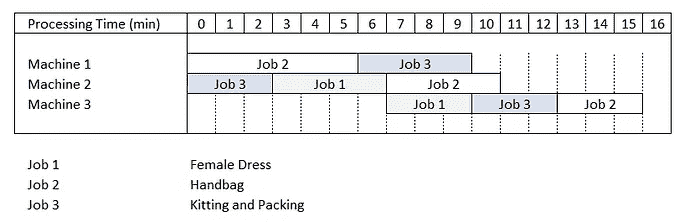

# 使用 Python 进行供应链过程调度

> 原文：[`towardsdatascience.com/supply-chain-process-scheduling-with-python-6811cd9e650a?source=collection_archive---------6-----------------------#2024-05-24`](https://towardsdatascience.com/supply-chain-process-scheduling-with-python-6811cd9e650a?source=collection_archive---------6-----------------------#2024-05-24)

## 使用线性规划来提高奢侈产品仓库中增值服务的生产能力。

[](https://s-saci95.medium.com/?source=post_page---byline--6811cd9e650a--------------------------------)[](https://towardsdatascience.com/?source=post_page---byline--6811cd9e650a--------------------------------) [Samir Saci](https://s-saci95.medium.com/?source=post_page---byline--6811cd9e650a--------------------------------)

·发布于[《数据科学前沿》](https://towardsdatascience.com/?source=post_page---byline--6811cd9e650a--------------------------------) ·阅读时间 8 分钟·2024 年 5 月 24 日

--


使用 Python 优化仓库过程调度 — （作者图片）

根据我的经验，奢侈品牌在分销中心面临的主要挑战与入库物流有关。

收到后，物品必须经过多次**增值服务**才能完成**入库流程**并返回库存。


增值服务要求示例 — （作者图片）

例如，从法国进口到中国的一只包包需要进行特定的中文标签标注、一系列质量检查以及防盗标签。

这些过程可能**创造瓶颈**，从而延迟分销并导致门店库存短缺。

> 作为数据科学家，你如何利用线性规划来减少瓶颈并最大化生产力？

在本文中，我们将使用**作业车间问题**来优化这些过程的调度，并最大化整体的入库生产力。

我将使用 Google OR 工具提供一种最佳过程调度解决方案，以将**入库能力提升多达 48%**。

```py
Summary 
I. Value-Added Services for Luxury Products
II. Problem Statement of Inbound Process Scheduling
1\. Inbound Operations Optimization for Luxury Products
2\. Problem Statement: The Job-Shop Problem
III. Conclusion
```

# 奢侈产品的增值服务

我所进行的大多数重组项目是为了零售、快速消费品（FMCG）或汽车行业，通过**最小化劳动力和设备的使用**来降低成本。


降低成本的重组项目示例 [查看更多: [链接](https://medium.com/@s-saci95/welcome-to-my-profile-5011f02dfbf3)] — （作者图片）

对于奢侈品牌，优先考虑的是不同的因素，考虑到商品的价值和需求的变动性。

> 门店团队：“SS2024 系列需要在 6 月的第一周之前送达门店。”

物流团队面临压力，必须确保产品及时接收、准备并发货，以满足门店的需求。

为了说明这一点，我将以一个实际的例子来讲解：一家法国奢侈品牌在上海运营配送中心，向**中国的 35 家门店**进行配送。


奢侈品牌的配送中心 — （图片来源：作者）

这个配送中心接收从法国进口到本地市场的商品（*服装、包包和配饰*）。


仓库中的产品流动 — （图片来源：作者）

在接收和增值服务完成后，商品可以经过两种不同的流动路径：

+   **交叉对接流动**：商品在当天发货到门店

    *⌛ KPI：接收和发货之间的周转时间*

+   **库存流动**：商品被存放到库存中（几天或几周）后，再被订购、拣选并发货到门店

    *⌛ KPI：接收和存放之间的周转时间*

这两个指标有一个共同的问题，就是依赖于仓库的**增值服务（VAS）**能力。

> 这些增值服务是什么？

+   **操作 1 — 防盗标签**：操作员为商品贴上自报警标签，防止在门店被盗


防盗标签 - （图片来源：作者）

+   **操作 2 — 贴标签**：操作员打印本地语言标签并进行标签缝制


标签示例 — （图片来源：作者）

+   **操作 3 — 配件与重新包装**：操作员将商品放入销售包装，并添加赠品（GWP）、个人说明和正品证书


赠品包装和证书示例 — （CAD 模型来源：作者）

完成这三个步骤后，商品可以存放在库存区或发货到门店。

> 可能会出什么问题？

如果整体流程的处理能力（件/天）过低，当面临入库量高峰时，这可能迅速成为瓶颈。

# 问题陈述：仓库增值服务调度

## 奢侈品入库操作优化

你是这家标志性奢侈品牌的物流部门数据科学经理，专注于时尚、香水和手表领域。

该配送中心的入库经理请求你支持，减少由于增值服务调度低效导致的瓶颈。

她的团队每天接收**数千件成衣**（成品服装），包括：

+   需要**贴标签**和**重新包装**的**1 件女装**

+   需要**贴标签**、**防盗标签**和**重新包装**的**手袋**

+   需要防盗标签、**贴标签**和**重新包装**的**1 条皮带**

由于这些物品是一起销售的，它们需要在完成以下步骤后同时准备好：

+   接收团队将托盘从卡车上卸下，并将其放入**暂存区**。


卸货并将托盘转移到暂存区 — （CAD 模型由作者提供）

+   **机器 1 — 防盗标签：** 操作员为每个手袋和皮带放置防盗标签。


2 个工作站，操作员在每个手袋和皮带上放置防盗标签 — （CAD 模型由作者提供）

+   **机器 2—标签：** 在专用区域打印标签后，标签会被缝制到皮带、手袋和裙子上。


4 个工作站，操作员执行标签缝制工作 — （CAD 模型由作者提供）

+   **机器 3 — 配套和重新包装：** 操作员为每个物品添加认证证书并进行精细包装。


4 个工作站，操作员执行重新包装工作 — （CAD 模型由作者提供）

完成这些步骤后，货物被转移到最终暂存区等待发货（流向 1），或被放入库存区（流向 2）。

**目标：** 达到每小时组装的最大生产率（套数/小时）。

## 问题描述：作业车间问题

**作业车间调度问题（JSSP）** 是一个 NP 难问题，由一组作业定义，机器必须按照每个作业的特定顺序执行。

在我们的例子中，每个项目都有一个作业，并且它们必须（可以）同时执行。


一个包含 3 个作业和 3 台机器的例子 — （图片由作者提供）

上表定义了每个作业的执行时间（分钟）和机器处理顺序。

例如，**作业 2（手袋）** 从使用机器 1 放置**防盗标签**开始（6 分钟），然后是使用机器 2 进行标签缝制**（4 分钟）**，最后以使用机器 3 进行**配套和包装**结束（3 分钟）。

我们在如何使用机器方面有一些约束：

+   这些机器一次只能执行一个作业。

+   一旦开始，机器无法在指定作业完成之前中断。

**目标是** 最小化完工时间，即完成所有作业的总时间。

> 基准是什么？

## **朴素解法：一次执行一个作业周期**


第一个朴素方法 — （图片由作者提供）

我们假设 VAS 团队负责人将作业按顺序安排，并避免并行执行任何作业。

**结果**

+   完工时间：**30 分钟**

+   生产率：**2 套/小时**

**评论**

这种简单的方法在生产力方面最差。因为作业是按顺序处理的，机器常常处于空闲状态（未使用）。

**问题：** 如果我们并行执行作业，结果会怎样？

## **最优解**

这个例子适用于使用 Google OR-Tools 解决的作业车间调度问题。

OR-Tools 是 Google 提供的一个开源工具集合 [](https://developers.google.com/optimization)，用于组合优化。

目标是从众多可能的解决方案中找到最佳方案。

我已经使用它进行了多个案例研究。

+   [Samir Saci](https://medium.com/u/bb0f26d52754?source=post_page---user_mention--6811cd9e650a--------------------------------)，使用 Google AI 设计路径规划算法以提高仓库生产率

[](/optimizing-warehouse-operations-with-python-part-3-google-ai-for-sprp-308c258cb66f?source=post_page-----6811cd9e650a--------------------------------) ## 使用 Python 的路径规划算法提高仓库生产率

### 基于旅行商问题设计的路径规划算法，结合 Google AI 线性优化进行实现……

[towardsdatascience.com

+   [Samir Saci](https://medium.com/u/bb0f26d52754?source=post_page---user_mention--6811cd9e650a--------------------------------)，使用 Python 的线性规划优化劳动力规划

[](/optimize-workforce-planning-using-linear-programming-with-python-47a0b5f89a6f?source=post_page-----6811cd9e650a--------------------------------) ## 使用 Python 的线性规划优化劳动力规划

### 你需要雇佣多少临时工来消化你的每周工作量，同时确保……

towardsdatascience.com

让我们使用这个库来找到优化的排序，以减少这个特定流程集的**完工时间**。

# 使用线性规划优化过程调度

## 结果：优化方案 vs. 朴素方案


第一个朴素方法 — （图像由作者提供）


使用 Google OR-Tools 的优化方案 — （图像由作者提供）

上面的两张图分别代表了初始方案（朴素方案：一次处理 1 个工作）和优化方案（并行任务处理）。

**结果**

+   **总完工时间：** 16 分钟 **(-47%)**

+   **生产率：** 3.75 套/小时 **(+85%)**

+   **每周期空闲时间：** 18 分钟 **(-71.4%)**

结果令人满意。

> 如何获得这些结果？

## 使用 Python 构建优化模型

**初始化你的线性规划模型**

在列表 jobs_data 中，你定义了每个工作的操作，包括与其相关的机器和时间安排。

**初始化变量并创建序列**

**添加约束并设置求解器**

**求解器优化方案**

**输出**

```py
Optimal Schedule Length: 16 min
Machine 1: job_2_1   job_3_2   
           [0,6]     [6,10]    
Machine 2: job_3_1   job_1_1   job_2_2   
           [0,3]     [3,7]     [7,11]    
Machine 3: job_1_2   job_3_3   job_2_3   
           [7,10]    [10,13]   [13,16]
```

根据这个输出，我们可以绘制更新后的时间表：



使用 Google OR-Tools 的优化方案 — （图像由作者提供）

考虑到约束条件，这个解决方案最大限度地减少了机器的空闲时间，并提供了最高的生产力（台数/小时）。

# 结论

通过实施一个智能调度解决方案，我们将生产力提高了+48%，最大化了资源利用率。

该解决方案基于一个简单的场景，使用了一个单一的装配线（每种类型 1 台机器）。

> 我们能通过改变条件来提高生产力吗？


使用空闲序列（黄色）优化的解决方案——（图片来源：作者）

在上面的图表中，我已经标出了我们可以在空闲时间添加的潜在额外工作：

+   **机器 1：1 个序列**，持续 4 分钟，相当于工作 3 的时间

+   **机器 2：1 个序列**，持续 4 分钟，相当于工作 1 和工作 2 的时间

+   **机器 3：2 个序列**，持续 4 分钟，相当于工作 1、2 和 3 的时间

**问题：**

+   如果我们在**Cycle n**的空闲序列期间开始**Cycle n+1**的工作，平均生产力会是多少？

## 超越

如果我们为标签缝纫设置平行工作站，整体生产力会受到什么影响？


排队理论的过程定义——（图片来源：作者）

这个问题可以通过排队理论来解答。


使用排队理论设计打包站——（图片来源：Samir Saci）

在这篇文章中了解更多，

[](/supply-chain-process-design-using-the-queueing-theory-2ad75e58d1f3?source=post_page-----6811cd9e650a--------------------------------) ## 使用排队理论进行供应链过程设计

### 使用 Python 应用排队理论的多个原则来设计电商包裹打包过程……

towardsdatascience.com

# 关于我

让我们在[Linkedin](https://www.linkedin.com/in/samir-saci/)和[Twitter](https://twitter.com/Samir_Saci_)上连接，我是一名供应链工程师，利用数据分析来改善物流操作并降低成本。

如果您需要关于供应链转型的咨询或建议，请通过[Logigreen Consulting](https://www.logi-green.com/)与我联系。

如果您对数据分析和供应链感兴趣，可以查看我的网站。

[](https://samirsaci.com/?source=post_page-----6811cd9e650a--------------------------------) [## Samir Saci | 数据科学与生产力

### 一篇关注数据科学、个人生产力、自动化、运筹学和可持续发展的技术博客……

samirsaci.com](https://samirsaci.com/?source=post_page-----6811cd9e650a--------------------------------)

💌 免费直接发送到您的邮箱的新文章：[Newsletter](https://www.samirsaci.com/#/portal/signup)

📘 您的供应链分析完整指南：[Analytics Cheat Sheet](https://bit.ly/supply-chain-cheat)

# 参考文献

+   Google AI, Google OR-Tools 库, [链接](https://developers.google.com/optimization)
