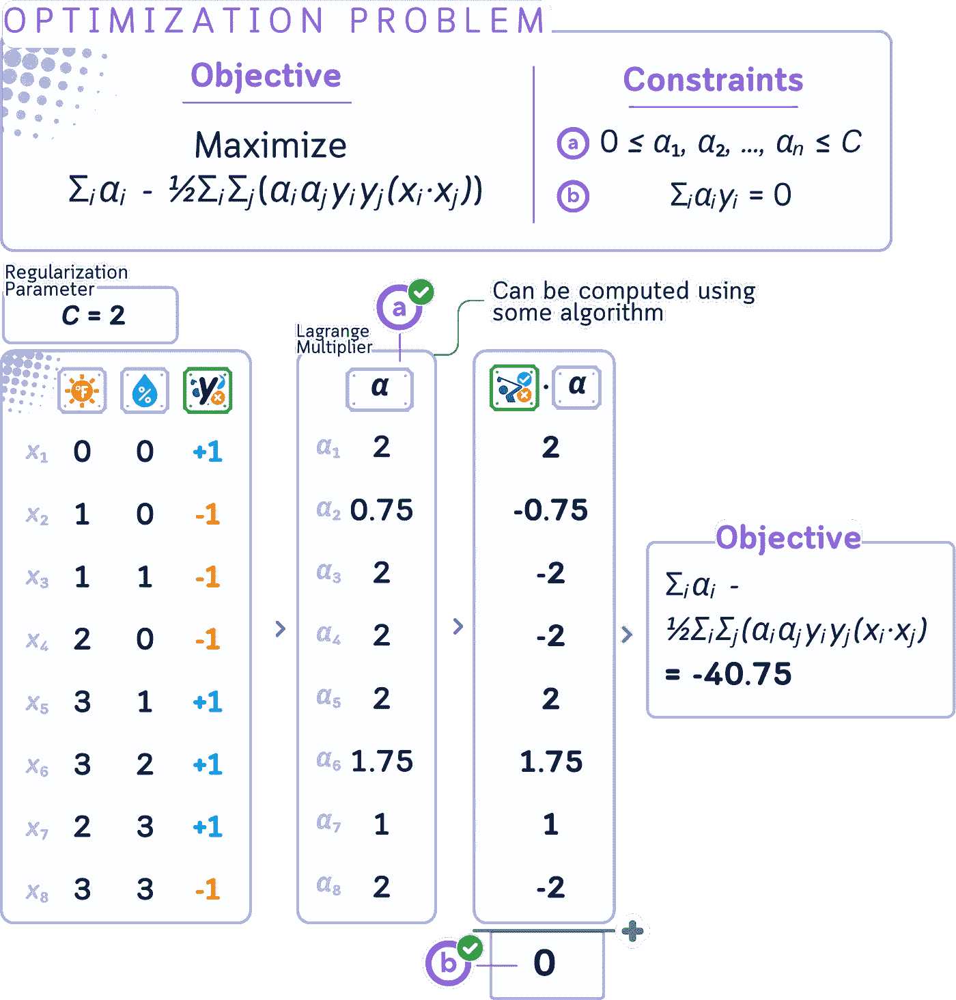

# 支持向量分类器，解释：带有迷你 2D 数据集的视觉指南

> 原文：[`towardsdatascience.com/support-vector-classifier-explained-a-visual-guide-with-mini-2d-dataset-62e831e7b9e9?source=collection_archive---------3-----------------------#2024-10-01`](https://towardsdatascience.com/support-vector-classifier-explained-a-visual-guide-with-mini-2d-dataset-62e831e7b9e9?source=collection_archive---------3-----------------------#2024-10-01)

## 分类算法

## 找到最佳的“分隔线”来区分不同的类别？嗯，当然……

[](https://medium.com/@samybaladram?source=post_page---byline--62e831e7b9e9--------------------------------)[](https://towardsdatascience.com/?source=post_page---byline--62e831e7b9e9--------------------------------) [Samy Baladram](https://medium.com/@samybaladram?source=post_page---byline--62e831e7b9e9--------------------------------)

·发表于 [Towards Data Science](https://towardsdatascience.com/?source=post_page---byline--62e831e7b9e9--------------------------------) ·14 分钟阅读·2024 年 10 月 1 日

--


`⛳️ 更多 [分类算法](https://medium.com/@samybaladram/list/classification-algorithms-b3586f0a772c)，解释如下： · 虚拟分类器 · K 最近邻分类器 · 伯努利朴素贝叶斯 · 高斯朴素贝叶斯 · 决策树分类器 · 逻辑回归 ▶ 支持向量分类器 · 多层感知器`

“用于分类的支持向量机（SVM）遵循一个非常基础的原则——它试图找到一条最优的分隔线，将两个类别分开。”但如果我再听到这种过于简化的解释**一次**，我可能真会把头埋进枕头里尖叫。

虽然前提看起来很简单，但 SVM 是那种包含复杂数学运算的算法，我花费了大量时间才搞懂。为什么它叫做“机器”？我们为什么需要支持向量？为什么有些点突然变得不重要？为什么它必须是直线——哦，等等，是**直超平面**??? 然后还有优化公式，这个公式 apparently 难得需要一个叫做对偶形式的版本来处理。等等，现在我们还需要**另一个**算法叫做 SMO 来解决这个问题？那些 scikit-learn 自动输出的对偶系数又是怎么回事？如果这还不够，当一条直线不够用时，我们又开始使用神奇的“核技巧”？我们为什么需要这些技巧？而且为什么没有教程展示实际的数字？！

在本文中，我试图停止这种支持向量机的疯狂。在花了几个小时尝试真正理解这个算法后，我将尝试用**实际**的数字（当然，还有其可视化）来解释实际发生了什么，而不涉及复杂的数学，适合初学者。


所有可视化：作者使用 Canva Pro 创建。已优化为适合移动端；在桌面端可能会显得过大。

# 定义

支持向量机（SVM）是监督学习模型，主要用于分类任务，尽管它们也可以适应回归任务。SVM 旨在找到能够最好地将数据集分成不同类别的那条线（*唉…*），并最大化这些类别之间的间隔。


尽管 SVM 很复杂，但它仍然可以被视为机器学习中的基础算法之一。

“支持向量”是那些距离决策边界最近的点，它们实际上可以定义这条线。那么，那个“机器”又是什么？虽然其他机器学习算法也可以包括“机器”，但 SVM 的命名可能部分来源于它被开发时的历史背景。就这样。

# 📊 使用的数据集

为了理解 SVM 的工作原理，最好从一个样本较少、维度较小的数据集开始。我们将以这个简单的二维小数据集（灵感来自[1]）作为示例。


列：温度（0–3）、湿度（0–3）、打高尔夫（是/否）。训练数据集有 2 个维度和 8 个样本。

我们不会直接解释训练过程的步骤，而是将从关键字到关键字，看看 SVM 实际上是如何工作的：

# 第一部分：基本组件

## 决策边界

SVM 中的决策边界是算法确定的最佳分隔不同类别数据的线（或在高维中称为“超平面”）。

这条线会尽力把大多数“是”类点放在一边，大多数“否”类点放在另一边。然而，对于那些不能线性分割的数据，这条边界不会是完美的——一些点可能会出现在“错误”的一侧。

一旦确定了这条线，任何新的数据都可以根据它位于决策边界的哪一侧来进行分类。


在我们的高尔夫例子中，决策边界将试图将“YES”（打高尔夫）和“NO”两类数据点分开。SVM 会尝试定位这条线，尽管用一条直线无法做到完美分隔。此时，凭借我们的眼光，这条线看起来是一个不错的分隔线。

## 线性可分性

线性可分性指的是我们是否可以画出一条直线，完美地将两个类别的数据点分开。如果数据是线性可分的，SVM 可以找到一个清晰的、硬的边界来区分不同类别。然而，当数据不是线性可分的（如我们的情况）时，SVM 需要使用更先进的技术。


在训练集里，不论我们如何画线，都无法将两类数据完全分开。如果我们忽略索引 1 和 8，现在就能分开它们了。

## 间隔

在 SVM 中，间隔是指决策边界到每个类别的最近数据点之间的距离。这些最近的点称为支持向量。

SVM 的目标是最大化这个间隔。较大的间隔通常能带来更好的泛化能力——即能够正确分类新的、未见过的数据点。

然而，由于数据通常并不是完全可分的，SVM 可能会采用软间隔的方法。这允许一些点位于间隔内，甚至处于决策边界的错误一侧，从而在完美分隔与构建更强健的分类器之间做出权衡。


SVM 会尝试将决策边界定位，创造出尽可能宽的间隔，同时尽量将大部分“YES”和“NO”实例分开。

## 硬间隔与软间隔

硬间隔 SVM 是理想情况，在这种情况下，所有数据点都能被决策边界完美地分开，不会出现任何误分类。在这种情况下，间隔是“硬”的，因为它不允许任何数据点处于决策边界的错误一侧或间隔内。

另一方面，软间隔 SVM 允许一定的灵活性。它允许一些数据点被误分类，或位于间隔内。这使得 SVM 能够在以下两者之间找到一个良好的平衡：

1.  最大化间隔

1.  最小化分类错误


在我们的案例中，硬间隔方法不可行，因为数据不是线性可分的。因此，对于我们的数据集，必须采用软间隔方法。在软间隔 SVM 中，可能允许像 ID 1 和 ID 8 这样的点处于决策边界的“错误”一侧，如果这能带来更好的总体分类器。

## **距离计算**

在 SVM 中，距离计算在训练和分类中都起着重要作用。点*x*到决策边界的距离由以下公式给出：

|*w* · *x* + *b*| / ||*w*||

其中，*w*是垂直于超平面的权重向量，*b*是偏置项，||*w*||是*w*的欧几里得范数。


通过这种方式，我们可以在不画出超平面的情况下，看到哪些点离超平面最近。

## 支持向量

支持向量是距离超平面最近的数据点。它们之所以重要，是因为：它们“支持”超平面，定义了其位置。

支持向量之所以特别，是因为它们是确定决策边界的唯一关键点。其他所有点可以移除而不改变边界的位置。这是支持向量机（SVM）的一个关键特性——它依据最关键的点来做出决策，而不是所有的数据点。


对于这个超平面，我们有 3 个支持向量位于边缘上。在某些情况下，2 个被错误分类的数据点也可以视为支持向量。

## 松弛变量

在软间隔 SVM 中引入了松弛变量，用以量化每个数据点的误分类或边缘违背程度。它们被称为“松弛”变量，因为它们为模型提供了一些松弛或灵活性来拟合数据。

在 SVM 中，松弛变量 *ξᵢ* 可以通过以下方式计算：

*ξᵢ* = max(0, 1 — *yᵢ*(*w* · *xᵢ* + *b*))

其中

· *w* 是权重向量

· *b* 是偏置项

· *xᵢ* 是输入向量

· *yᵢ* 是相应的标签

这个公式仅在类标签 *yᵢ* 为 {-1, +1} 格式时有效。它优雅地处理了两类问题：

· 正确分类且位于边缘之外的点：*ξᵢ* = 0

· 被错误分类或违反边缘的点：*ξᵢ* > 0

使用 {-1, +1} 标签保持了 SVM 的数学对称性并简化了优化，与 {0, 1} 标签不同，后者需要为每一类创建单独的情况。


在我们的高尔夫数据集中，点 (3,3) — NO 最终位于我们的边界的“YES”一侧。我们会为该点分配一个松弛变量，以衡量它偏离错误一侧的距离。同样，如果 (2,0) — NO 被正确分类但位于边缘内，它也会得到一个松弛变量。


在我们的高尔夫数据集中，点 (3,3) — NO 最终位于我们的边界的“YES”一侧。我们会为该点分配一个松弛变量，以衡量它偏离错误一侧的距离。同样，如果 (2,0) — NO 被正确分类但位于边缘内，它也会得到一个松弛变量。

## 硬间隔的原始形式

原始形式是支持向量机（SVM）优化问题的原始表述。它直接表达了在特征空间中寻找最大间隔超平面的目标。

简单来说，原始形式的目标是：

1.  找到一个能正确分类所有数据点的超平面。

1.  最大化该超平面与来自每个类别的最近数据点之间的距离。

原始形式是：

**最小化**: (1/2) ||*w*||²

**受限条件**: *yᵢ*(*w* · *xᵢ* + *b*) ≥ 1 对所有 i 都成立

其中

· *w* 是权重向量

· *b* 是偏置项

· *xᵢ* 是输入向量

· *yᵢ* 是相应的标签（+1 或 -1）

· ||*w*||² 是 *w* 的平方欧几里得范数


在省略索引 1 和 8 的情况下，我们正在尝试找到最佳的边界，以便获得更大的边距。


如果我们选择具有较小边距的超平面，它会使目标函数的值更高，而这不是我们想要的。

## 软边距的原始形式

记住，软边距 SVM 是原始（硬边距）SVM 的扩展，它允许一些误分类？这一变化在原始形式中有所体现。软边距 SVM 的原始形式变为：

**最小化**： (1/2) ||*w|*|² + *C* Σ*ᵢ ξᵢ*

**约束条件**：*yᵢ*(*w* · *xᵢ* + *b*) ≥ 1 — *ξᵢ* 对所有 *i*，*ξᵢ* ≥ 0 对所有 *i*

其中

· *C* 是惩罚参数

· *ξᵢ* 是松弛变量

· 所有其他变量与硬边距情况下相同


误分类数据点的惩罚作为额外值贡献到目标函数中，以便最小化。


假设我们选择了另一个稍微靠近索引 8 的超平面。目标值现在变得更高。从误分类点的距离越平衡，总的惩罚就越小。

## 对偶形式

这里有个坏消息：原始形式可能求解较慢且难以解决，尤其是在处理复杂数据时。

对偶形式提供了解决 SVM 优化问题的替代方法，通常能够带来计算上的优势。其形式如下：

**最大化**：*Σᵢ,ⱼ(αᵢyᵢ) - ½ΣᵢΣⱼ(αᵢαⱼyᵢyⱼ(xᵢ* · *xⱼ))* **约束条件**：0 ≤ *αᵢ* ≤ C 对所有 i，Σ*ᵢαᵢyᵢ* = 0

其中：

· *αᵢ* 是拉格朗日乘子（对偶变量）

· *yᵢ* 是类标签（+1 或 -1）

· *xᵢ* 是输入向量

· *C* 是正则化参数（*αᵢ* 的上界）

· (*xᵢ* · *xⱼ*) 表示 *xᵢ* 和 *xⱼ* 之间的点积



除了训练数据本身，唯一出现在对偶形式中的其他成分是拉格朗日乘子（*αᵢ*）。

## 拉格朗日乘子

正如我们在对偶形式中看到的，当我们将原始问题转换为对偶形式时，拉格朗日乘子（*αᵢ*）就会出现（这也是它们被称为对偶系数的原因）。如果你注意到了，权重和偏置不再存在！

每个训练集中的数据点都有一个关联的拉格朗日乘子。好处是，拉格朗日乘子使得理解问题变得更加容易：

1.  **解释**：

    - *αᵢ* = 0：该点被正确分类并且位于边距外。这个点不会影响决策边界。

    - 0 < *αᵢ* < *C*：该点位于边距边界上。这些点被称为“自由”或“无界”支持向量。

    - *αᵢ* = *C*：该点要么位于边界上，要么位于边界内部（包括误分类点）。这些点被称为“边界”支持向量。

1.  **与决策边界的关系**：

    *w* = Σ*ᵢ*(*αᵢ* *yᵢ* *xᵢ*),

    *b* = *yᵢ* — Σ*ⱼ*(*αᵢ* *yⱼ*(*xⱼ* · *xᵢ*))

    其中，*yᵢ*是任何（无界）支持向量的标签。

    这意味着最终的决策边界仅由具有非零*αᵢ*的点决定！


结果表明，算法决定我们原来的超平面是最优的，只是需要通过将所有权重减半来增大间隔。这使得所有点都变成了支持向量，但由于数据集本身较小，这没有问题。😅

## 顺序最小优化（Sequential Minimal Optimization）

记住，我们还没有真正展示如何获得最优的拉格朗日乘子（*αᵢ*）？解决这个问题的算法称为顺序最小优化（SMO）。下面是我们如何获得这些值的简化视图：

1.  从所有αᵢ为零开始。

1.  重复选择并调整两个*αᵢ*以改进解。

1.  使用简单的数学快速更新这些对。

1.  确保所有更新遵循支持向量机（SVM）约束。

1.  重复直到所有*αᵢ*都“足够好”为止。

1.  具有αᵢ > 0 的点成为支持向量。

这种方法高效地解决了 SVM 优化问题，无需繁重的计算，使其在大数据集上具有实用性。


## 决策函数

通过使用对偶形式求解 SVM 优化问题并获得拉格朗日乘子后，我们可以定义决策函数。该函数决定了训练后的 SVM 模型如何对新的、未见过的数据点进行分类。

*f*(*x*) = Σ*ᵢ*(*αᵢyᵢ*(*xᵢ* · *x*)) + *b*

这里，*αᵢ*是拉格朗日乘子，*yᵢ*是类别标签（+1 或-1），*xᵢ*是支持向量，*x*是待分类的输入向量。新点 x 的最终分类由*f*(*x*)的符号决定（即“+”或“-”）。

注意，这个决策函数仅使用支持向量（具有非零*αᵢ*的数据点）来分类新的输入数据，这就是 SVM 算法的核心原理！


# 🌟 支持向量分类器代码

上述结果可以通过以下代码获得：

```py
import numpy as np
import pandas as pd
from sklearn.svm import SVC

# Create DataFrame
df = pd.DataFrame({
    '🌞': [0, 1, 1, 2, 3, 3, 2, 3, 0, 0, 1, 2, 3],
    '💧': [0, 0, 1, 0, 1, 2, 3, 3, 1, 2, 3, 2, 1],
    'y': [1, -1, -1, -1, 1, 1, 1, -1, -1, -1, 1, 1, 1]
}, index=range(1, 14))

# Split into train and test
train_df, test_df = df.iloc[:8].copy(), df.iloc[8:].copy()
X_train, y_train = train_df[['🌞', '💧']], train_df['y']
X_test, y_test = test_df[['🌞', '💧']], test_df['y']

# Create and fit SVC model
svc = SVC(kernel='linear', C=2)
svc.fit(X_train, y_train)

# Add Lagrange multipliers and support vector status
train_df['α'] = 0.0
train_df.loc[svc.support_ + 1, 'α'] = np.abs(svc.dual_coef_[0])
train_df['Is SV'] = train_df.index.isin(svc.support_ + 1)

print("Training Data, Lagrange Multipliers, and Support Vectors:")
print(train_df)

# Print model parameters
w, b = svc.coef_[0], svc.intercept_[0]
print(f"\nModel Parameters:")
print(f"Weights (w): [{w[0]}, {w[1]}]")
print(f"Bias (b): {b}")
print(f"Decision function: f(🌞,💧) = ({w[0]})🌞 + ({w[1]})💧 + ({b})")

# Make predictions
test_df['ŷ'] = svc.predict(X_test)

print("\nTest Data and Predictions:")
print(test_df)
```


# 第二部分：核技巧

如我们所见，无论如何设置超平面，我们始终无法完美地将两类数据分开。实际上，我们可以做一些“技巧”，使得数据可以被分开……尽管它不再是线性可分的。

## 输入空间与特征空间

输入空间指的是数据特征的原始空间。在我们的高尔夫数据集中，输入空间是二维的，由温度和湿度组成。此空间中的每个数据点代表某个具体天气条件下，是否有人决定打高尔夫。

特征空间则是输入空间的一个转换版本，SVM 实际上在特征空间中执行分类。有时，在线性不可分的输入空间中，数据映射到高维特征空间后变得可分。


如我们到目前为止所尝试的，无论选择什么超平面，我们都无法将这两个类别线性分开。除了使用🌞和💧，特征空间可能还包括类似🌞²、💧²、🌞×💧的组合。这将把我们的二维输入空间转变为五维特征空间。如果你注意到的话，我们现在可以找到一个超平面，能够完美地分开这两个类别！

## 核及隐式变换

核是一个计算两个数据点之间相似性的函数，隐式地将它们表示在一个更高维的空间（特征空间）中。

假设有一个函数 *φ*(*x*)，它将每个输入点 *x* 转换到一个更高维的空间。例如：*φ* : ℝ² → ℝ³, *φ*(*x*,*y*) = (*x*, *y*, *x*² + *y*²)

**常见核及其隐式变换：**

**a. 线性核**：*K*(*x*,*y*) = *x* · *y*

- 变换：

*φ*(*x*) = *x* （恒等变换）

- 这实际上并不会改变空间，但对于线性可分的数据来说是有用的。

**b. 多项式核**：*K*(*x*,*y*) = (*x* · *y* + c)*ᵈ*

- 变换（对于 *d* = 2，*c* = 1 在 ℝ² 中）：

*φ*(*x*₁,*x*₂) = (1, √2*x*₁, √2*x*₂, *x*₁², √2*x*₁*x*₂, *x*₂²)

- 这涵盖了所有最高为 *d* 次的多项式项。

**c. RBF 核**：*K*(*x*,*y*) = exp(-*γ*||*x* - *y*||²)

- 变换（作为一个无穷级数）：

*φ*(*x*₁,*x*₂) = exp(-*γ*||*x*||²) * (1, √(2*γ*)*x*₁, √(2*γ*)*x*₂, …, √(2*γ*²/2!)*x*₁², √(2*γ*²/2!)*x*₁*x*₂, √(2*γ*²/2!)*x*₂², …, √(2*γⁿ*/*n*!)*x*₁*ⁿ*, …)

- 可以被看作是一个相似性度量，随着距离的增加而减小。


这旨在说明核如何转换输入空间。实际上，特征空间中每个点的计算本身并不会执行，因为计算非常昂贵，这就是为什么它被称为隐式的原因。

## 核技巧

核技巧的“技巧”部分在于，我们可以仅使用核函数，在这个更高维的空间中执行操作，而无需显式计算变换 *φ*(x)。

注意，在对偶形式中，数据点仅以点积的形式出现 (*xᵢ* · *xⱼ*)。这就是核技巧的作用所在。我们可以将这个点积替换为核函数：(*xᵢ* · *xⱼ*) → *K*(*xᵢ*, *xⱼ*)

如果我们仅使用原始形式，则无法进行此过程，这也是为什么对偶形式更可取的主要原因之一！

这个替代方法隐式地将数据映射到更高维空间**而不显式计算变换**。


## 使用核技巧的决策函数

对于新点 *x* 的决策函数结果为：

*f* (*x*) = sign(Σ*ᵢ* *αᵢyᵢK*(*xᵢ*, *x*) + *b*)

其中求和是针对所有支持向量（点的 *αᵢ* > 0）。


# 🌟 支持向量分类器（带核技巧）代码总结

上述结果可以通过以下代码得到：

```py
import numpy as np
import pandas as pd
from sklearn.svm import SVC

# Create DataFrame
df = pd.DataFrame({
    '🌞': [0, 1, 1, 2, 3, 3, 2, 3, 0, 0, 1, 2, 3],
    '💧': [0, 0, 1, 0, 1, 2, 3, 3, 1, 2, 3, 2, 1],
    'y': [1, -1, -1, -1, 1, 1, 1, -1, -1, -1, 1, 1, 1]
}, index=range(1, 14))

# Split into train and test
train_df, test_df = df.iloc[:8].copy(), df.iloc[8:].copy()
X_train, y_train = train_df[['🌞', '💧']], train_df['y']
X_test, y_test = test_df[['🌞', '💧']], test_df['y']

# Create and fit SVC model with polynomial kernel
svc = SVC(kernel='poly', degree=2, coef0=1, C=1)
svc.fit(X_train, y_train)

# Add Lagrange multipliers and support vector status
train_df['α'] = 0.0
train_df.loc[svc.support_ + 1, 'α'] = np.abs(svc.dual_coef_[0])
train_df['Is SV'] = train_df.index.isin(svc.support_ + 1)

print("Training Data, Lagrange Multipliers, and Support Vectors:")
print(train_df)

# Make predictions
test_df['ŷ'] = svc.predict(X_test)
print("\nTest Data and Predictions:")
print(test_df)
```


注意：由于 SVC 存在一些数值不稳定性，我们无法使得 scikit-learn 中的截距与手动计算一致……这就是为什么我没有展示如何手动计算偏置（尽管它应该与线性核的计算方法相同）。

# 关键参数

在 SVM 中，关键参数是惩罚/正则化参数 C：

+   大 C：努力准确分类所有训练点，可能会导致过拟合

+   小 C：允许更多的误分类，但目标是得到一个更简单、更通用的模型

当然，如果你使用的是非线性核，你还需要调整与该核相关的度数（和系数）。

# 最后的备注

我们已经讨论了很多关于 SVM 的关键概念（以及它们的工作原理），但主要思想是这样的：这全是关于找到合适的平衡。你希望你的 SVM 学会识别数据中的重要模式，而不是过于努力地让每一个训练数据都落在超平面的正确一侧。如果它太严格，可能会错过全局；如果它太灵活，可能会看到一些并不存在的模式。诀窍是调整你的 SVM，使其能够识别出真正的趋势，同时仍具有足够的适应性来处理新数据。把这个平衡做好，你就有了一个可以解决各种分类问题的强大工具。

## 进一步阅读

对于关于[支持向量机](https://scikit-learn.org/stable/modules/generated/sklearn.svm.SVC.html)及其在 scikit-learn 中实现的详细解释，读者可以参考官方文档，该文档提供了关于其使用和参数的全面信息。

## 技术环境

本文使用的是 Python 3.7 和 scikit-learn 1.5。虽然所讨论的概念通常适用，但不同版本的具体代码实现可能略有不同。

## 关于插图

除非另有说明，所有图片均由作者创作，融合了来自 Canva Pro 的授权设计元素。

## 参考文献

[1] T. M. Mitchell, [机器学习](https://www.cs.cmu.edu/afs/cs.cmu.edu/user/mitchell/ftp/mlbook.html) (1997), McGraw-Hill Science/Engineering/Math，第 59 页

𝙎𝙚𝙚 𝙢𝙤𝙧𝙚 𝘾𝙡𝙖𝙨𝙨𝙞𝙛𝙞𝙘𝙖𝙩𝙞𝙤𝙣 𝘼𝙡𝙜𝙤𝙧𝙞𝙩𝙝𝙢𝙨 𝙝𝙚𝙧𝙚: 


[Samy Baladram](https://medium.com/@samybaladram?source=post_page-----62e831e7b9e9--------------------------------)

## 分类算法

[查看列表](https://medium.com/@samybaladram/list/classification-algorithms-b3586f0a772c?source=post_page-----62e831e7b9e9--------------------------------)8 个故事

你可能还喜欢：


[Samy Baladram](https://medium.com/@samybaladram?source=post_page-----62e831e7b9e9--------------------------------)

## 回归算法

[查看列表](https://medium.com/@samybaladram/list/regression-algorithms-b0b6959f1b39?source=post_page-----62e831e7b9e9--------------------------------)5 个故事！一只戴着辫子和粉色帽子的卡通娃娃。这个“虚拟”娃娃，带着基础设计和心形装饰的衬衫，形象地代表了机器中的虚拟回归器概念。就像这个玩具般的人物是一个简化的、静态的人物表示一样，虚拟回归器也是一种基本模型，为更复杂的分析提供基准。

[Samy Baladram](https://medium.com/@samybaladram?source=post_page-----62e831e7b9e9--------------------------------)

## 集成学习

[查看列表](https://medium.com/@samybaladram/list/ensemble-learning-673fc83cd7db?source=post_page-----62e831e7b9e9--------------------------------)4 个故事！[](../Images/1bd2995b5cb6dcc956ceadadc5ee3036.png)
