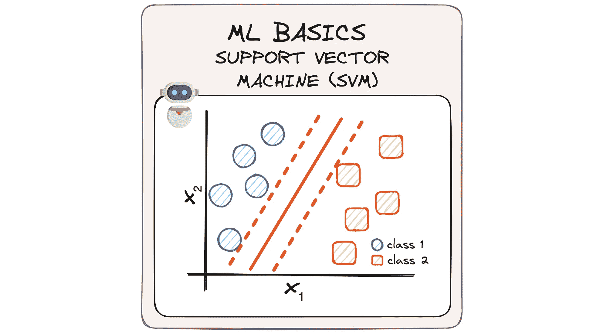

# 简化支持向量机——二元分类简明介绍

> 原文：[`towardsdatascience.com/support-vector-machines-svm-ml-basics-machine-learning-data-science-getting-started-1683fc99cd45?source=collection_archive---------6-----------------------#2024-06-21`](https://towardsdatascience.com/support-vector-machines-svm-ml-basics-machine-learning-data-science-getting-started-1683fc99cd45?source=collection_archive---------6-----------------------#2024-06-21)

## MLBasics #4：二元分类之王——支持向量机之旅

 [Josep Ferrer](https://medium.com/@rfeers?source=post_page---byline--1683fc99cd45--------------------------------)

·发表于[Towards Data Science](https://towardsdatascience.com/?source=post_page---byline--1683fc99cd45--------------------------------) ·阅读时间 7 分钟·2024 年 6 月 21 日

--

图片来自作者。

在数据和计算机程序的世界里，机器学习的概念可能听起来像一个难解的难题，充满了复杂的数学和深奥的思想。

这就是为什么今天我想放慢速度，看看那些让这一切工作的小知识点，通过我[MLBasics 系列](https://medium.com/towards-data-science/classification-multiple-logistic-regression-basics-ml-machine-learning-algorithm-classification-4acf6097ae1a)的新一期。

今天的议程是了解支持向量机。

这个强大的工具帮助我们将数据分类到不同的类别，但…

它是如何工作的？

让我们尝试简化支持向量机模型👇🏻

# 什么是支持向量机（SVM）？

支持向量机（SVM）是一种监督式机器学习算法，旨在寻找一个超平面，将数据点最佳地分成两类。

挑战在于，存在无限多的超平面可以做到这一点。因此，SVM 的目标是**识别能够以最大间隔将类别最佳分开的超平面**。
