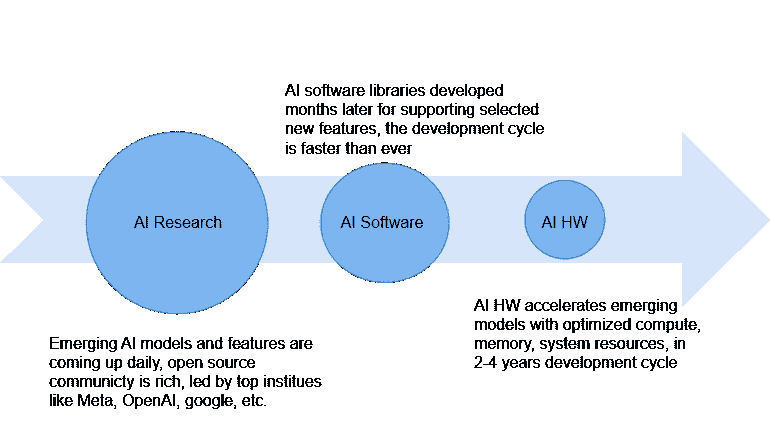

# LLM 的软硬件共同优化策略——第二部分（软件）

> 原文：[`towardsdatascience.com/sw-hw-co-optimization-strategy-for-llms-part-2-software-65ea2247481e?source=collection_archive---------3-----------------------#2024-01-02`](https://towardsdatascience.com/sw-hw-co-optimization-strategy-for-llms-part-2-software-65ea2247481e?source=collection_archive---------3-----------------------#2024-01-02)

## 软件正在吞噬世界。LLM 的软硬件生态是什么样的？有哪些新兴的库/软件框架可以提升 LLM 的性能？

 [Liz Li](https://medium.com/@LizLiAI?source=post_page---byline--65ea2247481e--------------------------------)

·发布于 [Towards Data Science](https://towardsdatascience.com/?source=post_page---byline--65ea2247481e--------------------------------) ·7 分钟阅读·2024 年 1 月 2 日

--

随着新的 LLM 模型和功能不断涌现（查看 [hugging face LLM 排行榜](https://huggingface.co/spaces/HuggingFaceH4/open_llm_leaderboard)），软件工具和库的发布速度也在加快。这一快速进展也激发了 AI 硬件方面的众多创新。在从系统角度优化 LLM 时，至关重要的是要理解，尽管 Meta、Google、OpenAI、Nvidia、斯坦福大学等大公司和研究机构每天都有新的研究成果涌现，但软件堆栈/库并不能立即将所有内容直接转化为硬件执行。只有少数选定的软件功能可以得到支持，这些功能需要几个月（大约 6 个月）的开发才能投入生产。如果这些功能需要在 AI 硬件加速器中得到支持，开发周期会更长（2-4 年），尤其在发生架构变化时。解决软件与硬件优化之间的这种差距是一个重大挑战，而我们正致力于在这一系列文章中 tackling 这一问题！

图片由作者提供

新兴的软件工具和库不仅服务于 LLM 的训练，也支持推理。在这篇文章中，我们将…… 
