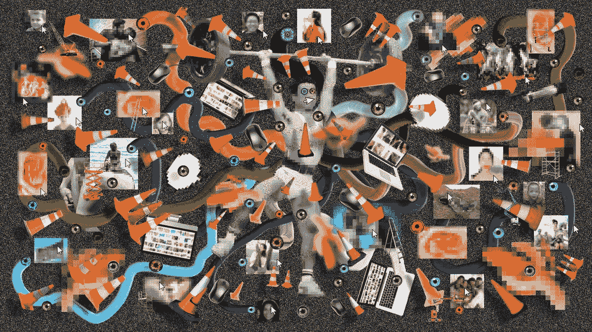

# 合成数据：好、坏与未整理

> 原文：[`towardsdatascience.com/synthetic-data-the-good-the-bad-and-the-unsorted-8220de6aac40?source=collection_archive---------7-----------------------#2024-01-13`](https://towardsdatascience.com/synthetic-data-the-good-the-bad-and-the-unsorted-8220de6aac40?source=collection_archive---------7-----------------------#2024-01-13)

## 关于使用合成数据进行 AI 训练的法律视角

 [Tea Mustać](https://medium.com/@tea.mustac?source=post_page---byline--8220de6aac40--------------------------------)

·发表于 [Towards Data Science](https://towardsdatascience.com/?source=post_page---byline--8220de6aac40--------------------------------) ·阅读时间 9 分钟·2024 年 1 月 13 日

--

> 免责声明：这不是另一篇关于利弊的文章合集。

Anne Fehres 和 Luke Conroy & AI4Media / 更好的 AI 图像 / 人类负责繁重的数据搬运 / CC-BY 4.0

合成数据被认为是推动研究、产品开发，甚至支持依赖大量数据的整个商业模型的一个有前途的途径，特别是在真实数据稀缺、敏感或在法律上存在使用问题的情况下。然而，似乎在现有的法律文献中（主要由现有的概括性观点引起）对合成数据在避免法律雷区和改善 AI 模型方面的实际效用存在很多困惑。这种困惑导致了大量文章提到相同的利弊，但从不同的角度出发。而且，这些文章有时会交替提到相同的特点。因此，例如，虽然大多数人似乎都同意*可扩展性*和*增强隐私*是依赖合成数据的明确优势，但*成本*既被提到是一个优点[[1]](#_ftn1)，也被提到是一个缺点[[2]](#_ftn2)。*偏见*也是如此，合成数据既可以作为减少偏见的一种手段[[3]](#_ftn3)，但有时也会导致偏见的放大[[4]](#_ftn4)。这一切都取决于你偶然遇到的文章，以及这些文章中考虑的具体情况和场景。最糟糕的是，这些文章中的任何一个观点都不是错误的。

我们在这里不会尝试做相同的尝试。我们将更倾向于在当前混淆的使用、目的、概念、情况和情境之间画出一些界限，以至少有助于澄清现有的混乱。因此，我们暂时将事情复杂化，以便稍后澄清迷雾。然而，在此过程中，我们始终会关注隐私问题。（毕竟，这是我至少可以假装有一些答案并知道自己在说什么的事情。）

# 人工智能生成的合成数据

至少在法律背景下，合成数据最常被分析的优缺点与其在增强隐私保护方面的应用有关。然而，在这个背景下，合成数据似乎经常与匿名数据或假名数据进行比较，甚至等同于它们。这是令人遗憾的，因为假名化和匿名化在历史上一直存在误解和滥用。因此，关于这两者在隐私和《通用数据保护条例》（GDPR）背景下的含义，并没有真正的共识，这使得它们成为糟糕的参考点。但同时，因为合成数据是（或应该是）与这两者完全不同的独立概念，所以我们应该尽量避免将其与这两个误解的概念混淆。然而，尽管理想情况下我们应当远离这两个误解的概念，我们仍然会坚持使用它们。毕竟我们并非生活在真空中，所以不妨与之和解。

首先，合成数据绝不应该是假名数据。因为如果它是，那意味着我们没有很好地合成它。其次，它（通常）属于匿名数据的范畴。为什么？为了回答这个问题，我们先来探讨一下假名化的问题。

假名数据是指在没有使用附加信息的情况下，无法将数据归属于特定数据主体的数据，前提是这些附加信息被分开并安全保存。[ [5] ](#_ftn5) 需要记住两点：1. 重新识别的可能性仍然存在，2. 有人持有解密密钥。这就是为什么假名数据仍被视为个人数据，也是为什么合成数据不是假名数据。或者说，至少不应该是。

另一方面，匿名化是将个人数据（鼓点）变为匿名的过程。[ [6] ](#_ftn6) 这意味着匿名数据与任何自然人无关（根本不相关），或者曾经与某人相关，但现在已经被匿名化，无法再识别该人。[ [7] ](#_ftn7) 在这里有多个需要注意的地方。首先，匿名数据也可以指经过处理和匿名化的个人数据。其次，匿名数据不再用于识别其原始归属者（如果曾经属于某人）。至少在今天可用的技术和方法下无法做到。[ [8] ](#_ftn8) 第三，匿名数据也可以是完全非个人的数据，例如天气统计。

现在引入合成数据。合成数据是通过人工生成的数据，用来再现原始数据的特征和结构。[[9]](#_ftn9) 我们可以将其视为原始数据的某种代理。在这个过程中，原始的真实数据不一定是个人数据，即使是个人数据，新的合成数据无论如何是匿名的，因为它是完全虚构的，并且不包含（或者至少不应该包含）其所基于的原始数据。这反过来使得*合成*仅仅是可能的匿名化技术之一。（现在暂时不讨论数据是否能够完全匿名化的问题。[ [10]](#_ftn10) ）但这仍然不意味着这两者总是完全相同的。

所有这一切都很重要，因为既然我们在谈论的应该是匿名数据，那么看起来整个隐私辩论实际上完全是没有意义的。因为匿名数据完全不在《通用数据保护条例》（GDPR）的范围之内。然而我们仍然在讨论它。而且我们这样做并没有错。

# 合成数据是隐私的朋友还是敌人？

我们在讨论合成数据与隐私之间的关系时，首先要考虑的事情是：为什么我们只是在某种程度上错了。合成数据必须通过生成得到，有时需要基于包含个人数据的数据集来生成。这现在（通常是，但不一定）是通过机器学习模型和深度学习算法来完成的。可能是因为我们在谈论处理和合成大量数据。而且，由于无论目的如何，识别模式和统计数据是机器学习模型天然擅长的（与大多数人类不同）。这反过来意味着，单单生成合成数据就已经是一个处理操作，从法律角度来看，这是相关的，特别是如果原始数据是个人数据的话。这也意味着，关于使用合成数据训练机器学习模型是否有益的常见论点和讨论，完全忽视了这个问题的两个关键方面。它们不仅通过将合成数据仅仅与隐私挂钩而过于简化问题，而且在大多数情况下忽略了仍然会有模型在处理个人数据以便进行合成。这些方面现在并不是被过度复杂化的边缘问题，相反，它们对于展开有关合成数据的（成熟的）对话非常关键，无论隐私是否在其中。

而且在谈论合成数据时，隐私问题往往没有被提及。再次指出，合成数据有其独立的生命。它作为一种技术和策略被应用于各种场合，包括当真实数据稀缺、敏感，或其使用涉及法律问题和不确定性的情形。例如，使用合成数据的一个重要目的（虽然在公众讨论中很少提及）就是在军事背景下训练人工智能系统。在那里，合成数据可以用于数据集多样化和数据属性精细控制的目的，这两个目的对于提升质量以及缩短训练周期在这一稀缺、难以获取且高度敏感的真实数据领域非常重要。[ [11] ](#_ftn11) 你很少在流行文献中看到这些类型的权衡，然而它们确实存在，并且同样重要，甚至在其他背景下也值得考虑。

另一方面，即使在隐私的背景下提到和关联合成数据，我们依然在过度概括事情，并混淆了两个不同的基本权利。因为，尽管隐私和数据保护在很大程度上有重叠，但它们不能作为同义词使用。而且，在讨论合成数据的背景下，尽管我们通常可以将其作为一种隐私保护技术，但在数据保护方面的情况则更为复杂。主要是因为它可能引发的一些问题，例如偏差或准确性不足。现在，虽然这乍一看可能是件坏事，数据保护再次让另一种有前景的方法受阻，但这可能仅仅是我们对好老 GDPR 做出了不必要的悲观看法。也就是说，这些问题同样困扰着人工智能开发者，他们经常提到数据分布偏差、不完整和不准确的数据、噪声缺乏、过度平滑或递归等问题，都是在使用合成数据时降低模型性能的因素。无论这个模型最终是否影响到人类，没有人愿意使用一个不准确且有偏见的模型。最后，这些问题的严重性仍然在很大程度上取决于训练的模型类型及其预定用途。不过，这确实意味着，律师和人工智能开发者实际上关心的许多问题是一样的，只是乍一看不太明显。这是件好事。它意味着我们只需要相互交流，共同解决问题。

# 最后思考

那么，合成数据是朋友还是敌人？它既不是也同时是。事实上，这里是一个经典的双刃剑例子。合成数据在解决一些现有问题的同时，也带来了新的问题。这不仅仅适用于隐私，它同样适用于性能目标，例如*可扩展性*和*数据增强*可能与*偏见放大*或*泛化*问题相对立。这并不是让我们放弃或重复那些过于泛化或只聚焦于某个微小点的利弊文章与分析的理由。这种做法也使得任何阅读某篇文章的人都无法看到树后面的森林。

在训练机器学习模型的过程中，合成数据的效用和适用性将始终取决于具体情况。它将取决于我们需要用于训练模型的数据类型（个人数据、受版权保护的数据、高度敏感的数据），所需数据的数量、数据的可用性以及模型的预期用途（因为不准确或偏见放大在评估信用 worthiness 的模型和优化供应链的模型中的权重是不同的）。所以，也许我们可以通过回答这些问题来开始任何特定情境，然后在更合适的环境中考虑各种现有的权衡。

## 关键要点：

· 合成数据绝不应为伪匿名数据。

· 合成数据应始终保持匿名。

· 合成数据不仅仅与隐私有关。

· 虽然合成数据始终有助于保护隐私，但它也带来了其他数据保护问题。

· 隐私和数据保护并非相同的概念。

· 一些数据保护问题也恰好是性能问题。这是好事，因为这意味着我们所有人（至少有时）都在尝试解决同一个问题。

· 与合成数据相关的所有权衡都非常依赖于具体情境，并应在相关背景下进行讨论。

Max Gruber / 更好的人工智能图像 / Ceci n’est pas une banane / CC-BY 4.0

[[1]](#_ftnref1) 探索合成数据：优势与应用场景，Intuit Mailchimp，[`mailchimp.com/resources/what-is-synthetic-data/`](https://mailchimp.com/resources/what-is-synthetic-data/)

[[2]](#_ftnref2) John Anthony R, 关于人工智能——合成数据有一个不为人知的小秘密，[`www.linkedin.com/pulse/when-comes-aisynthetic-data-has-dirty-little-secret-radosta/`](https://www.linkedin.com/pulse/when-comes-aisynthetic-data-has-dirty-little-secret-radosta/)

[[3]](#_ftnref3) Michael Yurushkin, 合成数据如何解决人工智能偏见问题？，Brouton Lab 博客，[`broutonlab.com/blog/ai-bias-solved-with-synthetic-data-generation/`](https://broutonlab.com/blog/ai-bias-solved-with-synthetic-data-generation/)

[[4]](#_ftnref4) Giuffrè, M., Shung, D.L. 在医疗保健中利用合成数据的力量：创新、应用和隐私。npj 数字医学，6，186（2023）。[`doi.org/10.1038/s41746-023-00927-3`](https://doi.org/10.1038/s41746-023-00927-3)

[[5]](#_ftnref5) GDPR

[[6]](#_ftnref6) AEDP，关于匿名化的 10 个误解，[`edps.europa.eu/system/files/2021-04/21-04-27_aepd-edps_anonymisation_en_5.pdf`](https://edps.europa.eu/system/files/2021-04/21-04-27_aepd-edps_anonymisation_en_5.pdf)

[[7]](#_ftnref7) GDPR 第 26 条说明

[[8]](#_ftnref8) AEDP，关于匿名化的 10 个误解，[`edps.europa.eu/system/files/2021-04/21-04-27_aepd-edps_anonymisation_en_5.pdf`](https://edps.europa.eu/system/files/2021-04/21-04-27_aepd-edps_anonymisation_en_5.pdf)

[[9]](#_ftnref9) Robert Riemann，合成数据，欧洲数据保护监督员。

[[10]](#_ftnref10) Alex Hern，《“匿名化”数据永远不可能完全匿名，研究表明》，《卫报》，2019 年 7 月 23 日，[`www.theguardian.com/technology/2019/jul/23/anonymised-data-never-be-anonymous-enough-study-finds`](https://www.theguardian.com/technology/2019/jul/23/anonymised-data-never-be-anonymous-enough-study-finds)；Emily M Weitzenboeck, Pierre Lison, Malgorzata Cyndecka, Malcolm Langford, GDPR 与非结构化数据：匿名化是否可能？，《国际数据隐私法》，第 12 卷，第 3 期，2022 年 8 月，184–206 页，[`doi.org/10.1093/idpl/ipac008`](https://doi.org/10.1093/idpl/ipac008)

[[11]](#_ftnref11) H. Deng, 探索用于人工智能和自主系统的合成数据：入门指南，

瑞士日内瓦：UNIDIR，2023，[`unidir.org/wp-content/uploads/2023/11/UNIDIR_Exploring_Synthetic_Data_for_Artificial_Intelligence_and_Autonomous_Systems_A_Primer.pdf`](https://unidir.org/wp-content/uploads/2023/11/UNIDIR_Exploring_Synthetic_Data_for_Artificial_Intelligence_and_Autonomous_Systems_A_Primer.pdf)。
