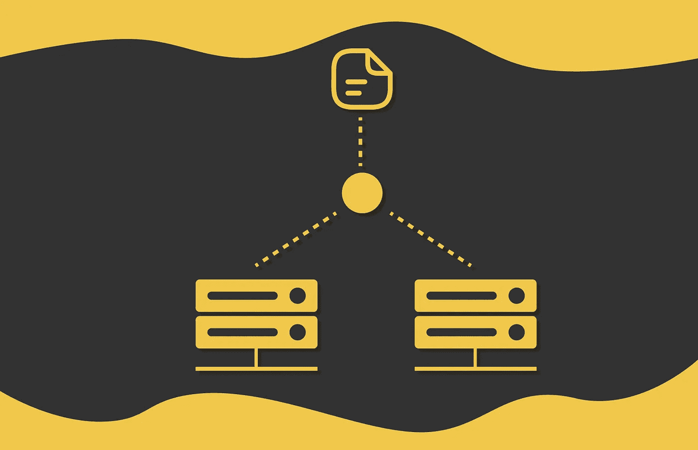

# 系统设计：负载均衡器

> 原文：[`towardsdatascience.com/system-design-load-balancer-9a3582176f9b?source=collection_archive---------2-----------------------#2024-06-28`](https://towardsdatascience.com/system-design-load-balancer-9a3582176f9b?source=collection_archive---------2-----------------------#2024-06-28)

## 为微服务应用中的工作负载分配设计最佳策略

 [Vyacheslav Efimov](https://medium.com/@slavahead?source=post_page---byline--9a3582176f9b--------------------------------)

·发布于 [Towards Data Science](https://towardsdatascience.com/?source=post_page---byline--9a3582176f9b--------------------------------) ·阅读时长 8 分钟·2024 年 6 月 28 日

--

# 介绍

大型分布式应用程序处理的请求量超过每秒数千个。在某些时候，处理单台机器上的请求变得不再可能。这就是为什么软件工程师关注**水平扩展**，在这种模式下，整个系统在多个服务器上有条不紊地组织。在这种配置中，每台服务器仅处理所有请求的一部分，基于其容量、性能和其他几个因素。

服务器之间的请求可以以不同的方式分配。在本文中，我们将研究最流行的策略。顺便说一下，无法概述出最佳策略：每种策略都有其独特的属性，应该根据系统配置进行选择。

# 负载均衡器的使用

**负载均衡器**可以出现在不同的应用层次中。例如，大多数 Web 应用程序由前端、后端和数据库层组成。因此，可以在不同的应用部分使用多个负载均衡器来优化请求路由：

+   在用户（客户端）和前端服务器之间；

+   在前端和后端之间……
