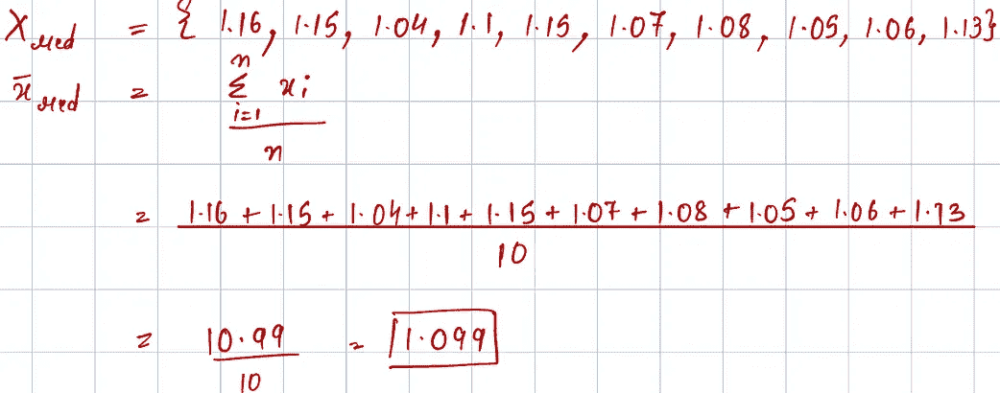

# t 检验：从应用到理论

> 原文：[`towardsdatascience.com/t-test-from-application-to-theory-5e5051b0f9dc?source=collection_archive---------6-----------------------#2024-07-12`](https://towardsdatascience.com/t-test-from-application-to-theory-5e5051b0f9dc?source=collection_archive---------6-----------------------#2024-07-12)

## 为了弥合数学计算与双样本 t 检验程序实现之间的差距，本文提供了一个使用实际案例的逐步指南。它包括统计工具的概述、使用这些工具的动机，以及对结果及其解释的说明。

 [Shreya Shukla](https://medium.com/@shreyashukla04?source=post_page---byline--5e5051b0f9dc--------------------------------)

· 发表在 [Towards Data Science](https://towardsdatascience.com/?source=post_page---byline--5e5051b0f9dc--------------------------------) · 阅读时间：6 分钟 · 2024 年 7 月 12 日

--

图片来源：[Steve Mushero](https://unsplash.com/@steve_mushero?utm_content=creditCopyText&utm_medium=referral&utm_source=unsplash) 在 [Unsplash](https://unsplash.com/photos/billiard-balls-on-billiard-table-Qok3vOrww_E?utm_content=creditCopyText&utm_medium=referral&utm_source=unsplash)

你是否曾经陷入过一个循环，不断复习统计工具的概念，记住它们并重新回顾，但这些概念仍然难以牢记？你知道如何使用公式，但总感觉这些只是对概念的表面理解。在我成为德州大学奥斯汀分校物理实验课程 105M 的助教并应用与我们解决问题相关的统计工具时，我也曾经历过同样的困境。正是在那时，我最终理解了学生 t 检验的理论和应用，现在我真的掌握了它。

让我们从一个问题开始。

## *颜色是否影响两个相似球体在斜坡上的滑动时间？*

直观地，问题的答案可能是“没有”！但让我们通过使用常见的统计测试来验证这个假设。在假设检验的术语中：

+   **原假设** 表示颜色不会影响滚动时间（没有效应）

+   **备择假设** 表示颜色确实会影响滚动时间（存在效应）。

实验示意图 — 两个颜色不同的相似球体从斜坡上滚下

## 数据

我们首先通过多次试验（比如每个小球进行 10 次试验），分别测量两个不同颜色（例如一个黑色，一个红色）的小球沿斜坡滚动所需的时间。

不同试验中获得的滚动时间差异突出显示了**进行多次试验的重要性**，而不是仅进行一次试验，从而有助于提供更可靠的估计。

> 还需要注意的是，对于估计的滚动时间，可能有许多不同的值（**总体**），但我们只通过有限的试验捕获这些值的**样本**。

来自 10 次试验的实验数据

## **最佳估计**

接下来，我们计算每个小球的预期值或最佳估计滚动时间。我们假设不同试验的时间记录形成了一个**随机分布**，并且预期值最好由该分布的**均值**或平均值表示。

两个分布的最佳估计/均值的数学计算（单位为秒）

最佳估计计算的程序实现

## 标准误差

如前所述，我们通过仅进行 10 次试验从所有可能的值（**总体**）中收集了有限的数据（**样本**）。请注意，计算出的最佳估计值来自样本分布。然而，为了更好地估计总体均值，我们计算样本分布的标准误差。**标准误差帮助我们确定最佳估计值在总体中的可能范围。** 它基于分布的方差，方差表示分布在均值周围的分散程度。

计算标准误差时，首先需要找到标准差（方差的平方根），然后将其除以数据点数量的平方根。

标准差和标准误差的数学计算（单位为秒）

标准误差计算的程序实现

我们观察到，两个小球的最佳估计值和标准误差是相似的（计算出的范围之间有重叠），这促使我们考虑到分布是相似的，因此颜色可能不会影响小球的滚动时间。然而，**这些发现的统计学意义和可靠性如何？** 从本质上讲，这些值是否提供了足够的证据，让我们对假设做出结论？

为了衡量我们结果的确定性，并以更易于交流的方式呈现证据，我们使用检验统计量。**这些统计量帮助我们衡量获得这些结果的概率，提供一个确定性的度量。**例如，如果已知总体标准差，则使用 z 统计量；如果只知道样本标准差（如在我们的实验中），则使用 t 统计量。

## t 统计量

我们通过**双样本 t 检验**比较两个样本分布（组），该检验依赖于两个组的最佳估计和方差。根据两个组之间方差的相似性，我们决定使用**合并方差（如学生 t 检验用于方差相等）或 Welch t 检验（用于方差不等）**。

> 使用统计检验，如 F 检验或 Levene 检验，我们可以评估方差的相等性。

由于计算出的两个分布的标准差（方差的平方根）非常相似，我们继续使用**方差相等的学生 t 检验**。我们进行双尾检验，检查分布的不等式，而不是专门寻找较小或较大的值。

我们使用合并标准差以及从两个分布中获得的均值来计算 t 得分。

双样本学生 t 检验的数学计算

学生 t 统计量计算的程序实现

## 结果解读

正如我们观察到的，t 统计量基于两个样本均值的差异。在我们的案例中，t 统计量非常小（约-0.38），这表明两个分布的均值之间的差异也非常小。这表明两个球的记录相似，暗示出结论，即颜色对滚动时间没有显著影响。

然而，**解释 t 统计量不仅仅是观察均值的微小差异**，特别是因为我们只比较了两个样本（有限的试验），而不是整个总体。为了做出有根据的推断，我们需要确定临界值，然后将我们的 t 统计量与该临界值进行比较。

**临界值**是基于置信区间（例如，95%）和样本大小（自由度）确定的。**95%置信区间**（CI）意味着，如果实验重复多次，真实的均值差异将落在 95%计算出的区间内。

在我们的案例中，为了找到临界值或临界值范围（因为我们检查的是不等式），我们使用 t 分布表。对于**95%置信区间的双尾检验**，我们查看 0.05 显著性水平，该水平分为每个尾部 2.5%。根据我们的自由度（df = 18），临界值范围大约为-2.101 到+2.101。

双尾 t 分布，用于 95%的置信区间和 18 的自由度  

**我们的 t 统计量-0.38 落在 95%置信区间的临界范围内，这得出了两个关键推论。** 首先，红球和黑球的滚动时间之间的观测差异非常小，表明颜色对滚动时间没有影响。其次，基于 95%的置信度，如果我们多次重复实验，红球和黑球滚动时间的真实均值差异将始终落在此范围内。  

**因此，我们的结果表明，两球的记录时间均值差异较小，在 95%的置信水平下是统计显著且可靠的，表明基于球的颜色，滚动时间没有实质性差异。**  

*我很高兴记录下我的理解，希望能帮助那些像我一样在掌握这些统计工具时遇到困难的人。我期待看到其他人实现这些方法。如有未解答的问题，请随时与我联系或参考下面提到的文献。*  

除非另有说明，所有图片均由作者提供。  

参考文献：  

[学生 t 检验 - 维基百科](https://en.wikipedia.org/wiki/Student%27s_t-test?source=post_page-----5e5051b0f9dc--------------------------------)  

### 学生 t 检验是一种用于检验两组响应差异是否显著的统计检验…

[标准误差 - 维基百科](https://en.wikipedia.org/wiki/Standard_error?source=post_page-----5e5051b0f9dc--------------------------------)  

### 统计量的标准误差（SE）（通常是参数的估计值）是其抽样分布的标准差…  

[numpy.std - NumPy v2.0 手册](https://en.wikipedia.org/wiki/Standard_error?source=post_page-----5e5051b0f9dc--------------------------------)  

### 计算沿指定轴的标准差。返回标准差，这是衡量数据分布的一种方法…  

[ttest_ind - SciPy v1.14.0 手册](https://docs.scipy.org/doc/scipy/reference/generated/scipy.stats.ttest_ind.html?source=post_page-----5e5051b0f9dc--------------------------------)  

### 计算两个独立样本的均值 T 检验。这是一个检验零假设的测试，假设两个…  

[docs.scipy.org](https://docs.scipy.org/doc/scipy/reference/generated/scipy.stats.ttest_ind.html?source=post_page-----5e5051b0f9dc--------------------------------)  
