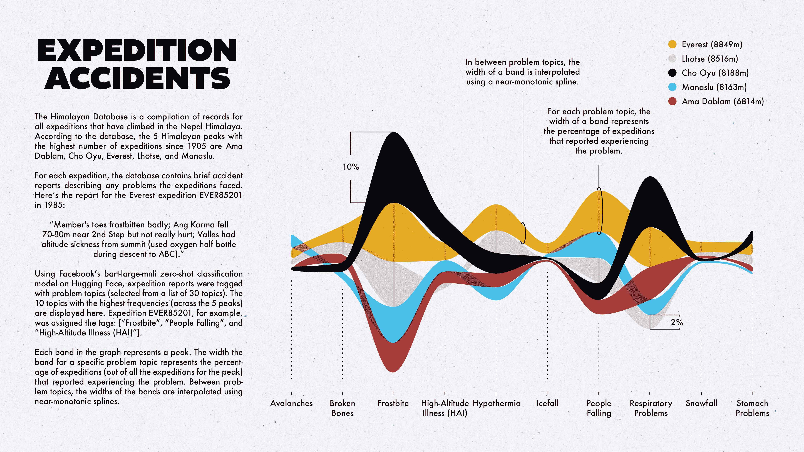

# 使用 bart-large-mnli 标记登山事故报告

> 原文：[`towardsdatascience.com/tagging-mountaineering-accident-reports-using-bart-large-mnli-1b1f6d97756a?source=collection_archive---------11-----------------------#2024-02-05`](https://towardsdatascience.com/tagging-mountaineering-accident-reports-using-bart-large-mnli-1b1f6d97756a?source=collection_archive---------11-----------------------#2024-02-05)

## 使用问题类型标记登山事故报告。

[](https://medium.com/@karlahrnndz?source=post_page---byline--1b1f6d97756a--------------------------------)[](https://towardsdatascience.com/?source=post_page---byline--1b1f6d97756a--------------------------------) [Karla Hernández](https://medium.com/@karlahrnndz?source=post_page---byline--1b1f6d97756a--------------------------------)

·发表于 [Towards Data Science](https://towardsdatascience.com/?source=post_page---byline--1b1f6d97756a--------------------------------) ·21 分钟阅读·2024 年 2 月 5 日

--



[图片来源：作者](https://www.karlahernandez.com/art-w-code/tagging-mountaineering-accident-descriptions)。

几周前，我发现了[喜马拉雅数据库](https://www.himalayandatabase.com/index.html)，并决定基于这个数据集创建一些“异想天开”的可视化图表。在之前的两篇文章中，我分别为珠穆朗玛峰探险创建了一个简单的 elevation plot，并展示了 5 座喜马拉雅山峰的死亡人数的对比图。这一次，我想探索探险事故报告。

我将使用的数据集是一个小型 CSV 文件，包含了喜马拉雅探险的信息（大约 11,300 行），每一条记录/行代表一次喜马拉雅探险。以下是 5 条安纳普尔纳二号山的探险样本记录：

```py
 expid peakid  year  season  host            route1            route2 route3 route4      nation               leaders                                        sponsor  success1  success2  success3  success4 ascent1 ascent2 ascent3 ascent4  claimed  disputed     countries                                   approach   bcdate   smtdate  smttime  smtdays  totdays  termdate  termreason                                         termnote  highpoint  traverse    ski  parapente  camps  rope  totmembers  smtmembers  mdeaths  tothired  smthired  hdeaths  nohired  o2used  o2none  o2climb  o2descent  o2sleep  o2medical  o2taken  o2unkwn…
```
