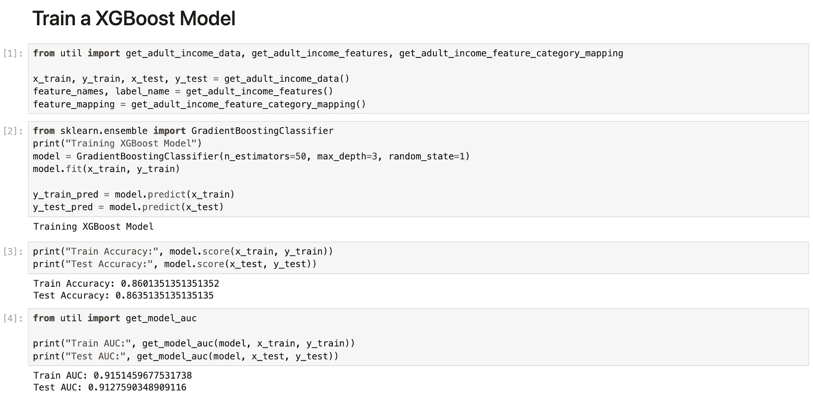
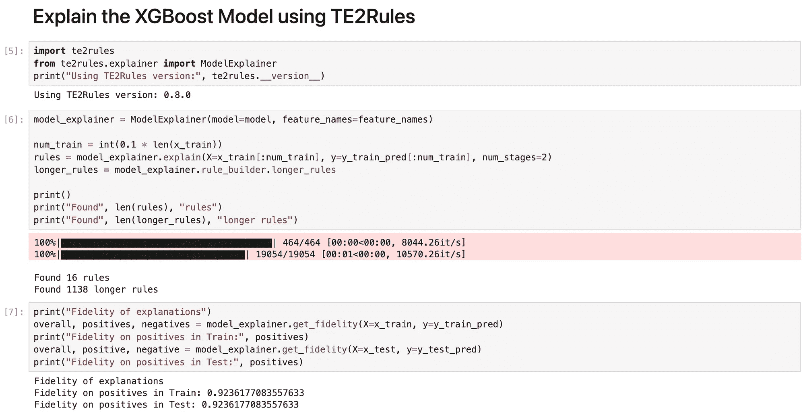
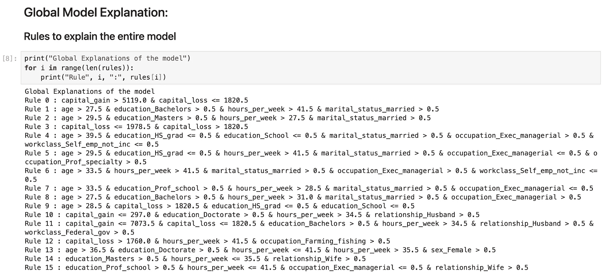
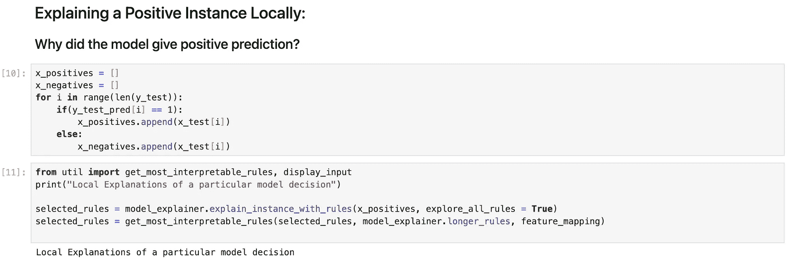
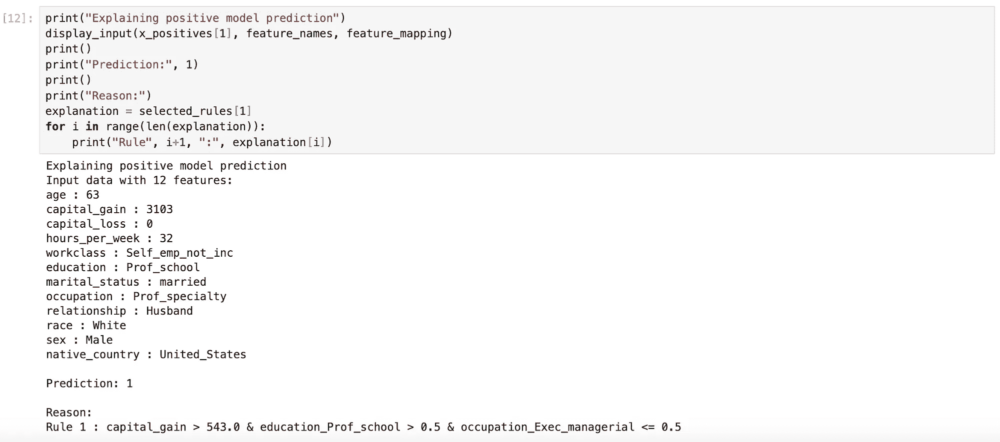
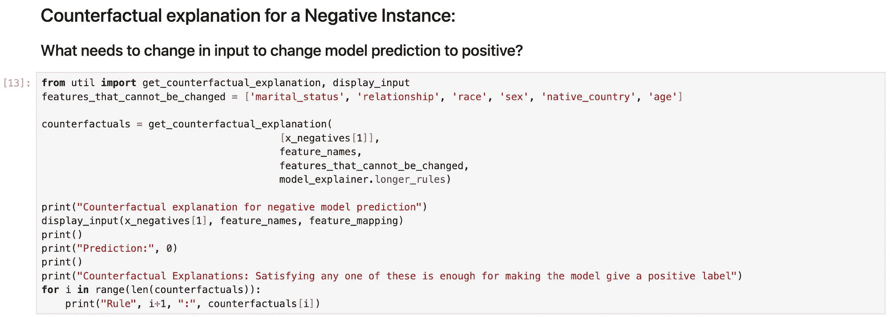
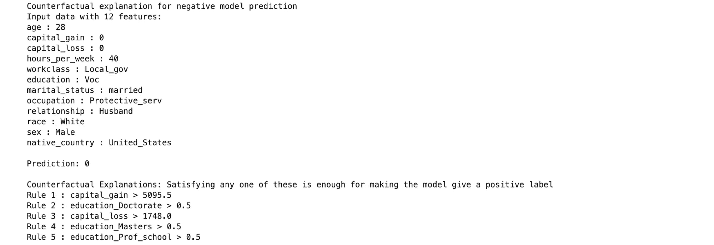

# TE2Rules：解释“为什么我的模型这么说？”

> 原文：[`towardsdatascience.com/te2rules-explaining-why-did-my-model-say-that-54214941075b?source=collection_archive---------14-----------------------#2024-01-05`](https://towardsdatascience.com/te2rules-explaining-why-did-my-model-say-that-54214941075b?source=collection_archive---------14-----------------------#2024-01-05)

## 将模型可解释性拓展到图像和文本之外

 [G Roshan Lal](https://groshanlal.medium.com/?source=post_page---byline--54214941075b--------------------------------)

·发表于[Towards Data Science](https://towardsdatascience.com/?source=post_page---byline--54214941075b--------------------------------) ·阅读时间 8 分钟·2024 年 1 月 5 日

--

在快速发展的人工智能领域，最近的进展已将该领域推向了惊人的高度，使得模型能够模仿人类在处理图像和文本方面的能力。从以艺术家的技巧创作图像到生成引人入胜的标题、回答问题以及撰写完整的文章，人工智能已成为我们数字工具库中不可或缺的一部分。

然而，尽管这些非凡的成就已经取得，强大技术的全面采用仍然并非普及。人工智能模型的“黑箱”特性引发了重大关切，尤其是在那些对透明度要求极高的行业中。对于**“为什么模型会这么说？”**缺乏洞察引入了风险，例如毒性和不公平的偏见，特别是针对边缘群体。在医疗和金融等高风险领域，错误决策的后果代价高昂，因此可解释性变得至关重要。这意味着，模型不仅需要得出正确的决策，还同样重要的是能够解释这些决策背后的逻辑。

# 表格数据挑战

尽管能够处理、理解并生成更多图像或文本的模型已经成为许多人中的新热点，但许多高风险领域是基于如用户信息、用户点赞的帖子、购买历史、观看历史等数据表格来做决策的，

表格数据并不是一个新现象。它自互联网诞生以来就存在，例如用户的浏览历史、访问的页面、点击的互动、在线浏览的产品、在线购买的产品等。这些信息通常被广告商用来向你展示相关广告。

在金融、医疗、法律等高风险领域，许多关键的应用案例也严重依赖以表格形式组织的数据。以下是一些例子：

1.  设想一个医院试图判断某个病人在接受某种治疗后康复的可能性。医院可能会使用包含患者数据的表格，数据可能包括年龄、以往的健康问题和治疗详情等因素。如果使用的模型过于复杂或是“黑箱模型”，医生可能很难信任或理解预测结果。

1.  同样，在金融领域，银行会分析表格中的各种因素来决定一个人是否符合贷款资格以及应该提供什么样的利率。如果使用的模型过于复杂，那么就很难向客户解释为何作出某个决策，这可能导致客户对系统失去信任。

在现实世界中，许多关键的决策任务，如通过医学检测诊断疾病、根据财务报表批准贷款、根据风险概况优化投资、在社交媒体上识别虚假个人资料以及为定制广告定位合适的受众，都涉及从表格数据中做出决策。尽管深度神经网络（如卷积神经网络和像 GPT 这样的变换器模型）擅长处理图像、文本和语音等非结构化输入，但像 XGBoost 这样的树集成模型仍然是处理表格数据的无可匹敌的冠军。这可能在深度神经网络时代让人感到惊讶，但它确实是事实！用于表格数据的深度模型，如 [TabTransformer](https://arxiv.org/abs/2012.06678)、[TabNet](https://arxiv.org/abs/1908.07442) 等，表现与 XGBoost 模型相当，尽管它们使用了更多的参数。

# 解释 XGBoost 模型在表格数据中的应用

在这篇博客文章中，我们将解释 XGBoost 模型所做的二元分类决策。解释这类模型的一种直观方法是使用人类可以理解的规则。例如，考虑一个模型用来判断一个用户账户是否属于机器人。如果模型将一个用户标记为“机器人”，那么基于模型特征的可解释性说明可能是“与其他机器人的连接数量 ≥ 100 且每日 API 调用次数 ≥ 10k”。

[TE2Rules](https://arxiv.org/abs/2206.14359)是专门为此目的设计的算法。TE2Rules 代表树集成到规则（Tree Ensembles to Rules），其主要功能是通过生成从输入特征组合中衍生的规则，来解释任何面向二分类的树集成模型。该算法结合了从 XGBoost 模型中的多棵树提取的决策路径，使用的是未标记数据的子集。从 XGBoost 模型中提取规则所使用的数据不必与训练数据相同，也不需要任何真实标签。该算法利用这些数据揭示数据集中隐含的相关性。值得注意的是，TE2Rules 提取的规则在模型预测中具有很高的精度（默认值为 95%）。该算法系统地识别出 XGBoost 模型中的所有潜在规则，以解释正例实例，并随后将其浓缩为一组简明的规则，能够有效地覆盖数据中的大多数正例。这组简化的规则作为模型的全面全局解释器。此外，TE2Rules 保留了所有可能规则的较长规则集，可以通过使用简洁规则来解释特定实例。

# 演示：展示与讲解

TE2Rules 通过提供模型决策过程的洞见，展示了其在各个医学领域的有效性。以下是一些实例：

+   多发性硬化症： [使用临床数据和脑部 MRI 病变纹理特征评估多发性硬化症的可解释 AI 模型](https://ieeexplore.ieee.org/abstract/document/10313379)

+   抑郁症：[使用机器学习识别抑郁症个体的特征](https://sol.sbc.org.br/index.php/kdmile/article/view/25576)

在本节中，我们展示了如何使用 TE2Rules 解释一个预测个人收入是否超过 50,000 美元的模型。该模型使用了来自 UCI 库的[成人收入数据集](https://archive.ics.uci.edu/dataset/2/adult)进行训练。此博客中使用的 Jupyter 笔记本可以在此处获取：[XGBoost-Model-Explanation-Demo](https://github.com/groshanlal/XGBoost-Model-Explanation-Demo)。该数据集受 CC BY 4.0 许可协议保护，允许学术和商业用途。

## 步骤 1：训练 XGBoost 模型

我们在成人收入数据集上训练了一个具有 50 棵深度为 3 的树的 XGBoost 模型。我们注意到，训练完成后，XGBoost 模型在训练和测试数据集上的准确率约为 86%，AUC 为 0.91。这证明了模型的有效训练及其在测试数据上良好的泛化能力。

## 步骤 2：使用 TE2Rules 解释模型

使用 TE2Rules，我们从训练好的 XGBoost 模型中推导出规则。为了引导 TE2Rules 生成解释规则，我们使用了 10%的训练数据。值得注意的是，TE2Rules 总共识别出 1138 条规则，其中每条规则在满足时确保模型的正类预测。为了提高可用性，TE2Rules 将这些规则整合为一组简洁的 16 条规则，有效地用 50 棵树（每棵树的深度为 3）解释模型。

以下是完整解释该模型的 16 条规则：

每条规则的精度超过 95%。这些规则按在数据中的支持度降序排列。

## 第 3 步：使用 TE2Rules 解释特定输入

使用 TE2Rules，我们通过收集所有满足输入的 1138 条规则来解释一个特定的正类实例，从而解释该正类实例。在这些规则中，我们使用自定义逻辑对可能的解释进行排序，并选择最易理解的规则作为解释。

可解释性是高度主观的，因使用场景的不同而有所不同。在本示例中，我们使用规则中所使用特征的数量作为该规则可解释性的衡量标准。我们选择使用最少特征的规则作为最易理解的解释。以下是一个正类模型预测的示例输入，以及 TE2Rules 生成的关于该预测的解释：

我们注意到，在上面的示例中，模型使用 12 个特征将输入分类为正类。TE2Rules 通过一个只包含 3 个特征的规则来解释这一预测：“capital_gain > 543 且 education = 专业学校 且 occupation != 管理职位”。任何其他满足此规则的输入（来自相同的数据分布）都可以确保模型以超过 95%的概率将其分类为正类。

## 第 4 步：使用 TE2Rules 进行反事实解释

TE2Rules 提取出满足时能导致模型作出正类预测的规则。这些规则可以用来指出需要对负类分类输入进行的最小修改，以确保模型将其分类为正类。因此，TE2Rules 在生成反事实解释时非常有价值，反事实解释以规则的形式呈现，指定将负实例转化为正实例所需的条件。

与前一个场景类似，可接受的最小修改因上下文而异。在本示例中，某些特征（如年龄、关系状态和性别）被视为不可改变，而其他特征（如教育、职业和资本收益/损失）则被视为可改变的。对于任何负类实例，我们指出在这些可改变特征中单一的特征，展示所需的调整，以促使模型将该实例评分为正类。

我们注意到，在上述示例中，模型将输入分类为负面。TE2Rules 识别出 5 条不同的规则，只要满足其中任何一条规则，就足以使模型将预测从负面转为正面。接受不同教育背景，如职业学校、硕士或博士学位，或获得更多资本收益，都有助于个人赚取更多的钱。然而，令人惊讶的是，模型已经学会了即使资本损失很大，这个人仍然会变得富有！这可能是因为这样的变化会导致数据样本与训练数据的分布差异很大，使得模型在这种情况下的可靠性降低。

# 结论

可解释性对于建立对 AI 模型的信任至关重要，特别是在高风险场景中，模型的决策可能对人们的生活产生深远影响，比如在医疗、法律和金融领域。许多这些关键的应用场景都涉及基于表格格式的数据做出决策。XGBoost 通常是表格数据中最受欢迎的 AI 模型选择。

TE2Rules 作为一种多功能工具，用于解释 XGBoost 模型。TE2Rules 在医学领域已经获得了广泛关注，并且逐渐在其他领域也开始受到欢迎。在这篇博客中，我们展示了 TE2Rules 如何有效地解释“为什么我的模型会这么说？”

作为一个由作者共同创建的开源研究项目，TE2Rules 的源代码可以在[[`github.com/linkedin/TE2Rules`](https://github.com/linkedin/TE2Rules)]找到。我们鼓励用户将 TE2Rules 集成到他们的可解释性项目中。如果你发现 TE2Rules 对你的项目有帮助，请通过给仓库加星来表达支持。如果在使用 TE2Rules 过程中遇到任何问题，请通过[[`github.com/linkedin/TE2Rules/issues`](https://github.com/linkedin/TE2Rules/issues)]联系我们，我们会尽力解决你的问题。
