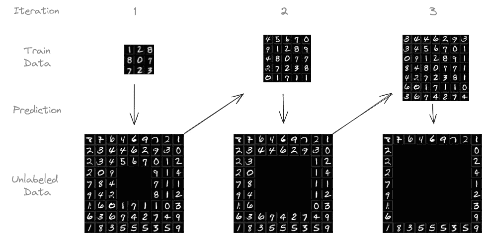
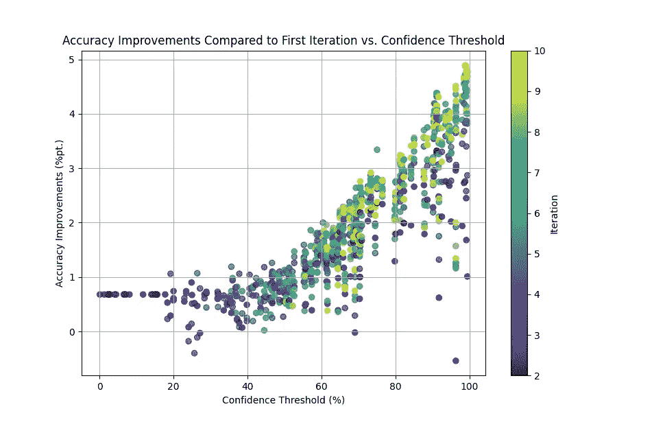
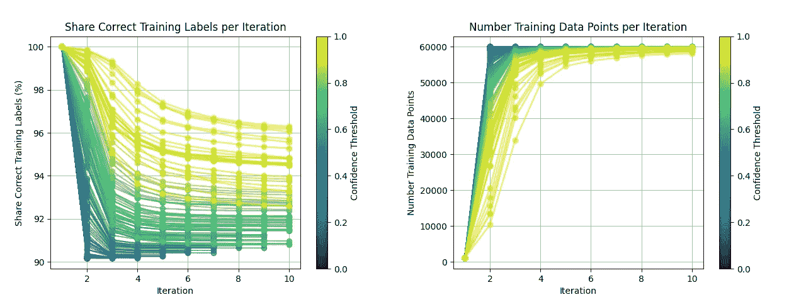
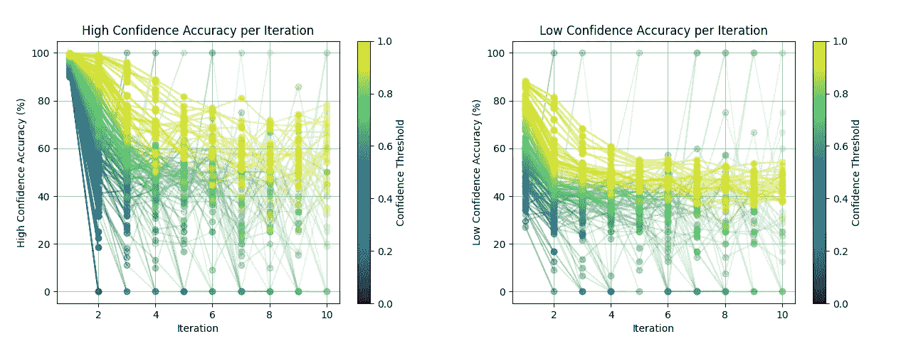

# 教授你的模型从自身学习

> 原文：[`towardsdatascience.com/teaching-your-model-to-learn-from-itself-8b5ef13eb173?source=collection_archive---------1-----------------------#2024-09-16`](https://towardsdatascience.com/teaching-your-model-to-learn-from-itself-8b5ef13eb173?source=collection_archive---------1-----------------------#2024-09-16)

## 基于迭代和置信度的伪标签分类案例研究

 [Niklas von Moers](https://medium.com/@niklasvmoers?source=post_page---byline--8b5ef13eb173--------------------------------)

·发表于 [Towards Data Science](https://towardsdatascience.com/?source=post_page---byline--8b5ef13eb173--------------------------------) ·6 分钟阅读·2024 年 9 月 16 日

--

在机器学习中，更多的数据通常会带来更好的结果。但标记数据可能非常昂贵且耗时。如果我们能够利用通常很容易获得的大量未标记数据呢？这就是伪标签方法的用武之地。

TL;DR：我在 MNIST 数据集上进行了案例研究，并通过应用迭代的、基于置信度的伪标签方法，将模型的准确率从 90%提高到了 95%。本文涵盖了伪标签的详细内容，以及我实验中的实用技巧和洞察。

# **它是如何工作的？**

伪标签是半监督学习的一种方式。它弥合了监督学习（所有数据都有标签）和无监督学习（没有标签数据）之间的差距。

过程示意图，展示了在 MNIST 数据集上执行的步骤。来源：Yann LeCun、Corinna Cortes 和 Christopher J.C. Burges。根据 CC BY-SA 3.0 许可授权。

我遵循的具体步骤如下：

+   我们从少量标记数据开始，并在其上训练模型。

+   模型对未标记的数据进行预测。

+   我们选择模型最有信心的预测（例如，置信度超过 95%），并将其*视为真实标签*，希望这些预测足够可靠。

+   我们将这些“伪标签”数据添加到我们的训练集，并重新训练模型。

+   我们可以多次重复这个过程，让模型从不断增长的伪标签数据池中学习。

虽然这种方法可能会引入一些错误标签，但它的好处在于大幅增加了训练数据的数量。

# **回声室效应：伪标签方法能有效吗？**

模型从自己预测中学习的想法可能会引起一些质疑。毕竟，我们不是在尝试从无到有，而是在依赖一个“回音室”，模型只是不断强化自己最初的偏见和错误，不是吗？

这个担忧是合理的。这可能让你想起传奇人物明茨豪森男爵，他曾声称自己通过自己的头发把自己和他的马从沼泽中拉了出来——这是物理上不可能的。类似地，如果一个模型完全依赖于自己可能存在缺陷的预测，它就有可能陷入自我强化的循环，就像那些被困在回音室中的人们，只听到自己信仰的回响。

那么，伪标签化真的可以有效避免陷入这个陷阱吗？

答案是**肯定的**。虽然明茨豪森男爵的故事显然是一个童话故事，但你可以想象一位铁匠随着时代的进步。他从基本的石器工具（最初的标注数据）开始，利用这些工具从原矿（无标签数据）中锻造出粗糙的铜器工具（伪标签）。这些铜器工具虽然仍然很粗糙，但使他能够进行**之前不可行**的任务，最终创造出青铜、铁等材料制成的工具。这个迭代过程至关重要：*你不能仅用石锤锻造钢剑。*

就像铁匠一样，在机器学习中，我们可以通过以下方式实现类似的进展：

+   **严格的阈值**：模型的样本外准确率受到正确训练标签比例的限制。如果 10%的标签是错误的，模型的准确率不会显著超过 90%。因此，尽可能减少错误标签的比例非常重要。

+   **可衡量的反馈**：不断在一个单独的测试集上评估模型的表现，充当现实检验，确保我们在取得实际进展，而不仅仅是在强化已有的错误。

+   **人机协作**：通过人工审查伪标签或人工标注低置信度数据的反馈，可以为调整方向提供宝贵的纠正。

当伪标签化正确执行时，它可以成为最大化利用小型标注数据集的强大工具，正如我们在接下来的案例研究中将看到的那样。

# **案例研究：MNIST 数据集**

我在 MNIST 数据集上进行了实验，MNIST 是一个经典的 28×28 像素手写数字图像集合，广泛用于机器学习模型的基准测试。它包含 60,000 张训练图像和 10,000 张测试图像。目标是根据 28×28 像素的图像，预测所写的数字是什么。

我用 1,000 张带标签的图像训练了一个简单的 CNN 模型，剩下的 59,000 张图像没有标签。然后，我用训练好的模型预测无标签图像的标签。对于置信度高于某个阈值（例如 95%）的预测结果，将其添加到训练集中，并标上预测的标签。接着，模型在这个扩展的数据集上重新训练。这个过程反复进行，最多进行十次，或者直到没有更多的无标签数据为止。

此实验使用不同数量的最初标记图像和置信度阈值进行了重复。

## **结果**

以下表格总结了我的实验结果，比较了伪标签与在完整标记数据集上训练的表现。

即使初始标记的数据集较小，伪标签仍然能产生**显著的效果**，对于 1,000 个初始标记样本，准确率提高了 4.87 个百分点。当仅使用 100 个初始样本时，这一效果更为显著。然而，手动标记超过 100 个样本会更明智。

有趣的是，使用 100 个初始训练样本的实验最终测试准确率超过了正确训练标签的比例。

相较于第一次迭代，按阈值（x 轴）和每次迭代（颜色）计算的准确率提升（y 轴）。更高的阈值和更多的迭代呈现出明显的改善趋势。图像由作者提供。

每次迭代中按阈值划分的正确训练标签的比例和总训练数据点数量。更高的阈值导致更稳健但更慢的标记。图像由作者提供。

每次迭代中按阈值划分的高置信度和低置信度预测的准确率。更高的阈值会导致更好的准确率，但随着时间推移，每个阈值选择的准确率都会下降。图像由作者提供。

与第一次迭代相比，按阈值对 100 个和 10,000 个最初标记的训练样本（分别位于左侧和右侧）计算的每次迭代的准确率提升。注意不同的刻度。图像由作者提供。

通过观察上述图表，可以明显看出，通常情况下，**更高的阈值会导致更好的结果**——只要至少有一些预测超过了阈值。在未来的实验中，可以尝试在每次迭代时变化阈值。

此外，准确率在后期迭代中仍然有所提高，这表明迭代的性质确实带来了真正的好处。

# **主要发现和经验教训**

+   伪标签最适用于**未标记数据丰富但标记成本高昂**的情况。

+   监控测试准确率：在整个迭代过程中，重要的是要关注模型在单独的测试数据集上的表现。

+   **手动标记仍然有帮助**：如果你有资源，重点手动标记低置信度数据。然而，人类也不是完美的，高置信度数据的标记可以放心交给模型。

+   **跟踪哪些标签是 AI 生成的。** 如果以后有更多手动标记的数据可用，你可能会希望丢弃伪标签并重新进行此过程，从而提高伪标签的准确性。

+   解释结果时要小心：几年前我第一次做这个实验时，我专注于剩余未标记训练数据的准确率。随着迭代次数的增加，这个准确率*下降*了！然而，这很可能是因为剩余的数据更难预测——在之前的迭代中，模型对这些数据从未有过信心。我应该专注于测试集的准确率，实际上随着迭代次数的增加，它会提高。

# **链接**

包含实验代码的仓库可以在[这里](https://github.com/NiklasvonM/Self-Training)找到。

相关论文：[使用深度特征注释和基于置信度的采样的迭代伪标签方法](https://doi.org/10.1109/SIBGRAPI54419.2021.00034)
