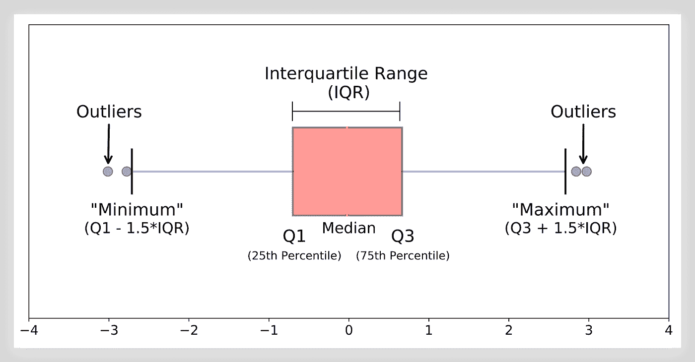

# 探索性数据分析技巧与统计图形的解释

> 原文：[`towardsdatascience.com/techniques-for-exploratory-data-analysis-and-interpretation-of-statistical-graphs-383ce57a6d0a?source=collection_archive---------1-----------------------#2024-11-12`](https://towardsdatascience.com/techniques-for-exploratory-data-analysis-and-interpretation-of-statistical-graphs-383ce57a6d0a?source=collection_archive---------1-----------------------#2024-11-12)

## 发现统计可视化中的洞察和模式的实用方法

 [Leo Anello 💡](https://medium.com/@panData?source=post_page---byline--383ce57a6d0a--------------------------------)

·发表于[Towards Data Science](https://towardsdatascience.com/?source=post_page---byline--383ce57a6d0a--------------------------------) ·49 分钟阅读·2024 年 11 月 12 日

--

[`datascience.stackexchange.com/questions/66356/machine-learning-methods-for-finding-outliers`](https://datascience.stackexchange.com/questions/66356/machine-learning-methods-for-finding-outliers) (CC BY-SA)

# **概述**

在这个项目中，我们将探索**探索性数据分析技巧**并深入研究**统计图形的解释**。你知道如何解释**直方图**或**箱线图**吗？

你能发现**异常值**或**缺失值**如何影响这些可视化效果吗？你能评估**数据清洗需求**以使这些解释更精确吗？

本项目将回答这些问题以及更多问题。项目设置在**与会计相关的商业背景**中，展示了在现实世界数据分析中常见的挑战。

本项目使用**虚拟数据**，模拟真实的会计场景，带领你了解分析和准备数据的关键步骤，以获得有意义的洞察。

 [## GitHub - 技术与图形解释]

### 技术与图形解释

github.com](https://github.com/Anello92/EDA-Techniques-and-Graph-Interpretation/tree/main?source=post_page-----383ce57a6d0a--------------------------------)

你可以通过我的[GitHub 仓库](https://github.com/Anello92/EDA-Techniques-and-Graph-Interpretation/tree/main)访问**完整的项目代码和数据集**，方便跟踪和学习……
