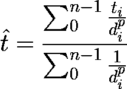
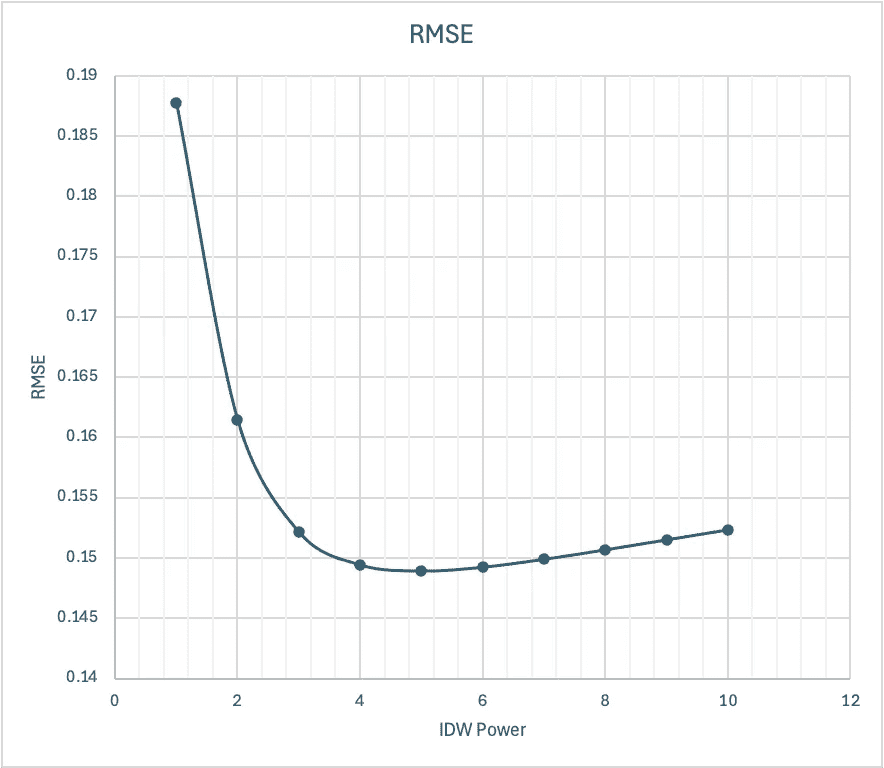

# 通过地理空间插值进行温度重建

> 原文：[`towardsdatascience.com/temperature-reconstruction-through-geospatial-interpolation-aea34c359207?source=collection_archive---------13-----------------------#2024-07-23`](https://towardsdatascience.com/temperature-reconstruction-through-geospatial-interpolation-aea34c359207?source=collection_archive---------13-----------------------#2024-07-23)

## 你的电动汽车那么冷吗？

[](https://medium.com/@joao.figueira?source=post_page---byline--aea34c359207--------------------------------)[](https://towardsdatascience.com/?source=post_page---byline--aea34c359207--------------------------------) [João Paulo Figueira](https://medium.com/@joao.figueira?source=post_page---byline--aea34c359207--------------------------------)

·发表于[Towards Data Science](https://towardsdatascience.com/?source=post_page---byline--aea34c359207--------------------------------) ·阅读时长 7 分钟·2024 年 7 月 23 日

--


图片由[马森·怀尔德芬](https://unsplash.com/@masonwildfang?utm_source=medium&utm_medium=referral)拍摄，来源：[Unsplash](https://unsplash.com/?utm_source=medium&utm_medium=referral)

大气温度不仅仅是天气条件，它是电动汽车电池性能的重要决定因素。近期的事件突显了极低温度对电动汽车电池性能的严重影响，减少了车辆的续航里程，并可能导致充电问题。温度重建在电动汽车车队性能的事后分析中的作用不仅仅是一个理论概念，而是一个实际工具，可以显著提高我们对电动汽车电池性能的理解，并改善电动汽车电池性能，这是电动汽车行业的关键问题。

在本文中，我将介绍一种用于历史温度重建的实用方法。该方法利用时空插值和减少的测量点集，可应用于增强和改善我们对电动汽车（EV）电池性能的理解。

# 问题

我们希望重建超过 2200 万个带时间戳的位置的历史大气温度，而不向[数据提供者](https://open-meteo.com/)发出相同数量的查询请求[1]。Open-Meteo 提供者对其免费访问层的每日请求数量进行限制，因此我们最好的选择是设计一个解决方案，以在保持良好精度的同时限制数据查询次数。

本文使用了[扩展车辆能量数据集](https://github.com/zhangsl2013/eVED)的原始 CSV 格式[2]。该数据集包含了 2017 年 11 月到 2018 年 11 月间在密歇根州安娜堡附近收集的车辆遥测数据。数据集包含了车辆测量的外部温度样本，但正如我们将看到的，这些数据有噪声，且不足以用于校准。

我们的问题是设计一个插值模型，该模型使用来自数据提供方的减少版本的真实温度集，并在目标数据上推导出高精度的预测。

# 解决方案

由于我们能从气象提供方获取的数据有限，我们将从遥测数据采样区域内的九个位置收集历史温度数据。我们收集了这九个位置全年每小时采样的温度时间序列，并将其作为插值的真实数据。

插值发生在三个维度中：两个是地图平面上的维度，第三个是时间维度。时间插值是最简单的，因为我们假设每小时样本之间的温度线性变化。正弦波可能是一个更好的模型，但可能代价太高，无法提高边际精度。我们使用[反距离加权（IDW）](https://www.geodose.com/2019/03/spatial-interpolation-inverse-distance-weighting-idw.html)[3,4]算法进行地理空间插值，利用每个温度源与目标点之间的反距离来估算目标温度。IDW 公式如下图**图 1**所示。



**图 1** — IDW 温度估算器需要来自每个 n 个位置的线性插值温度(t)，每个温度源与目标位置之间的距离(d)，以及功率(p)，这是一个可调参数。（图像由作者生成。）

如下图**图 2**所示，本解决方案使用了九个温度源。我们收集了数据提供方为每个位置报告的全年每小时的温度时间序列。这九个温度源的时间插值值将输入到地理空间插值器中，得到目标位置的估计温度的最终值。


**图 2** - 上图显示了我们收集真实数据的九个位置。（图像由作者使用 OpenStreetMap 数据和影像创建。）

为了测试插值的准确性，我们还收集了源数据样本，直接调用气象提供方在这些采样位置获取数据，创建了一个验证数据集。我们从具有有效外部空气温度（OAT）信号的记录中选择了这些样本，以测试车辆报告的温度质量。

## 设置

首先，将文章的[GitHub 仓库](https://github.com/joaofig/eved-geo-interp)克隆到本地机器。要安装所有必要的依赖（Python 环境和所需的包），请从项目根目录运行安装程序，使用以下命令：

```py
make install
```

如果你有访问 UNIX 系统的权限，可以直接运行以下命令行（请确保你对父目录具有写入权限，因为此脚本将尝试创建一个同级文件夹）来下载原始的 CSV 数据文件：

```py
make download-data
```

如果您在 Windows 系统上运行，请阅读[README](https://github.com/joaofig/eved-geo-interp/blob/main/README.md)文件中的说明。这些说明要求手动从源仓库下载数据并将压缩文件解压到适当的数据文件夹中。解压后，由于 CSV 编码错误，某些数据文件还需要特殊处理。

## 运行代码

该代码由三个 Python 脚本和共享的公共代码组成。运行说明请参见[README](https://github.com/joaofig/eved-geo-interp/blob/main/README.md)文件。

通过运行此代码，您将从初始源数据集过渡到更新版，其中所有超过二千二百万行的数据都已标注上与地面真实值匹配的外部温度值。

```py
python collect-samples.py
```

我们从一个[脚本](https://github.com/joaofig/eved-geo-interp/blob/main/collect-samples.py)开始，该脚本确定在哪里收集年度的真实温度数据，并将其存储在文件缓存中以供后续使用（见**图 2**）。然后，它逐个 CSV 文件采样原始数据集，收集验证集以帮助调整 IDW 算法的幂参数。该脚本收集每一行采样的地面真实温度，假设 Open-Meteo 提供者报告了给定位置和日期的准确数据。脚本最后将包含地面真实温度数据的采样行保存为 CSV 文件，以便在第二步中重复使用。

```py
python tune-idw-power.py
```

接下来，我们运行[脚本](https://github.com/joaofig/eved-geo-interp/blob/main/tune-idw-power.py)，该脚本通过计算采样数据集的插值来调整 IDW 算法的幂参数，将参数值从一变到十。通过绘制幂值与计算出的 RMSE 之间的关系，我们找到了一个最小值为五（见**图 3**），我们将在最终脚本中使用该值。



**图 2** — 上图展示了计算出的 RMSE 图表，RMSE 是地面真实温度和 IDW 算法插值结果之间的差值，随着幂参数值的变化，RMSE 值出现明显的最小值，当幂参数值为五时最小。（图像由作者生成。）

上面的 RMSE 值是通过将采样的温度作为真实值与插值后的温度进行比较计算得出的。该脚本计算了这些 RMSE 值，并且在与真实温度对比时，也计算了外部空气温度（OAT）信号的 RMSE。使用与上面图表相同的数据集，我们得到的值为 7.11，足足高出一个数量级，确认了 OAT 信号作为真实测量值的不足。

```py
python update-temperatures.py
```

最终的[脚本](https://github.com/joaofig/eved-geo-interp/blob/main/update-temperatures.py)会遍历 CSV 输入文件，通过插值估算外部温度，并将结果保存到一组新的 CSV 文件中。新文件与输入文件相同，只是新增了一个温度列，并且已经准备好可以使用。

请注意，这个脚本运行时间较长。如果你决定中断它，它会在上次生成的文件之后恢复执行。

## 日期和时间处理

该数据集在处理日期时有一种非常特殊的方式。根据[原始论文的 GitHub 仓库文档](https://github.com/gsoh/VED)，每个数据点在两列中编码日期和时间。第一列`DayNum`编码自数据收集开始以来的天数，其中值 1 对应第一天：

```py
base_dt = datetime(year=2017, month=11, day=1, 
                   tzinfo=timezone("America/Detroit"))
```

第二列`Timestamp(ms)`编码了从旅行开始的毫秒偏移量（更多信息请参考仓库和论文）。要从这两列中获得有效日期，必须将基准日期与这两个偏移量相加，方式如下：

```py
base_dt + timedelta(days=day_num-1) + timedelta(milliseconds=timestamp_ms)
```

每当我们需要将原始数据格式转换为标准的 Python 日期时间格式并明确指定时区时，你都会在代码中看到这种日期和时间的处理方式。

在从气象数据提供商收集温度信息时，我们明确要求所有的日期和时间都以当地时区表示。

# 结语

为什么在为本文编写代码时选择了[Polars](https://pola.rs/)? Pandas 同样是一个有效的选择，但我想先试试这项新技术。尽管我发现它很容易上手，但它感觉不像是 Pandas 的直接替代品。Polars 有一些新的非常有趣的概念，比如懒处理，它在并行解析所有 CSV 文件并提取地理边界时非常有帮助。

Polars 的懒执行 API 让我想起了编程 Spark，这让我感到很怀念。我也想念 Pandas 的一些快捷方式，但它的速度提升和显然更好的 API 结构轻松弥补了这一点。

# 致谢

我使用了[Grammarly](https://app.grammarly.com/)来审阅文章，并接受了它的一些重写建议。

[JetBrains 的 AI](https://www.jetbrains.com/ai/)助手编写了部分代码，我还用它学习了 Polars。它已成为我日常工作的重要工具。

# 许可信息

扩展车辆能量数据集在 Apache 2.0 许可下发布，类似于其原始数据集 [车辆能量数据集](https://github.com/gsoh/VED)。

# 参考文献

[1] [Open-Meteo](https://open-meteo.com/)

[2] Zhang, S., Fatih, D., Abdulqadir, F., Schwarz, T., & Ma, X. (2022). **扩展的车辆能量数据集 (eVED)：一个用于深度学习的增强版大规模车辆行程能耗数据集。** *ArXiv*. /abs/2203.08630

[3] [**使用逆距离加权（IDW）方法的空间插值解释**](https://www.geodose.com/2019/03/spatial-interpolation-inverse-distance-weighting-idw.html)

[4] **逆距离加权**. (2024 年 6 月 7 日). 载于 *维基百科*. [`en.wikipedia.org/wiki/Inverse_distance_weighting`](https://en.wikipedia.org/wiki/Inverse_distance_weighting)

João Paulo Figueira 是 [tb.lx by Daimler Truck](https://tblx.io/) 的数据科学家，位于葡萄牙里斯本。
