# TensorFlow Transform：确保生产中的数据准备无缝进行

> 原文：[`towardsdatascience.com/tensorflow-transform-ensuring-seamless-data-preparation-in-production-99ffcf49f535?source=collection_archive---------7-----------------------#2024-07-08`](https://towardsdatascience.com/tensorflow-transform-ensuring-seamless-data-preparation-in-production-99ffcf49f535?source=collection_archive---------7-----------------------#2024-07-08)

## 利用 TensorFlow Transform 来扩展生产环境中的数据管道

[](https://medium.com/@akila29?source=post_page---byline--99ffcf49f535--------------------------------)[](https://towardsdatascience.com/?source=post_page---byline--99ffcf49f535--------------------------------) [Akila Somasundaram](https://medium.com/@akila29?source=post_page---byline--99ffcf49f535--------------------------------)

·发表于[Towards Data Science](https://towardsdatascience.com/?source=post_page---byline--99ffcf49f535--------------------------------) ·阅读时长 10 分钟·2024 年 7 月 8 日

--


图片来自[Suzanne D. Williams](https://unsplash.com/@scw1217?utm_source=medium&utm_medium=referral) 在[Unsplash](https://unsplash.com/?utm_source=medium&utm_medium=referral)

数据预处理是任何机器学习管道中的主要步骤之一。TensorFlow Transform 帮助我们在分布式环境中处理庞大的数据集。

在深入探讨数据转换之前，数据验证是生产管道过程的第一步，我在我的文章[生产管道中的数据验证：TFX 方式](https://medium.com/towards-data-science/validating-data-in-a-production-pipeline-the-tfx-way-9770311eb7ce)中已经讲解过。请阅读这篇文章，以便更好地理解本文内容。

我在这个演示中使用了 Colab，因为它配置环境更简单（且更快）。如果你正处于探索阶段，我也建议使用 Colab，因为它能帮助你专注于更重要的内容。

机器学习管道操作从数据摄取和验证开始，然后是数据转换。转换后的数据进行训练并部署。我在之前的[文章](https://medium.com/towards-data-science/validating-data-in-a-production-pipeline-the-tfx-way-9770311eb7ce)中已经讲解了验证部分，现在我们将讨论数据转换部分。为了更好地理解 TensorFlow 中的管道，请查看下面的文章。

[](https://www.tensorflow.org/tfx?source=post_page-----99ffcf49f535--------------------------------) [## TFX | 机器学习生产管道 | TensorFlow

### 构建和管理端到端的生产级机器学习管道。TFX 组件支持可扩展的、高性能的数据处理……

[www.tensorflow.org](https://www.tensorflow.org/tfx?source=post_page-----99ffcf49f535--------------------------------)

如前所述，我们将使用 Colab。所以我们只需要安装 tfx 库，就可以开始了。

```py
! pip install tfx
```

> 安装完成后，重启会话以继续。

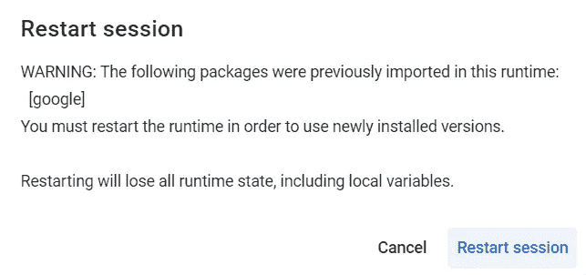

接下来是导入部分。

```py
# Importing Libraries

import tensorflow as tf

from tfx.components import CsvExampleGen
from tfx.components import ExampleValidator
from tfx.components import SchemaGen
from tfx.v1.components import ImportSchemaGen
from tfx.components import StatisticsGen
from tfx.components import Transform

from tfx.orchestration.experimental.interactive.interactive_context import InteractiveContext
from google.protobuf.json_format import MessageToDict

import os
```

我们将使用来自 Kaggle 的太空船泰坦尼克数据集，如数据验证文章中所示。该数据集可以用于商业和非商业目的，且免费使用。你可以从[这里](https://www.kaggle.com/competitions/spaceship-titanic)访问它。数据集的描述见下图。

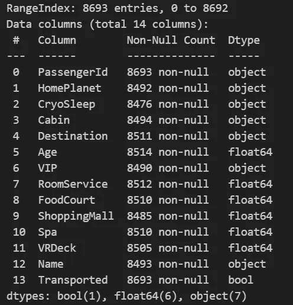

为了开始数据转换部分，建议创建文件夹来存放管道组件（否则它们将被放置在默认目录中）。我创建了两个文件夹，一个用于管道组件，另一个用于我们的训练数据。

```py
# Path to pipeline folder
# All the generated components will be stored here

_pipeline_root = '/content/tfx/pipeline/'

# Path to training data
# It can even contain multiple training data files
_data_root = '/content/tfx/data/'
```

接下来，我们创建 InteractiveContext，并传递管道目录的路径。此过程还会创建一个 sqlite 数据库，用于存储管道过程的元数据。

InteractiveContext 用于探索流程的每个阶段。在每个阶段，我们可以查看所创建的工件。在生产环境中，我们理想的做法是使用像 Apache Beam 这样的管道创建框架，在该框架中，整个过程会自动执行，无需人工干预。

```py
# Initializing the InteractiveContext 
# This will create an sqlite db for storing the metadata

context = InteractiveContext(pipeline_root=_pipeline_root)
```

接下来，我们开始数据导入。如果你的数据存储为 csv 文件，我们可以使用 CsvExampleGen，并传递数据文件所在目录的路径。

> 确保文件夹中只包含训练数据，且没有其他内容。如果你的训练数据分为多个文件，请确保它们具有相同的标题。

```py
# Input CSV files 
example_gen = CsvExampleGen(input_base=_data_root)
```

TFX 当前支持 csv、tf.Record、BigQuery 和一些自定义执行器。更多信息请参见以下链接。

[](https://www.tensorflow.org/tfx/guide/examplegen?source=post_page-----99ffcf49f535--------------------------------) [## ExampleGen TFX 管道组件 | TensorFlow

### ExampleGen TFX 管道组件将数据导入 TFX 管道。它使用外部文件/服务生成……

[www.tensorflow.org](https://www.tensorflow.org/tfx/guide/examplegen?source=post_page-----99ffcf49f535--------------------------------)

要执行 ExampleGen 组件，使用 context.run。

```py
# Execute the component

context.run(example_gen)
```

运行组件后，这将是我们的输出。它提供了执行 ID、组件详情以及组件输出保存的位置。

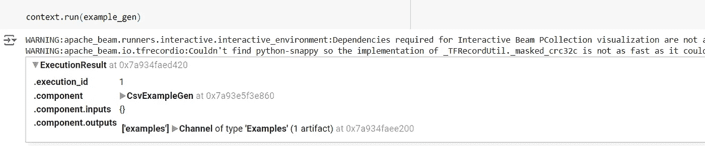

展开后，我们应该能够看到这些详情。

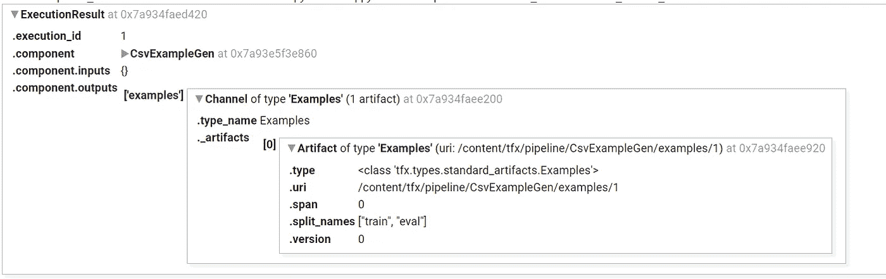

目录结构如下图所示。所有这些工件都是由 TFX 为我们创建的，它们也会自动进行版本控制，详细信息存储在 metadata.sqlite 中。sqlite 文件有助于维护数据来源或数据血统。

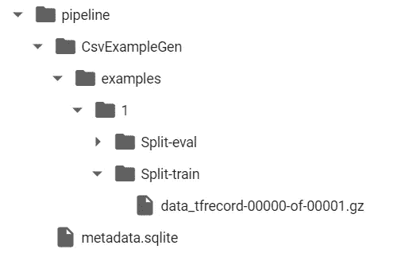

要以编程方式探索这些工件，可以使用以下代码。

```py
# View the generated artifacts
artifact = example_gen.outputs['examples'].get()[0]

# Display split names and uri
print(f'split names: {artifact.split_names}')
print(f'artifact uri: {artifact.uri}')
```

输出将是文件名和 uri。

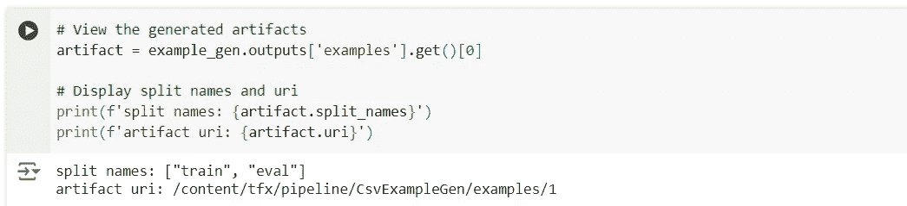

让我们复制训练的 uri，并查看文件中的详细信息。该文件以 zip 格式存储，并以 TFRecordDataset 格式存储。

```py
# Get the URI of the output artifact representing the training examples
train_uri = os.path.join(artifact.uri, 'Split-train')

# Get the list of files in this directory (all compressed TFRecord files)
tfrecord_filenames = [os.path.join(train_uri, name)
                      for name in os.listdir(train_uri)]

# Create a `TFRecordDataset` to read these files
dataset = tf.data.TFRecordDataset(tfrecord_filenames, compression_type="GZIP")
```

以下代码来自 Tensorflow，这是一个标准代码，可以用来从 TFRecordDataset 中获取记录，并返回供我们检查的结果。

```py
# Helper function to get individual examples
def get_records(dataset, num_records):
    '''Extracts records from the given dataset.
    Args:
        dataset (TFRecordDataset): dataset saved by ExampleGen
        num_records (int): number of records to preview
    '''

    # initialize an empty list
    records = []

    # Use the `take()` method to specify how many records to get
    for tfrecord in dataset.take(num_records):

        # Get the numpy property of the tensor
        serialized_example = tfrecord.numpy()

        # Initialize a `tf.train.Example()` to read the serialized data
        example = tf.train.Example()

        # Read the example data (output is a protocol buffer message)
        example.ParseFromString(serialized_example)

        # convert the protocol bufffer message to a Python dictionary
        example_dict = (MessageToDict(example))

        # append to the records list
        records.append(example_dict)

    return records
```

```py
# Get 3 records from the dataset
sample_records = get_records(dataset, 3)

# Print the output
pp.pprint(sample_records)
```

我们请求了 3 条记录，输出如下。每条记录及其元数据都以字典格式存储。

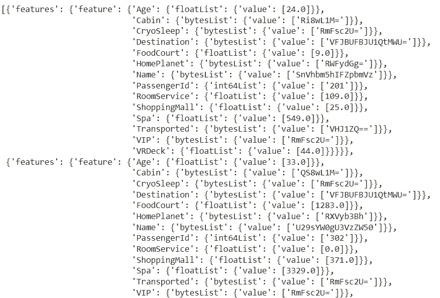

接下来，我们进入下一个步骤，即使用 StatisticsGen 生成数据的统计信息。我们将 example_gen 对象的输出作为参数传递。

我们使用 statistics.run 来执行组件，并将 statistics_gen 作为参数。

```py
# Generate dataset statistics with StatisticsGen using the example_gen object

statistics_gen = StatisticsGen(
    examples=example_gen.outputs['examples'])

# Execute the component
context.run(statistics_gen)
```

我们可以使用 context.show 来查看结果。

```py
# Show the output statistics

context.show(statistics_gen.outputs['statistics'])
```

你可以看到，这与我们在 TFDV 文章中讨论的统计生成非常相似。原因是，TFX 在底层使用 TFDV 来执行这些操作。熟悉 TFDV 有助于更好地理解这些过程。

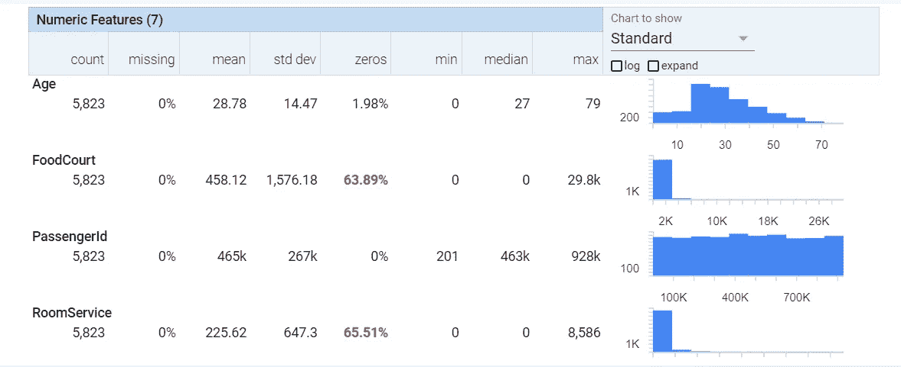

下一步是创建 schema。这是通过使用 SchemaGen 并传递 statistics_gen 对象来完成的。运行组件并使用 context.show 来可视化它。

```py
# Generate schema using SchemaGen with the statistics_gen object

schema_gen = SchemaGen(
    statistics=statistics_gen.outputs['statistics'],
    )

# Run the component
context.run(schema_gen)

# Visualize the schema

context.show(schema_gen.outputs['schema'])
```

输出显示了数据底层模式的详细信息。同样，这与 TFDV 中的内容类似。

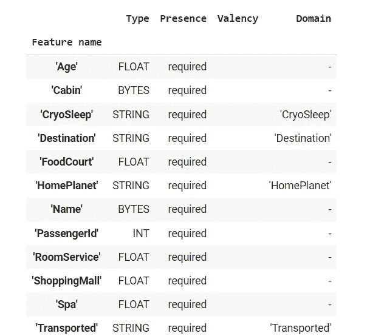

如果需要修改这里提供的 schema，请使用 tfdv 进行修改，并创建一个 schema 文件。你可以通过 ImportSchemaGen 传递它，并要求 tfx 使用新文件。

```py
# Adding a schema file manually 
schema_gen = ImportSchemaGen(schema_file="path_to_schema_file/schema.pbtxt")
```

接下来，我们使用 ExampleValidator 来验证示例。我们将 statistics_gen 和 schema_gen 作为参数传递。

```py
# Validate the examples using the ExampleValidator
# Pass statistics_gen and schema_gen objects

example_validator = ExampleValidator(
    statistics=statistics_gen.outputs['statistics'],
    schema=schema_gen.outputs['schema'])

# Run the component.
context.run(example_validator)
```

这应该是你的理想输出，以显示一切正常。

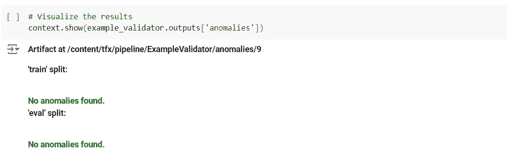

在这一点上，我们的目录结构如下图所示。我们可以看到，在每个过程步骤中，都会创建相应的工件。

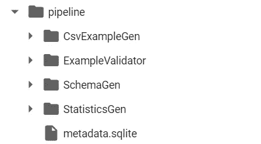

让我们进入实际的转换部分。我们现在将创建 constants.py 文件，以添加处理过程中所需的所有常量。

```py
# Creating the file containing all constants that are to be used for this project

_constants_module_file = 'constants.py'
```

我们将创建所有常量并写入 constants.py 文件。请看“%%writefile {_constants_module_file}”，此命令并不会让代码运行，而是将给定单元格中的所有代码写入指定的文件。

```py
%%writefile {_constants_module_file}

# Features with string data types that will be converted to indices
CATEGORICAL_FEATURE_KEYS = [ 'CryoSleep','Destination','HomePlanet','VIP']

# Numerical features that are marked as continuous
NUMERIC_FEATURE_KEYS = ['Age','FoodCourt','RoomService', 'ShoppingMall','Spa','VRDeck']

# Feature that can be grouped into buckets
BUCKET_FEATURE_KEYS = ['Age']

# Number of buckets used by tf.transform for encoding each bucket feature.
FEATURE_BUCKET_COUNT = {'Age': 4}

# Feature that the model will predict
LABEL_KEY = 'Transported'

# Utility function for renaming the feature
def transformed_name(key):
    return key + '_xf'
```

让我们创建 transform.py 文件，其中将包含用于转换数据的实际代码。

```py
# Creating a file that contains all preprocessing code for the project

_transform_module_file = 'transform.py'
```

在这里，我们将使用 tensorflow_transform 库。变换过程的代码将在 preprocessing_fn 函数下编写。我们必须使用相同的名称，因为 tfx 在变换过程中会在内部查找它。

```py
%%writefile {_transform_module_file}

import tensorflow as tf
import tensorflow_transform as tft

import constants

# Unpack the contents of the constants module
_NUMERIC_FEATURE_KEYS = constants.NUMERIC_FEATURE_KEYS
_CATEGORICAL_FEATURE_KEYS = constants.CATEGORICAL_FEATURE_KEYS
_BUCKET_FEATURE_KEYS = constants.BUCKET_FEATURE_KEYS
_FEATURE_BUCKET_COUNT = constants.FEATURE_BUCKET_COUNT
_LABEL_KEY = constants.LABEL_KEY
_transformed_name = constants.transformed_name

# Define the transformations
def preprocessing_fn(inputs):

    outputs = {}

    # Scale these features to the range [0,1]
    for key in _NUMERIC_FEATURE_KEYS:
        outputs[_transformed_name(key)] = tft.scale_to_0_1(
            inputs[key])

    # Bucketize these features
    for key in _BUCKET_FEATURE_KEYS:
        outputs[_transformed_name(key)] = tft.bucketize(
            inputs[key], _FEATURE_BUCKET_COUNT[key])

    # Convert strings to indices in a vocabulary
    for key in _CATEGORICAL_FEATURE_KEYS:
        outputs[_transformed_name(key)] = tft.compute_and_apply_vocabulary(inputs[key])

    # Convert the label strings to an index
    outputs[_transformed_name(_LABEL_KEY)] = tft.compute_and_apply_vocabulary(inputs[_LABEL_KEY])

    return outputs
```

我们在这个演示中使用了一些标准的缩放和编码函数。实际上，变换库包含了许多函数，可以在这里探索它们。

[](https://www.tensorflow.org/tfx/transform/api_docs/python/tft?source=post_page-----99ffcf49f535--------------------------------) [## 模块：tft | TFX | TensorFlow

### TF.Transform 的初始化模块。

www.tensorflow.org](https://www.tensorflow.org/tfx/transform/api_docs/python/tft?source=post_page-----99ffcf49f535--------------------------------)

现在是时候查看变换过程的实际操作了。我们创建一个 Transform 对象，并传入 example_gen 和 schema_gen 对象，以及我们创建的 transform.py 文件的路径。

```py
# Ignore TF warning messages
tf.get_logger().setLevel('ERROR')

# Instantiate the Transform component with example_gen and schema_gen objects
# Pass the path for transform file

transform = Transform(
    examples=example_gen.outputs['examples'],
    schema=schema_gen.outputs['schema'],
    module_file=os.path.abspath(_transform_module_file))

# Run the component
context.run(transform)
```

运行它，变换部分就完成了！

看一下下面图像中显示的变换数据。

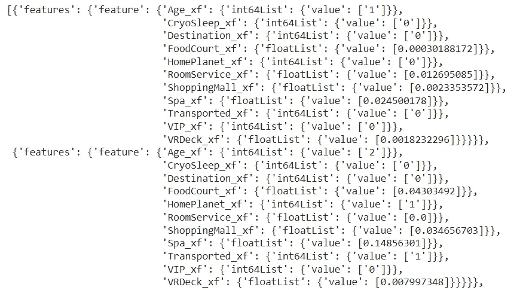

# 为什么不直接使用 scikit-learn 库或 pandas 来做这些？

这就是你现在的问题，对吧？

这个过程并不适用于想要预处理数据并开始训练模型的个人用户。它是为大规模数据（需要分布式处理的数据）和无法中断的自动化生产管道而设计的。

应用变换后，你的文件夹结构如下所示：

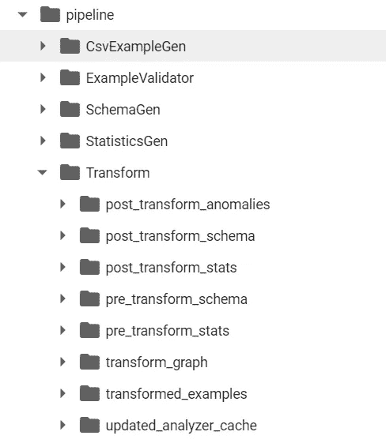

它包含了变换前后的详细信息。此外，还创建了一个变换图。

请记住，我们使用 tft.scale_to_0_1 对数值特征进行了缩放。像这样的函数需要计算一些细节，这些细节需要分析整个数据（例如特征的均值、最小值和最大值）。分析分布在多台机器上的数据以获取这些细节是性能密集型的（特别是如果多次执行时）。这些细节只会计算一次，并保存在 transform_graph 中。任何时候一个函数需要它们时，它都会直接从 transform_graph 中获取。这还有助于将训练阶段创建的变换直接应用于服务数据，确保预处理阶段的一致性。

使用 Tensorflow Transform 库的另一个主要优势是，每个阶段都会被记录为工件，从而保持数据的血缘关系。当数据发生变化时，数据版本控制也会自动进行。因此，它使得在生产环境中进行实验、部署和回滚变得更加容易。

就是这样。如果你有任何问题，请在评论区写下来。

你可以从我的 GitHub 仓库下载本文章中使用的笔记本和数据文件，点击这个[链接](https://github.com/akila29/TF_Transform_Demo)。

# 接下来做什么？

若想更好地理解管道组件，请阅读以下文章。

[](https://www.tensorflow.org/tfx/guide/understanding_tfx_pipelines?source=post_page-----99ffcf49f535--------------------------------) [## 了解 TFX 流水线 | TensorFlow

### MLOps 是将 DevOps 实践应用于机器学习（ML）工作流的实践，旨在帮助自动化、管理和审计机器学习工作流…

[www.tensorflow.org](https://www.tensorflow.org/tfx/guide/understanding_tfx_pipelines?source=post_page-----99ffcf49f535--------------------------------)

感谢阅读我的文章。如果你喜欢它，请通过给我一些掌声来鼓励我；如果你有不同的看法，欢迎在评论中告诉我有哪些可以改进的地方。再见。

除非另有说明，所有图片均由作者提供。
