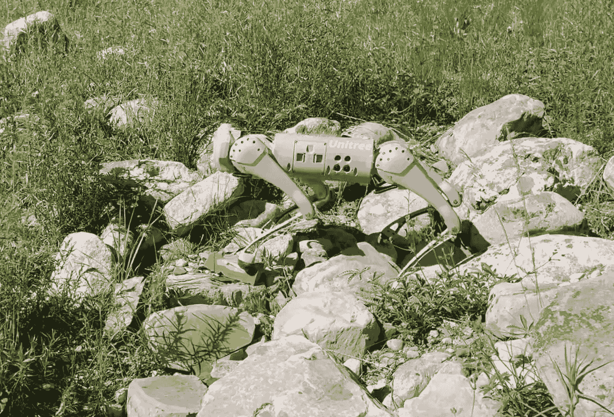

# 测试 Unitree Go-1 的现场能力

> 原文：[`towardsdatascience.com/testing-the-field-capabilities-of-the-unitree-go-1-de665ae6ef05?source=collection_archive---------4-----------------------#2024-07-06`](https://towardsdatascience.com/testing-the-field-capabilities-of-the-unitree-go-1-de665ae6ef05?source=collection_archive---------4-----------------------#2024-07-06)

## 宣传视频很棒，但把一只机器人狗带到现场实际情况如何？

 [Nikolaus Correll](https://medium.com/@nikolaus.correll?source=post_page---byline--de665ae6ef05--------------------------------)

·发表于[Towards Data Science](https://towardsdatascience.com/?source=post_page---byline--de665ae6ef05--------------------------------) ·阅读时间 8 分钟·2024 年 7 月 6 日

--

我正在与我的儿子 Arthur 一起度过夏天，感谢[Rady 计算机科学与工程学院](https://western.edu/school/paul-m-rady-school-of-computer-science-engineering/)的奖学金，以及[科罗拉多大学](http://www.colorado.edu)的合作伙伴[洛基山生物实验室](https://www.rmbl.org/)（RMBL）。我们还带来了一只来自[科罗拉多大学博尔德分校合作 AI 与机器人实验室](https://www.cairo-lab.com/)的[Unitree Go-1](https://shop.unitree.com/products/unitreeyushutechnologydog-artificial-intelligence-companion-bionic-companion-intelligent-robot-go1-quadruped-robot-dog?_gl=1*6jvrzo*_up*MQ..&gclid=CjwKCAjwkJm0BhBxEiwAwT1AXCLtkvwwRL5Pek6hnJRp_vv3RmIyidPbY_DSSewnUt6CH7tQaEgR0hoCFS0QAvD_BwE)。RMBL 的科学家不仅是生物学家，很多人还成为了无人机操作员、传感器工程师和数据科学家。我们的目标是了解一只商品化的机器人狗能为他们的工具集合带来什么，它在现场能够完成哪些任务，以及机器人学的哪些基础研究是实现这些任务所需的。

*如果您不是 Medium 订阅者，您可以* [*在此处*](https://medium.com/towards-data-science/testing-the-field-capabilities-of-the-unitree-go-1-de665ae6ef05?sk=fc33c52e2da6cf259fc2e9dac54a03b5)*.* 免费阅读此文章。

Unitree Go1 正在科罗拉多州哥特镇的洛基山生物实验室（Rocky Mountain Biological Lab）穿越碎石场。原创作品。

以下是我们第一次部署的主要发现：

1.  Unitree Go-1 能够在非常崎岖的地形上导航。

1.  机器人*确实*会失败。它的腿部可能会与草本植物和灌木的茎部缠绕，甚至在平坦的地形上（！）机器人也很容易滑倒。

1.  如果机器人失败，它通常无法自行恢复，需要手动解开缠绕并重新启动。
