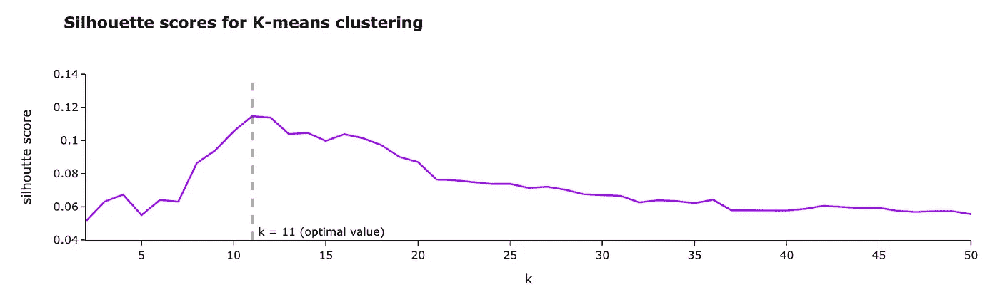
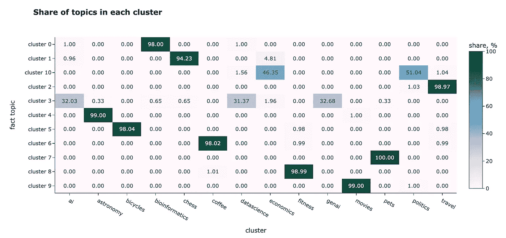

# 文本嵌入：全面指南

> 原文：[`towardsdatascience.com/text-embeddings-comprehensive-guide-afd97fce8fb5?source=collection_archive---------0-----------------------#2024-02-13`](https://towardsdatascience.com/text-embeddings-comprehensive-guide-afd97fce8fb5?source=collection_archive---------0-----------------------#2024-02-13)

## 嵌入的演变、可视化和应用

[](https://miptgirl.medium.com/?source=post_page---byline--afd97fce8fb5--------------------------------)[](https://towardsdatascience.com/?source=post_page---byline--afd97fce8fb5--------------------------------) [玛丽亚·曼苏罗娃](https://miptgirl.medium.com/?source=post_page---byline--afd97fce8fb5--------------------------------)

·发表于[Towards Data Science](https://towardsdatascience.com/?source=post_page---byline--afd97fce8fb5--------------------------------) ·阅读时间：20 分钟·2024 年 2 月 13 日

--


图片由 DALL-E 3 生成

作为人类，我们可以阅读和理解文本（至少是其中一些）。相反，计算机“用数字思考”，因此它们无法自动理解单词和句子的含义。如果我们希望计算机理解自然语言，我们需要将这些信息转换为计算机可以处理的格式——数字向量。

许多年前，人们就学会了如何将文本转换为计算机可以理解的格式（最早的版本之一是[ASCII](https://en.wikipedia.org/wiki/ASCII)）。这种方法有助于渲染和传输文本，但并没有编码单词的含义。当时，标准的搜索技术是关键字搜索，即仅仅查找包含特定单词或 N-gram 的所有文档。

随后，经过数十年的发展，嵌入出现了。我们可以计算单词、句子甚至图像的嵌入。嵌入也是数字向量，但它们可以捕捉到意义。因此，你可以用它们进行语义搜索，甚至处理不同语言的文档。

在本文中，我将深入探讨嵌入的主题，并讨论所有细节：

+   嵌入之前发生了什么，以及它们是如何演变的，

+   如何使用 OpenAI 工具计算嵌入，

+   如何判断句子之间的相似度，

+   如何可视化嵌入，

+   最令人兴奋的部分是你如何在实践中使用嵌入。

让我们继续前进，了解嵌入的演变。

# 嵌入的演变

我们将从简要回顾文本表示的历史开始我们的旅程。

## 词袋模型

将文本转换成向量的最基本方法是词袋模型。让我们看看理查德·费曼的名言之一*“我们很幸运生活在一个仍在不断发现的时代”*。我们将用它来说明词袋模型的方法。

获取词袋向量的第一步是将文本拆分为单词（词元），然后将单词简化为其基础形式。例如，*“running”*将转换为*“run”*。这个过程叫做词干提取。我们可以使用 NLTK Python 包来完成这一操作。

```py
from nltk.stem import SnowballStemmer
from nltk.tokenize import word_tokenize

text = 'We are lucky to live in an age in which we are still making discoveries'

# tokenization - splitting text into words
words = word_tokenize(text)
print(words)
# ['We', 'are', 'lucky', 'to', 'live', 'in', 'an', 'age', 'in', 'which',
#  'we', 'are', 'still', 'making', 'discoveries']

stemmer = SnowballStemmer(language = "english")
stemmed_words = list(map(lambda x: stemmer.stem(x), words))
print(stemmed_words)
# ['we', 'are', 'lucki', 'to', 'live', 'in', 'an', 'age', 'in', 'which', 
#  'we', 'are', 'still', 'make', 'discoveri']
```

现在，我们有了所有单词的基础形式列表。下一步是计算它们的频率以创建向量。

```py
import collections
bag_of_words = collections.Counter(stemmed_words)
print(bag_of_words)
# {'we': 2, 'are': 2, 'in': 2, 'lucki': 1, 'to': 1, 'live': 1, 
# 'an': 1, 'age': 1, 'which': 1, 'still': 1, 'make': 1, 'discoveri': 1}
```

实际上，如果我们想要将文本转换成向量，我们不仅需要考虑文本中的单词，还需要考虑整个词汇表。假设我们的词汇表中也包含*“i”*、*“you”*和*“study”*，那么我们就可以从费曼的名言中创建一个向量。


作者提供的图表

这种方法相当基础，并且没有考虑到单词的语义含义，因此句子*“the girl is studying data science”*和*“the young woman is learning AI and ML”*将不会彼此接近。

## TF-IDF

词袋模型方法的一个略微改进版本是[**TF-IDF**](https://en.wikipedia.org/wiki/Tf%E2%80%93idf)（*词频-逆文档频率*）。它是两个指标的乘积。


+   **词频**表示单词在文档中的出现频率。最常见的计算方法是将单词在文档中的原始计数（就像在词袋模型中一样）除以文档中单词的总数。然而，也有许多其他方法，如仅使用原始计数、布尔“频率”，以及不同的归一化方法。你可以在[维基百科](https://en.wikipedia.org/wiki/Tf%E2%80%93idf)上了解更多关于不同方法的信息。


+   **逆文档频率**表示单词提供的信息量。例如，像*“a”*或*“that”*这样的单词不会给你关于文档主题的额外信息。相反，像*“ChatGPT”*或*“生物信息学”*这样的单词可以帮助你定义领域（但对于这个句子来说不适用）。它是通过计算包含该单词的文档数量与文档总数的比率的对数来得出的。IDF 值越接近 0，表示该单词越常见，提供的信息越少。


所以，最终我们会得到向量，其中常见单词（如*“I”*或*“you”*）的权重较低，而在文档中多次出现的稀有单词的权重较高。这种策略可以提供稍微更好的结果，但它仍然无法捕捉到语义上的含义。

这种方法的另一个挑战是它生成的向量非常稀疏。向量的长度等于语料库的大小。英语中大约有 47 万个独特的单词（[来源](https://en.wikipedia.org/wiki/List_of_dictionaries_by_number_of_words)），因此我们将得到非常大的向量。由于一句话中不会超过 50 个独特单词，所以向量中 99.99% 的值将是 0，无法编码任何信息。基于此，科学家们开始考虑稠密向量表示。

## Word2Vec

最著名的稠密表示方法之一是 word2vec，由 Google 在 2013 年通过 Mikolov 等人的论文 [《Efficient Estimation of Word Representations in Vector Space》](https://arxiv.org/abs/1301.3781) 提出。

论文中提到了两种不同的 word2vec 方法：连续词袋模型（当我们基于周围的词汇预测目标词时）和 Skip-gram（相反的任务——当我们基于词汇预测上下文时）。


论文中的图示，Mikolov 等人，2013 | [来源](https://arxiv.org/pdf/1301.3781.pdf)

稠密向量表示的高级概念是训练两个模型：编码器和解码器。例如，在 Skip-gram 的情况下，我们可能会将词汇 *“christmas”* 传入编码器。然后，编码器会生成一个向量，我们将这个向量传递给解码器，期望得到词汇 *“merry”*、*“to”* 和 *“you”*。


作者的示意图

该模型开始考虑词汇的含义，因为它是基于词汇的上下文进行训练的。然而，它忽略了词形变化（例如，“*-less”* 表示缺少某物）。这个缺点后来通过关注子词 Skip-grams 在 [GloVe](https://www-nlp.stanford.edu/pubs/glove.pdf) 中得到了改进。

此外，word2vec 只能处理单个词汇，但我们希望对整个句子进行编码。那么，让我们进入下一个进化步骤——使用 transformers。

## Transformers 和句子嵌入

下一步的进化涉及到 transformers 方法，这是 Vaswani 等人在[《Attention Is All You Need》](https://arxiv.org/abs/1706.03762)论文中提出的。Transformers 能够生成信息丰富的稠密向量，并成为现代语言模型的主流技术。

我不会详细介绍 transformers 的架构，因为这与我们的主题关系不大，且会占用大量时间。如果你有兴趣了解更多，有许多关于 transformers 的资料可供参考，例如，[《Transformers, Explained》](https://daleonai.com/transformers-explained) 或 [《The Illustrated Transformer》](https://jalammar.github.io/illustrated-transformer/)。

Transformers 允许你使用相同的“核心”模型，并针对不同的使用场景进行微调，而无需重新训练核心模型（这需要大量时间且成本高昂）。它推动了预训练模型的兴起。其中一个最早流行的模型是 Google AI 的 BERT（双向编码器表示模型）。

从内部来看，BERT 仍然在与 word2vec 类似的单词级别进行操作，但我们仍然想要获取句子嵌入。所以，最简单的方法是取所有标记（token）向量的平均值。不幸的是，这种方法表现不好。

这个问题在 2019 年得到了解决，当时[Sentence-BERT](https://arxiv.org/abs/1908.10084)发布。它超越了所有先前的语义文本相似性任务方法，并且能够计算句子嵌入。

这是一个庞大的话题，因此我们无法在这篇文章中完全覆盖它。如果你真的感兴趣，可以在[这篇文章](https://www.pinecone.io/learn/series/nlp/sentence-embeddings/)中了解更多关于句子嵌入的内容。

我们简要地回顾了嵌入的演变，并对其理论有了一个高层次的理解。现在，是时候进入实践部分，学习如何使用 OpenAI 工具计算嵌入了。

# 计算嵌入

在这篇文章中，我们将使用 OpenAI 的嵌入模型。我们将尝试一个新的模型 `text-embedding-3-small`，它最近被[发布](https://openai.com/blog/new-embedding-models-and-api-updates)。与 `text-embedding-ada-002`相比，新模型的表现更好：

+   在一个广泛使用的多语言检索（[MIRACL](https://github.com/project-miracl/miracl)）基准测试中，平均分数从 31.4%上升到了 44.0%。

+   在一个常用的基准测试中，针对英文任务的平均性能（[MTEB](https://github.com/embeddings-benchmark/mteb)）也有所提升，从 61.0%提高到了 62.3%。

OpenAI 还发布了一个新的更大模型 `text-embedding-3-large`。现在，这是他们表现最好的嵌入模型。

作为数据源，我们将使用一个小样本的[Stack Exchange 数据库](https://archive.org/details/stackexchange)——这是一个匿名的所有用户贡献内容的转储，来自[Stack Exchange 网络](https://stackexchange.com/)。我选择了一些看起来有趣的主题，并从每个主题中随机抽取了 100 个问题。主题从生成性人工智能到咖啡或自行车，涉及内容非常广泛。

首先，我们需要计算所有 Stack Exchange 问题的嵌入。值得做一次并将结果本地存储（在文件或向量存储中）。我们可以使用 OpenAI Python 包来生成嵌入。

```py
from openai import OpenAI
client = OpenAI()

def get_embedding(text, model="text-embedding-3-small"):
   text = text.replace("\n", " ")
   return client.embeddings.create(input = [text], model=model)\
       .data[0].embedding

get_embedding("We are lucky to live in an age in which we are still making discoveries.") 
```

结果，我们得到了一个 1536 维的浮动数值向量。现在，我们可以对所有数据重复这个过程并开始分析这些值。

你可能会问的主要问题是：句子在语义上有多接近？为了揭示答案，让我们讨论一下向量之间的距离概念。

# 向量之间的距离

嵌入实际上就是向量。因此，如果我们想了解两句话之间的相似度，可以计算它们的向量之间的距离。较小的距离意味着语义上更接近。

可以使用不同的度量方法来衡量两个向量之间的距离：

+   欧几里得距离（L2），

+   曼哈顿距离（L1），

+   点积，

+   余弦距离。

让我们讨论它们。作为一个简单的例子，我们将使用两个二维向量。

```py
vector1 = [1, 4]
vector2 = [2, 2]
```

## 欧几里得距离（L2）

定义两个点（或向量）之间距离的最标准方法是欧几里得距离或 L2 范数。这种度量方法在日常生活中最为常见，例如当我们谈论两个城镇之间的距离时。

这里是 L2 距离的可视化表示和公式。


图片来自作者

我们可以使用原生 Python 或利用 numpy 函数来计算这个度量。

```py
import numpy as np

sum(list(map(lambda x, y: (x - y) ** 2, vector1, vector2))) ** 0.5
# 2.2361

np.linalg.norm((np.array(vector1) - np.array(vector2)), ord = 2)
# 2.2361
```

## 曼哈顿距离（L1）

另一个常用的距离度量是 L1 范数或曼哈顿距离。这个距离是以曼哈顿岛（纽约）命名的。这个岛有着网格状的街道布局，在曼哈顿，两个点之间的最短路径是 L1 距离，因为你需要沿着网格行驶。


图片来自作者

我们也可以从零开始实现，或者使用 numpy 函数。

```py
sum(list(map(lambda x, y: abs(x - y), vector1, vector2)))
# 3

np.linalg.norm((np.array(vector1) - np.array(vector2)), ord = 1)
# 3.0
```

## 点积

另一种看待向量之间距离的方法是计算点积或标量积。这里是公式，我们可以轻松实现它。


图片来自作者

```py
sum(list(map(lambda x, y: x*y, vector1, vector2)))
# 11

np.dot(vector1, vector2)
# 11
```

这个度量方法有些难以解释。一方面，它可以告诉你向量是否朝着同一方向指向。另一方面，结果高度依赖于向量的大小。例如，让我们计算两对向量之间的点积：

+   `(1, 1)` 对比 `(1, 1)`

+   `(1, 1)` 对比 `(10, 10)`。

在这两种情况下，向量是共线的，但在第二种情况下，点积大约是第一种情况的十倍：2 对比 20。

## 余弦相似度

很多时候，会使用余弦相似度。余弦相似度是通过向量的大小（或范数）归一化后的点积。


图片来自作者

我们可以像之前那样自己计算所有内容，或者使用来自 sklearn 的函数。

```py
dot_product = sum(list(map(lambda x, y: x*y, vector1, vector2)))
norm_vector1 = sum(list(map(lambda x: x ** 2, vector1))) ** 0.5
norm_vector2 = sum(list(map(lambda x: x ** 2, vector2))) ** 0.5

dot_product/norm_vector1/norm_vector2

# 0.8575

from sklearn.metrics.pairwise import cosine_similarity

cosine_similarity(
  np.array(vector1).reshape(1, -1), 
  np.array(vector2).reshape(1, -1))[0][0]

# 0.8575
```

函数`cosine_similarity`期望输入 2D 数组。因此，我们需要调整 numpy 数组的形状。

让我们谈谈这个度量的物理意义。余弦相似度等于两个向量之间的余弦值。向量越接近，度量值越高。


图片来自作者

我们甚至可以计算两个向量之间的精确角度（单位为度）。我们得到的结果大约为 30 度，这看起来非常合理。

```py
import math
math.degrees(math.acos(0.8575))

# 30.96
```

## 该使用哪种度量方法？

我们已经讨论了计算两个向量之间距离的不同方法，你可能开始思考该使用哪一种方法。

你可以使用任何距离来比较你拥有的嵌入。例如，我计算了不同聚类之间的平均距离。L2 距离和余弦相似度给我们呈现了相似的图像：

+   聚类内的对象比与其他聚类的对象更接近。解释我们的结果有点棘手，因为对于 L2 距离，越近意味着距离越小，而对于余弦相似度——度量越高表示对象越接近。不要感到困惑。

+   我们可以发现某些主题非常接近，例如*“政治”*和*“经济学”*，或者*“人工智能”*和*“数据科学”*。


图片由作者提供


图片由作者提供

然而，对于 NLP 任务，通常的最佳实践是使用余弦相似度。其背后有几个原因：

+   余弦相似度的范围在 -1 和 1 之间，而 L1 和 L2 距离没有界限，因此余弦相似度更容易解释。

+   从实际角度来看，计算点积比计算欧几里得距离的平方根更有效。

+   余弦相似度受维度灾难的影响较小（我们稍后会讨论它）。

> OpenAI 的嵌入已经是标准化的，因此在这种情况下，点积和余弦相似度是相等的。

你可能在上述结果中发现，聚类间距和聚类内距的差异并不大。根本原因是我们向量的高维度。这个现象被称为“维度灾难”：维度越高，向量之间的距离分布越窄。你可以在[这篇文章](https://towardsai.net/p/l/why-should-euclidean-distance-not-be-the-default-distance-measure)中了解更多细节。

我想简要地展示一下它是如何工作的，以便你能有所直觉。我计算了 OpenAI 嵌入值的分布，并生成了具有不同维度的 300 个向量集。然后，我计算了所有向量之间的距离，并绘制了直方图。你可以清楚地看到，向量维度的增加使得分布变得更窄。


图表由作者提供

我们已经学习了如何衡量嵌入之间的相似度。这样，我们就完成了理论部分，接下来将进入更实际的部分（可视化和实际应用）。让我们先从可视化开始，因为先看到你的数据总是更好的。

# 可视化嵌入

理解数据的最佳方式是将其可视化。不幸的是，嵌入有 1536 个维度，因此查看数据相当具有挑战性。然而，有一种方法：我们可以使用降维技术将向量投影到二维空间。

## PCA

最基本的降维技术是[PCA](https://en.wikipedia.org/wiki/Principal_component_analysis)（主成分分析）。让我们尝试使用它。

首先，我们需要将嵌入转换为二维 numpy 数组，以便传递给 sklearn。

```py
import numpy as np
embeddings_array = np.array(df.embedding.values.tolist())
print(embeddings_array.shape)
# (1400, 1536)
```

然后，我们需要初始化一个 PCA 模型，设置`n_components = 2`（因为我们想创建一个二维可视化图），在整个数据上训练模型并预测新值。

```py
from sklearn.decomposition import PCA

pca_model = PCA(n_components = 2)
pca_model.fit(embeddings_array)

pca_embeddings_values = pca_model.transform(embeddings_array)
print(pca_embeddings_values.shape)
# (1400, 2) 
```

结果，我们得到了一个包含每个问题两个特征的矩阵，这样我们就可以轻松地在散点图中可视化它。

```py
fig = px.scatter(
    x = pca_embeddings_values[:,0], 
    y = pca_embeddings_values[:,1],
    color = df.topic.values,
    hover_name = df.full_text.values,
    title = 'PCA embeddings', width = 800, height = 600,
    color_discrete_sequence = plotly.colors.qualitative.Alphabet_r
)

fig.update_layout(
    xaxis_title = 'first component', 
    yaxis_title = 'second component')
fig.show()
```


作者提供的图像

我们可以看到，每个话题中的问题彼此相当接近，这很好。然而，所有的簇都混在一起，所以还有改进的空间。

## t-SNE

PCA 是一个线性算法，而现实生活中的大多数关系是非线性的。因此，由于非线性原因，我们可能无法将簇分开。让我们尝试使用非线性算法[t-SNE](https://en.wikipedia.org/wiki/T-distributed_stochastic_neighbor_embedding)，看看它是否能展示更好的结果。

代码几乎相同。我只是用了 t-SNE 模型而不是 PCA。

```py
from sklearn.manifold import TSNE
tsne_model = TSNE(n_components=2, random_state=42)
tsne_embeddings_values = tsne_model.fit_transform(embeddings_array)

fig = px.scatter(
    x = tsne_embeddings_values[:,0], 
    y = tsne_embeddings_values[:,1],
    color = df.topic.values,
    hover_name = df.full_text.values,
    title = 't-SNE embeddings', width = 800, height = 600,
    color_discrete_sequence = plotly.colors.qualitative.Alphabet_r
)

fig.update_layout(
    xaxis_title = 'first component', 
    yaxis_title = 'second component')
fig.show()
```

t-SNE 的结果看起来好多了。除了*“genai”*、*“datascience”*和*“ai”*，大部分簇都已经分开了。然而，这是预料之中的——我怀疑我能否将这些话题分开。


看着这个可视化结果，我们可以看到，嵌入在编码语义意义方面相当不错。

另外，你可以将数据投影到三维空间并进行可视化。我不确定这是否实用，但将数据以三维方式展示，可能会带来一些深刻的洞察，并且玩转数据也会很有趣。

```py
tsne_model_3d = TSNE(n_components=3, random_state=42)
tsne_3d_embeddings_values = tsne_model_3d.fit_transform(embeddings_array)

fig = px.scatter_3d(
    x = tsne_3d_embeddings_values[:,0], 
    y = tsne_3d_embeddings_values[:,1],
    z = tsne_3d_embeddings_values[:,2],
    color = df.topic.values,
    hover_name = df.full_text.values,
    title = 't-SNE embeddings', width = 800, height = 600,
    color_discrete_sequence = plotly.colors.qualitative.Alphabet_r,
    opacity = 0.7
)
fig.update_layout(xaxis_title = 'first component', yaxis_title = 'second component')
fig.show()
```


## 条形码

理解嵌入的方法是将其中一些可视化为条形码，并查看它们之间的相关性。我挑选了三个嵌入示例：两个是最接近的，另一个是我们数据集中最远的示例。

```py
embedding1 = df.loc[1].embedding
embedding2 = df.loc[616].embedding
embedding3 = df.loc[749].embedding
```

```py
import seaborn as sns
import matplotlib.pyplot as plt
embed_len_thr = 1536

sns.heatmap(np.array(embedding1[:embed_len_thr]).reshape(-1, embed_len_thr),
    cmap = "Greys", center = 0, square = False, 
    xticklabels = False, cbar = False)
plt.gcf().set_size_inches(15,1)
plt.yticks([0.5], labels = ['AI'])
plt.show()

sns.heatmap(np.array(embedding3[:embed_len_thr]).reshape(-1, embed_len_thr),
    cmap = "Greys", center = 0, square = False, 
    xticklabels = False, cbar = False)
plt.gcf().set_size_inches(15,1)
plt.yticks([0.5], labels = ['AI'])
plt.show()

sns.heatmap(np.array(embedding2[:embed_len_thr]).reshape(-1, embed_len_thr),
    cmap = "Greys", center = 0, square = False, 
    xticklabels = False, cbar = False)
plt.gcf().set_size_inches(15,1)
plt.yticks([0.5], labels = ['Bioinformatics'])
plt.show()
```


作者提供的图

由于维度过高，我们很难直观地判断向量之间的接近程度。然而，我仍然喜欢这种可视化方式。它在某些情况下可能会有帮助，所以我和你分享这个想法。

我们已经学会了如何可视化嵌入，并且对它们抓取文本意义的能力没有任何疑虑。现在，到了最有趣、最吸引人的部分，我们将讨论如何在实际中利用嵌入。

# 实际应用

当然，嵌入的主要目标并不是仅仅将文本编码为数值向量或仅为了可视化它们而做。我们可以从捕捉文本意义的能力中受益匪浅。让我们通过一些更实际的例子来了解这个过程。

## 聚类

让我们从聚类开始。聚类是一种无监督学习技术，允许你将数据分成不同的组，而不需要任何初始标签。聚类可以帮助你理解数据中的内部结构模式。

我们将使用最基本的聚类算法之一——[K-means](https://scikit-learn.org/stable/modules/clustering.html#k-means)。对于 K-means 算法，我们需要指定聚类的数量。我们可以通过[silhouette 评分](https://scikit-learn.org/stable/modules/generated/sklearn.metrics.silhouette_score.html)来定义最优的聚类数量。

让我们尝试 k（聚类数量）在 2 到 50 之间的值。对于每个 k，我们将训练一个模型并计算 silhouette 评分。silhouette 评分越高，聚类效果越好。

```py
from sklearn.cluster import KMeans
from sklearn.metrics import silhouette_score
import tqdm

silhouette_scores = []
for k in tqdm.tqdm(range(2, 51)):
    kmeans = KMeans(n_clusters=k, 
                    random_state=42, 
                    n_init = 'auto').fit(embeddings_array)
    kmeans_labels = kmeans.labels_
    silhouette_scores.append(
        {
            'k': k,
            'silhouette_score': silhouette_score(embeddings_array, 
                kmeans_labels, metric = 'cosine')
        }
    )

fig = px.line(pd.DataFrame(silhouette_scores).set_index('k'),
       title = '<b>Silhouette scores for K-means clustering</b>',
       labels = {'value': 'silhoutte score'}, 
       color_discrete_sequence = plotly.colors.qualitative.Alphabet)
fig.update_layout(showlegend = False)
```

在我们的例子中，当`k = 11`时，silhouette 评分达到了最大值。因此，让我们在最终模型中使用这个聚类数量。



图表由作者提供

让我们像之前一样，使用 t-SNE 进行降维来可视化聚类。

```py
tsne_model = TSNE(n_components=2, random_state=42)
tsne_embeddings_values = tsne_model.fit_transform(embeddings_array)

fig = px.scatter(
    x = tsne_embeddings_values[:,0], 
    y = tsne_embeddings_values[:,1],
    color = list(map(lambda x: 'cluster %s' % x, kmeans_labels)),
    hover_name = df.full_text.values,
    title = 't-SNE embeddings for clustering', width = 800, height = 600,
    color_discrete_sequence = plotly.colors.qualitative.Alphabet_r
)
fig.update_layout(
    xaxis_title = 'first component', 
    yaxis_title = 'second component')
fig.show()
```

从视觉上看，我们可以看到算法能够很好地区分聚类——它们分离得非常清晰。


我们有事实性的主题标签，因此我们甚至可以评估聚类的效果。让我们看看每个聚类的主题混合情况。

```py
df['cluster'] = list(map(lambda x: 'cluster %s' % x, kmeans_labels))
cluster_stats_df = df.reset_index().pivot_table(
    index = 'cluster', values = 'id', 
    aggfunc = 'count', columns = 'topic').fillna(0).applymap(int)

cluster_stats_df = cluster_stats_df.apply(
  lambda x: 100*x/cluster_stats_df.sum(axis = 1))

fig = px.imshow(
    cluster_stats_df.values, 
    x = cluster_stats_df.columns,
    y = cluster_stats_df.index,
    text_auto = '.2f', aspect = "auto",
    labels=dict(x="cluster", y="fact topic", color="share, %"), 
    color_continuous_scale='pubugn',
    title = '<b>Share of topics in each cluster</b>', height = 550)

fig.show()
```



在大多数情况下，聚类效果非常好。例如，聚类 5 几乎只包含关于自行车的问题，而聚类 6 则是关于咖啡的。然而，它无法区分一些相近的主题：

+   *“ai”*、*“genai”*和*“datascience”*都在一个聚类中，

+   同一家商店，包含*“经济学”*和*“政治”*。

在这个例子中，我们仅使用了嵌入作为特征，但如果你有任何额外的信息（例如提问者的年龄、性别或国家），你也可以将其包含在模型中。

## 分类

我们可以将嵌入用于分类或回归任务。例如，你可以用它来预测客户评论的情感（分类）或 NPS 评分（回归）。

由于分类和回归是监督学习，你需要有标签。幸运的是，我们知道问题的主题，并且可以训练模型来预测它们。

我将使用随机森林分类器。如果你需要快速复习一下随机森林的相关知识，可以在[这里](https://medium.com/towards-data-science/interpreting-random-forests-638bca8b49ea)找到。为了正确评估分类模型的性能，我们将把数据集分为训练集和测试集（80%对 20%）。然后，我们可以在训练集上训练模型，并在测试集上测量质量（模型未见过的问题）。

```py
from sklearn.ensemble import RandomForestClassifier
from sklearn.model_selection import train_test_split
class_model = RandomForestClassifier(max_depth = 10)

# defining features and target
X = embeddings_array
y = df.topic

# splitting data into train and test sets
X_train, X_test, y_train, y_test = train_test_split(
    X, y, random_state = 42, test_size=0.2, stratify=y
)

# fit & predict 
class_model.fit(X_train, y_train)
y_pred = class_model.predict(X_test)
```

为了评估模型的表现，让我们计算一个混淆矩阵。在理想情况下，所有非对角元素应该为 0。

```py
from sklearn.metrics import confusion_matrix
cm = confusion_matrix(y_test, y_pred)

fig = px.imshow(
  cm, x = class_model.classes_,
  y = class_model.classes_, text_auto='d', 
  aspect="auto", 
  labels=dict(
      x="predicted label", y="true label", 
      color="cases"), 
  color_continuous_scale='pubugn',
  title = '<b>Confusion matrix</b>', height = 550)

fig.show()
```


我们可以看到与聚类相似的结果：一些主题很容易分类，准确率达到 100%，例如*“自行车”*或*“旅行”*，而其他一些则难以区分（尤其是*“ai”*）。

然而，我们达到了 91.8%的总体准确率，这已经相当不错了。

## 发现异常

我们还可以使用嵌入来发现数据中的异常。例如，在 t-SNE 图上，我们看到一些问题离它们的聚类非常远，例如，*“旅行”* 话题。让我们看看这个主题，尝试找出异常。我们将使用 [Isolation Forest 算法](https://scikit-learn.org/stable/modules/generated/sklearn.ensemble.IsolationForest.html) 来处理它。

```py
from sklearn.ensemble import IsolationForest

topic_df = df[df.topic == 'travel']
topic_embeddings_array = np.array(topic_df.embedding.values.tolist())

clf = IsolationForest(contamination = 0.03, random_state = 42) 
topic_df['is_anomaly'] = clf.fit_predict(topic_embeddings_array)

topic_df[topic_df.is_anomaly == -1][['full_text']]
```

所以，到了这里。我们已经找到了关于旅行话题的最不常见的评论 ([来源](https://travel.stackexchange.com/questions/150735/is-it-safe-to-drink-the-water-from-the-fountains-found-all-over-the-older-parts))。

```py
Is it safe to drink the water from the fountains found all over 
the older parts of Rome?

When I visited Rome and walked around the older sections, I saw many 
different types of fountains that were constantly running with water. 
Some went into the ground, some collected in basins, etc.

Is the water coming out of these fountains potable? Safe for visitors 
to drink from? Any etiquette regarding their use that a visitor 
should know about?
```

由于它谈论的是水，这条评论的嵌入接近咖啡话题，因为人们也讨论如何倒水来冲泡咖啡。所以，嵌入表示是非常合理的。

我们可以通过 t-SNE 可视化图来发现它实际上靠近 *咖啡* 聚类。


作者图

## RAG — 检索增强生成

随着 LLM 最近的广泛流行，嵌入已经在 RAG 用例中得到了广泛应用。

当我们有大量文档（例如，来自 Stack Exchange 的所有问题），并且无法将它们全部传递给 LLM 时，我们需要 Retrieval Augmented Generation，因为

+   LLM 有上下文大小的限制（目前，GPT-4 Turbo 的上下文限制为 128K）。

+   我们需要为令牌付费，因此每次传递所有信息会更加昂贵。

+   LLM 在处理更大的上下文时表现较差。你可以查看 [Needle In A Haystack — Pressure Testing LLMs](https://github.com/gkamradt/LLMTest_NeedleInAHaystack) 以了解更多细节。

为了能够处理庞大的知识库，我们可以利用 RAG 方法：

+   计算所有文档的嵌入并将其存储在向量存储中。

+   当我们收到用户请求时，我们可以计算其嵌入，并从存储中检索相关文档来回答这个请求。

+   仅将相关文档传递给 LLM 以获得最终答案。

若要了解更多关于 RAG 的信息，不要犹豫，阅读我的文章，里面有更多的细节 在这里.

# 总结

在本文中，我们详细讨论了文本嵌入。希望现在你已经对这个话题有了完整且深入的理解。以下是我们旅程的简要回顾：

+   首先，我们回顾了处理文本的各种方法的演变。

+   然后，我们讨论了如何理解文本之间是否具有相似的意义。

+   之后，我们看到了不同的文本嵌入可视化方法。

+   最后，我们尝试将嵌入作为特征应用于不同的实际任务，如聚类、分类、异常检测和 RAG。

> 非常感谢你阅读这篇文章。如果你有任何后续问题或评论，请在评论区留言。

# 参考文献

本文使用的数据集来自[Stack Exchange 数据集](https://archive.org/details/stackexchange)，该数据集可在[创作共用许可协议](https://creativecommons.org/licenses/by-sa/4.0/)下获取。

本文的灵感来源于以下课程：

+   DeepLearning.AI 与 Google Cloud 合作制作的“[理解与应用文本嵌入](https://www.deeplearning.ai/short-courses/google-cloud-vertex-ai/)”课程，

+   DeepLearning.AI 与 Weaviate 合作制作的“[向量数据库：从嵌入到应用](https://learn.deeplearning.ai/vector-databases-embeddings-applications/lesson/1/introduction)”课程。
