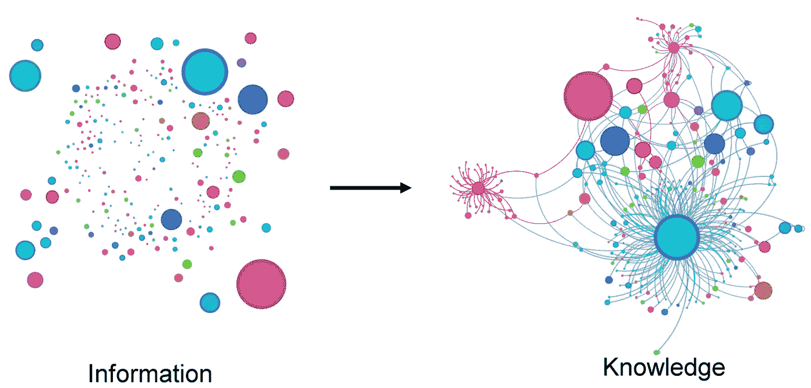
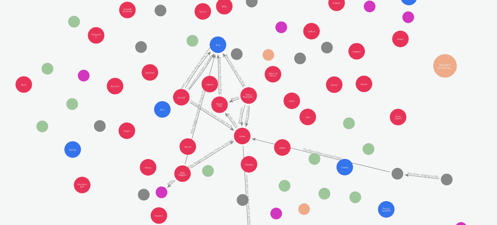

# 使用 Graph Maker 将文本转换为知识图谱

> 原文：[`towardsdatascience.com/text-to-knowledge-graph-made-easy-with-graph-maker-f3f890c0dbe8?source=collection_archive---------0-----------------------#2024-05-07`](https://towardsdatascience.com/text-to-knowledge-graph-made-easy-with-graph-maker-f3f890c0dbe8?source=collection_archive---------0-----------------------#2024-05-07)

## 一个开源库，用于使用 Llama 3 和 Mixtral 等开源 LLM 从文本语料库构建知识图谱。

[](https://medium.com/@rahul.nyk?source=post_page---byline--f3f890c0dbe8--------------------------------)[](https://towardsdatascience.com/?source=post_page---byline--f3f890c0dbe8--------------------------------) [Rahul Nayak](https://medium.com/@rahul.nyk?source=post_page---byline--f3f890c0dbe8--------------------------------)

·发表于 [Towards Data Science](https://towardsdatascience.com/?source=post_page---byline--f3f890c0dbe8--------------------------------) ·阅读时长 11 分钟·2024 年 5 月 7 日

--


图片由作者使用 Adobe Photoshop 生成

在这篇文章中，我将分享一个 Python 库——Graph Maker，它可以根据给定的本体从文本语料库中创建知识图谱。Graph Maker 使用像 Llama3、Mistral、Mixtral 或 Gemma 这样的开源 LLM 来提取知识图谱。

我们将回顾 Graph Maker 的基本概念，简要回顾上一篇文章，以及当前方法如何解决其中的一些挑战。我将在文章结尾分享 GitHub 仓库。

# 引言

这篇文章是我几个月前写的关于如何将任何文本转换为图的文章的续集。

[](/how-to-convert-any-text-into-a-graph-of-concepts-110844f22a1a?source=post_page-----f3f890c0dbe8--------------------------------) ## 如何将任何文本转换为概念图

### 使用 Mistral 7B 将任何文本语料库转换为知识图谱的方法。

towardsdatascience.com

这篇文章收到了热烈的反响。文中分享的 GitHub 仓库已有超过 180 个 Fork 和超过 900 个 Stars。文章本身在 Medium 上的阅读量超过了 80K。最近，这篇文章在麻省理工学院（MIT）Markus J. Buehler 教授发表的以下论文中被引用。

[](https://arxiv.org/abs/2403.11996?source=post_page-----f3f890c0dbe8--------------------------------) [## 加速科学发现：通过生成性知识提取和基于图的表示…

### 通过利用生成型人工智能（AI），我们将一个包含 1,000 篇科学论文的数据集进行了转化……

[arxiv.org](https://arxiv.org/abs/2403.11996?source=post_page-----f3f890c0dbe8--------------------------------)

这是一篇引人入胜的论文，展示了在人工智能时代知识图谱的巨大潜力。它展示了知识图谱不仅可以用来检索知识，还可以用来发现新知识。这里是我最喜欢的论文摘录之一。

> “例如，我们将展示这种方法如何将看似不相关的概念联系起来，比如贝多芬的第九交响曲与仿生材料科学之间的关系。”

这些进展是对我在上一篇文章中提出的观点的重大确认，并鼓励我进一步发展这些想法。

我还收到了许多同行技术人员的反馈，分享了他们在使用这个仓库时遇到的挑战，以及改善这个想法的建议。我将其中一些建议融入到我在这里分享的新的 Python 包中。

在我们讨论这个包——图形制作器——的工作原理之前，让我们先讨论一下它的“为什么”和“什么”。

# 简要回顾

我们可能应该从“为什么是图形”开始。然而，我们在我的[上一篇文章](https://medium.com/towards-data-science/how-to-convert-any-text-into-a-graph-of-concepts-110844f22a1a)中简要讨论了这个问题。请随时跳转到那篇文章进行复习。不过，让我们简要讨论一下与我们当前讨论相关的关键概念。

**TL;DR 如果你已经熟悉知识图谱的背景，可以跳过这一部分。**

这里有一个插图，简洁地总结了知识图谱的理念。



来源：[`arxiv.org/abs/2403.11996`](https://arxiv.org/abs/2403.11996)

要创建一个知识图谱，我们需要两条信息。

1.  **知识库**：这可以是一个文本语料库、一套代码库、一系列文章等。

1.  **本体**：我们关心的实体类别及其关系类型。我可能在这里对本体的定义做了过于简化的解释，但这足以满足我们的目的。

这里是一个简单的本体。

**实体**：*Person, Place*

**关系：**

*Person* — 相关于 → *Person*

*Person* — 居住在 → *Place*

*Person* — 访问 → *Place*

给定这两条信息，我们可以从提到人物和地点的文本中构建一个知识图谱。然而，假设我们的知识库是关于处方药及其相互作用的临床研究。我们可能会使用一个不同的本体，其中可能包含化合物、用途、效果、反应等作为我们的本体。

在上一篇文章中，我们讨论了**如何在不提供本体的情况下，通过 LLM 提取知识图谱**。这个方法的核心思想是让 LLM 自主发现最适合给定文本语料的本体。

尽管这种方法缺乏传统生成 KG 的严谨性，但它也有其优点。与传统方法相比，它可以更容易地生成来自非结构化数据的 KG。它生成的 KG 在某种程度上也是非结构化的。然而，它们更易于构建，并且信息更为丰富。它们非常适合像 GRAG（图谱检索增强生成）这样的应用。

# 为什么选择图谱构建工具？

让我列出一些我在之前的文章反馈中收到的挑战和观察结果。这将帮助我们理解用 LLM 创建 KG 时的挑战。让我们使用《**指环王**》的维基百科摘要。毕竟，没有人能不爱《指环王》！

## 有意义的实体

在自由运行的情况下，LLM 提取的实体可能在其类别上过于多样。它会错误地将抽象概念标记为实体。例如，在“比尔博·巴金斯庆祝他的生日并把戒指交给弗罗多”这段文字中，LLM 可能会提取“比尔博·巴金斯庆祝他的生日”或“庆祝他的生日”作为‘动作’。但如果它提取“生日”作为‘事件’，可能会更有用。

## **一致的实体**

它也可能会在不同的上下文中错误地标记同一实体。例如：

**‘*索伦*’**，**‘*黑暗领主索伦*’** 和 ***‘黑暗领主’*** 不应被提取为不同的实体。或者，如果它们被提取为不同的实体，它们应该通过等价关系连接。

## **解析的韧性**

LLM（大语言模型）的输出本质上是非确定性的。为了从大文档中提取知识图谱（KG），我们必须将语料库分割成较小的文本块，然后为每个文本块生成子图。为了构建一致的图谱，LLM 必须按照给定的架构一致地输出 JSON 对象。如果缺少任何一个，可能会不利地影响整个图谱的连通性。

尽管 LLM 在响应时能够更好地生成格式良好的 JSON 对象，但它仍远未完美。具有有限上下文窗口的 LLM 也可能生成不完整的响应。

## **实体的分类**

在识别实体时，LLM 可能会出现较大的错误。当上下文是领域特定的，或者实体没有标准英语命名时，这个问题尤为严重。命名实体识别（NER）模型在这方面做得更好，但它们也受到所训练数据的限制。此外，它们无法理解实体之间的关系。

强迫 LLM 在分类上保持一致是一门提示工程中的艺术。

## **隐含关系**

关系可以被明确提到，也可以通过上下文隐含。例如：

“比尔博·巴金斯庆祝他的生日并把戒指交给弗罗多”隐含了以下关系：

*比尔博·巴金斯* → 所有者 → *戒指*

*比尔博·巴金斯* → 继承人 → *弗罗多*

*弗罗多* → 所有者 → *戒指*

我认为，大型语言模型（LLMs）在某个时刻会超越任何传统的关系提取方法。但目前来说，这是一个需要巧妙提示工程的挑战。

# 图谱生成器

我在这里分享的图谱生成库在以往方法的基础上做出了改进，通过在严谨性和简易性之间走了一条折中的路——在结构化和非结构化之间走了一条折中的路。与我之前讨论的方式相比，它在上述大部分挑战中表现得更加出色。

与之前的方法不同，在之前的方法中，LLM 可以自行发现本体，而图谱生成器则尝试强制 LLM 使用用户定义的本体。

我们可以通过简单的 pip 命令安装知识图谱生成库。

```py
pip install knowledge-graph-maker
```

[](https://pypi.org/project/knowledge-graph-maker/?source=post_page-----f3f890c0dbe8--------------------------------) [## knowledge-graph-maker

### 使用给定的本体从任何文本中创建知识图谱。

pypi.org](https://pypi.org/project/knowledge-graph-maker/?source=post_page-----f3f890c0dbe8--------------------------------)

下面是它如何通过 5 个简单步骤工作的。

> 这些步骤的代码已包含在我在本文最后分享的笔记本中。

## 1\. 定义你的图谱本体。

该库理解以下本体模式。在幕后，本体是一个 Pydantic 模型。

```py
ontology = Ontology(
# labels of the entities to be extracted. Can be a string or an object, like the following.
labels=[
{"Person": "Person name without any adjectives, Remember a person may be referenced by their name or using a pronoun"},
{"Object": "Do not add the definite article 'the' in the object name"},
{"Event": "Event event involving multiple people. Do not include qualifiers or verbs like gives, leaves, works etc."},
"Place",
"Document",
"Organisation",
"Action",
{"Miscellaneous": "Any important concept can not be categorised with any other given label"},
],
# Relationships that are important for your application.
# These are more like instructions for the LLM to nudge it to focus on specific relationships.
# There is no guarantee that only these relationships will be extracted, but some models do a good job overall at sticking to these relations.
relationships=[
"Relation between any pair of Entities",
],
)
```

我已经调整了提示，以使结果与给定的本体一致。我认为它做得相当不错。不过，它仍然不是 100%准确。准确度取决于我们选择的生成图谱的模型、应用程序、本体和数据的质量。

## 2\. 将文本拆分成块。

我们可以使用尽可能大的文本语料库来创建大型知识图谱。然而，目前 LLMs 有一个有限的上下文窗口。所以我们需要适当地将文本拆分成块，并逐块地创建图谱。我们应该使用的块大小取决于模型的上下文窗口。此项目中使用的提示大约消耗 500 个 tokens，其余的上下文可以分为输入文本和输出图谱。根据我的经验，较小的 200 到 500 个 tokens 的块会生成更详细的图谱。

## 3\. 将这些块转换为文档。

该文档是一个 Pydantic 模型，具有以下模式。

```py
## Pydantic document model
class Document(BaseModel):
  text: str
  metadata: dict
```

我们在文档中添加的元数据会被标记到每个从文档中提取出的关系上。

我们可以将关系的上下文（例如，页码、章节、文章名称等）添加到元数据中。通常情况下，每对节点在多个文档中有多个关系。元数据有助于为这些关系提供上下文。

## 4\. 运行图谱生成器。

图谱生成器直接接受一个文档列表，并对每个文档进行迭代，为每个文档创建一个子图。最终输出是所有文档的完整图谱。

这里是一个简单的例子，展示如何实现这一点。

```py
 from knowledge_graph_maker import GraphMaker, Ontology, GroqClient

## -> Select a groq supported model
model = "mixtral-8x7b-32768"
# model ="llama3–8b-8192"
# model = "llama3–70b-8192"
# model="gemma-7b-it" ## This is probably the fastest of all models, though a tad inaccurate.

## -> Initiate the Groq Client.
llm = GroqClient(model=model, temperature=0.1, top_p=0.5)
graph_maker = GraphMaker(ontology=ontology, llm_client=llm, verbose=False)

## -> Create a graph out of a list of Documents.
graph = graph_maker.from_documents(docs)
## result: a list of Edges.

print("Total number of Edges", len(graph))
## 1503
```

图形制造者将每个文档输入 LLM，并解析响应以创建完整的图形。最终图形是由一系列边组成，每一条边都是像下面这样的 pydantic 模型。

```py
class Node(BaseModel):
  label: str
  name: str

class Edge(BaseModel):
  node_1: Node
  node_2: Node
  relationship: str
  metadata: dict = {}
  order: Union[int, None] = None
```

我已调整了提示，使它们现在能生成相对一致的 JSON。如果 JSON 响应解析失败，图形制造者还会尝试手动将 JSON 字符串拆分成多条边字符串，然后尽力恢复它能找到的部分。

## 5. 保存到 Neo4j

我们可以将模型保存到 Neo4j 中，既可以创建 RAG 应用程序，运行网络算法，也可以仅仅是通过[Bloom](https://neo4j.com/product/bloom/)来可视化图形。

```py
from knowledge_graph_maker import Neo4jGraphModel
create_indices = False
neo4j_graph = Neo4jGraphModel(edges=graph, create_indices=create_indices)
neo4j_graph.save()
```

图形的每一条边都会作为事务保存到数据库中。如果你是第一次运行这段代码，请将`create_indices`设置为 true。这会通过设置节点的唯一性约束来准备数据库。

***5.1 可视化，至少为了好玩*** 在上一篇文章中，我们使用 networkx 和 pyvis 库可视化了图形。在这里，因为我们已经将图形保存到 Neo4J，我们可以直接利用 Bloom 来可视化图形。

为了避免重复，我们将在本篇文章中生成与上一篇不同的可视化效果。

假设我们想查看书中人物之间关系是如何发展的。

我们可以通过追踪图形在图表制造者浏览书籍时逐步添加的边来实现这一点。为了实现这一点，边模型有一个叫做“order”的属性。这个属性可以用来为图形添加时间性或顺序维度。

在我们的示例中，图形制造者会自动将特定文本块在文档列表中出现的顺序号添加到它从该块提取的每一条边上。所以要查看人物之间关系如何发展，我们只需按边的顺序对图形进行交叉截面。

这里是这些交叉截面的动画。



作者生成的动画

# 图形和 RAG

这种 KG 的最佳应用可能是在 RAG 中。在 Medium 上有大量的文章讨论如何通过图形增强你的 RAG 应用。

本质上，图形提供了多种不同的知识检索方式。根据我们如何设计图形和应用程序，其中一些技术可能比简单的语义搜索更强大。

从最基本的角度来看，我们可以将嵌入向量添加到节点和关系中，并对向量索引进行语义搜索以进行检索。然而，我觉得图形在 RAG 应用中的真正力量是当我们将 Cypher 查询和网络算法与语义搜索结合时。

我自己也在探索一些这些技术。我希望在下一篇文章中写到它们。

# 代码

这里是 GitHub 仓库。欢迎随意试用。我还在仓库中包含了一个示例 Python 笔记本，帮助你快速入门。

> 请注意，在开始之前，你需要在***.env***文件中添加你的[GROQ 凭证](https://console.groq.com/keys)。

[](https://github.com/rahulnyk/graph_maker?source=post_page-----f3f890c0dbe8--------------------------------) [## GitHub - rahulnyk/graph_maker

### 通过在 GitHub 上创建账户，参与 rahulnyk/graph_maker 的开发。

github.com](https://github.com/rahulnyk/graph_maker?source=post_page-----f3f890c0dbe8--------------------------------)

最初，我为一些个人项目开发了这个代码库。我觉得它对更多的应用也会很有帮助。如果你在应用中使用这个库，请与我分享。我非常希望了解你的使用案例。

如果你觉得自己可以为这个开源项目做出贡献，请随时参与，并将其做成自己的项目。

希望你觉得图表生成器有用。感谢阅读。

我是一名架构学习者（不是建筑物的那种…是技术类型的）。过去，我曾从事半导体建模、数字电路设计、电子接口建模和物联网相关工作。

目前，沃尔玛的数据与消费者分析工作让我忙碌不已。

谢谢
