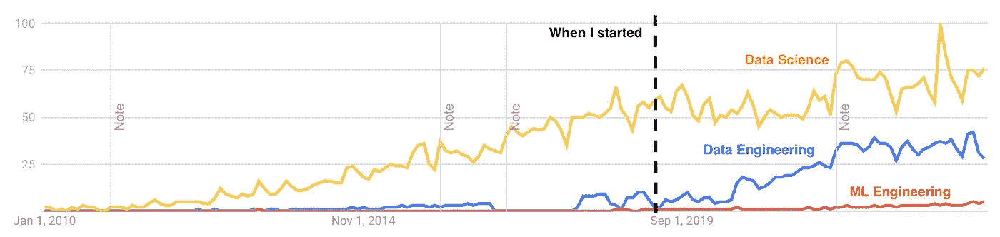

# 全栈数据科学家的 4 个角色

> 原文：[`towardsdatascience.com/the-4-hats-of-a-full-stack-data-scientist-5b916bd2f079?source=collection_archive---------2-----------------------#2024-04-17`](https://towardsdatascience.com/the-4-hats-of-a-full-stack-data-scientist-5b916bd2f079?source=collection_archive---------2-----------------------#2024-04-17)

## 如何成为数据科学领域的“独角兽”

 [Shaw Talebi](https://shawhin.medium.com/?source=post_page---byline--5b916bd2f079--------------------------------)

·发布于[Towards Data Science](https://towardsdatascience.com/?source=post_page---byline--5b916bd2f079--------------------------------) ·阅读时间 7 分钟·2024 年 4 月 17 日

--

图片由[Amanda Jones](https://unsplash.com/@amandagraphc?utm_source=medium&utm_medium=referral)提供，来源于[Unsplash](https://unsplash.com/?utm_source=medium&utm_medium=referral)

这是关于“全栈数据科学”（FSDS）系列文章的第一篇。虽然机器学习（ML）项目的不同方面有着明确的角色分工，但通常仍然需要一个能够**管理并实施从头到尾的项目**的人。这就是我们所说的全栈数据科学家。在这篇文章中，我将介绍 FSDS 并讨论它的 4 个*角色*。

# **什么是全栈数据科学家？**

当我第一次学习数据科学（超过 5 年前）时，数据工程和机器学习工程并不像今天这样普及。因此，数据科学家的角色通常**定义得更广泛**，与现在我们看到的角色有所不同。

数据科学、数据工程和机器学习工程的 Google 趋势—来自[Google trends](https://trends.google.com/trends)的截图。

例如，数据科学家可能会编写 ETL 脚本、设置数据库、进行特征工程、训练机器学习模型，并将模型部署到生产环境中。

尽管将这些任务分配到多个角色（例如，数据工程师、数据科学家和机器学习工程师）变得越来越普遍，但许多情况下仍然需要那些**精通机器学习各个方面**的贡献者……
