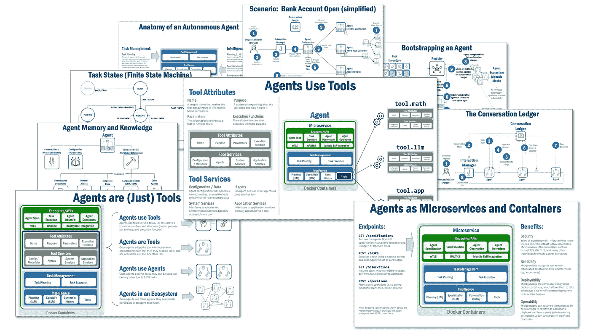

# 自主管理代理的构成

> 原文：[`towardsdatascience.com/the-anatomy-of-an-autonomous-agent-499b42b73124?source=collection_archive---------0-----------------------#2024-12-17`](https://towardsdatascience.com/the-anatomy-of-an-autonomous-agent-499b42b73124?source=collection_archive---------0-----------------------#2024-12-17)

## 一种自主管理代理的蓝图：在 Agentic Mesh 生态系统中的自主管理代理

 [Eric Broda](https://medium.com/@ericbroda?source=post_page---byline--499b42b73124--------------------------------)

·发布于[Towards Data Science](https://towardsdatascience.com/?source=post_page---byline--499b42b73124--------------------------------) ·阅读时间 17 分钟·2024 年 12 月 17 日

--

自主管理代理的构成

最近科技巨头的巨大投资几乎可以确保自主管理代理生态系统很快就会到来。那么，什么是“自主管理代理”呢？

[Sebastian Thielke](https://www.linkedin.com/in/sebastianthielke/)，AWS 平台经济学负责人，描述如下（转述）：“自主管理代理对环境刺激做出反应，在追求目标时具有主动性，具备社会互动能力，并能持续学习和改进。”维基百科提供了类似的[定义](https://en.wikipedia.org/wiki/Autonomous_agent)：“自主管理代理是生活在某些复杂动态环境中的计算系统，在该环境中自主感知和行动，并通过这样做实现其设计目标或任务。”在我之前的文章中，我提供了以下定义，我认为它既能涵盖前述定义，也能更加准确地描述：自主管理代理使用 Agentic AI（复杂推理和迭代规划）独立计划并执行任务。

在说到这些之后，我想集中讨论本文的主要内容：一个自主管理代理（以下简称“代理”）的架构是什么样的，它的主要组成部分有哪些？创建一个能够规划和执行任务的“智能”代理需要具备哪些能力？并且由于没有任何代理是孤立存在的，而是必须在一个生态系统中运作……
