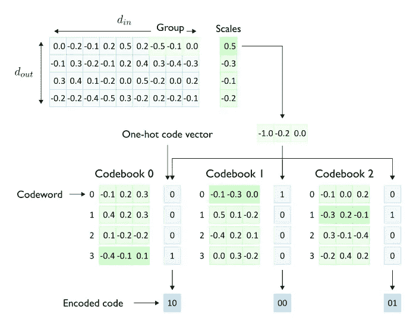
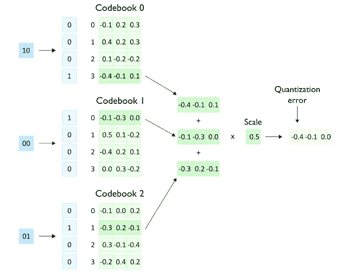
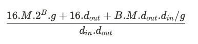
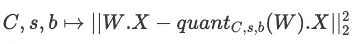
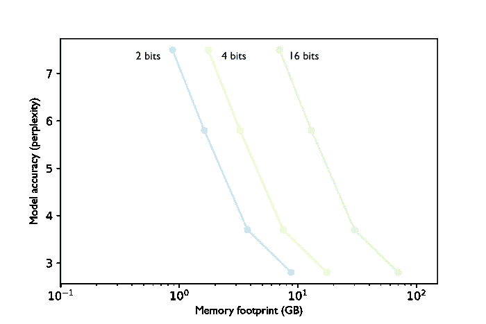
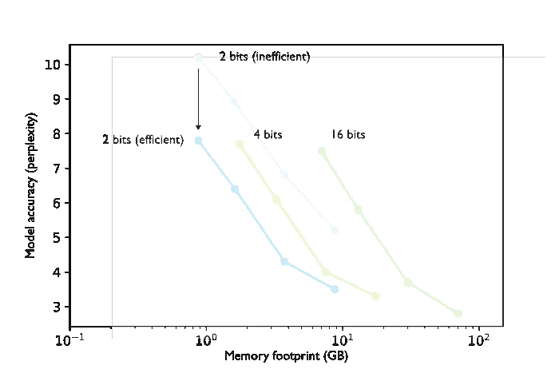

# AQLM 量化算法解析

> 原文：[`towardsdatascience.com/the-aqlm-quantization-algorithm-explained-8cf33e4a783e?source=collection_archive---------3-----------------------#2024-03-13`](https://towardsdatascience.com/the-aqlm-quantization-algorithm-explained-8cf33e4a783e?source=collection_archive---------3-----------------------#2024-03-13)

 [Pierre Lienhart](https://medium.com/@plienhar?source=post_page---byline--8cf33e4a783e--------------------------------)

·发表于[Towards Data Science](https://towardsdatascience.com/?source=post_page---byline--8cf33e4a783e--------------------------------) ·13 分钟阅读·2024 年 3 月 13 日

--

市面上有一种新的量化算法！***语言模型的加性量化（AQLM）*** [1] 量化过程在 2024 年 2 月初发布，且已被集成到[HuggingFace Transformers](https://huggingface.co/docs/transformers/main/en/main_classes/quantization#transformers.AqlmConfig)（自版本[4.38.0](https://github.com/huggingface/transformers/releases/tag/v4.38.0)–2024 年 2 月 21 日）和[HuggingFace PEFT](https://huggingface.co/docs/peft/developer_guides/quantization)（自版本[0.9.0](https://github.com/huggingface/peft/releases/tag/v0.9.0)–2024 年 2 月 28 日）。这意味着，使用 AQLM 量化的检查点可以通过这些库加载，并且可以使用 HuggingFace Transformers 通过 AQLM 对兼容的检查点进行量化。

图片由[JJ Ying](https://unsplash.com/@jjying?utm_source=medium&utm_medium=referral)提供，来源于[Unsplash](https://unsplash.com/?utm_source=medium&utm_medium=referral)

在这篇博客文章中，我们将探讨 AQLM 论文[1]中提出的关键结果，并提供对这一新型量化技术背后关键概念的详细概述。

本文将首先回顾 AQLM 论文中呈现的关键结果。接着，我们将探讨对大规模语言模型进行推理量化的动机。然后，我们将深入分析 AQLM 独特采用的多代码本量化（MCQ）技术，作为权重量化的一种方法。在分解 AQLM 模型的内存占用并检查关键量化参数后，我们将逐步解释 AQLM 量化过程。最后，我们将讨论帕累托效率的概念，探讨其与模型量化的关系，并从中提供关于 AQLM 如何推动帕累托最优量化边界的视角。

# AQLM 性能

现有的仅权重量化算法在技术上可以将模型权重量化到 2 位范围。然而，它们在有效保持模型准确性方面失败了。AQLM 是一种新的仅权重后训练量化（PTQ）算法，为 2 位每参数范围设定了新的最先进水平。与现有方法相比，它在 3 位和 4 位范围内也提供了较小的基准改进（见表 1）。具体来说，AQLM 超越了像 GPTQ [2] 这样的流行算法，以及更近期但知名度较低的方法，如 QuIP [3] 和 QuIP# [4]。AQLM 的作者还声称，他们的量化算法首次将模型准确性与内存占用之间的帕累托前沿推向了每参数低于 3 位的范围。

下表总结了在将 Llama-2–70B 模型压缩为每参数 4 位、3 位和 2 位时 AQLM 的表现。性能通过 WikiText2 [5] 和 C4 [6] 数据集上的困惑度（越低越好）以及 WinoGrande [7] 和 HellaSwag [8] 基准上的零-shot 准确率（越高越好）来衡量。为了对比，表中展示了 QuIP# 这一顶级竞争方法在 4 位和 2 位压缩下的表现。由于 [现有的 QuIP# 实现](https://github.com/Cornell-RelaxML/quip-sharp)不支持 3 位压缩，因此 SpQR [9] 被作为 AQLM 在 3 位压缩下的对比方法。

表 1 — AQLM 与顶级竞争者在 Llama-2–70B 模型压缩为每参数 2 位、3 位和 4 位时的对比

尽管与 FP16 相比，量化有时能够减少推理延迟，但这并不是一定的。在基准测试中，AQLM 量化的模型显示出适度的延迟改进，大多数情况下速度提高在 1.2 倍到 2 倍之间，最好的情况下可达到 3.05 倍。然而，延迟减少并不是 AQLM 设计者的主要关注点。他们的优先考虑是，在目标模型大小范围内最大化准确性，而不是优化速度。因此，AQLM 量化所带来的延迟增益是显著的，但不像其他现有量化算法的改进那么剧烈。

然而，AQLM 标志着使大规模语言模型在消费者硬件和移动设备上更加可访问的一个重要步骤。例如，将一个 7B 模型从 16 位半精度格式（如 FP16，每个参数 16 位或 2 字节）量化到每个参数仅 2 位（每个参数 0.25 字节），其内存占用减少了 8 倍——从 14GB 减少到仅 1.75GB。

# 为什么以及量化什么？

PTQ 方法分为两类：一种是仅量化模型权重，另一种是量化权重和激活函数。AQLM 属于第一类，仅量化权重。模型权重在定义上是静态的，因此可以在部署前离线量化，甚至可以分发到[HuggingFace 模型库](https://huggingface.co/models)等平台。激活函数包含所有其他内容，包括键值(KV)缓存，只有在推理时的运行时才能得知。

使用 AQLM 量化的第一个检查点（大多量化为 2 位）已开始出现在[HF Hub](https://huggingface.co/collections/ISTA-DASLab/aqlm-65e8dc75b908c7d73ec35598)上。然而，流行的模型量化工具[TheBloke](https://huggingface.co/TheBloke)尚未将这种量化技术纳入其量化方法集中。

在量化 LLM 权重时，并非所有权重都被量化。通常，只有构成参数总数大部分的参数，如注意力层和前馈层的大型投影矩阵，才会被量化。其他参数通常保持原精度。

在选择仅对权重进行量化时，矩阵乘法的高效混合精度内核通常不可用。因此，量化后的权重在运行时从内存中获取后会进行反量化。根据反量化的开销，较低数据传输带来的延迟减少可能会部分保留或完全抵消。

与量化模型在 LLM 推理中的权重内存占用减少相关的四大主要优势：

通过减少权重的内存占用，量化大规模语言模型权重进行推理提供了四大主要优势：

+   减少模型服务的硬件要求：量化模型可以使用更便宜的 GPU 进行服务，甚至可以在消费者设备或移动平台上提供访问。

+   为 KV 缓存提供更多空间，以支持更大的批处理大小和/或序列长度。

+   更快的解码延迟。由于解码过程受限于内存带宽，减少的权重大小直接减少了数据移动，除非被反量化开销所抵消。

+   更高的计算与内存访问比（通过减少数据移动），即算术强度。这允许在解码期间更充分地利用可用的计算资源。

# 什么是多词典量化（MCQ）？

**AQLM 应用多码本量化（MCQ）来压缩 LLMs 的权重。** 最初，MCQ 是为了在向量数据库上实现高效的最近邻搜索而开发的。它的工作原理是将数据库中的每个向量分割成**子组**（子向量），这些子组再通过学习到的向量来近似，称为**码字**。一个**码本**是一组这样的码字。这使得相似度计算可以通过有限的码字集来高效地进行，而不是使用完整的向量数据库。

在 AQLM 中，量化的向量对应于权重矩阵的行。也就是说，AQLM 使用 MCQ 对每个权重矩阵的输出通道进行量化。

**注意：** 应注意，AQLM 使用*W.X*符号约定（*W*和*X*分别是权重矩阵和激活矩阵），而其他一些量化论文使用相反的*X.W*符号约定。这意味着 AQLM 量化的输出通道对应于权重矩阵的行，而在*X.W*符号约定中，它们将是列。

**权重矩阵的每一行**，其形状为*(d_out, d_in)*，被划分为大小为*(1, g)*的子向量，称为**组**。**假设码本已经被学习**，AQLM 将每个组近似为**由*M*个相同大小的** **码字**组成的和，这些码字以原始精度存储。每个码字属于不同的码本，每个码本包含*2^B*个码字。为了使用学习到的码本重建一个组，我们实际上只需要存储每个组成码字在其码本中的索引。这个索引可以表示为一个*2^B*维的独热向量，称为**代码**。因此，每个组由*M*个大小为*2^B*的独热码向量表示。存储这样的独热向量需要*B*位。因此，存储每个组的压缩表示所需的总内存占用是*M* x *B*位。

AQLM 中构建量化表示的过程总结在图 1 中。需要注意的是，在将每个输出通道分割成组之前，输出通道会先由学习到的缩放因子进行缩放。

图 1 — 参数组的多码本编码（d_in=9，d_out=4，g=3，M=3，B=2）— 图由作者提供

如前所述，在推理时，与激活值*X*的矩阵乘法使用**去量化**的原始精度参数，而不是量化后的代码向量。如图 2 所示，去量化过程通过将代码向量解压回独热索引向量，进而从每个码本中检索对应的码字。这些码字被加总在一起，然后进行缩放，以再现原始的半精度权重值进行计算。

图 2 — 从码本索引（代码）解码参数组（d_in=9，d_out=4，g=3，M=3，B=2）— 图由作者提供

# AQLM 量化模型的内存占用

最重要的是，使用 AQLM 时，每个参数的平均比特数是多少？为了存储 AQLM 量化的权重矩阵，需要存储以下信息：

+   *M* 个码本，每个码本包含 *2^B* 个码字，且以原生 16 位精度存储。每个码字的大小为 *(1, g)*。

+   *d_out* 缩放因子，每个存储为 16 位浮动数。

+   *M* 个编码向量，每个 *B* 比特，用于编码每个组，组数为 *d_out* x *d_in/g*。

因此，每个参数的平均比特数可以通过以下公式计算：

应注意，上述公式计算的是单个权重矩阵（即单层）的每个参数的平均比特数，而不是整个模型的平均比特数。

让我们以 Llama-2-70B 前馈层为例，来看一下不同配置（表 2）中每个项的贡献：

为了理解在不同配置下每个项的贡献，让我们以 Llama-2-70B 模型的前馈层（*d_in=8 192* 和 *d_out=28 672*）为例。表 2 展示了该层在不同配置下每个项的贡献分解。

表 2 — 分解后的每个参数的平均比特数。场景 A：g=8；M=1；B=16（2 位）— 场景 B：g=8；M=2；B=12（3 位）— 场景 C：g=8；M=2；B=16（4 位）— 场景 D：g=32；M=6；B=16（3.85 位）

缩放因子项的贡献始终可以忽略不计。每个参数的平均比特数主要由编码每个组的码词决定。除非 *B* 和 *g* 都设置为相对较高的值（如场景 D），否则码本项通常贡献较小。

# 关键 AQLM 量化参数

组大小 *g*、码本数量 *M* 和码本大小 *B* 是 AQLM 量化过程中的超参数。假设编码每个组的码词主导了每个参数的平均比特数，我们可以通过 *B.M/g* 来近似计算总比特数。这意味着多种 *g*、*M* 和 *B* 的组合可以满足相同的整体比特预算。为了选择最佳配置，我们需要检查这些参数对模型性能的影响。

**注意：** AQLM 量化模型的命名遵循 `XBit-MxB` 的命名规则，例如 `ISTA-DASLab/gemma-2b-AQLM-2Bit-1x16-hf`，表示 Gemma-2B 的 2 位量化版本，使用一个包含 65,536（2¹⁶）个码字的码本。通过了解总比特预算、*M* 和 *B*，我们可以轻松推导出 *g*。

关于延迟，码字数越多，速度越慢，即延迟加速效果越低。例如，在 GPU（Nvidia RTX 3090）上进行 2 位 1x16（共 65,536 个码字）Llama-7B 模型的矩阵-向量乘法时，相较于 FP16 模型，速度提升为 x1.31，而相同规模的 2x8（共 512 个码字）模型则实现了 x1.57 的加速。

然而，减少码字的数量会对模型准确性产生负面影响。举个例子，论文展示了 1x16 的 Llama-7B 模型（2 位范围）在 WikiText2 [5]上的困惑度为 6.29，而相同模型的 2x8 变体在同一数据集上的困惑度为 7.98。相比之下，FP16 版本的困惑度为 5.12。

现在，考虑一个固定的总位预算（例如 2 位）和代码本大小 *B*（例如 B=8），有多个有效的（*M, g*）组合满足预算约束。例如，对于 *B=8*，(1, 4)、(2, 8)、...、(8, 32) 等组合是有效的配置。论文展示了在给定预算下，较大的（M, g）值与较低的困惑度相关，即减少量化误差，尽管收益递减。这揭示了一个延迟与准确性的权衡——更高的 M 提高了准确性，但也增加了延迟。

**注意：** 对于许多量化方法，每个参数的平均位数由用于存储参数的精度决定，例如 INT8、INT4、INT3 等。这仅允许几个离散的平均位大小。相比之下，AQLM 提供了更多的灵活性——通过调整 *g*、*M* 和 *B* 超参数，可以在更细的粒度下实现更广泛的平均位数范围（如表 3 所示）。

表 3 — 使用不同（*B, M, g*）值量化的 Llama-2–70B 前馈层每个参数的平均位数

**注意：** 忽略模型准确性，可能并非所有配置都是同样高效的。例如，如果 *B* 的值不是 8 的倍数，那么每个存储的代码并没有充分利用表示它所需的字节中的所有位。

# AQLM 量化过程

在前一节中，我们假设代码本和代码已经学习完毕，以便演示 AQLM 如何构建压缩表示。**实际上，使用 AQLM 对模型进行量化涉及学习这些代码本。** 一旦代码本学习完成，使用上述过程压缩权重矩阵就变得简单了。

对于输入的半精度权重矩阵 *W*，AQLM 量化过程学习：*M* 个代码本 *C*，*d_out* 个缩放因子 *s*，以及每个组的 *M* 个代码向量 *b*。这些是通过最小化以下损失函数来学习的：

要学习代码本和代码，**需要校准数据**（即训练数据）。作者使用了来自 RedPajama-v1 数据集[10]的几百个 4096 长度的序列作为校准数据。性能通过在 WikiText2 [5]和 C4 [6]数据集上评估困惑度来衡量，这些数据集作为验证集。

考虑这个特定训练的技术细节会让我们深入到代码本学习的独特性中。我们只会覆盖 AQLM 训练（因此也是量化）过程的主要步骤。

AQLM 算法实际上应用于每个 Transformer 解码器块。对于给定的解码器块，量化是一个两步过程：

1.  每个线性层的代码本、缩放因子和代码都是为该块中的每个线性层学习的。在每种情况下，损失函数最小化发生在两个阶段：1. 先使用初始化的代码本和缩放因子来学习代码。在这里，代码本是固定的，通过残差 k-means 方法初始化。2. 在第一阶段学习的代码保持固定后，代码本和缩放因子将从其初始化值开始进行更新。

1.  在对解码器块的每个线性层进行量化后，该块的代码本、缩放因子和非量化参数（如归一化层的缩放/偏置）会进一步微调。在这一阶段，代码保持冻结。这个微调过程使用在量化之前记录的输入和输出激活，并允许对跨层的参数进行联合优化。联合优化考虑了跨层量化误差之间的相互作用，这在非常低的位速率下尤为重要，因为此时量化误差相对较大。

# 帕累托最优性

AQLM 的作者声称首次将模型准确性（例如通过困惑度度量）与内存占用之间的帕累托前沿推到了每个权重低于 3 位的水平。尽管这是一个重要的成就，但这个里程碑代表了什么呢？

[帕累托最优性](https://en.wikipedia.org/wiki/Pareto_efficiency)指的是一种高效的状态，其中一个度量无法在不负面影响另一个度量的情况下得到改善。例如，考虑一个由两个期望特性描述的系统。一个帕累托最优状态是指不存在任何修改可以在不恶化另一个特性的情况下改善一个特性。相反，如果一个变化可以在不影响另一个特性的前提下正面影响一个特性，那么这个变化将被认为是帕累托低效的，因为可以实现一个更优的状态。帕累托前沿描绘了所有这样的帕累托最优状态。

当应用于模型量化时，每个模型变体（无论是量化的还是全精度的）表示一个由其准确性和内存占用描述的状态。帕累托前沿包含了一组（通常是量化的）模型，这些模型在准确性和大小之间达到了最佳权衡。在这个前沿上，无法进一步压缩模型大小而不损失准确性，也无法在不增加内存要求的情况下提高准确性。

例如，论文显示使用 AQLM 对 Llama-2-13B 进行 2 位量化后，困惑度为 5.65，而 Llama-2-7B 的 4 位 AQLM 量化则达到 5.21。两者的内存占用都约为 1.7GB，但 2 位模型的准确性较差。因此，在这个内存占用下，4 位模型更高效——在相同的 1.7GB 大小下具有更高的准确性。

这怎么可能呢？这些帕累托效率限制源于量化技术在极低位比的情况下，避免在准确性上造成重大损失的困难。

如果我们假设所有量化技术都能完美地保持模型准确性，那么每当一种新技术实现更高的压缩率时，帕累托前沿将简单地移动，只包括使用该最新技术量化的模型（图 3）。

图 3 — 完美的量化方法 — 作者提供的图

然而，由于量化会导致模型准确性的损失，压缩率更高并不一定意味着能够达到帕累托前沿，尤其是当与其他现有技术相比，准确性损失过大时（图 4）。

图 4 — 不完美的量化方法 — 作者提供的图

将帕累托前沿推向低于每个权重 3 比特意味着现有的低于 3 比特量化模型并非帕累托最优——对于给定的模型内存占用，准确性没有得到最大化。作者确定 2.5 比特是 Llama-2 系列在 AQLM 下的最佳率。换句话说，Llama-2 模型如果量化到每个参数平均使用 2.5 比特并采用 AQLM，它们就处于帕累托前沿。

# 结论

在这篇文章中，我们介绍了 AQLM，这是一种首次将多字典量化（MCQ）应用于大型语言模型的新量化算法。AQLM 在每个参数 2 比特范围内设定了模型压缩的新最先进水平，并首次实现了低于 3 比特模型的帕累托最优性。

凭借其开创性的压缩率和对准确性的保持，AQLM 代表了高效部署大型语言模型的重要进步，使得大型语言模型更容易在消费者硬件和移动设备上实现。

AQLM 已经得到了 HuggingFace Transformers 和 PEFT 库的支持，使开发者可以轻松利用 AQLM 的优势！

[1]: V. Egiazarian 等人，[通过加性量化极限压缩大型语言模型](https://arxiv.org/abs/2401.06118)（2024 年），arXiv 预印本 arXiv:2401.06118

[2]: E. Frantar 等人，[GPTQ：生成预训练变换器的精确后训练量化](https://arxiv.org/abs/2210.17323)（2022 年），ICLR 2023

[3]: J. Chee 等人，[QuIP：具有保证的 2 比特大型语言模型量化](https://arxiv.org/abs/2307.13304)（2023 年），NeurIPS 2023 亮点

[4]: A. Tseng 等人，[QuIP#：通过 Hadamard 不相干性和格子字典提高的 LLM 量化](https://arxiv.org/abs/2402.04396)（2024 年），arXiv 预印本 arXiv:2402.04396

[5]: S. Merity 等人，[指针哨兵混合模型](https://arxiv.org/abs/1609.07843)（2016 年），ICLR 2017 海报

[6]: C. Raffel 等人，[探索统一文本到文本转换器的迁移学习极限](https://arxiv.org/abs/1910.10683)（2019 年），JMLR 2020

[7]: K. Sagaguchi 等人，[WinoGrande：大规模对抗性 Winograd 范式挑战](https://arxiv.org/abs/1907.10641)（2021 年），ACM 2021

[8]: R. Zellers 等人，[HellaSwag: 机器真的能完成你的句子吗？](https://arxiv.org/abs/1905.07830) (2019)，ACL 2019

[9]: T. Dettmers 等人，[SpQR: 一种用于近乎无损 LLM 权重压缩的稀疏量化表示](https://arxiv.org/abs/2306.03078) (2023)，arXiv 预印本 arXiv:2306.03078

[10]: Together Computer，[RedPajama: 用于训练大语言模型的开放数据集](https://github.com/togethercomputer/RedPajama-Data) (2023)，[`github.com/togethercomputer/RedPajama-Data`](https://github.com/togethercomputer/RedPajama-Data)
