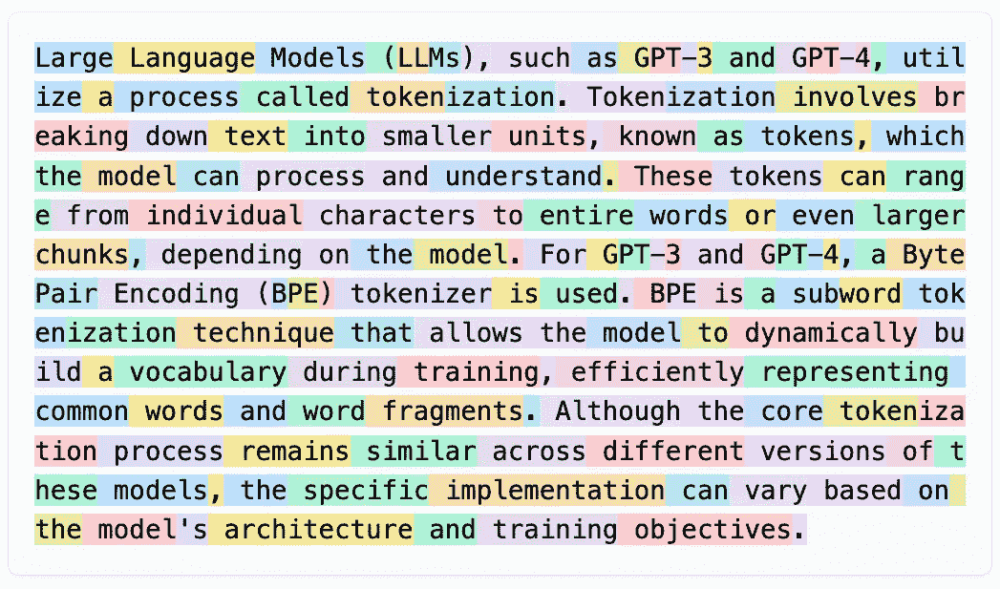
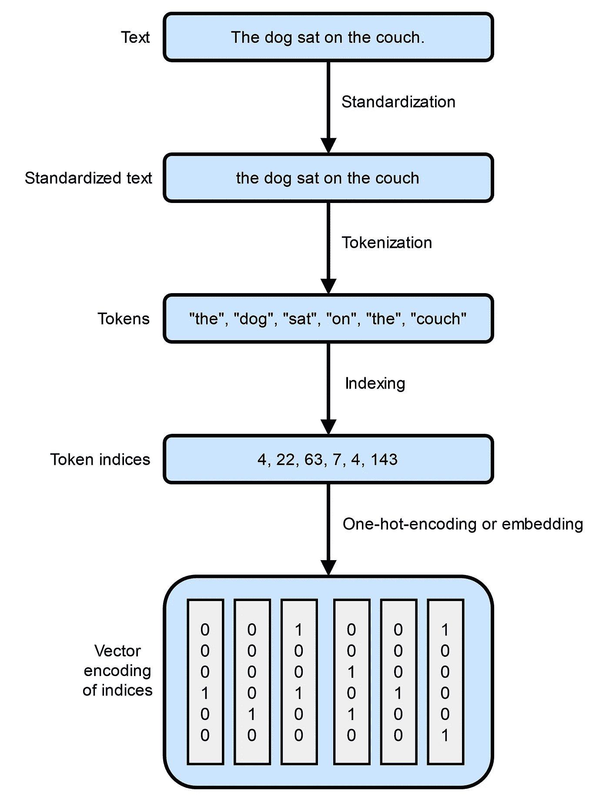
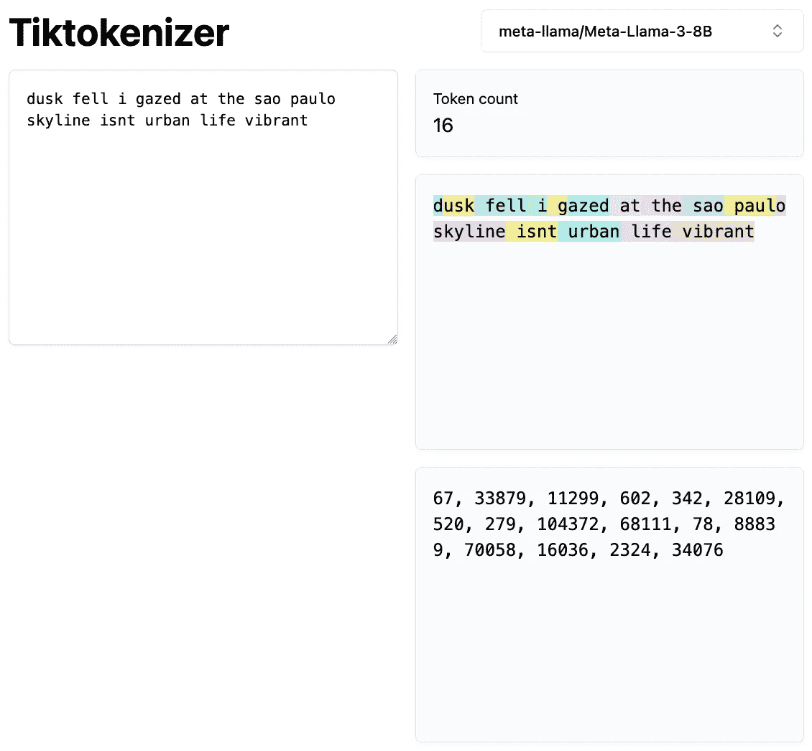

# 分词的艺术：为 AI 分解文本

> 原文：[`towardsdatascience.com/the-art-of-tokenization-breaking-down-text-for-ai-43c7bccaed25?source=collection_archive---------0-----------------------#2024-09-26`](https://towardsdatascience.com/the-art-of-tokenization-breaking-down-text-for-ai-43c7bccaed25?source=collection_archive---------0-----------------------#2024-09-26)

## 揭开 NLP 的神秘面纱：从文本到嵌入

[](https://medium.com/@murilogustineli?source=post_page---byline--43c7bccaed25--------------------------------)[](https://towardsdatascience.com/?source=post_page---byline--43c7bccaed25--------------------------------) [Murilo Gustineli](https://medium.com/@murilogustineli?source=post_page---byline--43c7bccaed25--------------------------------)

·发表于[Towards Data Science](https://towardsdatascience.com/?source=post_page---byline--43c7bccaed25--------------------------------) ·10 分钟阅读·2024 年 9 月 26 日

--



由 Llama-3-8B 生成的分词示例。每个不同颜色的子词代表一个独立的标记（token）。

# **什么是分词（Tokenization）？**

在计算机科学中，我们将像英语和普通话这样的语言称为“自然”语言。相反，像汇编语言和 LISP 这样的语言，专为与计算机交互而设计，被称为“机器”语言，遵循严格的句法规则，几乎没有解释的余地。尽管计算机擅长处理自身高度结构化的语言，但它们在处理人类语言的混乱性方面却表现得相当挣扎。

语言——尤其是文本——构成了我们大部分的沟通和知识存储。例如，互联网主要由文本组成。像[ChatGPT](https://openai.com/chatgpt/)、[Claude](https://www.anthropic.com/claude)和[Llama](https://www.llama.com/)这样的大型语言模型，都是通过使用复杂的计算技术，在海量的文本上进行训练——本质上是互联网上所有可用的文本。然而，计算机处理的是数字，而不是单词或句子。那么，我们如何弥合人类语言与机器理解之间的差距呢？

这就是**自然语言处理（NLP）**的作用所在。NLP 是一个结合语言学、计算机科学和人工智能的领域，旨在使计算机能够理解、解释和生成自然语言。无论是将文本从英语翻译成法语、总结文章，还是进行对话，NLP 都能让机器从文本输入中生成有意义的输出。

自然语言处理的第一步是将原始文本转化为计算机能够有效处理的格式。这个过程称为**分词**。分词是将文本分解成更小、易于处理的单位，称为***词元***，这些词元可以是单词、子词甚至是单个字符。以下是该过程的典型工作方式：

+   **标准化：** 在进行分词之前，文本需要进行标准化，以确保一致性。这可能包括将所有字母转换为小写、去除标点符号，并应用其他规范化技术。

+   **分词：** 然后，将标准化后的文本拆分成词元。例如，句子`“The quick brown fox jumps over the lazy dog”`可以被分词为以下词语：

```py
["the", "quick", "brown", "fox", "jumps", "over", "the", "lazy", "dog"]
```

+   **数值表示：** 由于计算机处理的是数值数据，每个词元会被转换为数值表示。这可以是简单地为每个词元分配一个唯一标识符，也可以是创建多维向量来捕捉词元的意义和上下文。



*插图灵感来源于《**Python 深度学习** *作者：François Chollet*](https://www.manning.com/books/deep-learning-with-python-second-edition)中的“图 11.1 从文本到向量”*

分词不仅仅是拆分文本；它是以一种保留意义和上下文的方式准备语言数据，以便计算模型使用。不同的分词方法会显著影响模型理解和处理语言的效果。

在本文中，我们将重点讨论文本标准化和分词，探讨几种技术和实现方法。我们将为将文本转换为机器可以处理的数值形式打下基础——这是迈向更高级主题（如词嵌入和语言建模）的一项关键步骤，未来的文章中我们将深入讨论这些内容。

# **文本标准化**

请看这两个句子：

> *1\.* `“dusk fell, i was gazing at the Sao Paulo skyline. Isnt urban life vibrant??”`
> 
> *2\.* `“Dusk fell; I gazed at the São Paulo skyline. Isn’t urban life vibrant?”`

初看这些句子，它们传达了类似的意思。然而，当计算机处理这些句子时，尤其是在分词或编码任务中，由于微小的变化，它们可能表现出截然不同的结果：

+   **大写化：** `“dusk”` 与 `“Dusk”`

+   **标点符号：** 逗号与分号；问号的存在

+   **缩写：** `“Isnt”` 与 `“Isn’t”`

+   **拼写和特殊字符：** `“Sao Paulo”` 与 `“São Paulo”`

这些差异可能会显著影响算法如何解读文本。例如，`“Isnt”`没有撇号，可能不会被识别为`“is not”`的缩写，而像`“São”`中的特殊字符`“ã”`可能会被误解或导致编码问题。

**文本标准化**是自然语言处理中的一个关键预处理步骤，它解决了这些问题。通过标准化文本，我们减少了无关的变化，确保输入到模型中的数据是一致的。这个过程是一种特征工程方法，我们消除了对于当前任务没有意义的差异。

一种简单的文本标准化方法包括：

+   **转为小写**：减少因大小写不同而导致的差异。

+   **去除标点符号**：通过去除标点符号简化文本。

+   **规范化特殊字符**：将像`“ã”`这样的字符转换为其标准形式（如`“a”`）。

将这些步骤应用到我们的句子中，我们得到：

> *1\.* `“dusk fell i was gazing at the sao paulo skyline isnt urban life vibrant”`
> 
> *2\.* `“dusk fell i gazed at the sao paulo skyline isnt urban life vibrant”`

现在，句子更加统一，突出了只有在单词选择上的有意义差异（例如`“was gazing at”`与`“gazed at”`的区别）。

虽然有更高级的标准化技术，如[**词干提取**](https://en.wikipedia.org/wiki/Stemming)（将单词还原为词根形式）和[**词形还原**](https://en.wikipedia.org/wiki/Lemmatization)（将单词还原为词典形式），但这种基本方法有效地最小化了表面上的差异。

## **文本标准化的 Python 实现**

下面是如何在 Python 中实现基本文本标准化的方法：

```py
import re
import unicodedata

def standardize_text(text:str) -> str:
    # Convert text to lowercase
    text = text.lower()
    # Normalize unicode characters to ASCII
    text = unicodedata.normalize('NFKD', text).encode('ascii', 'ignore').decode('utf-8')
    # Remove punctuation
    text = re.sub(r'[^\w\s]', '', text)
    # Remove extra whitespace
    text = re.sub(r'\s+', ' ', text).strip()
    return text

# Example sentences
sentence1 = "dusk fell, i was gazing at the Sao Paulo skyline. Isnt urban life vibrant??"
sentence2 = "Dusk fell; I gazed at the São Paulo skyline. Isn't urban life vibrant?"

# Standardize sentences
std_sentence1 = standardize_text(sentence1)
std_sentence2 = standardize_text(sentence2)
print(std_sentence1)
print(std_sentence2)
```

**输出：**

```py
dusk fell i was gazing at the sao paulo skyline isnt urban life vibrant
dusk fell i gazed at the sao paulo skyline isnt urban life vibrant
```

通过标准化文本，我们已经最小化了可能会混淆计算模型的差异。模型现在可以专注于句子之间的变化，比如`“was gazing at”`和`“gazed at”`之间的区别，而不是像标点符号或大小写等差异。

# 标记化

在文本标准化后，自然语言处理中的下一个关键步骤是**标记化**。标记化涉及将标准化后的文本拆分成更小的单元，称为***标记***。这些标记是模型用来理解和生成自然语言的基本构建块。标记化为向量化做准备，其中每个标记都被转换为机器可以处理的数值表示。

我们的目标是将句子转换成计算机可以高效处理的形式。标记化有三种常见方法：

## **1\. 单词级标记化**

根据空格和标点符号将文本拆分成单独的单词。这是分解文本最直观的方式。

```py
text = "dusk fell i gazed at the sao paulo skyline isnt urban life vibrant"
tokens = text.split()
print(tokens)
```

**输出：**

```py
['dusk', 'fell', 'i', 'gazed', 'at', 'the', 'sao', 'paulo', 'skyline', 'isnt', 'urban', 'life', 'vibrant']
```

## **2\. 字符级标记化**

将文本拆分成单独的字符，包括字母，有时也包括标点符号。

```py
text = "Dusk fell"
tokens = list(text)
print(tokens)
```

**输出：**

```py
['D', 'u', 's', 'k', ' ', 'f', 'e', 'l', 'l']
```

## **3\. 子词标记化**

将单词拆分成更小的、有意义的子词单元。这种方法在字符级别的分词粒度与词汇级别分词的语义丰富性之间取得了平衡。像 **字节对编码（BPE）** 和 **WordPiece** 这样的算法属于这一类别。例如，[BertTokenizer](https://huggingface.co/docs/transformers/v4.44.2/en/model_doc/bert#transformers.BertTokenizer) 将 `“I have a new GPU!”` 分词如下：

```py
from transformers import BertTokenizer

text = "I have a new GPU!"
tokenizer = BertTokenizer.from_pretrained("bert-base-uncased")
tokens = tokenizer.tokenize(text)
print(tokens)
```

**输出：**

```py
['i', 'have', 'a', 'new', 'gp', '##u', '!']
```

在这里，`“GPU”` 被拆分为 `“gp”` 和 `“##u”`，其中 `“##”` 表示 `“u”` 是前一个子词的延续。

子词分词提供了一种在词汇大小和语义表示之间的平衡方法。通过将稀有词拆解为常见的子词，它保持了可管理的词汇大小，而不牺牲含义。子词携带着有助于模型更有效理解上下文的语义信息。这意味着，模型可以通过将新词或稀有词分解成熟悉的子词来处理它们，从而提高其处理更广泛语言输入的能力。

例如，考虑单词 `“annoyingly”`，它在训练语料库中可能比较稀有。它可以被拆解为子词 `“annoying”` 和 `“ly”`。`“annoying”` 和 `“ly”` 在它们各自的形式中更为常见，并且它们的组合含义保留了 `“annoyingly”` 的本质。这种方法在[粘着语](https://en.wikipedia.org/wiki/Agglutinative_language)（如土耳其语）中尤其有益，因为这些语言中的单词可以通过将子词组合在一起，形成极长的词来传达复杂的含义。

请注意，标准化步骤通常会集成到分词器本身。大型语言模型在处理文本时，使用标记作为输入和输出。以下是由 Llama-3–8B 在[Tiktokenizer](https://tiktokenizer.vercel.app/)上生成的标记的可视化表示：



**Tiktokenizer** 示例使用 **Llama-3–8B**。每个标记都用不同的颜色表示。

此外，Hugging Face 提供了一份出色的[分词器总结](https://huggingface.co/docs/transformers/en/tokenizer_summary)指南，我在本文中使用了其中的一些示例。

现在让我们探索不同的子词分词算法是如何工作的。请注意，所有这些分词算法都依赖于某种形式的训练，通常是在与对应模型训练相关的语料库上进行的。

# 字节对编码（BPE）

B**字节对编码**（Byte-Pair Encoding，BPE）是一种子词分词方法，最早由 Sennrich 等人在 2015 年的论文 [《使用子词单元的稀有词神经机器翻译》](https://arxiv.org/abs/1508.07909) 中提出。BPE 从一个包含所有唯一字符的基础词汇开始，逐步合并最频繁的符号对——这些符号可以是字符或字符序列——以形成新的子词。这个过程会持续进行，直到词汇表达到预定义的大小，这是你在训练前选择的超参数。

假设我们有以下单词及其频率：

+   `“hug”`（出现 10 次）

+   `“pug”`（出现 5 次）

+   `“pun”`（出现 12 次）

+   `“bun”`（出现 4 次）

+   `“hugs”`（出现 5 次）

我们的初始基础词汇包含以下字符：`[“h”, “u”, “g”, “p”, “n”, “b”, “s”]`。

我们将单词拆分为单个字符：

+   `“h” “u” “g”`（hug）

+   `“p” “u” “g”`（pug）

+   `“p” “u” “n”`（pun）

+   `“b” “u” “n”`（bun）

+   `“h” “u” “g” “s”`（hugs）

接下来，我们计算每个符号对的频率：

+   `“h u”`：出现 15 次（来自 `“hug”` 和 `“hugs”`）

+   `“u g”`：出现 20 次（来自 `“hug”`，`“pug”`，`“hugs”`）

+   `“p u”`：出现 17 次（来自 `“pug”`，`“pun”`）

+   `“u n”`：出现 16 次（来自 `“pun”`，`“bun”`）

最频繁的字符对是 `“u g”`（出现 20 次），因此我们将 `“u”` 和 `“g”` 合并为 `“ug”` 并更新我们的单词：

+   `“h” “ug”`（hug）

+   `“p” “ug”`（pug）

+   `“p” “u” “n”`（pun）

+   `“b” “u” “n”`（bun）

+   `“h” “ug” “s”`（hugs）

我们继续进行此过程，合并下一个最频繁的符号对，例如将 `“u n”` 合并为 `“un”`，直到达到我们期望的词汇大小。

BPE 通过指定合并操作的次数来控制词汇大小。频繁的单词保持不变，从而减少了大量记忆的需求。同时，罕见或未见过的单词可以通过已知子词的组合来表示。它被用于像 [**GPT**](https://openai.com/index/language-unsupervised/) 和 [**RoBERTa**](https://arxiv.org/abs/1907.11692) 这样的模型中。

Hugging Face 分词器库提供了一种快速且灵活的方法来训练和使用分词器，包括 BPE。

## 训练 BPE 分词器

下面是如何在一个示例数据集上训练 BPE 分词器的方法：

```py
from tokenizers import Tokenizer
from tokenizers.models import BPE
from tokenizers.trainers import BpeTrainer
from tokenizers.pre_tokenizers import Whitespace

# Initialize a tokenizer
tokenizer = Tokenizer(BPE())

# Set the pre-tokenizer to split on whitespace
tokenizer.pre_tokenizer = Whitespace()

# Initialize a trainer with desired vocabulary size
trainer = BpeTrainer(vocab_size=1000, min_frequency=2, special_tokens=["[UNK]", "[CLS]", "[SEP]", "[PAD]", "[MASK]"])

# Files to train on
files = ["path/to/your/dataset.txt"]

# Train the tokenizer
tokenizer.train(files, trainer)

# Save the tokenizer
tokenizer.save("bpe-tokenizer.json")
```

**使用训练好的 BPE 分词器：**

```py
from tokenizers import Tokenizer

# Load the tokenizer
tokenizer = Tokenizer.from_file("bpe-tokenizer.json")

# Encode a text input
encoded = tokenizer.encode("I have a new GPU!")
print("Tokens:", encoded.tokens)
print("IDs:", encoded.ids)
```

**输出：**

```py
Tokens: ['I', 'have', 'a', 'new', 'GP', 'U', '!']
IDs: [12, 45, 7, 89, 342, 210, 5]
```

# WordPiece

W**ordPiece** 是另一种子词分词算法，由 [Schuster 和 Nakajima 于 2012 年](https://static.googleusercontent.com/media/research.google.com/ja//pubs/archive/37842.pdf) 提出，并由像 [**BERT**](https://arxiv.org/abs/1810.04805#) 这样的模型广泛使用。与 BPE 相似，WordPiece 也从所有唯一字符开始，但在选择合并的符号对时有所不同。

下面是 WordPiece 的工作原理：

1.  **初始化**：从包含所有唯一字符的词汇表开始。

1.  **预分词**：将训练文本拆分为单词。

1.  **构建词汇表**：通过迭代添加新的符号（子词）到词汇表中。

1.  **选择标准**：与选择最常见的符号对不同，WordPiece 选择的符号对是将其加入词汇表后，最大化训练数据的可能性。

使用与之前相同的词频，WordPiece 评估哪个符号对在合并后能最有效地提高训练数据的概率。这比 BPE 基于频率的方法更具概率性。

类似于 BPE，我们可以使用`tokenizers`库训练一个 WordPiece 分词器。

## 训练一个 WordPiece 分词器

```py
from tokenizers import Tokenizer
from tokenizers.models import WordPiece
from tokenizers.trainers import WordPieceTrainer
from tokenizers.pre_tokenizers import Whitespace

# Initialize a tokenizer
tokenizer = Tokenizer(WordPiece(unk_token="[UNK]"))

# Set the pre-tokenizer
tokenizer.pre_tokenizer = Whitespace()

# Initialize a trainer
trainer = WordPieceTrainer(vocab_size=1000, min_frequency=2, special_tokens=["[UNK]", "[CLS]", "[SEP]", "[PAD]", "[MASK]"])

# Train the tokenizer
tokenizer.train(files, trainer)

# Save the tokenizer
tokenizer.save("wordpiece-tokenizer.json")
```

**使用训练好的 WordPiece 分词器：**

```py
from tokenizers import Tokenizer

# Load the tokenizer
tokenizer = Tokenizer.from_file("wordpiece-tokenizer.json")

# Encode a text input
encoded = tokenizer.encode("I have a new GPU!")
print("Tokens:", encoded.tokens)
print("IDs:", encoded.ids)
```

**输出：**

```py
Tokens: ['I', 'have', 'a', 'new', 'G', '##PU', '!']
IDs: [10, 34, 5, 78, 301, 502, 8]
```

# **结论**

分词是自然语言处理中的基础步骤，旨在为计算模型准备文本数据。通过理解和实施适当的分词策略，我们使模型能够更有效地处理和生成自然语言，为像词嵌入和语言建模等高级主题打下基础。

> 本文中的所有代码也可以在我的 GitHub 仓库中找到：[**github.com/murilogustineli/nlp-medium**](https://github.com/murilogustineli/nlp-medium)

## 其他资源

+   [让我们来构建 GPT 分词器 | Andrej Karpathy 在 YouTube 上](https://www.youtube.com/watch?v=zduSFxRajkE)

+   [分词 | Mistral AI 大型语言模型](https://docs.mistral.ai/guides/tokenization/)

+   [分词器总结 | Hugging Face](https://huggingface.co/docs/transformers/en/tokenizer_summary)

+   [构建分词器，一步步来 | Hugging Face](https://huggingface.co/learn/nlp-course/en/chapter6/8)

> 除非另有说明，所有图片均由作者创建。
