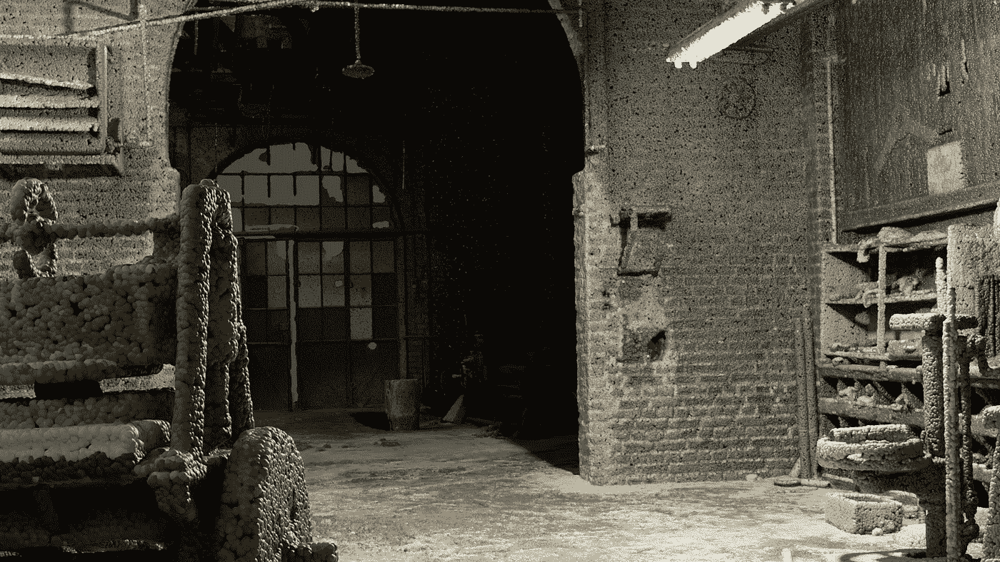

# Blender 3D 点云可视化与渲染手册

> 原文：[`towardsdatascience.com/the-blender-handbook-for-3d-point-cloud-visualization-and-rendering-1700ebe69c7b?source=collection_archive---------4-----------------------#2024-02-28`](https://towardsdatascience.com/the-blender-handbook-for-3d-point-cloud-visualization-and-rendering-1700ebe69c7b?source=collection_archive---------4-----------------------#2024-02-28)

## Blender

## 完整指南：如何在 Blender 中创建大规模点云的 3D 体验

 [Florent Poux, Ph.D.](https://medium.com/@florentpoux?source=post_page---byline--1700ebe69c7b--------------------------------)

·发表于[Towards Data Science](https://towardsdatascience.com/?source=post_page---byline--1700ebe69c7b--------------------------------) ·阅读时长 20 分钟·2024 年 2 月 28 日

--

在本教程中，我希望填补一个巨大的互联网空白：如何利用其中一个最强大的 3D 工具来处理和可视化海量的点云数据集。

在 Blender 中对一个旧工厂进行的 3D 点云可视化。© [F. Poux](https://learngeodata.eu/)

这个工具叫做[Blender](https://www.blender.org/)。它允许我们通过尝试不同的数据可视化技术来解决复杂的分析场景。这正是将我们聚集在一起的原因。

如何在 Blender 的扩展数据可视化能力下，建立现实捕捉数据集（以点云形式）与 Blender 的最佳基础工作流？

🦊**Florent**：*Reality Capture 是一个相对“新”的术语，可能会让人感到困惑，因为一些软件和公司正是以此命名。你可以将这个“学科”看作是“3D 制图”的一个专门分支，其目标是通过 LiDAR 或被动相机（通过摄影测量和 3D 计算机视觉）等各种传感器从现实世界中捕捉 3D 几何数据。你可以在本文中看到我们是如何做到的：* [*通过摄影测量进行 3D 重建指南*](https://medium.com/towards-data-science/the-ultimate-guide-to-3d-reconstruction-with-photogrammetry-56155516ddc4)

在本指南中，我将过程分解为九个清晰的步骤，如下所示。
