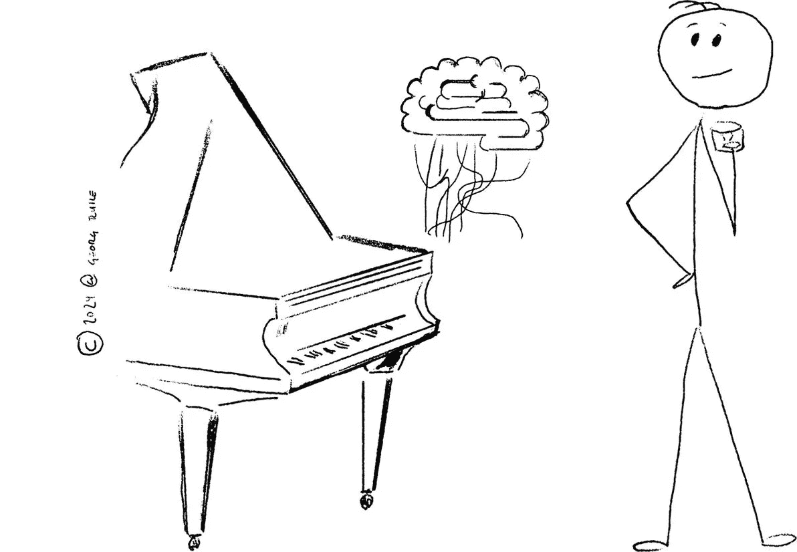
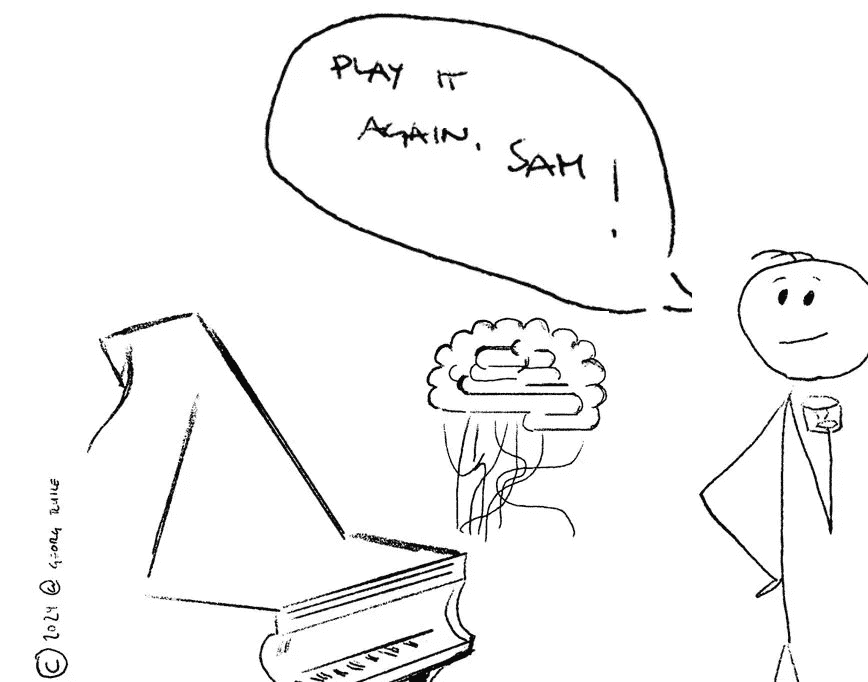
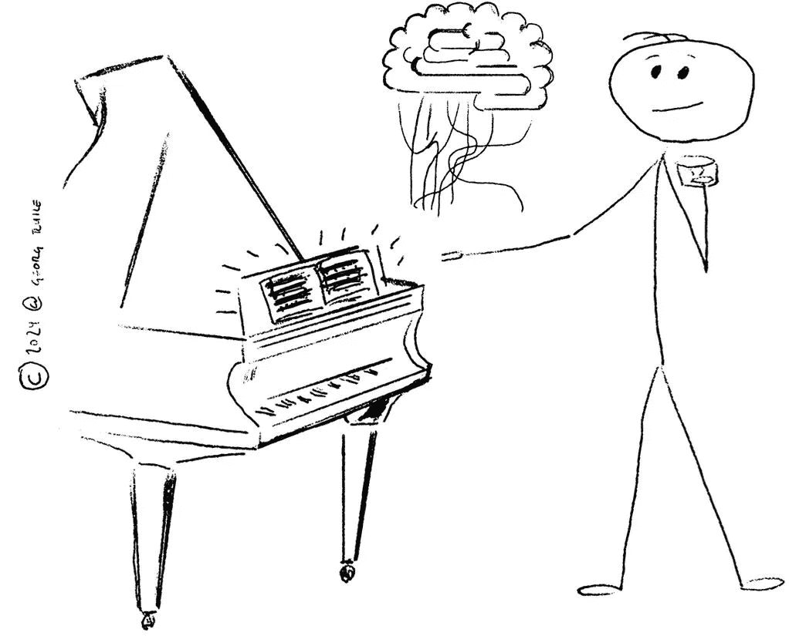
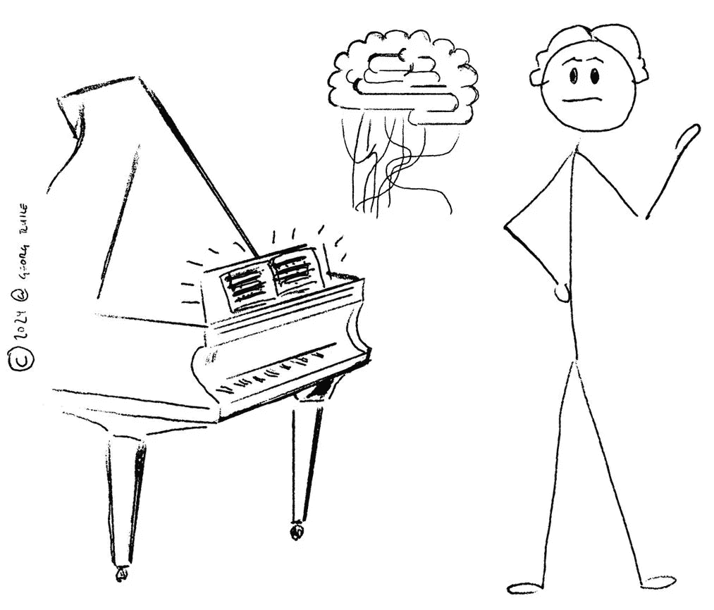

# 《定制语言 AI 的商业指南》

> 原文：[`towardsdatascience.com/the-business-guide-to-tailoring-language-ai-5f0fa806e838?source=collection_archive---------8-----------------------#2024-03-27`](https://towardsdatascience.com/the-business-guide-to-tailoring-language-ai-5f0fa806e838?source=collection_archive---------8-----------------------#2024-03-27)

## 解锁定制 LLM 解决方案的框架，你将能够理解

 [Georg Ruile, 博士](https://medium.com/@georg.ruile?source=post_page---byline--5f0fa806e838--------------------------------)

·发表于[Towards Data Science](https://towardsdatascience.com/?source=post_page---byline--5f0fa806e838--------------------------------) ·阅读时间 8 分钟·2024 年 3 月 27 日

--

## 前言

本文说明了大型语言模型（LLM）是如何逐步适应定制化使用的。它旨在为没有计算机科学背景的人提供一种易于理解的类比，帮助他们了解 GPT 和类似的 AI 系统如何被定制。为什么要有艺术作品？请耐心一点，我希望你能享受这个过程。

# **引言**

我不会从 ChatGPT、Claude 和生成性 AI 如何改变企业并将永远改变我们的生活、职业和商业的介绍开始这篇文章。关于这些内容已经有很多文章（尤其是 GPT 们自己写的…）。相反，今天我想关注的是，我们如何**利用大型语言模型（LLM）来满足我们特定的、定制化的需求**。

在我的职业生涯和私人生活中，我一直在帮助人们理解语言 AI 能够做什么以及不能做什么的基本概念，从为什么以及如何进行正确的提示（这超出了本文的范围）开始，到当管理者声称他们的公司拥有“自己的语言模型”时，这意味着什么。我觉得，特别是在将语言模型适应到特定业务需求的问题上，存在许多困惑和不确定性。到目前为止，我还没有遇到一个能够解决这一需求的成熟框架。

为了提供一个易于理解的解释，让非 IT 专业人士理解语言模型定制的可能性，我想出了一个类比，它让我回忆起早年作为酒吧钢琴演奏员时的经历。就像语言模型一样，酒吧钢琴演奏员常常被要求演奏各种歌曲，通常是没有明确要求或限定上下文的：“再来一首，Sam……”

# 认识 Sam——酒吧钢琴演奏员

想象一下你正坐在一家五星级酒店的钢琴酒吧里，那里有一架漂亮的三角钢琴。Sam（依然是人类）正演奏着钢琴曲。你正在享受着你的饮品，想知道 Sam 是否也能根据你的特定音乐口味演奏。为了便于论述，假设 Sam 实际上是一个语言模型，而你是酒店（或企业）老板，想知道 Sam 能为你做些什么。我在这里展示的“升级阶梯”是一个框架，提供了四个级别或方法，用以逐步调整 Sam 的知识和能力，以适应你的独特需求。在每个级别，需求变得越来越具体，同时让 Sam 适应所需的努力和成本也越来越高。

# 升级阶梯：从提示到训练你自己的语言模型

## **1. 提示：超越提问技巧**

提示语言模型——模型的输出取决于提示的质量

你可以做的第一件事非常简单，但可能并不容易。你请求 Sam 播放你想听的歌曲。你越具体，也就是说，你的请求越清晰，你的措辞越准确（当然还取决于你在酒店酒吧喝了多少酒，你的发音），效果就越好。正如伏尔泰曾经说过：

> “通过一个人的提问，而不是他的回答来判断他。”

“弹一些爵士乐”可能会，也可能不会使 Sam 演奏出你心中想要的旋律。“弹戴夫·布鲁贝克的《Take Five》的原版，右手弹奏萨克斯风的主旋律，左手保持节奏模式”则会得到一个非常具体的结果，前提是 Sam 接受了正确的训练。

你在这里所做的就是我对**提示**的类比——我们当前与像 GPT 或 Claude 这样的通用语言模型的交互方式。虽然提示是最直接的方式，但输出的质量在很大程度上依赖于你的提示的具体性和清晰度。正因为如此，[**提示工程**](https://de.wikipedia.org/wiki/Prompt_Engineering)成为了一个职业，而这个职业你可能在几年前都没听说过。

提示会带来巨大的差异，从得到一个糟糕、笼统，甚至错误的答案，到得到一个你可以实际使用的答案。这就是为什么在我日常使用 GPT 之类的工具时，我总是花一点时间思考一个合适的提示（我最喜欢的做法叫做“***基于角色的提示***”，即在提示中给模型一个特定角色，例如 IT 专家、数据工程师或职业教练。我们这里不深入探讨提示的细节，因为这超出了本文的范围）。

但是**提示有其局限性**：你可能不想总是通过提示来解释整个世界。在提示中提供所有的上下文并进行适当的书写可能是一项相当繁琐的任务（尽管基于聊天的语言模型在拼写上有一定的宽容度）。而且输出仍然可能偏离你的预期——在酒店酒吧场景中，不管你要求多么具体，你仍然可能对 Sam 演奏你最喜欢的歌曲不满意。

## 2\. 嵌入或检索增强生成（RAG）：提供与上下文相关的数据或指令

通过检索增强生成（RAG）将上下文嵌入或添加到你的提示中

你有一个想法。除了让 Sam “再演奏一次”（并具体提醒他你想听什么），你记得你的包里有乐谱。所以你把乐谱放在钢琴上，要求 Sam 演奏上面写的内容（前提是你给他一些激励，比如 10 美元现金）。

在我们的类比中，模型现在利用其固有的能力生成语言输出（Sam 演奏钢琴），并将这些能力应用于特定的上下文（Sam 演奏特定的歌曲）。

这种架构模式被称为**检索增强生成（RAG）**，你为模型提供与你领域相关的附加上下文或参考材料。通过结合这些外部来源和数据，模型可以生成更有信息量和准确性的回答，量身定制以满足你的特定需求。从技术上讲，这涉及准备和清理文本上下文数据，然后将其转化为[**嵌入**](https://learn.microsoft.com/en-us/semantic-kernel/memories/embeddings)，并进行适当的索引。当提示时，模型会根据提示内容接收到与之相关的上下文数据。

这是更进一步的一步，因为它需要你付出一些努力（例如，给 Sam 10 美元），并且可能涉及一些实际的实施成本。

现在 Sam 演奏了你最喜欢的曲子——然而，你仍然对他的演奏方式不满意。某种程度上，你希望加点 Swing，或者少了某种感觉。所以你踏上了我们阶梯的下一步。

## 3\. 微调：学习并适应反馈

通过不断提供（人类）反馈来微调模型——就像钢琴老师一样

这就是我的类比开始有些动摇的地方，特别是当我们在音乐语境中字面理解“调音”一词时。在这里，我们并不是在谈论调音萨姆的钢琴。相反，当我在这个语境中提到微调时，我是指花费大量时间与萨姆一起工作，直到他弹奏出我们希望的方式。所以我们基本上是在给他上钢琴课，提供**反馈**来改进他的演奏，并**监督他的进展**。

回到语言模型，这里的一种方法被称为**强化学习（通过人类反馈）**（[**RLHF**](https://huggingface.co/blog/rlhf)），它很好地契合了我们对严格钢琴教师的类比。微调通过将模型的知识和技能调整（即调音）到特定任务或领域，进一步推进了定制化过程。同样，更技术一点来说，这里发生的事情基于[强化学习](https://en.wikipedia.org/wiki/Reinforcement_learning)，其核心是奖励函数。这个奖励会动态适应人类的反馈，这通常是人类对模型文本输出的 A/B 判断标签，基于相同的提示。

对于这个过程，我们需要大量的（计算）资源、大量精心挑选的数据和/或人工反馈。这也解释了为什么它已经排在我们提升阶梯的较高位置，但这还不是终点。

如果我们希望萨姆演奏或做一些非常具体的音乐事情呢？例如，我们希望他一起唱歌——这会让萨姆相当紧张（至少，曾经有过这样的请求让我有这种感觉），因为萨姆没有接受过训练，也从未尝试过唱歌……

## 4. 自定义模型训练：培养一位新的专家

从零开始训练模型来培养专家

在提升阶梯的顶端，我们遇到了自定义模型（预）训练，您实际上是从零开始创建一个全新的专家，完全按照您的要求量身定制。这也是我的类比可能会崩溃的地方（我可没说它是完美的！）——如何从头开始培养一位钢琴演奏者？不过我们还是继续这个类比——假设我们要训练*萨曼莎*，她一生中从未演奏过任何音乐，也没有唱过歌。所以我们将大量投资于她的教育和技能，把她送到那些音乐家学习我们希望他们演奏的顶级学府。

在这里，我们正在从**零基础培养一种新的语言模型**，为其注入在我们特定领域内执行所需的知识和数据。通过精心策划训练数据并调整模型及其架构，我们可以开发出一个高度专业化和优化的语言模型，能够应对即使是组织内最专有的任务。在这个过程中，目前的大型语言模型所训练的数据量和参数数量可能会相当惊人。例如，传闻称 OpenAI 最新的[GPT-4 有 1.76 万亿个参数](https://en.wikipedia.org/wiki/GPT-4)。因此，这种方法通常需要巨大的资源，对于今天的许多企业来说，往往是难以企及的。

## 结论

就像我们从害羞地要求 Sam 演奏 Dave Brubeck 的《Take Five》到开发新人才一样——随着我们逐步通过每个“升级阶梯”，所需的努力和资源显著增加，但我们在语言模型能力上的定制化和控制程度也随之增加。

当然，就像大多数框架一样，这个框架并不像我在这里展示的那样简单明了。可能存在混合或综合的方法，甚至是最精细的 RAG 实现，也需要你进行适当的提示。然而，通过理解并时常提醒自己这个框架，我相信你可以战略性地确定为特定使用场景所需的定制化程度。要释放语言 AI 的全部潜力，你需要在努力与成本之间找到合适的平衡，同时实现量身定制的表现。这也有助于在语言 AI 模型的适应和实施过程中，弥合商业与 IT 之间的沟通鸿沟。

我希望你们喜欢与 Sam 和 Samantha 见面，并适应他们在钢琴上的能力。我欢迎你在下方评论、批评或扩展你对这个类比的看法，或者简单地将这篇文章分享给可能从中受益的人。

*注释和参考文献：

本文的灵感来源于这篇关于检索增强生成技术的* [*文章*](https://www.databricks.com/de/glossary/retrieval-augmented-generation-rag) *，由 Databricks 发布。

所有插图均由作者手工精心制作，充满自豪感 :)*
