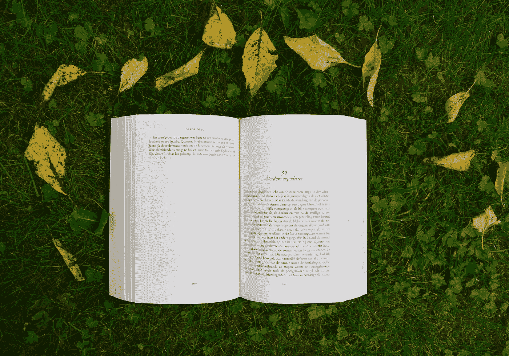

# 生成性 AI 的即将版权审判

> 原文：[`towardsdatascience.com/the-coming-copyright-reckoning-for-generative-ai-b7fe0963c58f?source=collection_archive---------3-----------------------#2024-04-01`](https://towardsdatascience.com/the-coming-copyright-reckoning-for-generative-ai-b7fe0963c58f?source=collection_archive---------3-----------------------#2024-04-01)

## 法院正准备裁定生成性 AI 是否侵犯版权——让我们讨论一下这到底意味着什么

 [Stephanie Kirmer](https://medium.com/@s.kirmer?source=post_page---byline--b7fe0963c58f--------------------------------)

·发布于[数据科学前沿](https://towardsdatascience.com/?source=post_page---byline--b7fe0963c58f--------------------------------) ·14 分钟阅读·2024 年 4 月 1 日

--

图片由[Annelies Geneyn](https://unsplash.com/@anneliesgeneyn?utm_source=medium&utm_medium=referral)拍摄，来源于[Unsplash](https://unsplash.com/?utm_source=medium&utm_medium=referral)

美国的版权法是一个复杂的领域。我们这些非律师的人，理所当然地很难搞清楚它到底意味着什么，以及它保护了什么，没保护什么。数据科学家通常不会花很多时间考虑版权问题，除非我们正在为开源项目选择许可证。即使是这样，有时候我们也会跳过那一部分，没太处理它，尽管我们知道应该处理。但是法律界现在开始密切关注版权与生成性 AI 的交集，这可能对我们的工作产生实际影响。在我们讨论它如何影响生成性 AI 领域之前，让我们先[回顾一下版权的真相](https://www.eff.org/teachingcopyright)。

# 版权

1.  美国的版权法与所谓的“原创作品”相关。这些包括以下类别的作品：文学；音乐；戏剧；哑剧和舞蹈作品；图像、图形和雕塑作品；视听作品；声音录制；衍生作品；编纂作品；建筑作品。

1.  内容必须以可版权化的形式进行创作或记录。“创意是不能获得版权的。只有具体的表达形式（例如书籍、剧本、画作、电影或照片等）才能获得版权。一旦你将创意以固定的形式表达出来——比如数字绘画、录制的歌曲，甚至是在餐巾纸上的涂写——如果它是原创作品，它会自动获得版权。” — [电子前沿基金会](https://www.eff.org/teachingcopyright/handouts#copyrightFAQ)

1.  版权保护意味着只有版权持有者（作者或创作者、继承其权利的后代，或权利的购买者）才能做以下事情：制作并销售作品的复制品、从原作品创作衍生作品、以及公开表演或展示作品。

1.  版权不是永恒的，它在一定时间后会结束。通常来说，这是在作者去世后 70 年或内容发布后 95 年。（在美国，1929 年之前的作品通常处于“公有领域”，这意味着它不再受到版权保护。）

为什么版权存在？近期的法律解释认为，版权的存在不仅仅是让创作者致富，而是鼓励创作，使我们拥有一个充满艺术和文化创造力的社会。基本上，我们与创作者交换金钱，激励他们为我们创造伟大的作品。这意味着很多法院在审理版权案件时会问：“这个复制品是否有助于创造一个具有创意、艺术性和创新的社会？”并且在做出判断时也会考虑这一点。

# 合理使用

此外，“合理使用”并不是可以忽视版权的免死金牌。判断某一内容使用是否为“[合理使用](https://www.eff.org/teachingcopyright/handouts#fairuseFAQ)”有四个标准：

1.  第二次使用的目的和性质：你是在用这些内容做一些创新和不同的事情，还是仅仅是在复制原作？你的新作品本身是否具有创新性？如果是，那么它更有可能被认为是合理使用。此外，如果你的使用目的是为了盈利，那么它就不太可能被认为是合理使用。

1.  原作品的性质：如果原作品具有创意性，那么通过合理使用破坏版权会更困难。如果它只是事实，那么你更有可能适用合理使用（比如引用研究文章或百科全书）。

1.  使用的数量：你是在复制全部内容吗？还是仅仅是复制一段或一小部分？合理使用时，尽量使用必要的最小量是很重要的，尽管有时你可能需要使用大量内容来创作衍生作品。

1.  影响：你是在从原创者那里窃取客户吗？人们会购买或使用你的复制品，而不是购买原版吗？创作者会因为你的复制品失去收入或市场份额吗？如果是，那么它可能不是合理使用。（即使你没有赚钱，这一点仍然相关。）

你必须满足所有这些测试标准，才能认为是合理使用，而不仅仅是其中一两项。当然，所有这些都需要法律解释。（本文不是法律建议！）但现在，在我们掌握了这些事实之后，让我们思考生成性人工智能的作用以及上述概念为何会与生成性人工智能发生碰撞。

# 生成性人工智能回顾

我的专栏的常读者应该已经对生成性人工智能的训练过程有了相当清晰的理解，但让我们做一个非常简短的回顾。

+   收集大量数据，并通过分析数据中的模式来训练模型。（[正如我之前所写](https://medium.com/towards-data-science/how-human-labor-enables-machine-learning-367feee8bc91)：“有报告显示，GPT-4 的训练数据大约有*1 万亿*个单词。这些单词每一个都由人类创作，源于他们自己的创造能力。为了让大家更好理解，‘权力的游戏’第一部书大约有 292,727 个单词。因此，GPT-4 的训练数据大约相当于*3,416,152 本该书*。”）

+   当模型学习到数据中的模式（对于大型语言模型（LLM），它学习的是语言语义、语法、词汇和习语等内容）时，它将通过人工微调，以确保在人们与之互动时，模型能按照预期的方式表现。这些数据中的模式可能非常具体，以至于一些学者认为模型可以“记住”训练数据。

+   然后，模型将能够根据它学到的模式回答用户的提示（对于大型语言模型（LLM），即用非常像人类的语言回答问题）。

这些模型的输入（训练数据）和输出对版权法有重要影响，所以我们来仔细分析一下。

# 训练数据与模型输出

训练数据对于创建生成性人工智能模型至关重要。目标是教会模型复制人类的创造力，因此模型需要看到*海量的*人类创造性作品，以便学习这些作品的样貌和声音。但正如我们之前了解到的，人类创作的作品归创作者所有（即使它们只是在纸 napkin 上随便写的）。为每个创作者支付作品的版权费用对于我们训练即使是一个小型生成性人工智能模型所需的海量数据来说是不可行的。那么，是否可以视为合理使用，将他人的作品输入训练数据集并创建生成性人工智能模型呢？让我们来看一下合理使用的测试标准，看看我们最终的结论是什么。

1.  第二种用途的目的和特征

我们可以争论，使用数据来训练模型并不算真正的创造衍生作品。例如，这与用一本书或一首音乐来教孩子有什么不同吗？反驳意见有两个：首先，教一个孩子与使用成千上万本书来生成一个有利润的产品不同；其次，生成型 AI 能够如此精准地复制它所训练的内容，基本上是一个复制几乎逐字不差的工作的高级工具。生成型 AI 的结果有时是否具有创新性，并且完全不同于输入内容？如果是，那可能是由于非常有创意的提示工程，但这是否意味着底层工具是合法的？

然而，从哲学角度来看，机器学习试图尽可能准确地再现其从训练数据中学到的模式。它从原始作品中学到的模式是否与原始作品的“核心”相同？

2\. 原始作品的性质

这在不同种类的生成型 AI 之间差异很大，但由于训练任何模型所需的数据量庞大，因此至少有一些数据可能符合创造力的法律标准。在许多情况下，使用人类内容作为训练数据的主要原因是为了将创新的（高度多样化的）输入引入模型。除非有人要逐一审查 GPT-4 的 1 万亿单词，并决定哪些是有创造力的，哪些不是，否则我认为这一标准不符合合理使用的要求。

3\. 使用的数量

这与第 2 点有些相似。因为，几乎可以说生成型 AI 的训练数据集使用了它能够获取的所有内容，而且数据量需要庞大且全面；根本没有所谓的“最小必要”内容量。

4\. 影响

最后，影响问题是生成型 AI 的一个大难点。我想我们都知道有些人时不时地使用 ChatGPT 或类似工具，而不是在百科全书或报纸中寻找答案。有强烈的证据表明，人们使用像 Dall-E 这样的服务来请求“以[艺术家姓名]的风格”创作视觉作品，尽管这些服务显然已经做出了一些努力来阻止这种行为。如果问题是人们是否会使用生成型 AI 而不是支付原始创作者报酬，那显然在某些行业中确实有这种情况。而且我们可以看到，像微软、谷歌、Meta 和 OpenAI 这样的公司通过生成型 AI 获得了数十亿美元的估值和收入，所以他们显然不会在这个问题上轻松过关。

## 计算中的复制概念

我想暂停一下，讨论一个虽不直接相关但非常重要的问题。版权法并没有很好地应对计算机技术，特别是软件和数字化作品的问题。版权法大多是在一个更早的时代制定的，当时复制一张黑胶唱片或重新出版一本书是一项专业化且昂贵的任务。但如今，任何计算机上的东西基本上都可以通过点击鼠标在几秒钟内复制，复制的概念与以前大不相同。而且，请记住，安装任何软件都算作复制。数字复制在我们文化中意味着的内容与以前计算机出现之前的复制大不相同。关于版权在数字时代如何运作的问题有许多重要的质疑，因为很多内容似乎不再那么相关。你是否曾从 GitHub 或 StackOverflow 上复制过一段代码？我当然有！你是否*仔细*审查了内容许可证，确保它适用于你的使用场景？你应该这么做，但你做了吗？

# 《纽约时报》诉 OpenAI

现在我们对这个困境有了一个大致的了解，创作者和法律是如何处理这一问题的呢？我认为最有趣的案例之一（当然有很多）是《纽约时报》提起的案件，因为它在某种程度上探讨了复制的含义，而我认为其他案件未能做到这一点。

正如我上面提到的，复制数字文件的行为是如此普遍且正常，以至于很难想象执行复制一个数字文件（至少没有意图将该文件精确分发给全球公众，从而违反其他合理使用测试）会构成版权侵权。我认为这就是我们在生成型 AI 问题上需要关注的地方——不仅仅是复制，而是对文化和市场的影响。

生成型 AI 真的在复制内容吗？例如，训练数据输入，训练数据输出？《纽约时报》在其文件中显示，经过非常具体的提示，你可以从 ChatGPT 获取《纽约时报》文章的逐字文本。由于《纽约时报》有付费墙，如果这一点属实，那么这似乎明显违反了合理使用的效果测试。到目前为止，OpenAI 的回应是“嗯，你使用了许多复杂的提示来获得这些逐字结果”，这让我想知道，他们的论点是否是，如果生成型 AI *有时* 生成它训练时使用的内容的逐字副本，那就不违法？（环球音乐集团提出了一个类似的案件，涉及音乐，认为生成型 AI 模型 Claude 可以几乎逐字地复制版权歌曲的歌词。）

我们要求法院裁定，使用版权材料的多少以及何种用途是可以接受的，在这个背景下这将是一个挑战——我倾向于认为，使用数据进行训练本身不应是问题，但重要的问题是模型如何被使用，以及这会带来什么样的影响。

我们通常把合理使用看作是一个单一的步骤，比如在文章中引用一段文字并注明来源。我们的系统有一套法律思想体系，已经为这种情况做好了充分的准备。但在生成式人工智能中，它更像是两个步骤。要说侵犯了版权，我认为，如果内容在训练中被使用，那么它也必须能够从最终模型中被提取，并且以某种方式抢占原始材料的市场。我不认为你能将使用的输入内容的数量与能被逐字提取出来的输出内容的数量分开来看。那么，ChatGPT 真的符合这一点吗？我们将看到法院是怎么认为的。

[Ars Technica](https://arstechnica.com/tech-policy/2024/02/why-the-new-york-times-might-win-its-copyright-lawsuit-against-openai/)、[The Verge](https://www.theverge.com/24062159/ai-copyright-fair-use-lawsuits-new-york-times-openai-chatgpt-decoder-podcast)、[TechDirt](https://www.techdirt.com/2023/12/28/the-ny-times-lawsuit-against-openai-would-open-up-the-ny-times-to-all-sorts-of-lawsuits-should-it-win/)

# DMCA

这些问题还有另一个有趣的角度，那就是 DMCA（数字千年版权法案）是否在这里具有相关性。你可能对这部法律有所了解，因为几十年来它一直被用来迫使社交媒体平台移除未经版权持有者授权发布的音乐和电影文件。这项法律的基础思想是，你可以通过类似“打地鼠”游戏的方式对付版权侵权者，一次移除一件内容。然而，当涉及到训练数据集时，这显然行不通——你需要重新训练整个模型，在大多数生成式人工智能的情况下，代价是巨大的，需要从训练数据中移除相关文件。理论上，你仍然可以使用 DMCA 来强制移除侵犯版权模型生成的内容，但证明是哪一个模型生成了该内容将是一个挑战。不过，这并没有解决我描述的输入+输出作为侵权的关键问题。

# 权力问题

如果这些行为实际上侵犯了版权，法院仍然需要决定如何处理此事。很多人争辩说，生成式人工智能在某种意义上是“太大而不能倒”的——他们不能废除那些让我们走到今天的做法，因为大家都喜欢 ChatGPT，对吧？我们被告知，生成式人工智能将会彻底改变[插入行业名称]！

尽管是否侵犯版权的问题仍然待定，但我确实觉得如果侵犯了版权应该有相应的后果。我们应该在什么时刻停止宽容那些规避法律或直接违反法律的有权势的人和机构，假设他们认为请求原谅比获得许可更容易？这个问题并不完全明确。没有一些人以这种方式行事，我们今天所依赖的许多创新将无法出现，但这并不一定意味着这样做值得。放任这些情况通过是否会导致法治的贬值？

像现在许多听众一样，我在读[罗伯特·卡罗的《权力经纪人》](https://99percentinvisible.org/episode/the-power-broker-03-david-sims/)。听到关于罗伯特·摩西如何在 20 世纪初处理纽约法律问题的故事很吸引人，因为他处理分区法的方式似乎让人联想到优步在 2010 年代初期如何处理旧金山租车司机的法律问题，以及现在那些开发生成性 AI 的大公司如何应对版权问题。与其遵守法律，他们采取了这样一种态度：法律的约束不适用于他们，因为他们正在构建的东西如此重要和有价值。

然而，我并不完全相信这是真的。每个案例在某些方面都是独特的，但一个强大的人决定他认为好的想法无可避免地比任何人想法更重要，这让我感到不舒服。生成性 AI 可能是有用的，但认为它比拥有一个充满活力和创造力的文化社会更重要，这种观点让我感到不真诚。法院仍然需要决定生成性 AI 是否对艺术家和创作者产生了寒蝉效应，但这些创作者提起的诉讼认为确实如此。

# 未来

美国版权局并没有忽视这些棘手的问题，尽管它们可能有点迟到，但他们已经发布了一个[关于其生成性 AI 相关内容的最新博客文章](https://blogs.loc.gov/copyright/2024/03/looking-forward-the-u-s-copyright-offices-ai-initiative-in-2024/)。然而，这篇文章在具体细节上非常简短，仅告诉我们相关报告将在未来发布。这个部门的工作将专注于以下三个领域：

+   “数字复制品”：基本上是人类的深度伪造（deepfakes）和数字双胞胎（digital twins）（比如特技替身和演员在工作时需要被扫描，以便可以被数字化模仿）

+   “包含 AI 生成内容的作品的版权资格”

+   “在版权作品上训练 AI 模型”

这些都是重要的话题，我希望结果能够引人深思。（一旦这些报告发布，我会写关于它们的文章。）我希望参与这项工作的政策制定者能够充分了解相关问题并具备技术能力，因为一个官僚很容易通过不明智的新规则让整个局面变得更糟。

另一个未来的可能性是，伦理数据集将被开发用于训练。这已经是 HuggingFace 的一些人通过[名为 The Stack 的代码数据集](https://www.bigcode-project.org/docs/about/the-stack/)所做的事情。我们能否为其他形式的内容做类似的事情？

# 结论

然而，无论政府或行业提出什么方案，法院都在继续处理这个问题。如果法院中的某个案件由生成式 AI 一方败诉，会发生什么？

这至少可能意味着，生成式 AI 创造的一些收益将会回馈给创作者。我并不完全相信生成式 AI 的整个概念会消失，尽管我们确实在 Napster 时代见证了许多公司的倒闭。法院可能会使那些生成式 AI 公司破产，和/或禁止生成式 AI 模型的生产——这并非不可能！然而，我认为这并不是最可能的结果——相反，我认为我们将会看到一些处罚以及法律上的碎片化（这个模型可以，那个模型不行，等等），这可能并不会让局势在法律上变得更加明晰。

我真的希望法院能够解决一个问题：何时以及如何应当认为生成式 AI 模型侵犯了版权，而不是将输入和输出问题分开，而是将它们作为一个整体来审视，因为我认为这对理解整个局势至关重要。如果他们这样做了，我们可能能够提出适用于我们正在处理的新技术的法律框架。如果没有，我担心我们会陷入一个法律泥潭，法律无法有效引导我们的数字创新。[我们需要更符合数字时代的版权法](https://www.theatlantic.com/technology/archive/2024/02/generative-ai-lawsuits-copyright-fair-use/677595/)。但我们同样需要智能地保护人类的艺术、科学和创造力，我不认为 AI 生成的内容值得用来换取这些保护。

*在我的网站上阅读更多内容* [*www.stephaniekirmer.com.*](http://www.stephaniekirmer.com.)

# 参考文献与进一步阅读

 [## 教授版权

### 欢迎来到这个关于数字时代法律权利和责任的误解的讨论。这是…

[www.eff.org](https://www.eff.org/teachingcopyright?source=post_page-----b7fe0963c58f--------------------------------)  [## 展望未来：2024 年美国版权局的 AI 计划 | 版权

### 本文预览了美国版权局全面审查版权法的下一步举措……

[blogs.loc.gov](https://blogs.loc.gov/copyright/2024/03/looking-forward-the-u-s-copyright-offices-ai-initiative-in-2024/?source=post_page-----b7fe0963c58f--------------------------------)  [## 关于 AI 版权的可怕真相是，没人知道接下来会发生什么

### 生成型 AI 模型自 2022 年起快速发展。它们能够生成代码、文本、艺术作品等。但是，存在严重的……

[www.theverge.com](https://www.theverge.com/23444685/generative-ai-copyright-infringement-legal-fair-use-training-data?source=post_page-----b7fe0963c58f--------------------------------)  [## AI 是否会摧毁 DMCA 版权妥协？- Frost Brown Todd | 全方位服务律师事务所

### 在 1990 年代，和今天一样，互联网依赖内容，这意味着它既有问题，又是问题本身。它有一个问题……

[frostbrowntodd.com](https://frostbrowntodd.com/will-ai-destroy-the-dmca-copyright-compromise/?source=post_page-----b7fe0963c58f--------------------------------)  [## 生成型 AI 正在挑战一部 234 年历史的法律

### 这项技术可能终于将版权推向了临界点，颠覆了拥有创造性社会的意义……

[www.theatlantic.com](https://www.theatlantic.com/technology/archive/2024/02/generative-ai-lawsuits-copyright-fair-use/677595/?source=post_page-----b7fe0963c58f--------------------------------)  [## 版权法如何在 2024 年威胁 AI 行业

### 如果 2023 年是人工智能改变一切的年份，那么 2024 年可能会被记为美国版权法的重大转折点……

[www.reuters.com](https://www.reuters.com/legal/litigation/how-copyright-law-could-threaten-ai-industry-2024-2024-01-02/?source=post_page-----b7fe0963c58f--------------------------------)  [## 人工智能版权诉讼如何让整个行业面临灭绝风险

### 人工智能公司正面临关于其公正使用声明的重大版权挑战，整个行业的未来悬而未决……

[www.theverge.com](https://www.theverge.com/24062159/ai-copyright-fair-use-lawsuits-new-york-times-openai-chatgpt-decoder-podcast?source=post_page-----b7fe0963c58f--------------------------------)  [## 当前针对生成式 AI 的法律案件仅仅是个开始 | TechCrunch

### 像 ChatGPT 和 DALL-E 2 这样的生成式人工智能已经进入主流，并吸引了投资者的关注。但是它们也面临着…

[techcrunch.com](https://techcrunch.com/2023/01/27/the-current-legal-cases-against-generative-ai-are-just-the-beginning/?guccounter=1&guce_referrer=aHR0cHM6Ly9kdWNrZHVja2dvLmNvbS8&guce_referrer_sig=AQAAABRQgH3ZwO8oOc9nW5_yjeAzOTyc-jQkQNZk1QSLUuta6S67PC5WHTgJ2jU6wGaS3eNDtKRgqeKNBAFYGEZTcH4ZJpV-zfblEzUev6vxNik6cbM8bmap6ek1_a3vD6rL-VKtzL8An4VklVjrRPOK7seMP2P5Gy0dTvXOejoATPMi&source=post_page-----b7fe0963c58f--------------------------------)  [## The Intercept 为数字出版商起诉 OpenAI 制定新的法律策略

### 针对 OpenAI 的两起诉讼正在为 AI 开发者的版权诉讼开辟一条新路径——这条路径专门针对…

[www.niemanlab.org](https://www.niemanlab.org/2024/03/the-intercept-charts-a-new-legal-strategy-for-digital-publishers-suing-openai/?source=post_page-----b7fe0963c58f--------------------------------)  [## Patronus AI | 推出 CopyrightCatcher，首个用于大型语言模型的版权检测 API

### 在部署大型语言模型的公司中，管理由非预期的版权侵权所带来的风险应成为核心关注点……

[www.patronus.ai](https://www.patronus.ai/blog/introducing-copyright-catcher?source=post_page-----b7fe0963c58f--------------------------------)
