# 《在自定义数据集上训练和运行 YOLOv8 模型的全面指南》

> 原文：[`towardsdatascience.com/the-comprehensive-guide-to-training-and-running-yolov8-models-on-custom-datasets-22946da259c3?source=collection_archive---------2-----------------------#2024-10-02`](https://towardsdatascience.com/the-comprehensive-guide-to-training-and-running-yolov8-models-on-custom-datasets-22946da259c3?source=collection_archive---------2-----------------------#2024-10-02)

## 现在，通过 Python、命令行或 Google Colab 在自定义数据集上训练自己的计算机视觉模型比以往任何时候都更加容易。

[](https://medium.com/@oliverma.california?source=post_page---byline--22946da259c3--------------------------------)[](https://towardsdatascience.com/?source=post_page---byline--22946da259c3--------------------------------) [Oliver Ma](https://medium.com/@oliverma.california?source=post_page---byline--22946da259c3--------------------------------)

·发表于 [Towards Data Science](https://towardsdatascience.com/?source=post_page---byline--22946da259c3--------------------------------) ·阅读时长：15 分钟·2024 年 10 月 2 日

--


图片由作者使用 ChatGPT Auto 创建。

Ultralytics 的前沿**YOLOv8**模型是解决计算机视觉问题的最佳方法之一，同时最小化麻烦。它是 Ultralytics 的 **YOLO (You Only Look Once)** 系列模型的第八个也是最新的版本，像其他版本一样，使用**卷积神经网络 (CNN)** 来预测物体类别及其边界框。YOLO 系列物体检测器因其高准确度和快速性而广为人知，并提供了一个基于 **PyTorch** 的平台，简化了从头开始创建模型的过程。

重要的是，YOLOv8 也是一个非常灵活的模型。也就是说，它可以在各种平台上进行训练，使用你选择的任何数据集，且预测模型可以从多个来源运行。本指南将作为一个全面的教程，涵盖训练和运行 YOLOv8 模型的多种方式，以及每种方法的优缺点，这些内容将帮助你根据硬件和数据集选择最合适的流程。

*注：创建此示例数据集所使用的所有图像均由作者拍摄。*

# 环境

要开始训练我们的 YOLOv8 模型，第一步是决定我们希望在哪种**环境**中训练模型（请记住，**训练**和**运行**模型是两个独立的任务）。

我们可以选择的环境大致可以分为两类：**本地环境**和**云环境**。

在本地训练中，我们实际上是在直接使用设备的物理硬件运行训练过程。在本地训练中，YOLOv8 为我们提供了两种选择：**Python API**和**CLI**。这两种选择在结果和速度上没有真正的区别，因为它们背后运行的是相同的过程；唯一的区别在于训练的设置和执行方式。

另一方面，基于云的训练允许你利用云服务器的硬件。通过使用互联网，你可以连接到云运行时并执行代码，就像在本地机器上一样，只不过现在是在云硬件上运行。

到目前为止，最受欢迎的机器学习云平台是**Google Colab**。它使用 Jupyter 笔记本格式，允许用户创建**“单元”**，在其中编写和运行代码片段，并提供与 Google Drive 和 Github 的强大集成。

你决定使用哪个环境主要取决于你所拥有的硬件。如果你拥有一台配备高端 NVIDIA GPU 的强大系统，本地训练可能会非常适合你。如果你的本地机器硬件不符合机器学习的要求，或者你只是需要比本地硬件更多的计算能力，那么 Google Colab 可能是一个不错的选择。

Google Colab 的一个最大优势是它提供了一些免费的计算资源，并且还具有简单的升级路径，允许你利用更快的计算硬件。即使你已经有了一台强大的系统，如果 Google Colab 在其高阶计划中提供的更快 GPU 相比现有硬件能带来显著的性能提升，你也可以考虑使用 Google Colab。在免费计划中，你只能使用 NVIDIA T4，其性能大致相当于 RTX 2070。更高阶的计划中提供 L4（性能约等于 4090）和 A100（性能约等于两块 4090）。在比较 GPU 时，请记住**VRAM**的大小是机器学习性能的主要决定因素。

# 数据集

为了开始训练一个模型，你需要大量的数据来训练它。目标检测**数据集**通常由各种物体的图像集合组成，此外还包括指示物体在图像中位置的**“边界框”**。

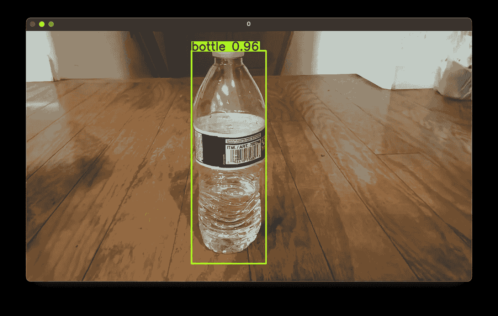

被检测物体周围的边界框示例。图片来源：作者。

YOLOv8 兼容的数据集有特定的结构。它们主要分为**valid**、**train**和**test**文件夹，分别用于模型的**验证**、**训练**和**测试**（*验证*和*测试*的区别在于，验证过程中使用结果来调整模型以提高其准确性，而测试过程中，结果仅用于提供模型在现实世界中的准确性度量）。

在这些文件夹中，数据集进一步分为两个文件夹：`images`和`labels`文件夹。这两个文件夹的内容是紧密相关的。

`images`文件夹顾名思义，包含数据集中的所有物体图像。这些图像通常具有正方形的长宽比、较低的分辨率和较小的文件大小。

`labels`文件夹包含每个图像中边界框的位置和大小数据，以及每个图像表示的物体类型（或类别）。例如：

```py
5 0.8762019230769231 0.09615384615384616 0.24519230769230768 0.18990384615384615
11 0.8846153846153846 0.2800480769230769 0.057692307692307696 0.019230769230769232
11 0.796875 0.2668269230769231 0.04807692307692308 0.02403846153846154
17 0.5649038461538461 0.29927884615384615 0.07211538461538461 0.026442307692307692
8 0.48197115384615385 0.39663461538461536 0.06490384615384616 0.019230769230769232
11 0.47716346153846156 0.7884615384615384 0.07932692307692307 0.10576923076923077
11 0.3425480769230769 0.5745192307692307 0.11057692307692307 0.038461538461538464
6 0.43509615384615385 0.5216346153846154 0.019230769230769232 0.004807692307692308
17 0.4855769230769231 0.5264423076923077 0.019230769230769232 0.004807692307692308
2 0.26322115384615385 0.3713942307692308 0.02403846153846154 0.007211538461538462
```

每一行代表图像中存在的一个独立物体。在每一行中，第一个数字表示物体的**类别**，第二和第三个数字表示**边界框中心的 x 和 y 坐标**，第四和第五个数字表示**边界框的宽度和高度**。

`images`和`labels`文件夹中的数据通过文件名相互关联。`images`文件夹中的每张图像都有一个在`labels`文件夹中对应的文件，文件名相同，扩展名不同。数据集中，`images`和`labels`文件夹中总是有成对的文件，**它们的文件名相同，但扩展名不同；** `.jpg`用于图像，`.txt`用于标签。每个`.jpg`图片中物体的边界框数据包含在相应的`.txt`文件中。

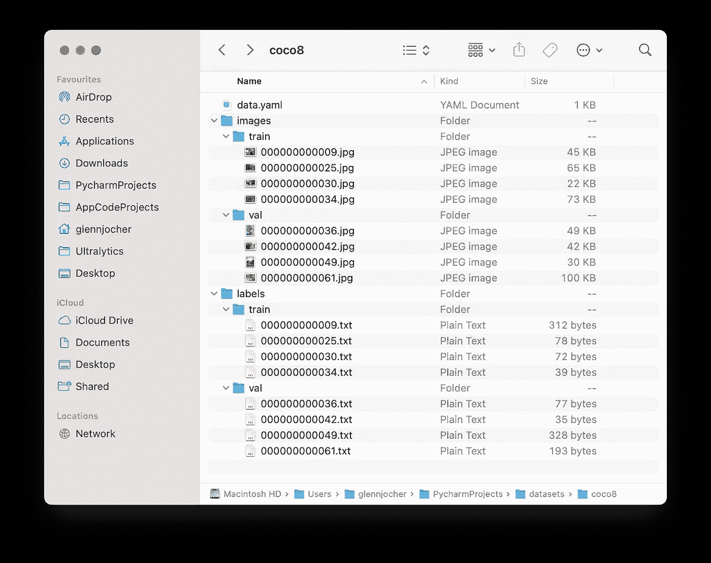

YOLOv8 兼容数据集的典型文件结构。来源：Ultralytics YOLO 文档（[`docs.ultralytics.com/datasets/detect/#ultralytics-yolo-format`](https://docs.ultralytics.com/datasets/detect/#ultralytics-yolo-format)）

有几种方法可以获取 YOLOv8 兼容的数据集来开始训练模型。你可以**创建自己的数据集**或**使用互联网中的预配置数据集**。为了本教程的目的，我们将使用[**CVAT**](https://www.cvat.ai)来创建自己的数据集，并使用[**Kaggle**](https://www.kaggle.com)来查找一个预配置的数据集。

## CVAT

CVAT（[cvat.ai](https://www.cvat.ai)）是一款标注工具，允许你通过手动为图像和视频添加标签来创建自己的数据集。

创建账户并登录后，开始标注的过程很简单。只需创建一个**项目**，为其取一个合适的名字，并添加你希望标注的物体类型/类别的标签。

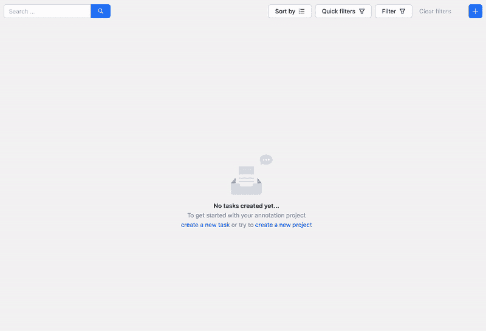

在 cvat.ai 上创建新项目和标签，视频由作者提供。

创建一个新任务并上传你希望包含在数据集中的所有图像。点击“Submit & Open”，一个新的**任务**将在项目下创建，并附带一个**工作**。

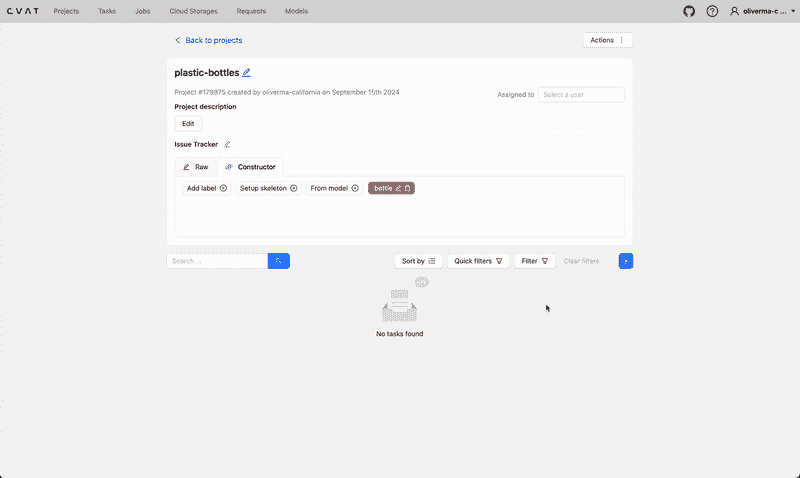

在 cvat.ai 上创建新任务和工作，视频由作者提供。

打开此任务将允许你开始标注过程。使用**矩形工具**为数据集中的每张图像创建边界框和标签。

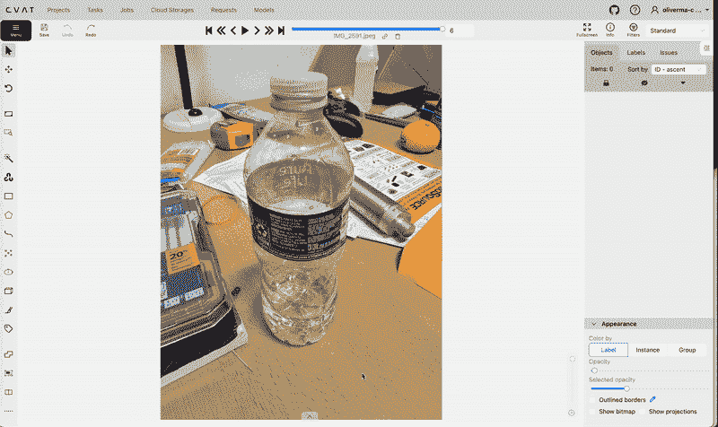

在 cvat.ai 上使用矩形工具创建边界框，视频由作者提供。

在标注完所有图像后，返回任务页面，选择“Actions” → “Export task dataset”，并选择**YOLOv8 Detection 1.0**作为导出格式。下载任务数据集后，你会发现它只包含*labels*文件夹，而没有*images*文件夹（除非在导出时选择了“保存图像”选项）。你需要手动创建*images*文件夹并将图像移动到其中（你可能想先将图像压缩到较低的分辨率，例如 640x640）。记住不要更改文件名，因为它们必须与*labels*文件夹中的.txt 文件的文件名匹配。你还需要决定如何将图像分配到`valid`、`train`和`test`文件夹中（其中`train`是最重要的）。

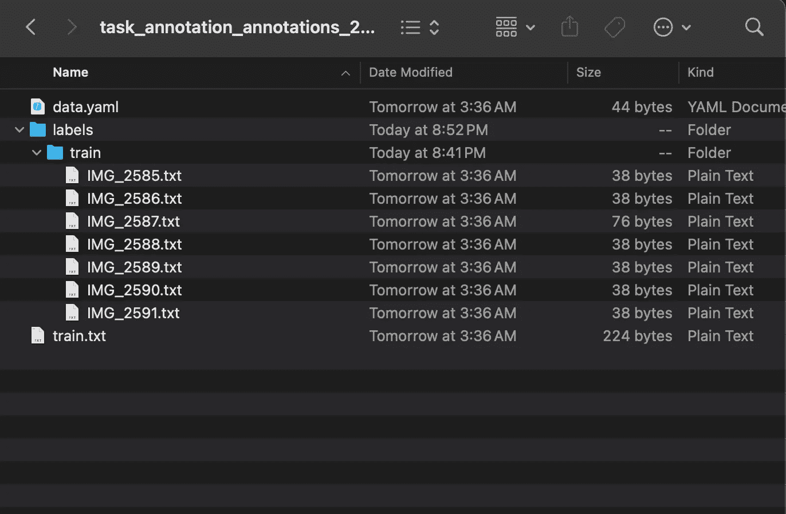

从 cvat.ai 导出的数据集示例，图片由作者提供。

你的数据集已经完成并准备好使用！

## Kaggle

Kaggle ([kaggle.com](https://kaggle.com/)) 是最大的在线数据科学社区之一，也是探索数据集的最佳网站之一。你可以通过简单地搜索他们的网站来查找所需的数据集，除非你在寻找非常具体的内容，否则很有可能会找到。然而，Kaggle 上的许多数据集并不符合 YOLOv8 兼容格式和/或与计算机视觉无关，因此你可能需要在查询中加入“YOLOv8”来优化搜索结果。

你可以通过数据集的**数据资源管理器**（页面右侧）中的文件结构判断一个数据集是否为 YOLOv8 兼容格式。

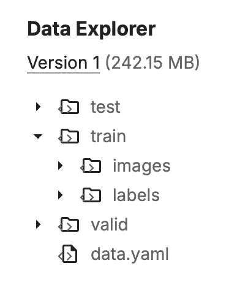

一个 YOLOv8 兼容格式的数据集示例，图片由作者提供。

如果数据集相对较小（几 MB）和/或你在本地训练，你可以直接从 Kaggle 下载数据集。然而，如果你计划在 Google Colab 上训练一个大型数据集，最好从 notebook 本身获取数据集（更多信息见下文）。

# 训练

训练过程将根据你是本地训练还是在云端训练而有所不同。

## 本地

创建一个用于存放所有训练文件的项目文件夹。本教程中我们将其命名为`yolov8-project`。将数据集移动/复制到此文件夹。

设置一个包含 YOLOv8 所需依赖项的 Python 虚拟环境：

```py
python3 -m venv venv
source venv/bin/activate
pip3 install ultralytics
```

创建一个名为`config.yaml`的文件。在这里，重要的训练数据集信息将被指定：

```py
path: /Users/oliverma/yolov8-project/dataset/ # absolute path to dataset
test: test/images # relative path to test images
train: train/images # relative path to training images
val: val/images # relative path to validation images

# classes
names:
  0: bottle
```

在`path`中，填写数据集根目录的**绝对**文件路径。你也可以使用相对文件路径，但这取决于`config.yaml`的相对位置。

在`test`、`train`和`val`中，填写用于测试、训练和验证的图像位置（如果你只有`train`图像，可以将所有三个位置都设置为`train/images`）。

在`names`下，指定每个类别的名称。这些信息通常可以在任何 YOLOv8 数据集的`data.yaml`文件中找到。

如前所述，可以使用**Python API**或**CLI**进行本地训练。

**Python API**

创建另一个名为`main.py`的文件。这将是实际训练开始的地方：

```py
from ultralytics import YOLO

model = YOLO("yolov8n.yaml")

model.train(data="config.yaml", epochs=100)
```

通过将模型初始化为`YOLO("yolov8n.yaml")`，我们实际上是从头创建一个新模型。我们使用`yolov8n`是因为它是最快的模型，但你也可以根据自己的使用情况选择其他模型。

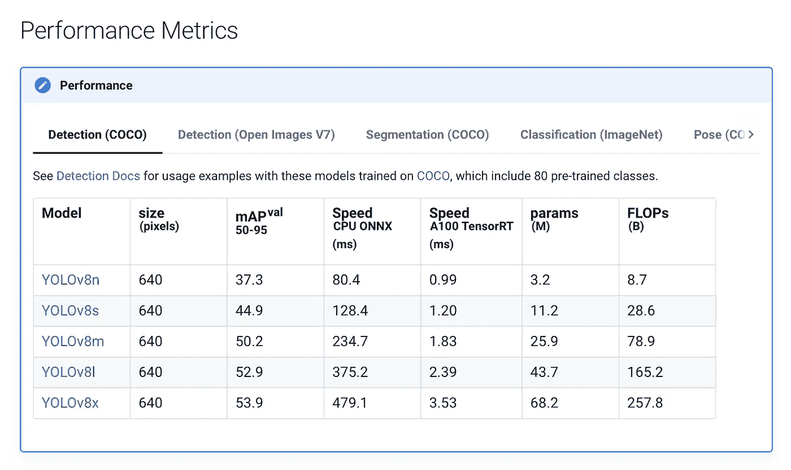

YOLOv8 变体的性能指标。来源：Ultralytics YOLO 文档（[`docs.ultralytics.com/models/yolov8/#performance-metrics`](https://docs.ultralytics.com/models/yolov8/#performance-metrics)）

最后，我们训练模型并传入配置文件和**epochs**（训练轮次）。一个好的基准是 300 个 epochs，但你可能需要根据数据集的大小和硬件的速度调整这个数字。

还有一些有用的设置你可能想要包含：

+   `imgsz`：将所有图像调整为指定的大小。例如，`imgsz=640`将所有图像调整为 640x640。这在你创建了自己的数据集并且没有调整图像大小的情况下非常有用。

+   `device`：指定要训练的设备。默认情况下，YOLOv8 尝试在 GPU 上进行训练，并使用 CPU 训练作为后备，但如果你在 M 系列 Mac 上进行训练，你必须使用`device="mps"`，以便通过 Apple 的**Metal 性能着色器（MPS）**后端进行 GPU 加速。

有关所有训练参数的更多信息，请访问 [`docs.ultralytics.com/modes/train/#train-settings`](https://docs.ultralytics.com/modes/train/#train-settings)。

你的项目目录现在应该类似于以下结构：

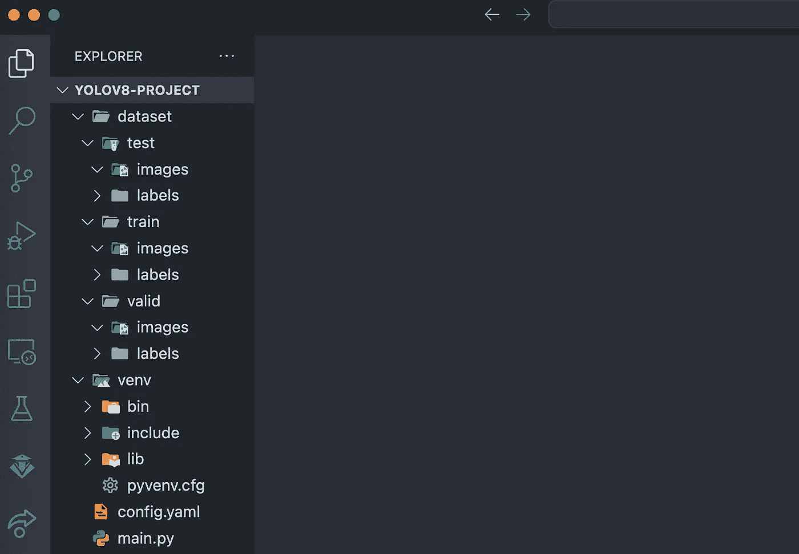

项目目录的示例文件结构。图片由作者提供。

我们终于准备好开始训练我们的模型了。在项目目录中打开一个终端并运行：

```py
python3 main.py
```

终端将显示每个 epoch 的训练进度信息。

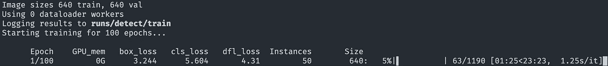

每个 epoch 的训练进度将在终端显示。图片由作者提供。

训练结果将保存在 `runs/detect/train`（或 `train2`、`train3` 等）中。包括 **权重**（扩展名为 `.pt` 的文件），这些将对稍后运行模型非常重要，以及 `results.png`，其中显示了包含相关训练统计信息的多张图表。

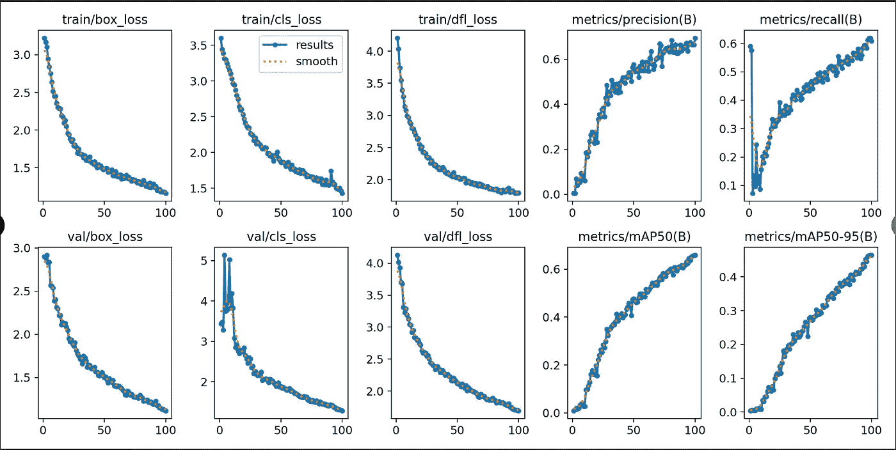

来自 results.png 的示例图表。图像由作者提供。

**CLI**

在项目目录中打开一个新的终端并运行以下命令：

```py
yolo detect train data=config.yaml model=yolov8n.yaml epochs=100
```

此命令可以根据上面列出的 Python API 中的相同参数进行修改。例如：

```py
yolo detect train data=config.yaml model=yolov8n.yaml epochs=300 imgsz=640 device=mps
```

训练将开始，进度将在终端显示。其余的训练过程与 Python CLI 中相同。

## Google Colab

访问 [`colab.research.google.com/`](https://colab.research.google.com/) 并创建一个新的训练笔记本。

在训练之前，确保通过在右上角选择 **更改运行时类型** 来连接到 GPU 运行时。在 CPU 运行时上，训练将非常缓慢。

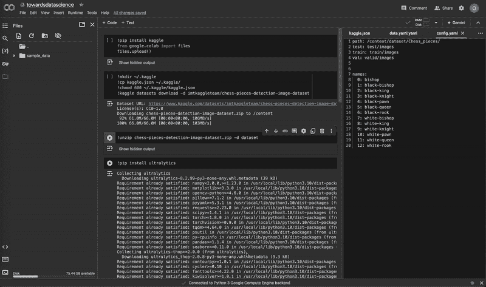

将笔记本运行时从 CPU 更改为 T4 GPU。视频由作者提供。

在我们可以开始在 Google Colab 上训练之前，我们首先需要将数据集导入到笔记本中。直观上，最简单的方法是将数据集上传到 Google Drive，然后从那里导入到我们的笔记本中。然而，上传任何大于几 MB 的数据集都需要极长的时间。解决办法是将数据集上传到一个远程文件托管服务（如 Amazon S3 或甚至 Kaggle），然后直接从那里将数据集拉入我们的 Colab 笔记本。

**从 Kaggle 导入**

以下是如何直接将 Kaggle 数据集导入 Colab 笔记本的说明：

在 Kaggle 账户设置中，向下滚动至 **API** 并选择 **创建新令牌**。这将下载一个名为 `kaggle.json` 的文件。

在笔记本单元格中运行以下命令：

```py
!pip install kaggle
from google.colab import files
files.upload()
```

上传刚刚下载的 `kaggle.json` 文件，然后运行以下命令：

```py
!mkdir ~/.kaggle
!cp kaggle.json ~/.kaggle/
!chmod 600 ~/.kaggle/kaggle.json
!kaggle datasets download -d [DATASET] # replace [DATASET] with the desired dataset ref
```

数据集将作为 zip 压缩包下载。使用 `unzip` 命令解压内容：

```py
!unzip dataset.zip -d dataset
```

**开始训练**

在笔记本的文件浏览器中创建一个新的 `config.yaml` 文件，并按照之前的描述进行配置。Colab 笔记本中的默认工作目录是 `/content/`，因此数据集的绝对路径将是 `/content/[dataset folder]`。例如：

```py
path: /content/dataset/ # absolute path to dataset
test: test/images # relative path to test images
train: train/images # relative path to training images
val: val/images # relative path to validation images

# classes
names:
  0: bottle
```

确保检查数据集的文件结构，确保 `config.yaml` 中指定的路径是准确的。有时数据集会嵌套在多个文件夹层级中。

将以下命令作为单元格运行：

```py
!pip install ultralytics
```

```py
import os

from ultralytics import YOLOmodel = YOLO("yolov8n.yaml")

results = model.train(data="config.yaml", epochs=100)
```

前面提到的用于修改本地训练设置的参数同样适用于此处。

与本地训练类似，结果、权重和图表将保存在 `runs/detect/train` 中。

# 运行中

无论是在本地还是在云端进行训练，**预测**必须在本地运行。

模型训练完成后，`runs/detect/train/weights` 文件夹中会有两个权重文件，分别名为 `best.pt` 和 `last.pt`，它们是最佳周期和最新周期的权重文件。对于本教程，我们将使用 `best.pt` 来运行模型。

如果你在本地训练，移动 `best.pt` 到一个方便的位置（例如我们的项目文件夹 `yolov8-project`）以便运行预测。如果你在云端训练，将 `best.pt` 下载到你的设备上。在 Google Colab 上，右击文件浏览器中的文件并选择 **下载**。

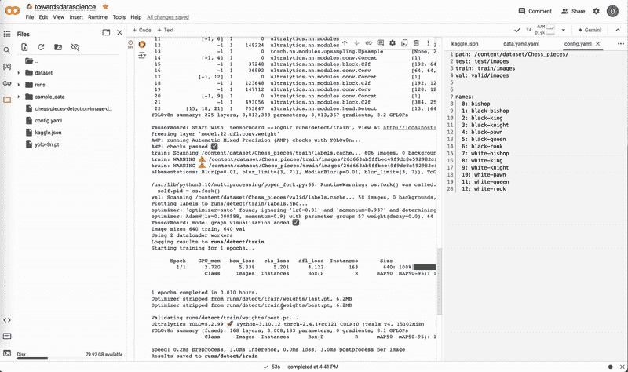

在 Google Colab 上下载权重。视频由作者提供。

与本地训练类似，预测可以通过**Python API** 或 **CLI** 运行。

## Python API

在 `best.pt` 所在的同一位置，创建一个名为 `predict.py` 的新文件：

```py
from ultralytics import YOLO

model = YOLO("best.pt")

results = model(source=0, show=True, conf=0.25, save=True)
```

与训练类似，有许多有用的参数可以修改预测设置：

+   `source`: 控制预测的输入源。`source=0` 设置摄像头为输入源。更多信息见下文。

+   `show`: 如果为 `True`，则在屏幕上显示预测、边界框和置信度。

+   `conf`: 用于判断预测是否被接受的最小置信度阈值。

+   `save`: 如果为 `True`，将预测结果保存到 `runs/detect/predict`（或 `predict2`、`predict3` 等）文件夹中。

+   `device`: 如前所述，在 M 系列 Mac 上使用 `device="mps"`。

要查看完整的预测参数列表，请访问 [`docs.ultralytics.com/modes/predict/#inference-arguments`](https://docs.ultralytics.com/modes/predict/#inference-arguments)。

## CLI

运行以下命令以启动模型：

```py
python3 predict.py
```

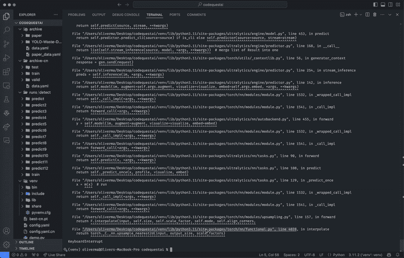

通过实时摄像头视频流运行 YOLOv8 模型预测。视频由作者提供。

## CLI

```py
yolo detect predict model=best.pt source=0 show=True conf=0.25 save=True
```

这些参数与 Python API 中的参数相同。

## 实现

我们现在已经成功地在实时摄像头视频流上运行了我们的模型，但这又意味着什么呢？我们如何实际使用这个模型并将其集成到项目中？

让我们从**输入**和**输出**的角度来思考它。为了使这个模型在外部应用中对我们有用，它必须能够接受有用的输入并产生有用的输出。幸运的是，YOLOv8 模型的灵活性使得它可以被集成到多种应用场景中。

我们使用 `source=0` 将摄像头设置为我们的预测输入源。然而，YOLOv8 模型可以使用比这更多的输入源。以下是几个示例：

```py
results = model(source="path/to/image.jpg", show=True, conf=0.25, save=True) # static image
results = model(source="screen", show=True, conf=0.25, save=True) # screenshot of current screen
results = model(source="https://ultralytics.com/images/bus.jpg", show=True, conf=0.25, save=True) # image or video URL
results = model(source="path/to/file.csv", show=True, conf=0.25, save=True) # CSV file
results = model(source="path/to/video.mp4", show=True, conf=0.25, save=True) # video file
results = model(source="path/to/dir", show=True, conf=0.25, save=True) # all images and videos within directory
results = model(source="path/to/dir/**/*.jpg", show=True, conf=0.25, save=True) # glob expression
results = model(source="https://www.youtube.com/watch?v=dQw4w9WgXcQ", show=True, conf=0.25, save=True) # YouTube video URL
```

要查看完整的预测源和输入选项列表，请访问 [`docs.ultralytics.com/modes/predict/#inference-sources`](https://docs.ultralytics.com/modes/predict/#inference-sources)。

每当我们运行预测时，YOLOv8 会返回大量有价值的数据，这些数据以 `Results` 对象列表的形式呈现，包含关于**边界框、分割掩码、关键点、类别概率和定向边界框（OBB）**的信息。

由于我们在代码中将预测结果分配给了`results`变量，我们可以使用它来获取有关预测的信息：

```py
from ultralytics import YOLO

model = YOLO("best.pt")

results = model(source="bottles.jpg", show=True, conf=0.25, save=True)

print("Bounding boxes of all detected objects in xyxy format:")
for r in results:
  print(r.boxes.xyxy)

print("Confidence values of all detected objects:")
for r in results:
  print(r.boxes.conf)

print("Class values of all detected objects:")
for r in results:
  print(r.boxes.cls)
```

由于输出结果的类型繁多，无法在本教程中全部涵盖，但你可以通过访问[`docs.ultralytics.com/modes/predict/#working-with-results`](https://docs.ultralytics.com/modes/predict/#working-with-results)了解更多内容。

这只是你可以使用 YOLOv8 模型输出的一个非常基础的示例，实际上有无数种方法可以将模型应用到你自己的项目中。

# 结论

恭喜你坚持到最后！

在本文中，我们能够从零开始，制作自己的 YOLOv8 兼容数据集，从 Kaggle 导入数据集，使用包括 Python API、CLI 和 Google Colab 在内的多个环境训练模型，运行本地模型，并探索许多输入/输出方法，使我们能够在自己的项目中利用 YOLOv8 模型。

请记住，本教程的目的是作为 YOLOv8 或计算机视觉的入门点或介绍。我们只是略微触及了 YOLOv8 模型的复杂性，随着你对 YOLOv8 和计算机视觉的进一步了解，深入探索这一主题绝对是明智之举。互联网上有大量的文章，Medium 上也有很多内容，专门为此目的而写。

话虽如此，如果你跟随本教程并完成了最后的部分，这仍然是一个伟大的成就。我希望这篇文章能帮助你对机器学习、计算机视觉以及 YOLOv8 模型有一个基本的理解。也许你已经对这个主题产生了兴趣，并将在未来继续学习更深入的内容，挑战更高阶的课题。

感谢阅读，祝你度过愉快的一天！
