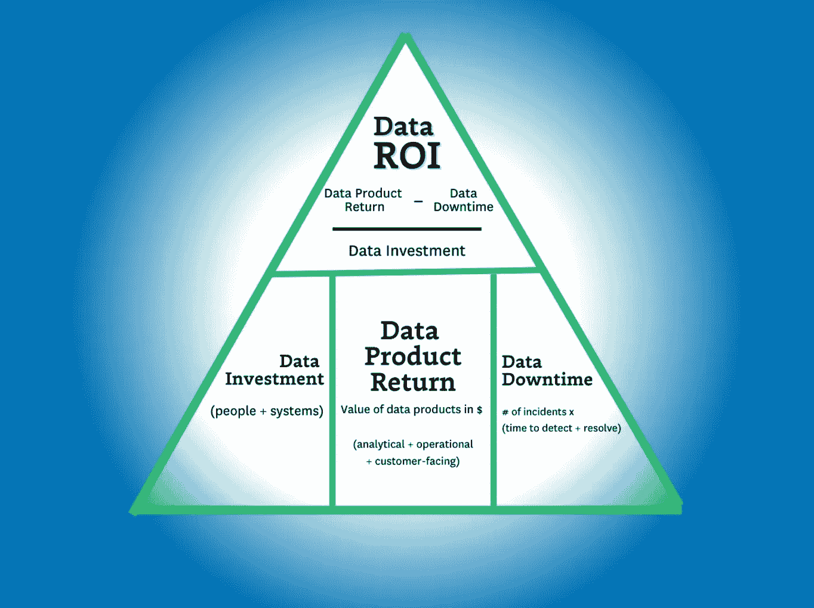
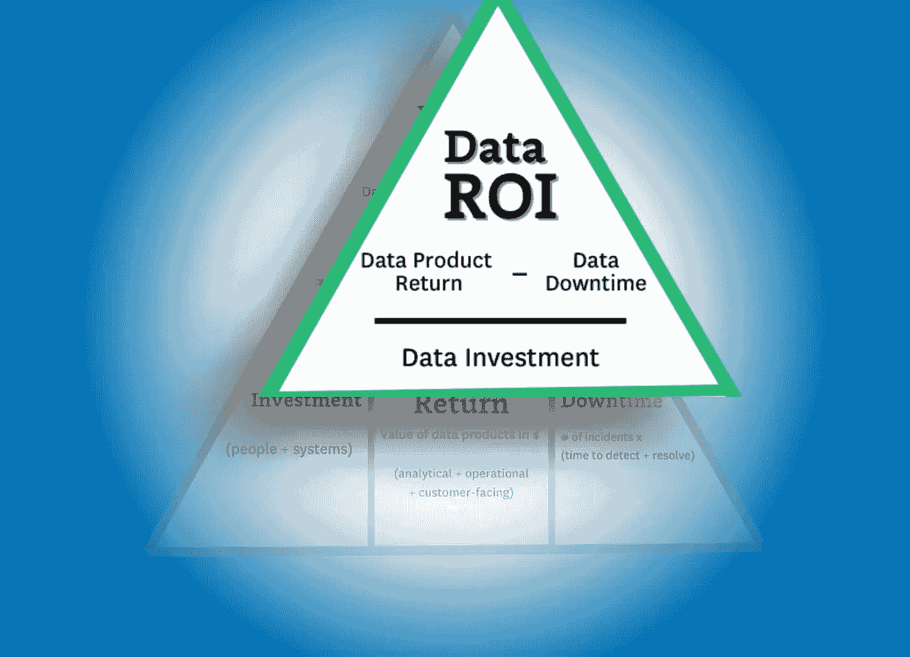
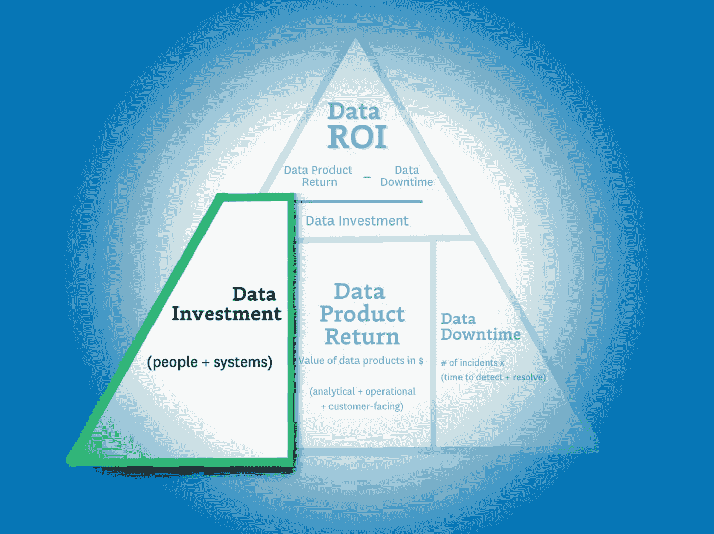
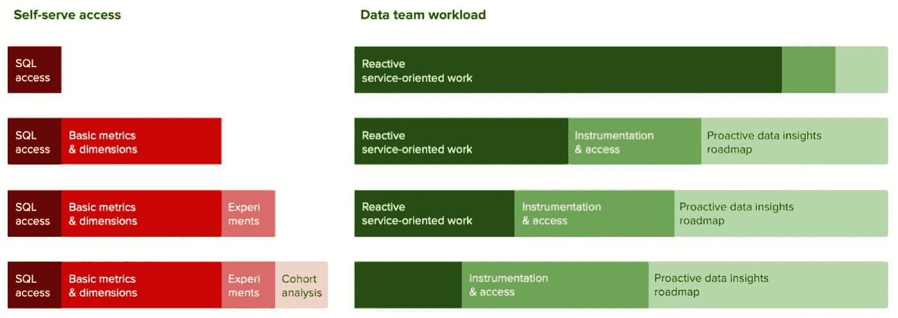
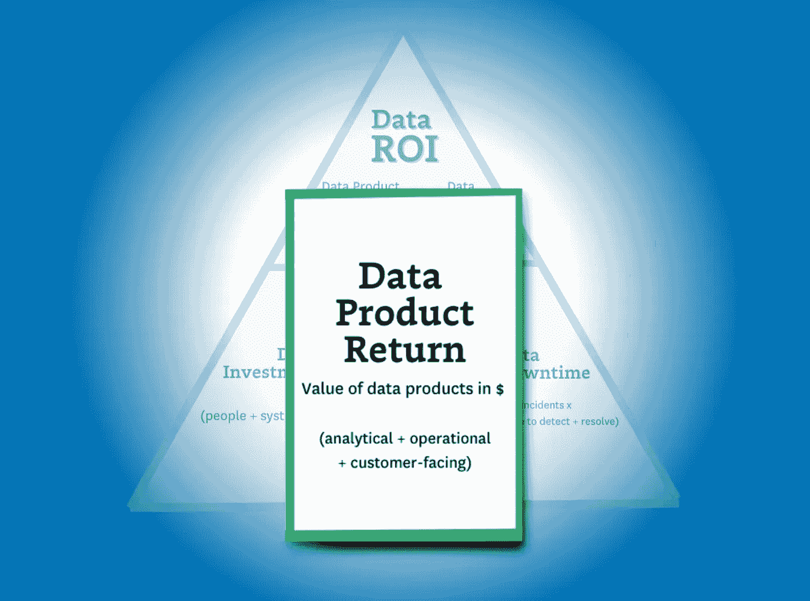
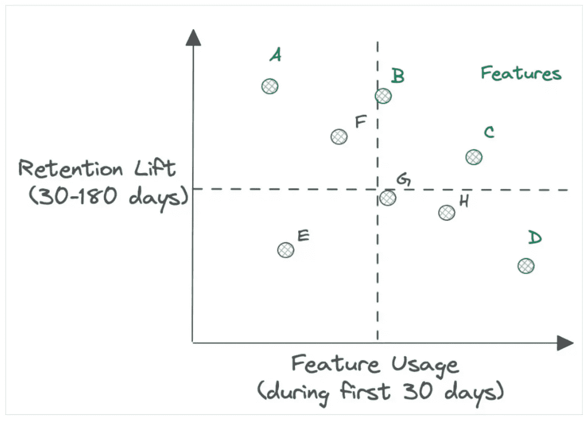
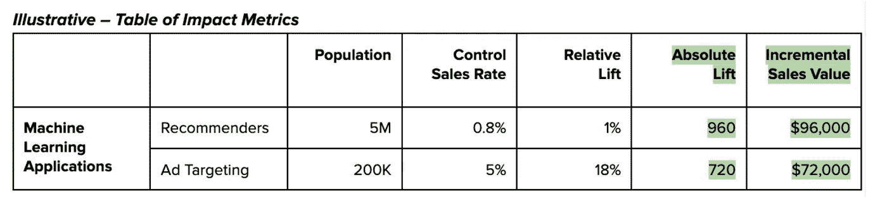
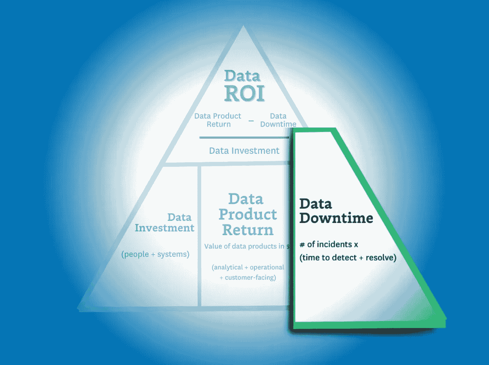
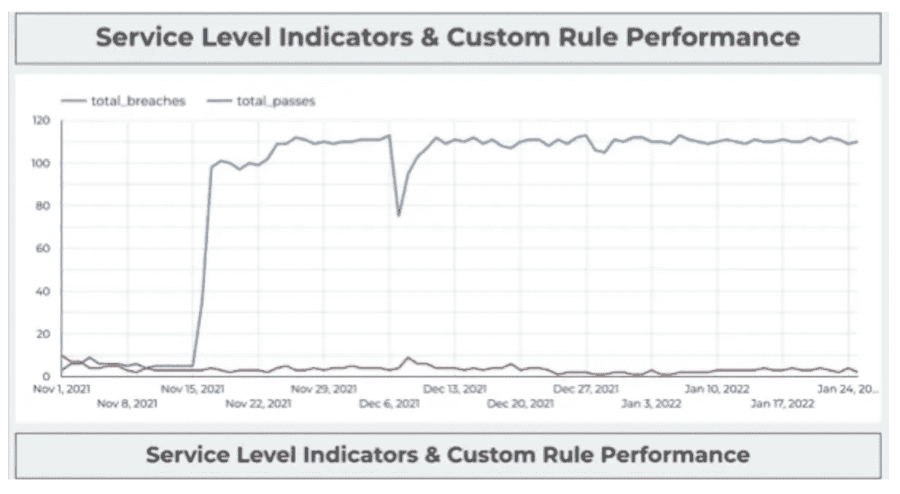

# 数据投资回报率金字塔：衡量和最大化数据团队价值的方法

> 原文：[`towardsdatascience.com/the-data-roi-pyramid-a-method-for-measuring-maximizing-your-data-team-cab470b98cf6?source=collection_archive---------4-----------------------#2024-02-02`](https://towardsdatascience.com/the-data-roi-pyramid-a-method-for-measuring-maximizing-your-data-team-cab470b98cf6?source=collection_archive---------4-----------------------#2024-02-02)

## 难以清晰表达你数据团队的价值？了解如何使用数据投资回报率金字塔计算你数据团队的回报。

 [Barr Moses](https://barrmoses.medium.com/?source=post_page---byline--cab470b98cf6--------------------------------)

·发表于 [Towards Data Science](https://towardsdatascience.com/?source=post_page---byline--cab470b98cf6--------------------------------) ·阅读时间 12 分钟·2024 年 2 月 2 日

--

图片来源：作者

直到一年前，我与约一半的数据领导者交谈时，他们认为自己团队的业务价值几乎是自明的。而今天，最大化和衡量数据团队的投资回报率已成为每位数据领导者议程的重点之一。

大多数数据团队的投资回报率公式都专注于以下某个版本的计算：

**提升 / 投资 = 投资回报率（ROI）。**

尽管其简洁性无疑具有价值，但它并没有完全捕捉到**数据团队的全部价值**。例如，如何衡量以下几点的价值：

+   客户流失率仪表板

+   支持即席查询用户参与行为的数据集

+   迁移到一个支持更快速、更可扩展计算的新数据架构

+   由于数据质量改进措施，数据采纳率提高了 30%

这并不容易！那些成功将客户获取漏斗这一复杂的领域转变为可预测科学的资深数据行业专家，在向内审视时，往往会感到不安。

在过去的六个月里，我与数据领域的领导者进行了交流，并反复探讨了各种投资回报率公式，所有这些努力都是为了达成一个目标：即使无法完全捕捉到数据团队的*确切*价值，至少能够更接近这个目标。

而这些讨论的结果就是一个全新的数据 ROI 金字塔。是的，我知道之前有很多[伟大的金字塔](https://parksandrecreation.fandom.com/wiki/Ron_Swanson%27s_Pyramid_of_Greatness)和[联结三角形](https://www.bustle.com/articles/157415-are-the-conjoined-triangles-of-success-real-silicon-valley-mocks-a-famous-business-model)，但这个不同，算是不同吧。

这个金字塔的目标明确地帮助数据领导者：

+   更接近业务

+   平衡相互竞争的优先事项

+   并专注于正确的指标，为其利益相关者创造价值。

所以，前言已经结束，让我们从头开始！

# 计算数据 ROI

图片由作者提供。

一般来说，组织中职位越高，你的指标就会越少且越全面。CEO 并不关心你支持多少个仪表盘，或者你的数据新鲜度 SLA 遵守百分比。

他们想知道他们的投资者想知道的：**“我有没有从我的投资中获得回报？”**

数据 ROI 金字塔通过与引言中类似的公式来解决这个问题：

**（数据产品价值 — 数据停机时间）/ 数据投资** **= ROI**

……但有两个关键区别。第一个是“数据产品收入”的定义更广泛（稍后会详细介绍），第二个是引入了数据停机时间。

停机时间变量很重要，因为随着更多数据团队通过机器学习模型、面向客户的应用程序、数据民主化和其他举措推动更高的收入水平，停机时间的后果在时间、收入和信任方面变得更加严重。

这也使得减少数据停机时间成为数据领导者提高 ROI 的三大战略之一：你可以增加收入，可以减少投资，或者可以减少数据停机时间。而其中一个策略比其他的更容易实现。

所以，现在我们已经有了计算 ROI 的框架，让我们深入探讨如何识别这些变量。

# 计算数据投资

图片由作者提供。

公式很简单 —— 投资 = 人员 + 解决方案。

但也很容易过于复杂化。

一些合同是年度的，其他的则不是。有些解决方案按使用收费，其他的则不收费。我在这里的建议是保持这个部分相对简单。坚持对成本进行总体预测，并均匀分配到一段时间内（通常是一个月或一个季度）。

# 优化数据投资的杠杆

在优化数据投资时，关键是*效率*。为了最大化数据投资的价值，你需要提高这些投资带来价值的速度。

以下是你可以利用的三种杠杆，来提高你数据系统、数据团队和数据消费者的效率。

+   **系统优化** — 几乎所有现代数据解决方案的成本都基于使用量。你需要关注的指标是驱动这些成本的项目总数（如表格、查询、虚拟机、数据仓库等），以及顶部的异常值（高成本查询）或底部的异常值（未使用的表格）。理解和控制系统成本的几种方法可能包括**为领域分配所有权、清理未使用的资产和高成本查询，**甚至是**围绕中央工具整合数据堆栈**。

+   **构建和维护时间** — 构建和维护关键数据资产（包括数据产品和机器学习能力）所需的时间是衡量数据团队生产力的一个关键杠杆。尽管开发一个有效的数据平台可能需要较大的前期投入，但简化数据管道的构建和维护工作流，可以显著提高数据团队的效率。

+   **洞察（或行动）时间** — 这个杠杆关注的是数据消费者实现价值所需的时间。换句话说，数据团队在多大程度上有效地帮助了数据消费者？可发现性和自助服务可以改善消费者的洞察时间，而微批处理基础设施则可以以最低的延迟使数据可用于机器学习、分析和报告。

花费时间来支持数据自助服务通常是值得的，但其回报必须大于构建和维护所投入的努力。图片由[Shane Murray](https://www.montecarlodata.com/blog-product-experimentation/)提供。

# 计算数据产品回报

图片来源：作者。

计算数据产品回报是我们 ROI 计算中最复杂的步骤。因为随着数据行业的不断发展，数据产品使用案例的多样性和复杂性也在不断进步。

幸运的是，数据产品通常可以分为三大类：分析数据产品、操作数据产品和面向客户的数据产品。这些产品可以以仪表板、机器学习模型、利用数据洞察的实验形式存在，当然还有——生成式人工智能。虽然后者可能在构建上稍显复杂，但生成式人工智能本质上仍然是数据产品，并且它的价值仍然可以通过我们将在下面概述的方法来计算。

要真正回答这个问题，数据产品回报的公式需要包含**所有**数据团队的活动，无论它们是直接创造价值（例如通过付费墙机器学习模型产生的收入），还是间接创造价值（例如客户流失仪表板）。

我建议用来计算数据产品回报的公式是：

**分析数据产品 + 操作数据产品 + 面向客户的数据产品 = 数据产品回报**

如你所见，这部分的方程式为我们的 ROI 计算带来了最多的变量。由于这一部分是迄今为止最复杂的，我们将在这里花费大部分时间。因此，考虑到这一点，我们将更加详细地查看每个子类别（或使用案例）。

## 分析数据产品

首先，让我们深入探讨最传统——也是最常见——的数据使用案例：分析。

分析数据产品是由你的数据团队支持和执行的关键仪表板、机器学习模型和实验的组合，用于为决策提供洞察。

无论我们谈论的是营销仪表板还是像客户生命周期价值（LTV）这样的关键指标，分析数据产品在任何业务的日常运作中都扮演着基础性角色。但就像所有数据产品并非一视同仁一样，你计算它们的价值方式也不会相同。当然，有些计算起来会比其他的容易。

首先，让我们看看实验：

**衡量增量影响**

衡量绝对影响是理解任何数据产品回报的最简单方式之一。通过理解测试与对照组之间的差异，并将这些数字转化为每月赚取/节省的美元，你可以快速估算由数据团队的研究和分析洞察所进行的实验的价值。

对于更保守的方法，你可以通过计算一个随机或平均决策的回报来估算价值，以更好地代表没有数据团队支持下所做的决策。

每年结合数十个或数百个这样的实验，将为你提供一个大致的数字，来衡量实验平台所带来的增量价值以及围绕这些实验的分析工作。

**衡量对利益相关者的价值**

那么仪表板呢？这些项目很少能通过控制实验或自然实验来轻松衡量。

为了考虑这些数据产品，我们需要采取更为细致的方法来估算价值。在这种情况下，我们将通过与消费者本身接触，将定性数据转化为有代表性的东西。

不管你信不信，你的业务用户和数据消费者实际上对你的仪表板对他们的价值（或不价值）有着相当的了解。而他们的反馈是可以量化的。虽然乍一看，这似乎并不够严谨，但这实际上与[麻省理工学院经济学家所使用的方法](https://news.mit.edu/2019/online-tools-facebook-count-toward-gdp-0326)类似，用来确定免费的服务如何为国家 GDP 贡献价值。例如，他们问受访者，如果一年内不使用 Facebook 或 Google Maps，愿意接受多少报酬。（如果你感兴趣的话，Facebook 的月费用大概是 40 到 50 美元。）

对于最重要的仪表板，数据团队可以进一步通过为响应者创建基准来进行衡量，例如：“我们估计上个季度维护此仪表板的成本约为$5,000。您认为在那段时间内，它为您的工作增加了相同的价值吗？”作为基准，以下是我们对[200 名数据专业人员的调查](https://resources.montecarlodata.com/ebooks/survey-the-state-of?lx=LPgDLW&_ga=2.241244226.1959217176.1687357614-281318478.1687357614&__hstc=100283906.219fdde827c76a2f0cbc0d86979fce46.1699371251532.1706637990490.1706643706988.228&__hssc=100283906.1.1706643706988&__hsfp=589919331)结果，显示他们认为数据消费者会如何评估他们的仪表板：

+   少于$500k: 5%

+   500k-1m: 11%

+   1m-10m: 49%

+   10m-25m: 32%

+   25m+: 5%

## 面向客户的提升

在这里，我指的是特别针对客户的面对面数据，而不是由数据驱动的机器学习模型。这种数据用例通常有两种形式。

第一个情况是数据本身就是产品。许多企业会摄取、转换并出售数据给其他公司。例如，一家数据挖掘公司通过抓取电商网站获取见解，或一家电视制造商将收视数据出售给广告商。

在这种情况下，计算非常直接：数据产品的收入就是销售收入。当你找到丰富数据的方法时，你使其变得更有价值，从而提高销售价格。

那么，数据仅仅是所提供产品的一部分时该如何处理呢？例如，一个销售点系统提供有关商户人流模式的见解？或者一个视频播放器根据时间细分观众群体的观看情况？

在某些情况下，数据可能只是锦上添花。在其他情况下，它可能是客户获取和保持的一个重要因素。幸运的是，数据团队已经开始实验并衡量功能对客户保持的影响一段时间了。

图片来自[Shane Murray.](https://www.montecarlodata.com/blog-product-experimentation/)

## 操作性提升

我将操作数据用例定义为必须发生的活动。例如，向董事会报告或航空公司为延误航班的乘客重新安排座位等。

如果数据系统出现故障，这些活动仍然会发生，但会变得更加痛苦。组织可能需要手动收集并汇总来自整个业务的数据进行报告，或者乘客可能需要去客户服务台，而不是通过应用程序自动展示他们的重新安排行程选项。

在这些情况下，价值通常最好通过自动化和痛苦过程之间节省的时间来确定。在某些情况下，诸如避免罚款或降低客户满意度等替代影响也可以进行计算。

图片由[Shane Murray 提供](https://www.linkedin.com/in/shanemurray5/)。

# 最大化数据产品回报的杠杆

你可以通过提高数据产品的有效性和其影响范围来优化数据产品的价值。一些可以在广泛的使用场景和行业中衡量的宽泛指标包括采用率、覆盖面和速度。

+   **采用率和覆盖面**——数据产品的使用越多，它能提供的价值就越大。因此，推动更好的覆盖面和采用率也能显著增加你的数据产品所能提供的增量价值。

+   **速度**——实验价值的最大驱动因素之一是速度：组织在一段时间内能执行多少有意义的实验？更高的速度意味着提高生产力、更成熟的中央平台，甚至是更好的数据消费者支持。

# 计算数据停机时间

图片由作者提供。

最后，我们需要了解数据停机时间如何影响 ROI。

在其他文章中，我们讨论了如何使用事件和响应时间来计算数据停机时间。以下是该公式的样子：

***事件数量 x （检测平均时间 + 解决平均时间）***

这对于衡量你整体数据产品可靠性的趋势是有帮助的。但在这种情况下，我们暂时不关心整体数据停机时间或团队的效率（尚且不考虑）。

我们在这里想要找出的，是特定数据产品的数据停机时间的运营成本。为此，你需要数据血缘关系，以便理解上游表格的数据问题如何影响各种下游数据产品。

既然我们已经计算出每个数据产品（包括关键仪表板）所产生的收入，我们现在可以从收入中扣除这些停机时间的运营成本。

对于这个 ROI 计算的组成部分，我建议只关注违反数据服务水平协议（SLA）的停机时间。如果一个每天检查的仪表板出现数据新鲜度问题，并且该问题在几小时内就得到解决，那么这种停机时间不太可能对组织产生运营影响（你的数据团队也不应因此受到惩罚）。

# 减少数据停机时间的杠杆

数据停机时间的改善可能对你数据团队的 ROI 计算产生巨大影响，尤其是在数据对产品提供至关重要的用例中，数据停机时间等同于运营停机时间。

Red Ventures 定制构建的 SLA 遵守仪表板。图片由[Red Ventures 的 Red Digital 提供](https://www.montecarlodata.com/blog-one-sla-at-a-time-our-data-quality-journey-at-red-digital/)。

我们已经讨论了 CEO 关心的指标以及数据领导者应考虑的战略指标。现在让我们来谈谈你的团队可以采取哪些战术杠杆，以在这些战略指标上最大化你的成果。

## SLA 遵守情况

SLA 遵守率（SLA 被违反的时间与 SLA 被遵守的时间的比例）可以帮助数据团队维持对特定数据资产受到的不良影响及其数据质量事件的详细了解——并采取措施保护这些产品的价值。

## 覆盖率%

最小化数据停机时间往往可以与数据产品从原始数据摄取到最终结果表的监控和自定义测试覆盖程度直接相关。数据管道和系统之间的依赖性极强。更高的覆盖率通常意味着更短的检测和解决时间。

## 状态更新%

那些在记录事件历史方面做得最好的团队几乎总是拥有最低的停机时间。高状态更新比例有助于缩短解决时间，甚至通过提供更好的数据健康状况洞察来预防事件的发生。

如果你的数据团队有较低的状态更新比例，那要么是因为警报疲劳，要么是因为你的团队无法迅速处理事件。

# 计算数据 ROI 很难——但这是值得的

虽然我并不认为计算数据产品的投资回报率（ROI）是一门精确的科学或快速的成功之道，但我坚信这是一个值得追求的努力——也许最重要的是，这是一个可以实现的目标。

我也相信，对于数据领导者来说，很少有比这更关乎生死存亡的活动了。

通过更好地量化和优化数据团队的价值，我们可以更好地赢得同事们的信任，并获得他们对我们为业务增值的认可。到那时，对于那些有动力、领导得当的数据团队来说，天空才是极限。
