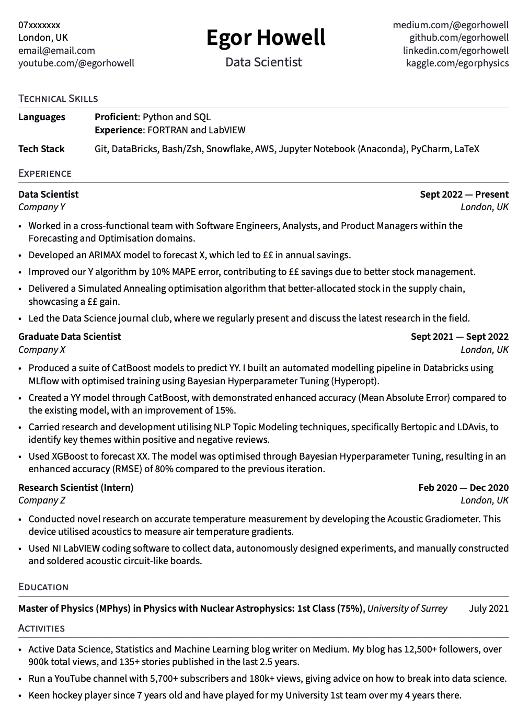

# 那份让我获得工作和面试机会的数据科学简历

> 原文：[`towardsdatascience.com/the-data-science-resume-that-got-me-jobs-interviews-9039505b9a15?source=collection_archive---------0-----------------------#2024-06-23`](https://towardsdatascience.com/the-data-science-resume-that-got-me-jobs-interviews-9039505b9a15?source=collection_archive---------0-----------------------#2024-06-23)

## 数据科学简历的结构解析

 [Egor Howell](https://medium.com/@egorhowell?source=post_page---byline--9039505b9a15--------------------------------)

·发布于 [Towards Data Science](https://towardsdatascience.com/?source=post_page---byline--9039505b9a15--------------------------------) ·阅读时长 8 分钟·2024 年 6 月 23 日

--

照片来源：[Resume Genius](https://unsplash.com/@resumegenius?utm_source=medium&utm_medium=referral) 于 [Unsplash](https://unsplash.com/?utm_source=medium&utm_medium=referral)

在这篇文章中，我将带你走过我那份成功获得多个数据科学面试和工作机会的简历，并分享一些我最重要的建议！

# 简历一览

如果你没有时间阅读整篇文章，以下是我的简历/CV 的完整内容。

我的简历/CV，作者提供。

出于隐私原因，我已经对某些部分进行了匿名处理，但这真的是我在申请数据科学职位时所使用的简历结构和语言。

如果你想获得这个 PDF 模板，请查看下面的链接！
