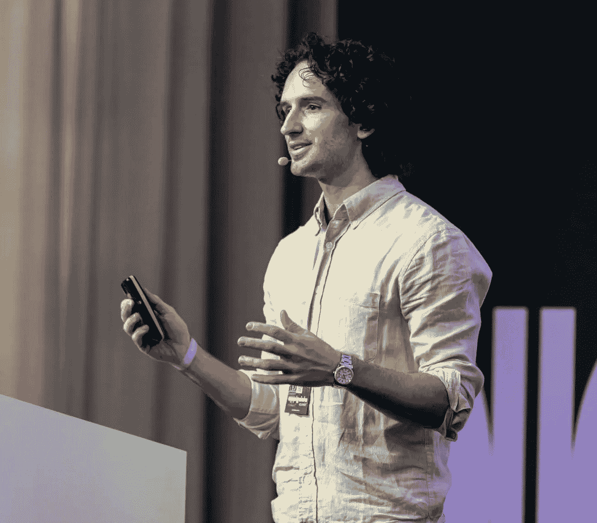
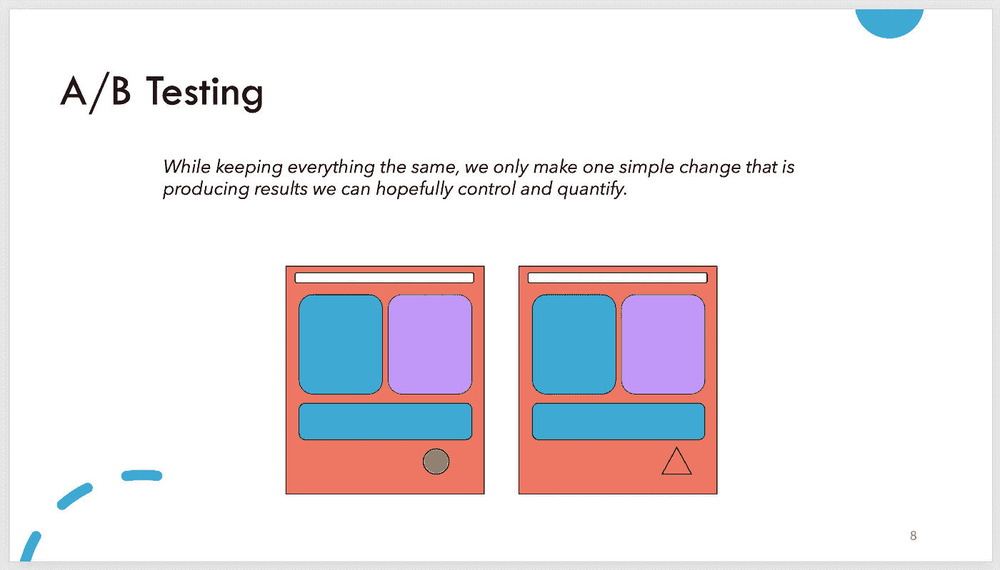

# 数据演讲者的蓝图：将分析转化为掌声

> 原文：[`towardsdatascience.com/the-data-speakers-blueprint-turning-analytics-into-applause-96fb12a0ef39?source=collection_archive---------5-----------------------#2024-01-21`](https://towardsdatascience.com/the-data-speakers-blueprint-turning-analytics-into-applause-96fb12a0ef39?source=collection_archive---------5-----------------------#2024-01-21)

## 我作为数据科学领域的公众演讲者的经验与学习。

 [Alessandro Romano](https://alerom90.medium.com/?source=post_page---byline--96fb12a0ef39--------------------------------)

·发布于[Towards Data Science](https://towardsdatascience.com/?source=post_page---byline--96fb12a0ef39--------------------------------) ·7 分钟阅读·2024 年 1 月 21 日

--

我在 2023 年柏林的 Applydata Summit 大会上

在我的数据科学家生涯中，我参加了许多会议和聚会。当我刚开始工作时，很多人还在为理解什么是数据科学以及如何利用不断发展的云计算解决方案而苦恼。**那时总感觉像是在丛林中求生！**

这就是为什么通过聚会和其他本地活动与数据社区建立联系变得对我至关重要。在某个时刻，有人邀请我展示我正在做的一个项目。那时我才意识到，我是多么喜欢分享和解释我的工作！

从那时起，我有幸在多个会议上发言，包括[ODSC](https://odsc.com/california/)、[PyCon](https://python.ie/pycon-2023/)和[Data Innovation Summit](https://datainnovationsummit.com/)等。每次我都会被问到：

> “你是如何为会议找到合适的故事的？”
> 
> “你在展示技术内容时，不怕犯错吗？”

这些问题，以及我收到的其他类似问题，让我意识到是时候分享这些年来我所学到的东西，并希望能够激励新的数据专家分享他们的知识。

# 为什么我们需要数据演讲者？

*数据*真的很难！公司往往不知道他们真正需要什么，这迫使数据爱好者去为一些有时根本无法解决的问题找到解决方案。**现在，想象一下，与一个面临相同挑战的人建立联系，并可能提供你一直在寻找的答案，是多么有帮助啊**。或者，或许只是找到一个你能够产生共鸣的人，可以和你一起分享并深入探讨你正在做的工作。

这正是为什么我们在这个领域需要优秀的沟通者。我仍然清楚地记得那位了不起的数据工程师在演讲中分享了他如何解决 AWS Lambda 部署问题的经历。这个问题困扰了我几个星期。

另一方面，听别人展示一个用例可以是一次启发。它是一种发现某些解决方案并理解如何应用它们的方式。此外，如果你对自己的工作充满热情，展示你的想法并开放讨论是非常愉快的。这是一个从各方听到反馈的机会。

我也坚信，在 AI 技术，如应用的大型语言模型（LLMs）取得显著进展的今天，沟通的需求愈加迫切。这对于解释我们与技术之间的复杂层次至关重要，而这些技术已经成为我们生活的一部分。

## 我没有什么可说的

由 Dall-E 生成

可惜，这种情绪我常常遇到。在我看来，它总是像这样回响：

> “我没有发言的权利，因为我没有什么可说的。”

但事实远非如此。总是有话可说，特别是当你每天都沉浸在数据的世界中时。你被挑战和故事包围，这些挑战无法通过简单的确定性解决方案来解决。对我而言，这正是做出非凡成果的完美起点！

我们有时会忽视自己工作的意义，仅仅因为它是我们日常对话的一部分。我们与老板、同事讨论它，却忘记了在我们的圈子之外，许多公司和个人仍在摸索数据和 AI 的基础知识。例如，我知道有很多人并不熟悉 ChatGPT，尽管它越来越受欢迎。把你的见解带到更广泛的圈子，你会意识到你的受众有多广泛！

最后，如果你从事数据工作，那么你本质上就是一个讲故事的人。要在这个领域工作，无法避免将复杂的背景转化为更易理解的叙述。你可能是在下意识地做这件事，但你一定是在做。

# 演讲作为产品：技巧与窍门

考虑将你的演讲打造成任何其他产品一样。它的价值至关重要；没有价值的演讲可能就不值得进行。

具体来说，向会议展示内容是一项协作努力，涉及听众、演讲者和组织者。如果你的演讲没有为这三大关键群体增值，那么回过头来重新评估它的目的会更明智。

我相信，一场引人入胜的演讲始于解决一个特定的需求。它可能是你投入了数月时间的成果，最终意识到它值得分享。无论是关于你成功的解决方案，还是你失败的经历（以及从中学到的教训），都应该来源于你的个人专业知识和勤奋努力。

在深入探讨一些制定演讲技巧之前，让我们先解决我认为的“房间里的大象”问题：

> 目标是成为数据倡导者，而非数据大师。

我观察到，世界上充斥着“导师”，但真正的专家寥寥无几。当你考虑登上讲台时，要将其视为一个分享知识的平台，而非一个目的地或巅峰成就。“导师”这个词本身并不带有负面含义，但在此语境下，我想强调我所做的区分。

## 找到主题

在决定下一个演讲的主题时，我首先会提出三个基本却至关重要的问题：

1.  **我目前正在从事什么项目？**

1.  **我在这项工作中最近面临了哪些挑战？**

1.  **分享这些信息对他人有益吗？**

这些问题是我确定理想主题的起点。接下来的步骤是研究其他人是否在讨论类似的主题，渠道可以是出版物、演讲或 Medium 文章等。这个阶段至关重要，因为它需要对当前趋势和发展有透彻的了解，从而确保我的贡献以某种独特的方式脱颖而出。

例如，几年前我写过一篇 Medium 文章。我并不是在介绍一些全新的东西；创新之处在于我如何将现有的技术结合起来，解决一个特定的挑战。这个经历随后成为我在汉堡当地 Python 社区演讲的核心内容。

## 制作你的演示文稿

图片来源：作者

我坚信“**少即是多**”的理念，尽管我对不同观点保持开放态度，但我在这个信念上相当坚定！与其过度依赖文字，我建议使用简洁的视觉效果来解释你的算法，或者采用简短的要点作为指导。当你面对的观众可能对主题不如你那样熟悉，并且很可能已经听过其他类似演讲时，过多的文字会适得其反。结果是什么呢？观众失去兴趣，且感到你的信息未能传达出去。试想一下，在这种情况下，听一场 30 分钟的演讲会是怎样的体验！

在演示文稿中保持简约，展示仅能补充你讲述内容的关键信息。要明白，无法覆盖每一个细节。因此，为那些有兴趣进一步探索主题的观众提供一些相关链接。

> 记得在演讲中要承认他人的工作。给原创内容以应有的赞誉非常重要，因为这并非一场竞争。通过认可他人的贡献，你可以显著提升演讲的质量，展示你对主题的深刻理解。

## 解释得像没人知道你在说什么

这是你真正脱颖而出的时刻，毕竟你为你的主题付出了那么多努力！目标是吸引所有人的注意力。确保在场的专家对熟悉的主题感兴趣，而那些知识较少的人也能感到被包容，并能理解你的要点。要留心你的观众，观察他们是否跟得上你的节奏。如果时间允许，可以用一个笑话来轻松一下气氛，缓解你和他们的紧张情绪。在演讲过程中，直接向观众提几个问题，保持他们高度关注。

我把这看作是一场战略游戏，你必须积极防止观众的注意力下降。尽可能加入更多的细节，帮助观众与你以及你解决的问题产生联系。这可能包括一些关于你的公司背景，或者在你的解决方案之前采用了哪些方法。

> 这就是为什么我们称之为讲故事，而不是讲数据。

最终，会有一个问题出现：你是否应该将演讲稿背下来并记住它？在我看来，这是个人的偏好问题。就我个人而言，我倾向于不这么做。主要是因为我喜欢让思路的流动引导我的演讲，这样我可以自发地加入一些原本没有考虑到的想法。这种方式，主要通过经验驱动，让整个过程变得更加愉快，至少在我看来是这样。

# 最后的思考

由 Dall-E 生成

对某些人来说，可能最令人生畏的是站在舞台上，但对我来说，真正的挑战是与冒名顶替综合症作斗争。这种感觉似乎是数据科学家们普遍经历的。因此，走上讲台谈论一个稍显模糊的项目，或者一个未按预期顺利进行的项目，可能会非常具有挑战性。幸运的是，我克服了我的忧虑，感谢在我旅程中遇到的无数杰出演讲者，我现在可以回顾我的成就，并认识到许多确实值得分享。

所以，跳出你的舒适区，找到最适合你的舞台。无论是数据科学的主题，还是数据工程的案例，收集你所有的见解，走出去，与世界分享。

如果你需要支持或想要联系，可以随时访问：[`www.aromano.dev/`](https://www.aromano.dev/)
