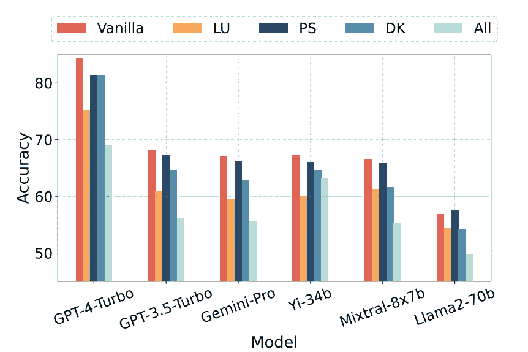
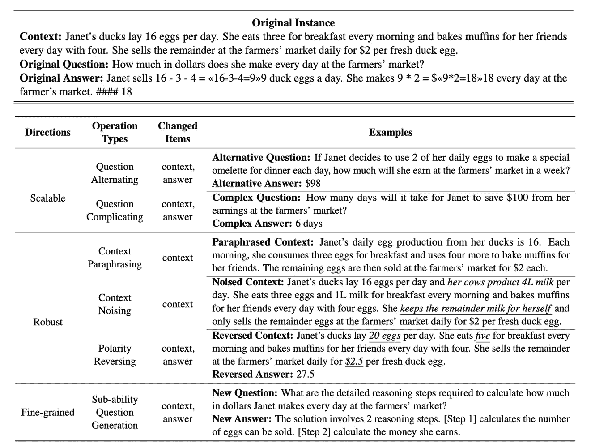

# 静态人工智能基准的死亡

> 原文：[`towardsdatascience.com/the-death-of-the-static-ai-benchmark-88b5ff437086?source=collection_archive---------8-----------------------#2024-03-21`](https://towardsdatascience.com/the-death-of-the-static-ai-benchmark-88b5ff437086?source=collection_archive---------8-----------------------#2024-03-21)

## 基准测试作为成功的衡量标准

 [Sandi Besen](https://medium.com/@sandibesen?source=post_page---byline--88b5ff437086--------------------------------)

·发布于 [Towards Data Science](https://towardsdatascience.com/?source=post_page---byline--88b5ff437086--------------------------------) ·3 分钟阅读·2024 年 3 月 21 日

--

基准测试常常被誉为成功的标志。它们是衡量进展的一个重要方式——无论是跑完 4 分钟以内的一英里，还是在标准化考试中取得优异成绩。在人工智能（AI）领域，基准测试是评估模型能力的最常见方法。OpenAI、Anthropic、Meta、Google 等行业领袖竞相争夺，通过超越彼此的基准分数来领先。然而，最近的研究和行业中的抱怨开始对这些常见基准是否真正捕捉到模型能力的本质提出了质疑。

来源：Dalle 3

# 数据污染导致记忆化

新兴的研究表明，某些模型的训练集可能已经被其评估所用的数据污染——这引发了对基准分数是否真正反映了模型对知识的理解的质疑。就像电影中演员可以扮演医生或科学家一样，他们在台词中虽然说得头头是道，但并不真正理解背后的概念。当基里安·墨菲在电影《奥本海默》中扮演著名物理学家 J·罗伯特·奥本海默时，他可能并没有理解他所讲的复杂物理理论。尽管基准测试旨在评估模型的能力，但如果像演员一样，模型只是记住了这些分数，它们真的是在评估模型的能力吗？

亚利桑那大学的最新研究发现，GPT-4 受到 AG News、WNLI 和 XSum 数据集的污染，从而使其相关的基准失去可信度[[1]](https://arxiv.org/pdf/2308.08493v3.pdf)。此外，来自中国科技大学的研究人员发现，当他们将“探测”技术应用于流行的 MMLU 基准[[2]](https://arxiv.org/pdf/2402.14865.pdf)时，结果显著下降。

他们的探测技术包括一系列方法，旨在挑战模型对问题的理解，当问题以不同的方式提出，选项不同，但正确答案相同时。探测技术的示例包括：转述问题、转述选项、排列选项、在问题中加入额外背景信息，以及为基准问题添加新的选项。

从下面的图表中可以看出，尽管每个测试的模型在未改变的“原始”MMLU 基准上表现良好，但当探测技术被加入到基准的不同部分（语言理解（LU）、问题解决（PS）、领域知识（DK）、所有部分）时，它们的表现并没有那么强劲。

“原始”代表未改变的 MMLU 基准的表现。其他键代表在修改过的 MMLU 基准部分上的表现：语言理解（LU）、问题解决（PS）、领域知识（DK）、所有部分

# 关于如何评估人工智能的未来考虑

这种不断变化的情况促使我们重新评估如何评估人工智能模型。现在越来越明显的是，我们需要既能可靠展示能力，又能预见数据污染和记忆化问题的基准。

随着模型不断发展并可能更新其训练集以包括基准数据，基准的生命周期将自然变短。此外，模型的上下文窗口正在迅速增大，允许在模型的响应中包含更多的上下文。上下文窗口越大，污染数据对模型学习过程的间接影响越大，这会使模型对已见过的测试样本产生偏见。

# 动态与现实世界基准的崛起

为了应对这些挑战，创新方法如动态基准正在出现，采用诸如：改变问题、使问题复杂化、向问题中引入噪声、转述问题、反转问题的极性等策略[[3]](https://arxiv.org/pdf/2402.11443.pdf)。

下面的示例提供了几种方法来改变基准问题（无论是手动还是由语言模型生成）。

来源：《基准自我进化：一种多代理框架用于动态 LLM 评估》

随着我们前进，将评估方法与现实世界应用更加紧密地对接的必要性变得愈加明显。建立能够准确反映实际任务和挑战的基准，不仅能提供更真实的 AI 能力衡量标准，还能引导小型语言模型（SLMs）和 AI 代理的开发。这些专业化的模型和代理需要能够真正捕捉它们执行实际和有益任务潜力的基准。
