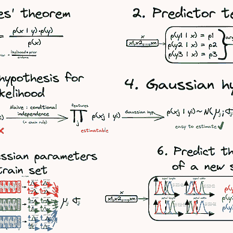

# Scikit-learn 的虚拟模型

> 原文：[`towardsdatascience.com/the-dummy-models-of-scikit-learn-3001f54c48e9?source=collection_archive---------3-----------------------#2024-02-14`](https://towardsdatascience.com/the-dummy-models-of-scikit-learn-3001f54c48e9?source=collection_archive---------3-----------------------#2024-02-14)

## 始终保持虚拟模型在你身边

 [Yoann Mocquin](https://mocquin.medium.com/?source=post_page---byline--3001f54c48e9--------------------------------)

·发布于[Towards Data Science](https://towardsdatascience.com/?source=post_page---byline--3001f54c48e9--------------------------------) ·8 分钟阅读·2024 年 2 月 14 日

--

虚拟模型非常简单易于设置，但却能为检查机器学习模型的性能提供重要的见解。

在这篇文章中，我想解释什么是虚拟模型，以及如何在 scikit-learn 中使用它们。

图片来自[Nicolas Thomas](https://unsplash.com/@nicolasthomas?utm_source=medium&utm_medium=referral)于[Unsplash](https://unsplash.com/?utm_source=medium&utm_medium=referral)

> 如果你喜欢或者想学习使用 scikit-learn 进行机器学习，可以查看我关于这个惊人工具包的教程系列：

[Yoann Mocquin](https://mocquin.medium.com/?source=post_page-----3001f54c48e9--------------------------------)

## Sklearn 教程

[查看列表](https://mocquin.medium.com/list/sklearn-tutorial-2e46a0e06b39?source=post_page-----3001f54c48e9--------------------------------)9 个故事！

*所有图片来自作者。*

# **什么是虚拟模型？**

虚拟模型是非常简化的模型，旨在作为基准与实际模型进行比较。基准只是某种参照点，用于与自己进行比较。当你计算第一次交叉验证结果以估算模型性能时，通常知道分数越高越好，如果第一次尝试的分数很高，那当然很好。但通常情况并非如此。

如果第一次的准确度评分很低——或者比你预期的还要低，该怎么办？是不是因为……
