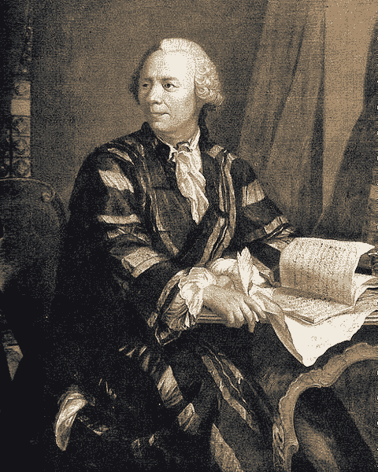

# 图解图理论精要：从 18 世纪谜题到人工智能框架

> 原文：[`towardsdatascience.com/the-essential-guide-to-graph-theory-from-an-18th-century-riddle-to-artificial-intelligence-c441cb9400de?source=collection_archive---------4-----------------------#2024-05-16`](https://towardsdatascience.com/the-essential-guide-to-graph-theory-from-an-18th-century-riddle-to-artificial-intelligence-c441cb9400de?source=collection_archive---------4-----------------------#2024-05-16)

## 学习如何提升你的数据分析，针对先进的计算任务，从创新的优化策略到基础的机器学习算法

 [Sydney Nye](https://medium.com/@sydneynye?source=post_page---byline--c441cb9400de--------------------------------)

·发布于 [Towards Data Science](https://towardsdatascience.com/?source=post_page---byline--c441cb9400de--------------------------------) ·20 分钟阅读 ·2024 年 5 月 16 日

--

图 1：Merian-Erben 的[1652 年科尼斯堡地图](https://commons.wikimedia.org/wiki/File:Image-Koenigsberg,_Map_by_Merian-Erben_1652.jpg)的增强版，数字化复原突出了普雷格尔河（蓝色）及其七座桥梁（红色），更好地呈现历史布局。强调部分由作者（Sydney Nye）添加。

想象一下，1736 年，你正在普鲁士的科尼斯堡繁忙街头漫步。现在的俄罗斯加尔东格勒，这座繁荣的港口是文化和建筑的奇迹。你沿着普雷格尔河的河岸漫游，这条城市的重要水道，你会听到市场上热闹的喧嚣，远处商船的低鸣声。七座宏伟的桥梁横跨河面，连接着不同的岛屿和街区。你可能不知道的是，你走过的这条路径，已经成为一个数学谜题的基础，困扰着欧洲大陆一些最敏锐的头脑。

这个问题看似无关紧要，却充满争议：是否可能在不重复经过的情况下，穿越这座城市，每座桥都恰好走一次？

图 2：“莱昂哈德·欧拉”，由约翰·乔治·布鲁克（1756 年）创作

尽管[最初他认为这个问题很平凡](https://maa.org/press/periodicals/convergence/leonard-eulers-solution-to-the-konigsberg-bridge-problem-euler-and-the-bridge-problem)，但最终这一命题却不可抗拒地吸引了他…
