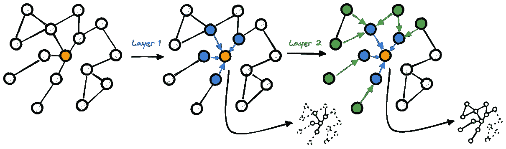

# GNN 的表现力 — 介绍与基础

> 原文：[`towardsdatascience.com/the-expressive-power-of-gnns-introduction-and-foundations-5cdb4bca6ae3?source=collection_archive---------4-----------------------#2024-02-21`](https://towardsdatascience.com/the-expressive-power-of-gnns-introduction-and-foundations-5cdb4bca6ae3?source=collection_archive---------4-----------------------#2024-02-21)

## GNNs 解析系列

## 为图神经网络模型的理论分析连接点滴

 [Giuseppe Futia](https://medium.com/@giuseppefutia?source=post_page---byline--5cdb4bca6ae3--------------------------------)

·发表于 [Towards Data Science](https://towardsdatascience.com/?source=post_page---byline--5cdb4bca6ae3--------------------------------) ·13 分钟阅读·2024 年 2 月 21 日

--

*本系列旨在提供一个全面的理解，帮助读者理解 GNN 是如何捕捉网络结构的关系信息的。*

*我想感谢* [*Pantelis Krasadakis*](https://www.linkedin.com/in/pantelis-krasadakis-126092233/)*,* [*Alessia Melania Lonoce*](https://www.linkedin.com/in/alessia-melania-lonoce/)*, 和* [*Antonio Vetrò*](https://www.linkedin.com/in/antoniovetro/) *审阅了这篇文章，并给出了宝贵的反馈。*

# 介绍

图表示了描述交互元素的通用模型，而图神经网络（GNNs）已成为将学习算法应用于图结构数据的必备工具。

GNNs 最常见的框架基于消息传递神经网络（MPNN）。在这个框架中，邻居的特征通过边缘作为*信息*传递给目标节点。然后，目标节点的表示会与其邻居的聚合表示一起更新。

基于这一原理，节点的新表示编码了与局部结构相关的信息。这个信息传递过程如图 1 所示。

图 1 — 在 2 层 MPNN 中，邻居特征聚合到橙色节点

该图展示了如何更新橙色节点的表示…
