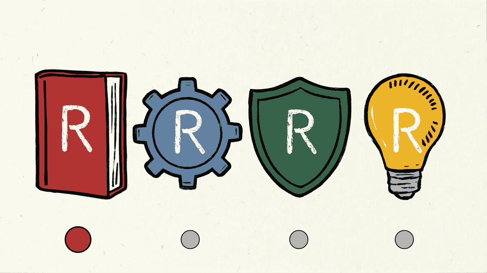

# 数据项目代码卓越的四个 R（第一部分）

> 原文：[`towardsdatascience.com/the-four-rs-of-code-excellence-for-data-projects-part-1-3a390deacff4?source=collection_archive---------5-----------------------#2024-03-19`](https://towardsdatascience.com/the-four-rs-of-code-excellence-for-data-projects-part-1-3a390deacff4?source=collection_archive---------5-----------------------#2024-03-19)

图片由 Ideogram 提供，作者修改

## 如何编写出令人惊叹的代码，既能保障机器学习管道，又能维护你的理智！

 [Siavash Yasini](https://medium.com/@siavashyasini?source=post_page---byline--3a390deacff4--------------------------------)

·发表于[Towards Data Science](https://towardsdatascience.com/?source=post_page---byline--3a390deacff4--------------------------------) ·阅读时间：15 分钟·2024 年 3 月 19 日

--

# 介绍

任何成功的数据科学项目的关键成分之一就是高质量的代码。从简单的数据分析到复杂的机器学习管道，代码质量始终是确保项目**准确性**、**效率**和**可维护性**的最重要因素。编写良好的代码可以确保你的工作容易被他人理解、修改和扩展——包括你未来的自己。它能最大限度地减少错误和漏洞的可能性，并使数据和机器学习项目更加高效、有效和稳健。但编写高质量的代码并不总是那么容易，对吧？

我们都见过低质量的代码。而当我说见过时，我的意思是亲手写过！

你知道怎么做：你被分配了一项快速分析和概念验证建模任务。于是，你将数据集导入 CSV 文件，打开一个笔记本，创建了 42 个晦涩的单元格，如果你运行两次，它们就会给你报错。最后你得到了一本杂乱无章的笔记本，里面充斥着无数难以理解的函数名称、重写的变量、无法解读的图表，最终一片混乱，可能会导致…
