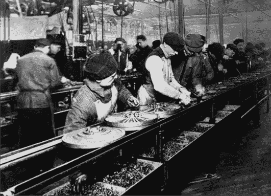

# 机器人组装的未来

> 原文：[`towardsdatascience.com/the-future-of-robotic-assembly-ce3446703de8?source=collection_archive---------4-----------------------#2024-03-29`](https://towardsdatascience.com/the-future-of-robotic-assembly-ce3446703de8?source=collection_archive---------4-----------------------#2024-03-29)

## 自 1913 年大规模生产引入以来，生产线依然主要由人工操作——人形机器人可能会改变这一现状。

 [Nikolaus Correll](https://medium.com/@nikolaus.correll?source=post_page---byline--ce3446703de8--------------------------------)

·发表于[Towards Data Science](https://towardsdatascience.com/?source=post_page---byline--ce3446703de8--------------------------------) ·阅读时长 12 分钟·2024 年 3 月 29 日

--

一位人形机器人在执行组装任务。图片由作者提供，来源于 miramuseai.net。

*这是我在 2024 年 3 月 27 日为《Assembly Magazine》举办的网络研讨会的文字版。该网络研讨会也可以* [*在线观看*](https://www.assemblymag.com/events/7035-the-future-of-robotic-assembly)*。如果你不是 Medium 订阅用户，可以* [*免费阅读此文章*](https://medium.com/towards-data-science/the-future-of-robotic-assembly-ce3446703de8?sk=e5d2b10f877383d1146a1d03689b3928) *。高混合、低产量的问题仍然难以实现机器人自动化。通过回顾最近在协作机器人、人工智能和人形机器人领域的趋势，我认为组装和拆卸可能是人形机器人寻求工作机会的“杀手级应用”。*

亨利·福特被誉为大规模生产的奠基人，他通过简化“T 型车”的生产流程，使汽车变得普及且价格亲民。当时的一项关键创新是使用输送带来控制生产线的节奏。然而，实际的劳动大多仍然是人工的，今天仍然如此，例如可以参考[2024 年宝马的发动机组装](https://www.bmwgroup-werke.com/en/produktion/engine-assembly.html)。

亨利·福特的 T 型车工厂于 1913 年的大规模生产（公有领域）。许多组装步骤，特别是在发动机部门和最终组装阶段，依然是人工操作。

通过被称为德语词“*Takt*”或循环时间来控制生产线的节奏，的确是使组装过程顺利进行的关键理念……
