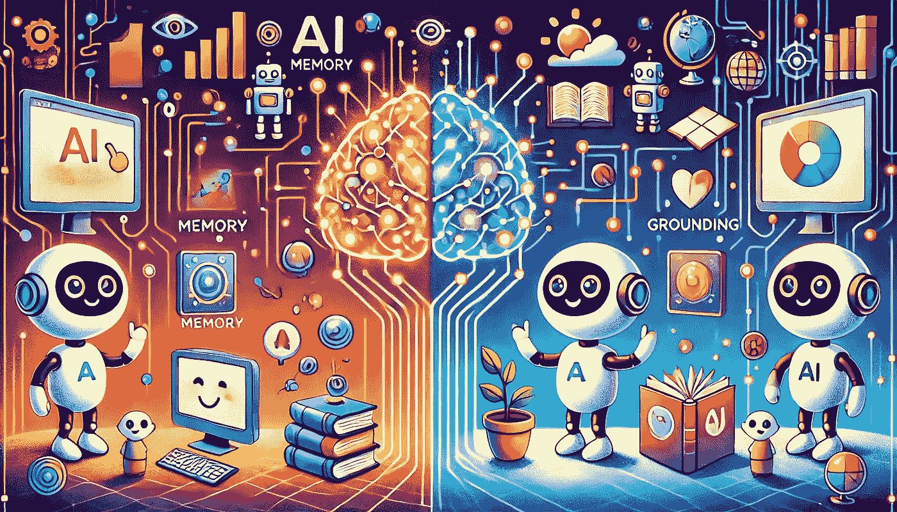
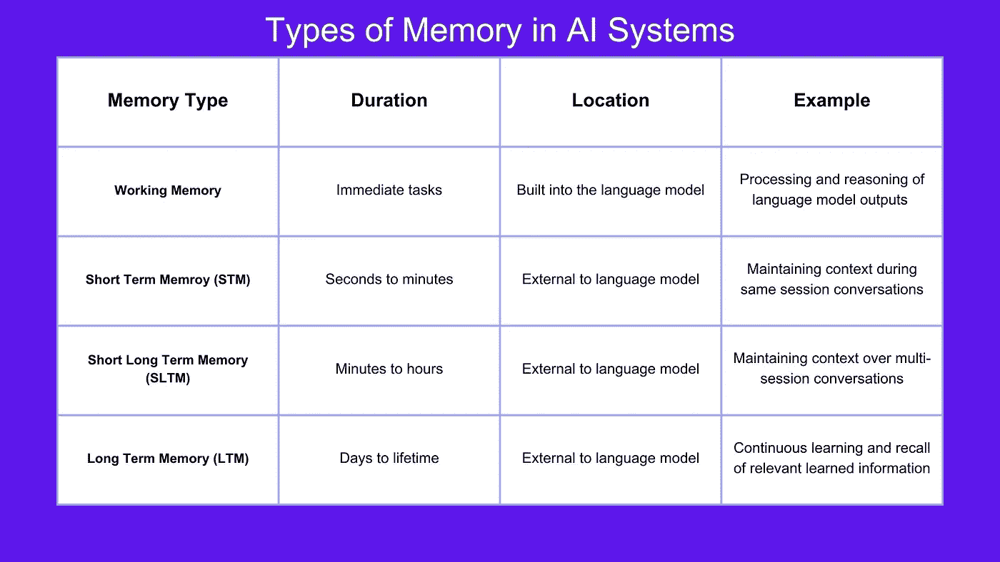

# AI 系统中记忆与基础构建的交集

> 原文：[`towardsdatascience.com/the-intersection-of-memory-and-grounding-in-ai-systems-0fda53231011?source=collection_archive---------8-----------------------#2024-07-24`](https://towardsdatascience.com/the-intersection-of-memory-and-grounding-in-ai-systems-0fda53231011?source=collection_archive---------8-----------------------#2024-07-24)

 [Sandi Besen](https://medium.com/@sandibesen?source=post_page---byline--0fda53231011--------------------------------)

·发表于 [Towards Data Science](https://towardsdatascience.com/?source=post_page---byline--0fda53231011--------------------------------) ·阅读时间：6 分钟·2024 年 7 月 24 日

--

了解记忆的四个关键类型（短期记忆、短期长期记忆、长期记忆和工作记忆）、语言模型的基础构建方法以及记忆在基础构建过程中的作用。

在语言模型和智能体 AI 的背景下，记忆和基础知识是两个热门且新兴的研究领域。尽管它们通常在句子中紧密相连且常常相关，但在实际应用中，它们的功能是不同的。在本文中，我希望能澄清这两个术语之间的混淆，并展示记忆在模型的整体基础构建中所起的作用。

来源：Dalle3，描述：分割的大脑部分呈现记忆和基础构建，以友好的卡通风格展现

# **语言模型中的记忆**

在我上一篇文章中，我们讨论了[记忆在智能体 AI 中的重要作用](https://medium.com/towards-data-science/the-important-role-of-memory-in-agentic-ai-896b22542b3e)。语言模型中的记忆指的是 AI 系统保持和回忆相关信息的能力，这有助于其推理能力，并能不断从经验中学习。**记忆可以分为 4 类：短期记忆、短期长期记忆、长期记忆和工作记忆。**

听起来很复杂，但让我们简单地拆解一下：

## **短期记忆（STM）：**

STM（短期记忆）保留信息的时间非常短，可能是几秒到几分钟。如果你问一个语言模型一个问题，它需要保持你的消息足够长的时间，以便生成对你的问题的回答。就像人类一样，语言模型也难以同时记住太多的事物。

> [米勒定律](https://www.simplypsychology.org/short-term-memory.html)指出，“短期记忆是记忆的一个组成部分，它在一个活跃、随时可用的状态下保持少量信息，通常为几秒钟到一分钟。短期记忆的持续时间似乎在 15 到 30 秒之间，短期记忆的容量是有限的，通常认为大约为 7±2 项。”

所以，如果你问一个语言模型“我在之前的消息中提到的那本书是哪种类型？”它需要使用它的短期记忆来参考最近的消息并生成相关的回应。

**实现：**

上下文存储在外部系统中，例如会话变量或数据库，这些系统保存对话历史的一部分。每次新的用户输入和助手回应都会附加到现有上下文中，形成对话历史。在推理过程中，上下文会与用户的新查询一起发送给语言模型，以生成一个考虑到整个对话的回应。此[研究论文](https://openreview.net/pdf?id=QNW1OrjynpT)提供了关于支持短期记忆机制的更深入的观点。

## **短期长时记忆（SLTM）：**

短期长时记忆（SLTM）保留信息的时间为中等时长，从几分钟到几个小时。例如，在同一会话中，你可以继续未完成的对话，而无需重复上下文，因为它已经作为 SLTM 被存储。这个过程也是外部过程，而不是语言模型本身的一部分。

**实现：**

会话可以通过标识符进行管理，这些标识符将用户的互动在时间上连接起来。上下文数据以一种方式存储，使其可以在定义的时间段内跨用户交互持久化，比如存储在数据库中。当用户恢复对话时，系统可以从之前的会话中检索对话历史，并在推理时将其传递给语言模型。就像短期记忆一样，每次新的用户输入和助手回应都会附加到现有的上下文中，以保持对话历史的更新。

## **长期记忆（LTM）：**

长期记忆（LTM）保留信息的时间为管理员定义的时间段，这段时间可以是无限的。例如，如果我们要构建一个 AI 导师，语言模型需要理解学生在哪些科目上表现好，在哪些方面仍然挣扎，哪种学习方式最适合他们，等等。这样，模型可以召回相关信息，以指导未来的教学计划。[松鼠 AI](https://squirrelai.com/#/products/technology)就是一个使用长期记忆来“制定个性化学习路径，进行有针对性的教学，并在需要时提供情感干预”的平台示例。

**实现：**

信息可以存储在结构化数据库、知识图谱或文档存储中，按需查询。相关信息基于用户当前的互动和历史记录进行检索。这为语言模型提供了上下文，该上下文随着用户的回应或系统提示返回。

## **工作记忆：**

工作记忆是语言模型本身的一个组成部分（不同于其他类型的记忆，它们是外部过程）。它使语言模型能够保持信息、操作信息并进行改进——从而提高模型的推理能力。这一点非常重要，因为当模型处理用户的请求时，它对任务的理解及执行任务所需采取的步骤可能会发生变化。你可以把工作记忆看作是模型思维的草稿本。例如，当提供一个多步骤的数学问题，如(5 + 3) * 2 时，语言模型需要能够计算括号中的(5 + 3)并存储该信息，然后再将两数之和乘以 2。如果你有兴趣深入了解这个话题，[论文](https://arxiv.org/abs/2404.09173)《TransformerFAM: 反馈注意力是工作记忆》提供了一种新的方法来扩展工作记忆，使语言模型能够处理无限长度的输入/上下文窗口。

**实现：**

像变换器中的注意力层或循环神经网络（RNNs）中的隐藏状态这样的机制负责保持中间计算，并提供在同一推理会话中操作中间结果的能力。随着模型处理输入，它更新内部状态，这使得推理能力更强。

*所有 4 种类型的记忆都是创建一个能够有效管理和利用跨越不同时间框架和上下文信息的人工智能系统的重要组成部分。*

人工智能系统中的记忆类型表，来源：Sandi Besen

# 基础

**语言模型的回应应始终在对话的上下文中合理——它们不应仅仅是一堆事实陈述**。基础性测量模型生成一个在上下文中相关且有意义的输出的能力。对语言模型进行基础化的过程可以是语言模型训练、微调和外部过程（包括记忆！）的组合。

## **语言模型训练与微调**

模型最初的训练数据会在很大程度上影响模型的基础性和表现。通过在大量多样化的数据语料库上训练模型，可以让其学习语言模式、语法和语义，从而预测下一个最相关的词语。预训练的模型随后会在特定领域的数据上进行微调，这有助于其为需要更深入领域知识的特定应用生成更相关和准确的输出。如果你要求模型在某些文本上表现良好，而这些文本在初始训练中没有涉及，那么这种微调尤为重要。尽管我们对语言模型的能力期望很高，但我们不能指望它在从未接触过的内容上表现出色。就像我们不会指望一个没有学习材料的学生能在考试中表现优异一样。

## **外部上下文**

为模型提供实时或最新的上下文信息有助于其保持基础性。实现这一目标的方法有很多，比如将其与外部知识库、API 和实时数据集成。这种方法也被称为检索增强生成（RAG）。

## **记忆系统**

人工智能中的记忆系统在确保系统根据其先前采取的行动、所学的经验、随时间积累的表现以及与用户和其他系统的互动中保持基础性方面发挥着至关重要的作用。文章中之前提到的四种记忆类型在保持语言模型上下文感知和生成相关输出方面起着重要作用。记忆系统与基础性技术（如训练、微调和外部上下文整合）协同工作，以提升模型的整体表现和相关性。

# **结论**

记忆和基础性是相互关联的元素，它们提高了人工智能系统的表现和可靠性。记忆使得人工智能能够跨时间维度保留和处理信息，而基础性确保了人工智能的输出在上下文中是相关和有意义的。通过整合记忆系统和基础性技术，人工智能系统可以在其交互和任务中实现更高水平的理解和有效性。

注意：本文及论文中的观点仅代表作者个人观点，并不一定反映其所在单位的看法或政策。

如果你还有疑问或认为有些内容需要进一步澄清，欢迎在[Linkedin](https://www.linkedin.com/in/sandibesen/)上给我发私信！我总是乐于参与思维碰撞并改进我的工作。

参考文献：

[`openreview.net/pdf?id=QNW1OrjynpT`](https://openreview.net/pdf?id=QNW1OrjynpT)

[`www.simplypsychology.org/short-term-memory.html`](https://www.simplypsychology.org/short-term-memory.html)
