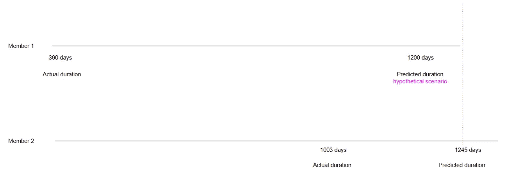

# Concordance Index 的直觉——生存分析

> 原文：[`towardsdatascience.com/the-intuition-behind-concordance-index-survival-analysis-3c961fc11ce8?source=collection_archive---------4-----------------------#2024-11-28`](https://towardsdatascience.com/the-intuition-behind-concordance-index-survival-analysis-3c961fc11ce8?source=collection_archive---------4-----------------------#2024-11-28)

## 排名准确度与绝对准确度

 [Antonieta Mastrogiuseppe](https://medium.com/@fyi.oamd?source=post_page---byline--3c961fc11ce8--------------------------------)

·发布于 [Towards Data Science](https://towardsdatascience.com/?source=post_page---byline--3c961fc11ce8--------------------------------) ·16 分钟阅读·2024 年 11 月 28 日

--

作者与她的边境牧羊犬合影。 “感恩你拥有的一切。勇敢追求你想要的一切”

你会保持多少时间的健身房会员资格才决定取消？或者，如果你是一个喜欢追剧的 Netflix 用户，但比平时更忙，没办法腾出两个小时待在沙发上看电视，什么时候会取消订阅？又或者，何时你会升级或更换你的智能手机？在考虑交通、道路封闭、时间等因素时，如何选择最佳路线？又或者，你的车多久需要保养一次？这些问题是我们日常生活中经常面临的（但并不简单的）问题，很多时候我们并没有过多思考（甚至从未考虑过）影响我们下一步行动的不同因素。当然（或者在读完这些内容后），你可能会想知道什么因素或哪些因素可能对预期某一事件（无论是上面提到的，还是其他事件）的发生时间有最大的影响？在统计学中，这就是所谓的时间至事件分析或生存分析。这也是本研究的重点。

在生存分析中，我们旨在分析事件发生的时间。在本文中，我将使用生存分析预测注册会员何时可能会离开（流失），具体来说是预测会员取消其会员合同的天数。由于关注的变量是*天数*，此时需要明确强调的一个关键点是：事件发生时间的因变量是连续型的，可以在某个范围内取任何值。因此，生存分析是适用的工具。

数据

本研究使用了由一家私营机构提供的专有数据集，该机构位于辅导行业。数据包括为确保保密性而进行匿名化处理的记录，收集时间跨度为两年，即 2022 年 7 月至 2024 年 10 月。所有分析均符合伦理标准，确保数据隐私和匿名性。因此，为尊重数据提供方的机密性，任何特定的组织细节和/或唯一标识符的详细信息都已被省略。

数据预处理后的最终数据集（即处理空值、归一化以处理异常值、聚合以去除重复数据并按合理级别分组）包含 44,197 条唯一标识符级别的记录。总共有 5 列输入到模型中，分别是：1）年龄，2）访问次数，3）首次访问，4）会员期间的最后访问，以及 5）任期。后者代表持有会员资格的天数，因此是事件发生的时间目标变量。基于访问的变量是为本研究生成的特征工程产品，由原始的现有变量通过对每个标识符在分析期间的数据进行一些计算和聚合得到。最后且非常重要的是，数据集仅包含未删失记录。也就是说，所有唯一标识符在分析时都已经经历了事件，即会员取消。因此，在本分析中没有删失数据，即没有个体在观察期之后生存（未取消会员）。这一点在选择建模技术时非常关键，正如我接下来将解释的。

在所有用于生存分析的不同技术中，有三种技术最为常见：

Kaplan-Meier 估计量。

+   这是一种非参数模型，因此不对数据的分布做出任何假设。

+   KM 并不关注单个特征如何影响流失，因此它不会提供基于特征的洞察。

+   它广泛用于探索性分析，以评估生存曲线的形态。

+   非常重要的是，它不提供个性化的预测。

Cox 比例风险（PH）模型

+   Cox PH 模型是一种半参数模型，因此它不假设生存时间的具体分布，使其在更广泛的数据范围内更加灵活。

+   它估计风险函数。

+   它在很大程度上依赖于未删失以及删失数据，以区分那些“处于风险中”的个体（即可能经历事件的个体）和那些已经经历事件的个体。因此，如果仅分析未删失数据，模型会假设所有个体都经历了事件，从而得出偏差的结果，导致 Cox PH 模型表现不佳。

AFT 模型

+   它不需要删失数据。因此，可以用于所有个体都已经经历事件的情况。

+   它直接建模协变量之间的关系。

+   当事件发生的时间是主要关注点时使用。

+   该模型显式地估计事件时间。因此，提供了直接的取消持续时间预测。

基于本研究中使用的数据集特点，我选择了加速失败时间（AFT）模型作为最合适的技术。这个选择是基于两个关键因素：（1）数据集仅包含未删失数据，且（2）分析侧重于为每个唯一标识符生成个体级别的预测。

在深入探讨方法和模型输出之前，我将介绍一些关键概念：

**生存函数（Survival Function）：** 它提供了生存概率随时间变化的洞察。

**危险函数（Hazard Function）：** 在时间 t 时事件发生的速率。它捕捉事件随时间的变化。

**事件时间（Time-to-event）：** 指捕捉事件发生前的时间（目标变量）。

**删失（Censoring）：** 标记指的是在分析时间框架内某些受试者尚未发生的事件。注意：在本研究中只分析未删失数据，这意味着所有受试者的生存时间都已知。

**一致性指数（Concordance Index）：** 衡量模型预测生存时间相对排序的准确性。这是衡量排名准确度而非绝对准确度的指标，用于评估所有受试者配对中预测的生存时间与实际结果一致的比例。

**赤池信息准则（AIC）：** 用于评估模型质量的度量标准，且对使用的无关变量数量进行惩罚。在比较多个模型时，AIC 最小的模型被认为是最优的。

接下来，我将详细阐述前两个概念。

在数学上：

生存函数为：

(1)

其中，

T 是一个随机变量，表示事件发生的时间——即直到事件发生的持续时间。

S(t) 是事件在时间 t 时尚未发生的概率。

另一方面，危险函数为：

(2)

其中，

f(t) 是概率密度函数（PDF），描述了事件在时间 t 发生的速率。

S(t) 是描述在时间 t 之后生存的概率的生存函数。

由于 PDF f(t) 可以通过对 S(t) 关于 t 求导来表示，因此：

(3)

将 S(t) 的导数代入危险函数：

(4)

对对数生存函数求导：

(5)

根据链式法则，可以得出：

(6)

因此，危险函数和生存函数之间的关系定义如下：

(7)

危险率捕捉了在特定时间点生存概率变化的速度。

危险函数始终是非负的，永远不会低于零。其形态可以增加、减少、保持恒定或呈现更复杂的变化。

简单来说，危险函数是衡量在某个时刻 t 发生事件的即时风险。它告诉我们，个体在该时刻经历事件的可能性有多大。而生存（率）函数则衡量的是在某个特定时刻之后生存的概率。这是指在时间点 t 之前没有经历事件的总体概率。

随着时间的推移，生存函数始终是递减的，因为越来越多的个体经历了事件。这在下面的直方图中有所展示，图示了事件发生时间变量：任期。

由作者通过绘制所研究数据集中的事件发生时间目标变量生成。

在 t=0 时，没有个体经历事件（没有个体取消其会员资格），因此

(8)

最终，所有个体都会经历事件，因此生存函数趋向于零（0）。

(9)

模型

就本文的目的而言，我将重点讨论一种基于多变量参数化的模型：加速失效时间（AFT）模型，该模型明确估计连续的事件发生时间目标变量。

给定 AFT 模型：

(10)

对方程两边取自然对数，得到：

(11)

其中，

**log(T)** 是生存时间的对数，即事件发生时间（持续时间），如公式（11）所示，它是协变量的线性函数。

**X** 是协变量的向量

**β** 是回归系数的向量。

*这非常重要：*

模型中的系数 **β** 描述了协变量如何加速或减缓事件时间，即生存时间。在 AFT 模型（本文的重点）中，系数直接影响生存时间（而不是危险函数），具体如下：

如果 **β > 1**，生存时间较长，因此导致事件发生时间减缓。这意味着，成员将需要更长时间来终止其会员资格（较晚经历事件）。

如果 **β < 1**，生存时间较短，因此导致事件发生时间加速。这意味着，成员将较早终止其会员资格（更早经历事件）。

最后，

**ϵ** 是随机误差项，表示影响生存时间的未观察因素。

现在，基于上述几点，列出一些明确的要点：

1.  这是一个多变量方法，其中事件发生时间（持续时间）目标变量在多个协变量上进行拟合。

1.  这是一种参数化方法，因为该模型对生存率分布的特定形状做出了假设。

1.  在 AFT 模型框架下已经实现了三种算法，分别是：

3.1) 威布尔 AFT 模型

+   该模型具有灵活性，可以捕捉不同的生存模式。支持一致的单调递增/递减函数。这意味着：在函数定义的任意两个点之间，后一个点至少与前一个点一样高。

+   无需显式建模风险函数。该模型有两个参数，通过这两个参数推导出生存函数：*形状*，它决定了分布的形状，因此有助于确定数据的偏斜程度；*尺度*，它决定了分布的扩展性。再加上与每个协变量相关的回归系数。形状参数决定了风险函数的单调行为，进而影响生存函数的行为。

+   右偏、左偏分布的事件时间目标变量是其中的例子。

3.2) 对数正态 AFT 模型

+   主要集中于建模生存时间的对数转换。是一个近似呈正态分布的连续概率分布的随机变量的对数。

+   支持右偏分布的事件时间目标变量。当事件风险不遵循简单模式时，允许非单调的风险函数。这在风险随时间变化复杂时很有用。

+   它不需要显式建模风险函数。

+   两个主要参数（加上任何回归系数）：*尺度*和*位置*，前者表示对数转换的生存时间的标准差，后者表示对数转换的生存时间的均值。这表示在没有包含协变量时的截距，否则表示这些变量的线性组合。

3.3) 广义伽马 AFT 模型。

+   适用于广泛的生存数据模式。高度适应的参数化模型，能够适应上述提到的形状以及生存函数中的更复杂数学形式。

+   它可以用来测试是否可以使用更简单的模型（如威布尔分布、对数正态分布），因为它涵盖了这些模型作为特殊情况。

+   它不需要显式指定风险函数。

+   除了回归系数外，它有三个参数：*形状、尺度*和*位置*，后者对应在没有包含协变量时的生存时间中位数的对数，因此是模型中的截距。

提示：关于这些算法的文献数量非常庞大，专门聚焦于每个算法及其特性的文献，我强烈建议读者去深入了解。

最后，分析了上述算法的性能，重点关注一致性指数（是的，C-指数，我们关注的度量标准）和赤池信息准则（AIC）。这些将在下文中展示，并附带模型输出：

回归输出

威布尔 AFT 模型

由作者使用 lifelines 库生成

对数正态 AFT 模型

由作者使用 lifelines 库生成

广义伽马 AFT 模型

由作者使用 flexsurv 库生成

在右侧，显示了每个预测变量的图表：以对数加速故障率为 x 轴，展示其对生存时间的正向或负向（加速/减速）影响。如图所示，所有模型在预测变量的影响方向上都一致，得出了一致的结论，表明预测变量对生存时间的影响是正向还是负向的。现在，在一致性指数和 AIC 方面，对数正态模型和威布尔模型的 C-index 值都显示为最高，但特别是对数正态模型由于 AIC 较低而占据主导地位。因此，对数正态模型被选为最适合的模型。

聚焦于对数正态 AFT 模型以及每个协变量（coef）估计系数的解释，通常预测变量的 p 值都低于常规的 5% 显著性水平，从而拒绝了原假设，证明它们对生存时间具有统计学显著的影响。年龄的系数为负值 -0.06，意味着随着年龄的增长，成员更有可能更早经历事件，从而更早终止其会员身份。即：每增加一岁，生存时间减少 6%，这时生存时间会乘以一个 0.94 的因子（exp(coef)），从而加速生存时间。相比之下，访问次数、加入后的首次访问和最近一次访问都显示出对生存时间的强正向影响，表明更多的访问、早期参与和最近的参与都能显著增加生存时间。

现在，从模型间的一致性指数（Concordance Index，C-index）来看（这是本分析的重点），广义伽马 AFT 模型的 C-index 值最低，因此是预测准确性最弱的模型。这个模型在根据预测的风险得分正确排序生存时间方面能力最弱。这个结果强调了模型表现的一个重要方面：无论模型是否能够正确捕捉各预测变量影响方向的准确性，这并不一定保证预测的准确性，特别是在区分提前发生事件与较晚发生事件的受试者时，依据一致性指数来衡量。C-index 明确评估的是模型的排名准确性，而非绝对准确性。这是本分析的核心区分，我将在接下来的部分详细阐述。

一致性指数（C-INDEX）

“排名生存时间”是指模型为每个个体生成的预测风险评分，用于排名，从而区分那些比其他人早经历事件的个体。协调指数是排名准确性的度量，而非绝对准确性，具体来说：C 指数评估所有个体对的比例，这些个体的预测生存时间与实际结果一致。从绝对角度来看，模型在预测成员取消会员所需的具体天数的精确度并不重要，重要的是模型在实际和预测时间一致的情况下，如何准确地对个体进行排名。下面对此做出说明：

由作者根据实例绘制：来自验证数据集的实际值和估计值。

上述两个实例来自验证集，在模型经过训练集训练后，针对未见数据生成了预测结果。这些例子展示了预测生存时间（由模型估计）超过实际生存时间的情况。水平平行线表示时间。

对于会员 1，实际的会员时长是 390 天，而模型预测的时长是 486 天——高估了 96 天。同样，会员 2 的实际会员时长为 1,003 天，但模型预测会员取消的时间比实际发生的时间晚了 242 天，即 1,245 天的会员时长。

尽管在绝对预测值上存在这些差异（这点非常重要）：模型在风险排名方面正确地对两名会员进行了排序，准确预测了会员 1 会在会员 2 之前取消会员资格。绝对误差和相对排名之间的区别是模型评估的一个关键方面。考虑以下假设情境：

由作者根据实例绘制：来自验证数据集的实际值和估计值。

如果模型预测会员 1 的会员时长是 1,200 天，而不是 486 天，这不会影响排名。模型仍然会预测会员 1 会比会员 2 早终止会员资格，无论预测误差（即天数）有多大。在生存分析中，任何对于会员 1 的预测，若落在图中的虚线之前，都会保持相同的排名，并且被分类为*一致对*。这个概念对计算**C 指数**至关重要，它衡量数据集中所有一致对的比例。

以下展示了几个假设场景。在每个场景中，误差的大小增加/减少，即实际事件时间与预测事件时间之间的差异，这是绝对误差。然而，排名准确性保持不变。

作者根据实例绘制，来自验证数据集的实际和预测值。

以下内容同样来自验证集，但在这些实例中，模型预测的成员资格终止时间早于实际事件发生时间。对于成员 3，实际的成员资格持续时间为 528 天，但模型预测的终止时间早了 130 天，即 398 天的成员资格持续时间。同样，对于成员 4，模型预测在实际事件发生之前终止会员资格。在这两种情况下，模型正确地将成员 4 排名为早于成员 3 终止会员资格。

作者根据实例绘制，来自验证数据集的实际和预测值。

在下面的假设场景中，即使模型为成员 3 提前 180 天预测了终止，排名仍然不变。这仍然被分类为*一致对*。我们可以多次重复此分析，在 88% 的情况下，LogNormal 模型将产生这个结果，如一致性指数所示。这意味着：模型正确预测了个体生存时间的相对顺序。

作者根据实例绘制，来自验证数据集的实际和预测值。

和一切一样，关键在于根据手头的任务战略性地使用生存分析。关注排名个体的使用案例，采用生存分析作为最有效的策略，而不是专注于减少绝对误差的案例包括：

*客户保持 — 企业* 按客户流失的可能性对客户进行排名。生存分析可以帮助识别最有流失风险的客户，从而有针对性地进行保持工作。

*员工流失 — 人力资源分析* 组织使用生存分析来预测和排名员工的离职可能性。类似于上述方法，可以识别出流失风险最高的员工，从而提高保持率，减少员工流动成本。

*医疗保健 — 资源分配* 生存模型可能用于根据患者发生不良结果（即疾病进展）的风险对患者进行排名。在这里，正确识别哪些患者处于最高风险并需要紧急干预，从而更有效地分配有限资源，比准确预测生存时间更为关键，因此更为相关。

*信用风险 — 金融* 金融机构利用生存模型根据借款人的违约风险对其进行排序。因此，他们更关心识别最具风险的客户，以便做出更明智的贷款决策，而不是专注于违约的具体月份。这将积极指导贷款审批（等）。

在上述情况下，受试者的**相对排名**（例如，谁处于更高或更低的风险）直接驱动可操作的决策和资源分配。生存时间预测中的绝对误差可能不会显著影响结果，只要排名准确性（C 指数）保持较高。这表明，即使模型的绝对预测不够精确，具有高 C 指数的模型仍然能非常有效。

总结

在生存分析中，区分**绝对误差**和**排名准确性**至关重要。绝对误差是指预测与实际事件时间之间的差异，在本分析中通常以天数衡量。诸如平均绝对误差（MAE）或均方根误差（RMSE）等指标用于量化这些差异的大小，从而衡量模型的整体预测准确性。然而，这些指标无法捕捉模型正确根据受试者发生事件的早晚排序的能力。

**排名准确性**，另一方面，评估模型如何根据预测的风险对受试者进行排序，而不考虑如上所示的确切时间预测。这就是**一致性指数（C 指数）**发挥关键作用的地方。C 指数衡量模型正确排序个体对的能力，值越高表示排名准确性越好。C 指数为 0.88 表明模型成功地以 88%的准确率正确排序会员终止风险。

因此，虽然绝对误差提供了有关时间预测精度的宝贵见解，但 C 指数更关注模型正确排序受试者的能力，这在生存分析中通常更为重要。具有高 C 指数的模型，即使存在一定程度的绝对误差，也能在排序个体时非常有效，使其成为预测相对风险随时间变化的强大工具。
