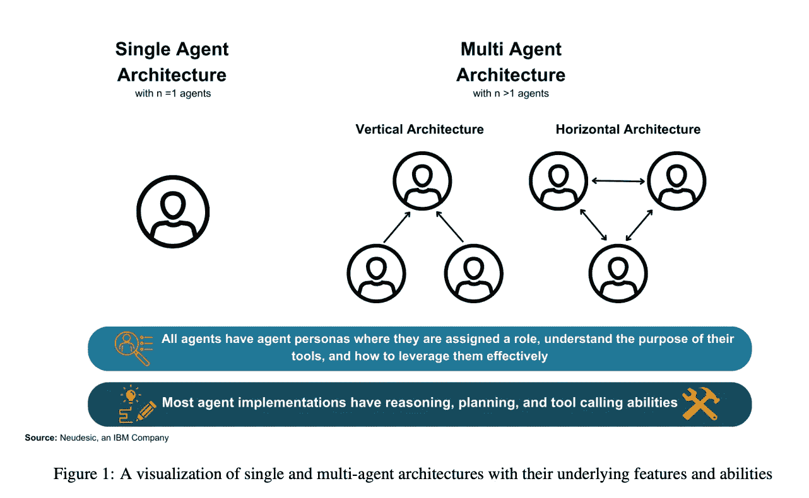

# 新兴人工智能代理架构在推理、规划和工具调用方面的全景：一项调查

> 原文：[`towardsdatascience.com/the-landscape-of-emerging-ai-agent-architectures-for-reasoning-planning-and-tool-calling-a-a95214b743c1?source=collection_archive---------0-----------------------#2024-04-23`](https://towardsdatascience.com/the-landscape-of-emerging-ai-agent-architectures-for-reasoning-planning-and-tool-calling-a-a95214b743c1?source=collection_archive---------0-----------------------#2024-04-23)

 [Sandi Besen](https://medium.com/@sandibesen?source=post_page---byline--a95214b743c1--------------------------------)

·发表于 [Towards Data Science](https://towardsdatascience.com/?source=post_page---byline--a95214b743c1--------------------------------) ·7 分钟阅读·2024 年 4 月 23 日

--

图片由作者提供

***我和我的团队（***[***Sandi Besen***](https://www.linkedin.com/in/sandibesen/)***、*** [***Tula Masterman***](https://www.linkedin.com/in/tula-masterman/)***、*** [***Mason Sawtell***](https://www.linkedin.com/in/mason-sawtell/)*** 和*** [***Alex Chao***](https://www.linkedin.com/in/alexchao56/)***) 最近发表了一篇调查研究论文，全面探讨了当前人工智能代理架构的现状。作为这篇论文的共同作者，我们的目标是揭示使这些自主系统能够有效执行复杂目标的关键设计要素。***

本文为研究人员、开发者以及任何有兴趣了解人工智能代理技术前沿进展的人提供了一个资源。

阅读完整的元分析文章请访问 [Arxiv](https://arxiv.org/abs/2404.11584)

# 向代理转型

自 ChatGPT 推出以来，初期的生成式人工智能应用大多围绕着利用检索增强生成（RAG）模式来响应用户提示的聊天机器人展开。尽管目前仍有在增强这些基于 RAG 的系统的鲁棒性方面的工作，但研究界现在正在探索下一代人工智能应用——一个共同的主题是开发自主人工智能代理。

代理系统融合了高级能力，如规划、迭代和反思，利用模型固有的推理能力完成端到端的任务。结合使用工具、插件和功能调用的能力，代理能够处理更广泛的一般用途工作。

# 推理、规划和有效工具调用对于代理的重要性

推理是人类思维的基础构建块。没有推理能力，人类将无法做出决策、解决问题或在获得新信息时完善计划——本质上是无法理解周围的世界。**如果代理没有强大的推理能力，它们可能会误解任务，生成无意义的答案，或者忽视多步骤的后果。**

我们发现，大多数代理实现包含一个规划阶段，利用以下技术之一来创建计划：任务分解、多计划选择、外部模块辅助规划、反思和优化以及记忆增强规划[1]。

采用代理实现而非仅使用基础语言模型的另一个好处是代理能够通过调用工具解决复杂问题。工具可以使代理执行诸如与 API 交互、向第三方应用写入数据等操作**。**推理与工具调用是紧密相连的，有效的工具调用依赖于充分的推理能力。简而言之，你不能指望一个推理能力差的代理理解何时是调用其工具的合适时机。

# **单一代理与多代理架构**

**我们的研究强调，单一代理和多代理架构都可以通过应用推理和工具调用步骤来解决具有挑战性的任务。**

**对于单一代理实现，我们发现成功的目标执行取决于适当的规划和自我修正**[1, 2, 3, 4]。如果没有自我评估和制定有效计划的能力，单一代理可能会陷入无限执行循环，既无法完成给定任务，也无法返回不符合用户预期的结果[2]。我们发现，单一代理架构在任务要求直接的功能调用且不需要来自其他代理的反馈时尤其有用。

然而，我们注意到单一代理模式通常难以完成长时间序列的子任务或工具调用[5, 6]。多代理模式能够解决并行任务和鲁棒性的问题，因为架构中的多个代理可以独立处理各自的子问题。许多多代理模式首先会将复杂问题分解成若干较小的任务。然后，每个代理独立地使用自己的工具集来解决各自的任务。

多智能体参与的架构为基于能力的智能劳动分工提供了机会，同时也为来自不同智能体角色的宝贵反馈提供了机会。许多多智能体架构在各个阶段运作，其中智能体团队在每个规划、执行和评估阶段都会动态形成和重新组织[7, 8, 9]。这种重新组织产生了卓越的结果，因为专门的智能体被用于特定任务，并在不再需要时被移除。通过将智能体角色和技能与手头的任务匹配，智能体团队可以实现更高的准确性，并减少实现目标所需的时间。有效的多智能体架构的关键特征包括智能体团队内明确的领导、动态团队构建以及团队成员之间的高效信息共享，以防止重要信息在多余的沟通中丢失。

*我们的研究重点介绍了诸如 ReAct、RAISE、Reflexion、AutoGPT + P、LATS 等显著的单智能体方法，以及 DyLAN、AgentVerse 和 MetaGPT 等多智能体实现，这些在* [*全文*](https://arxiv.org/abs/2404.11584)*.* *中有更深入的解释。

# 我们的主要发现

**单智能体模式：**

单智能体模式通常最适合具有明确定义工具清单和流程明确定的任务。他们不会面临来自其他智能体的负面反馈，也不会受到其他团队成员的干扰和无关的闲聊。然而，如果他们的推理和改进能力不够强大，单一智能体可能会陷入执行循环中，并未能朝着目标取得进展。

**多智能体模式：**

多智能体模式非常适合需要来自多个角色的反馈以完成任务的情况。当需要跨不同任务或工作流程进行并行化时，它们非常有用，允许各个智能体继续进行下一步而不受其他智能体处理的任务状态的阻碍。

**反馈和人在回路中**

语言模型往往在其回应中较早地承诺一个答案，这可能导致与其目标状态越来越偏离的“雪球效应”[10]。通过实施反馈，智能体更有可能纠正其行动并达到目标。人类监督通过使智能体的回应更贴近人类期望，提供更可靠和可信赖的结果，从而改善了即时结果[11, 8]。智能体可能会受到来自其他智能体的反馈的影响，即使反馈不正确。这可能导致智能体团队制定一个错误的计划，使他们偏离目标[12]。

**信息共享和沟通**

多代理模式更容易陷入琐事，彼此问一些诸如“你好吗？”之类的问题，而单一代理模式则倾向于专注于当前任务，因为没有团队动态需要管理。通过强有力的提示可以缓解这种情况。在垂直架构中，代理可能未能将关键信息传递给支持的代理，未意识到其他代理没有完成任务所需的必要信息。这种失败可能导致团队混乱或结果中的幻觉。解决这个问题的一种方法是显式地在系统提示中包括关于访问权限的信息，以便代理进行情境上合适的互动。

**角色定义和动态团队的影响**

清晰的角色定义对于单一和多代理架构至关重要。角色定义确保代理能够理解其分配的角色，保持专注于所提供的任务，执行正确的工具，并最大限度地减少其他能力的幻想。建立一个明确的团队领导者可以通过简化任务分配来提高多代理团队的整体表现。基于需要将代理引入和移出系统的动态团队也被证明是有效的。这确保了参与任务的所有代理都是强有力的贡献者。

**关键洞察总结**

讨论的关键洞察表明，最佳的代理架构取决于使用案例。**无论选择何种架构，表现最佳的代理系统往往包含以下至少一种方法：明确的系统提示、清晰的领导和任务分配、专门的推理/计划-执行-评估阶段、动态团队结构、人类或代理反馈以及智能消息过滤**。利用这些技术的架构在各种基准和问题类型中表现更为有效。

# 结论

我们的元分析旨在提供对当前 AI 代理格局的全面理解，并为那些使用现有代理架构或开发自定义代理架构的人提供洞察。设计和开发自主 AI 代理仍存在显著的局限性和未来改进的空间，如缺乏全面的代理基准、实际应用性不足以及有害语言模型偏见的缓解。这些问题需要在短期内解决，以实现可靠的代理。

注意：本文及论文中表达的观点仅代表作者个人意见，不一定反映其所属雇主的观点或政策。

如果你还有疑问，或者认为某些内容需要进一步澄清，请在[Linkedin](https://www.linkedin.com/in/sandibesen/)上私信我！我总是乐于参与思想碰撞并不断优化我的工作。

***参考文献***

[1] 蒂莫·比尔等人. AutoGPT+P: 基于效能的任务规划与大语言模型. arXiv:2402.10778 [cs] 版本: 1\. 2024 年 2 月\. URL: [`arxiv.org/abs/2402.10778.`](https://arxiv.org/abs/2402.10778)

[2] 姚顺宇等人. ReAct: 在语言模型中协同推理与行动. arXiv:2210.03629 [cs]. 2023 年 3 月\. URL: [`arxiv.org/abs/2210.03629.`](https://arxiv.org/abs/2210.03629)

[3] 刘娜等人. 从 LLM 到对话智能体: 具有大语言模型微调的记忆增强架构. arXiv:2401.02777 [cs]. 2024 年 1 月\. URL: [`arxiv.org/abs/2401.02777.`](https://arxiv.org/abs/2401.02777)

[4] 诺亚·辛恩等人. Reflexion: 语言智能体与言语强化学习. arXiv:2303.11366 [cs]. 2023 年 10 月\. URL: [`arxiv.org/abs/2303.11366`](https://arxiv.org/abs/2303.11366)

[5] 石正良等人. 通过协作和交互式智能体学习使用工具. arXiv:2403.03031 [cs]. 2024 年 3 月\. URL: [`arxiv.org/abs/2403.03031`](https://arxiv.org/abs/2403.03031)

[6] 高思林等人. 通过抽象链推理高效使用工具. arXiv:2401.17464 [cs]. 2024 年 2 月\. URL: [`arxiv.org/abs/2401.17464`](https://arxiv.org/abs/2401.17464)

[7] 陈伟泽等人. AgentVerse: 促进多智能体协作与探索涌现行为. arXiv:2308.10848 [cs]. 2023 年 10 月\. URL: [`arxiv.org/abs/2308.10848`](https://arxiv.org/abs/2308.10848)。

[8] 郭旭东等人. 有形 LLM 智能体学习在有组织团队中的合作. 2024\. arXiv: 2403.12482 [cs.AI]. URL: [`arxiv.org/abs/2403.12482`](https://arxiv.org/abs/2403.12482)

[9] 刘子俊等人. 动态 LLM-智能体网络: 一种具有智能体团队优化的 LLM-智能体协作框架. 2023\. arXiv: 2310.02170 [cs.CL]. URL: [`arxiv.org/abs/2310.02170`](https://arxiv.org/abs/2310.02170)

[10] 张木如等人. 语言模型幻觉如何会呈滚雪球效应. arXiv:2305.13534 [cs]. 2023 年 5 月\. URL: [`arxiv.org/abs/2305.13534`](https://arxiv.org/abs/2305.13534)。

[11] 冯学阳等人. 基于大语言模型的人类-智能体协作解决复杂任务. 2024\. arXiv: 2402.12914 [cs.CL]。

[12] 陈伟泽等人. AgentVerse: 促进多智能体协作与探索涌现行为. arXiv:2308.10848 [cs]. 2023 年 10 月\. URL: [`arxiv.org/abs/2308.10848`](https://arxiv.org/abs/2308.10848)。
