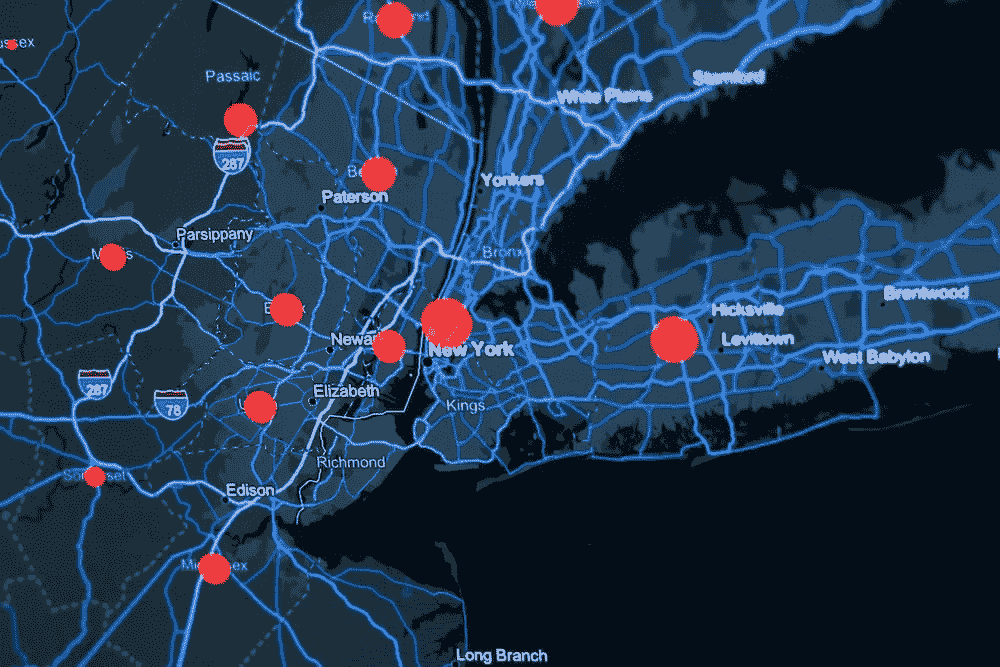

# 地图语言：地理空间数据格式与坐标指南

> 原文：[`towardsdatascience.com/the-language-of-maps-a-guide-to-geospatial-data-formats-and-coordinates-06382df7db36?source=collection_archive---------11-----------------------#2024-01-17`](https://towardsdatascience.com/the-language-of-maps-a-guide-to-geospatial-data-formats-and-coordinates-06382df7db36?source=collection_archive---------11-----------------------#2024-01-17)

## 从 GeoJSON 到 UTM，这些工具帮助我们绘制世界地图！

[](https://bench-5.medium.com/?source=post_page---byline--06382df7db36--------------------------------)[](https://towardsdatascience.com/?source=post_page---byline--06382df7db36--------------------------------) [Ben Chamblee](https://bench-5.medium.com/?source=post_page---byline--06382df7db36--------------------------------)

·发表于 [Towards Data Science](https://towardsdatascience.com/?source=post_page---byline--06382df7db36--------------------------------) ·阅读时间：6 分钟 ·2024 年 1 月 17 日

--



图片来自[KOBU Agency](https://unsplash.com/@kobuagency)，图片来源：[Unsplash](https://unsplash.com/)

每当我使用像 Google Maps 或 Uber 这样的工具时，我有时会忽略它们试图解决的挑战的复杂性。这些应用程序需要进行高度复杂的计算，同时展示一个带有通常非常精确数据的有趣地图。最起码，可以说我们在地理数据和制图工具方面取得了令人印象深刻的进展！

在本文中，我将带你了解一些数据科学家和工程师使用的最流行的数据格式和坐标。如果你曾经看过[世界地图投影](https://en.wikipedia.org/wiki/List_of_map_projections)，你会知道有很多不同的方法来可视化空间地理，而尽管本指南没有涵盖所有的工具，但它应该能够为你提供一些更流行工具的概览。

**地理空间数据格式**

**GeoJSON**

```py
{
  "type": "Feature",
  "geometry": {
    "type": "Point",
    "coordinates": [125.6, 10.1]
  },
  "properties": {
    "name": "Dinagat Islands"
  }
}
```

如果你曾经使用过 JSON 数据，那么 GeoJSON 数据应该看起来非常熟悉！GeoJSON 数据易于处理，也很简单，用户可以轻松地…
