# 构建可靠 AI 应用程序的 LLM 三角原则

> 原文：[`towardsdatascience.com/the-llm-triangle-principles-to-architect-reliable-ai-apps-d3753dd8542e?source=collection_archive---------0-----------------------#2024-07-16`](https://towardsdatascience.com/the-llm-triangle-principles-to-architect-reliable-ai-apps-d3753dd8542e?source=collection_archive---------0-----------------------#2024-07-16)

## 软件设计原则，用于精心设计可靠且高性能的 LLM 应用程序。这是一个弥合潜力与生产级性能之间差距的框架。

[](https://medium.com/@almogbaku?source=post_page---byline--d3753dd8542e--------------------------------)[](https://towardsdatascience.com/?source=post_page---byline--d3753dd8542e--------------------------------) [Almog Baku](https://medium.com/@almogbaku?source=post_page---byline--d3753dd8542e--------------------------------)

·发表于[Towards Data Science](https://towardsdatascience.com/?source=post_page---byline--d3753dd8542e--------------------------------) ·阅读时间 16 分钟·2024 年 7 月 16 日

--

大型语言模型（LLM）具有巨大的潜力，但开发可靠的生产级应用程序仍然具有挑战性。经过构建数十个 LLM 系统后，我将成功的公式提炼为 3+1 个基本原则，任何团队都可以应用。

> “LLM 本地应用程序是 10%的复杂模型，和 90%的实验性数据驱动的工程工作。”

构建生产就绪的 LLM 应用程序需要*细致的工程实践*。当用户无法*直接*与 LLM 互动时，提示语必须精心编写，以涵盖所有细节，因为*迭代的用户反馈可能不可用*。

# 介绍 LLM 三角原则

LLM 三角原则概括了构建有效 LLM 本地应用程序的基本指南。它们提供了一个坚实的概念框架，引导开发人员构建健壮且可靠的 LLM 本地应用程序，并提供方向和支持。

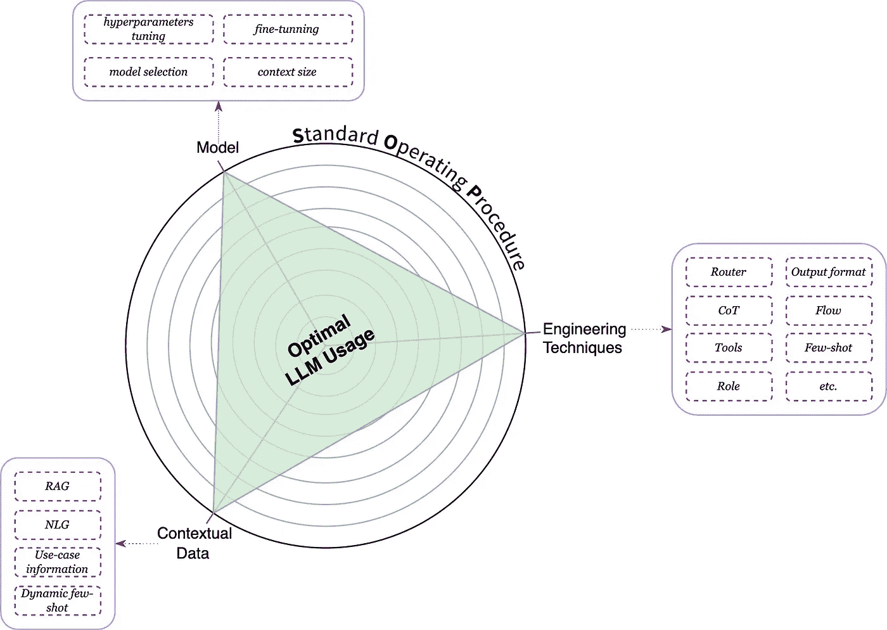

通过 SOP 的视角来优化三个突出原则，可以实现最佳的 LLM 使用。（图片来源：作者）

## 关键顶点

LLM 三角原则介绍了四个编程原则，帮助您设计和构建 LLM 本地应用程序。

第一个原则是*标准操作程序（****SOP****）*。SOP 引导着我们三角形的三个顶点：***模型***、***工程技术***和***上下文数据***。

通过**SOP 的视角**来优化三个顶点的原则是**确保高性能**LLM 本地应用的关键。

# 1. 标准操作程序（SOP）

[**标准操作程序（SOP）**](https://en.wikipedia.org/wiki/Standard_operating_procedure)是工业界的一个著名术语。它是一套由大组织编写的逐步指令，帮助工人完成日常操作，并确保每次都能保持高质量和相似的结果。这实际上通过编写详细的指令，将没有经验或技术不熟练的工人转变为专家。

LLM 三角原则借鉴了 SOP 范式，并鼓励你**将模型视为一个经验不足/技术不熟练的工作人员**。通过“教导”模型专家如何完成任务，我们可以确保更高质量的结果。

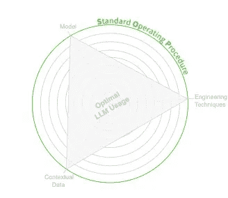

SOP ***指导***原理。（图片来源：作者）

> “没有 SOP，即使是最强大的 LLM 也无法持续交付高质量的结果。”

在思考**SOP *指导*原理**时，我们应该识别哪些技术将帮助我们最有效地实施 SOP。

## 1.1. 认知建模

要创建一个 SOP，我们需要选出表现最好的工人（领域专家），建模他们如何思考和工作以实现相同的结果，并将他们所做的每一步都记录下来。

在编辑和正式化后，我们将拥有详细的指令，帮助每一位经验不足或技能较低的工人取得成功，并产出卓越的工作成果。

像人类一样，*通过简化或分解任务来减轻认知负担*是至关重要的。遵循简单的逐步指令比繁琐复杂的程序更直接。

在这个过程中，我们识别出隐藏的[*隐性认知*](https://en.wikipedia.org/wiki/Implicit_cognition) *“跳跃”* —— 专家在无意识中采取的微小步骤，这些步骤会显著影响结果。这些细微的、无意识的、通常未言明的假设或决策，可能会大大影响最终结果。

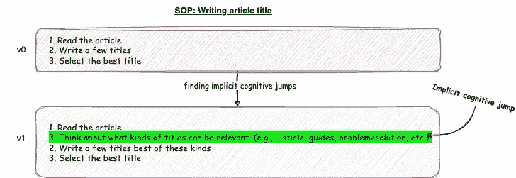

一个“隐性认知跳跃”的示例。（图片来源：作者）

例如，假设我们想要建立一个 SQL 分析师的模型。我们将通过面谈他们并询问几个问题，例如：

+   当你被要求分析一个商业问题时，你会怎么做？

+   你如何确保你的解决方案满足需求？

+   <将我们理解的过程反馈给面试对象>

+   这准确地反映了你的流程吗？ <获取修正>

+   等等。

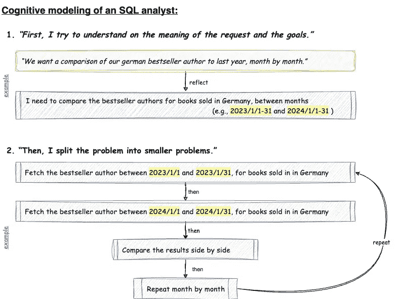

分析师进行的认知过程的一个示例，以及如何建模它。（图片来源：作者）

隐性认知过程有许多表现形式；一个典型的例子是“领域特定定义”。例如，“畅销书”可能是我们领域专家的一个显著术语，但对其他人来说却不一定如此。


扩展我们 SQL 分析师示例中的隐性认知过程。（图片来源：作者）

最终，我们将拥有一个完整的 SOP“配方”，使我们能够模仿我们顶尖的分析员。

在绘制这些复杂的过程时，将它们可视化为图形可能会非常有帮助。当过程非常细致，并且涉及许多步骤、条件和分支时，这尤其有用。

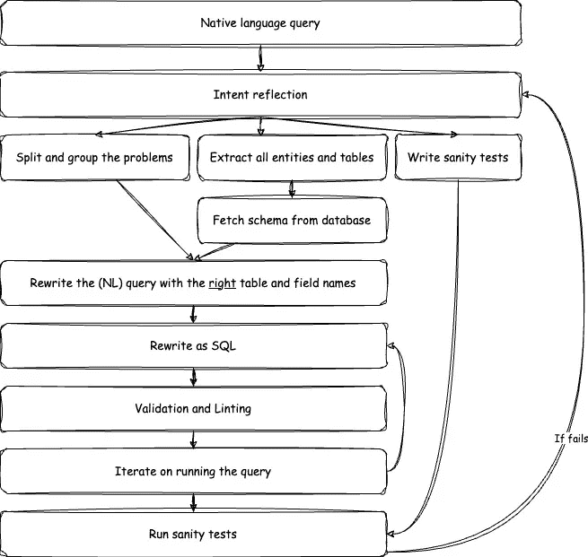

“SQL 分析员 SOP”包括所有必要的技术步骤，以图形方式呈现。（图片由作者提供）

我们的最终解决方案应模仿 SOP 中定义的步骤。在此阶段，尽量忽略实现细节——稍后，你可以在我们的解决方案中的一个或多个步骤/链条中实现它。

与其他原则不同，认知建模（SOP 编写）是*唯一独立的过程*。强烈建议在编写代码之前先对你的过程进行建模。话虽如此，在实施过程中，你可能会根据获得的新见解或理解，回头对其进行修改。

现在我们理解了制定清晰 SOP 的重要性，它指导了我们对问题的*业务理解*，接下来让我们探索如何利用各种工程技巧有效地实现它。

# 2\. 工程技巧

[工程技巧](https://www.promptingguide.ai/)帮助你实际实施 SOP 并从模型中获得最大收益。在思考**工程技巧原则**时，我们应该考虑哪些工具（技巧）能帮助我们实施和塑造 SOP，并协助模型与我们有效沟通。

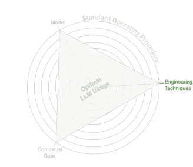

工程技巧原则。（图片由作者提供）

一些工程技巧仅在提示层中实现，而许多技巧则需要在软件层中才能生效，另外一些则结合了这两者。

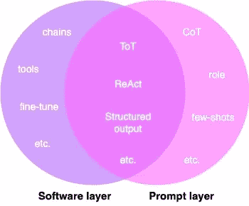

工程技巧层。（图片由作者提供）

虽然每天都会发现许多小细节和技巧，但我将涵盖两种主要技巧：工作流/链条和代理。

## 2.1\. LLM 原生架构（也叫流工程或链条）

LLM 原生架构描述了你的应用程序执行任务结果的代理流。

我们流程中的每个步骤都是一个独立的过程，必须执行才能实现我们的任务。一些步骤将仅通过确定性代码执行；对于某些步骤，我们将使用 LLM（代理）。

为了做到这一点，我们可以反思我们绘制的标准操作程序（SOP），并思考：

1.  我们应该将哪些 SOP 步骤组合到同一个代理中？又应该将哪些步骤拆分为不同的代理？

1.  哪些 SOP 步骤应该独立执行（但它们可能会接收来自前一步骤的信息）？

1.  我们可以在确定性代码中执行哪些 SOP 步骤？

1.  等等。

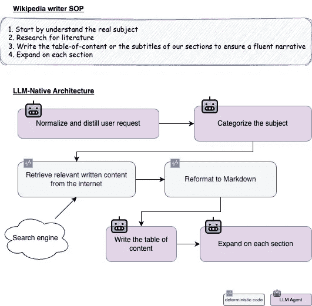

基于给定 SOP 的“维基百科写作员”LLM 原生架构示例。（图片由作者提供）

在进入我们架构/图表的下一步之前，我们应该定义其关键属性：

+   **输入和输出** — 这一步的签名是什么？我们在采取行动之前需要什么？（这也可以作为代理的输出格式）

+   **质量保证**— 什么样的响应才算是“足够好”？是否有需要人工干预的情况？我们可以配置什么样的断言？

+   **自主级别** — 我们需要对结果质量的控制有多大？这一阶段能处理什么范围的用例？换句话说，在这一点上，我们能多大程度上信任模型独立工作？

+   **触发器** — 下一步是什么？是什么决定了下一步？

+   **非功能性** — 需要什么样的延迟？我们是否需要在这里进行特别的业务监控？

+   **故障转移控制** — 可能发生什么样的故障（系统性和代理性）？我们的备选方案是什么？

+   **状态管理** — 我们需要特殊的状态管理机制吗？我们如何检索/保存状态（定义索引键）？我们需要持久存储吗？这个状态有哪些不同的使用场景（例如，缓存、日志记录等）？

+   等等。

## 2.2\. 什么是代理？

LLM 代理是 LLM-Native 架构中的独立组件，涉及调用 LLM。

这是一个包含上下文的 LLM 使用实例。并非所有代理都是相同的——有些会使用“工具”，有些则不会；有些可能只在流程中“使用一次”，而其他的则可以递归调用或多次调用，携带之前的输入和输出。

## 2.2.1\. 带工具的代理

一些 LLM 代理可以使用“工具”——用于执行任务如计算或网页搜索的预定义函数。代理输出指定工具和输入的指令，应用程序执行这些指令，并将结果返回给代理。

为了理解这个概念，我们来看看一个简单的提示实现，看看如何调用工具。即使是没有原生训练来调用工具的模型也能这样工作：

```py
You are an assistant with access to these tools:

- calculate(expression: str) -> str - calculate a mathematical expression
- search(query: str) -> str - search for an item in the inventory

Given an input, Respond with a YAML with keys: `func`(str) and `arguments`(map) or `message`(str).Given input
```

区分带工具的代理（因此是*自主代理*）和能够导致执行动作的代理非常重要。

> “自主代理是具有生成完成任务方式能力的代理。”

自主代理被*赋予权力*来**决定**是否采取行动以及采取什么行动。相比之下，（非自主）代理仅仅“处理”我们的请求（例如，分类），并基于这一过程，我们的确定性代码执行动作，模型对此没有任何控制。

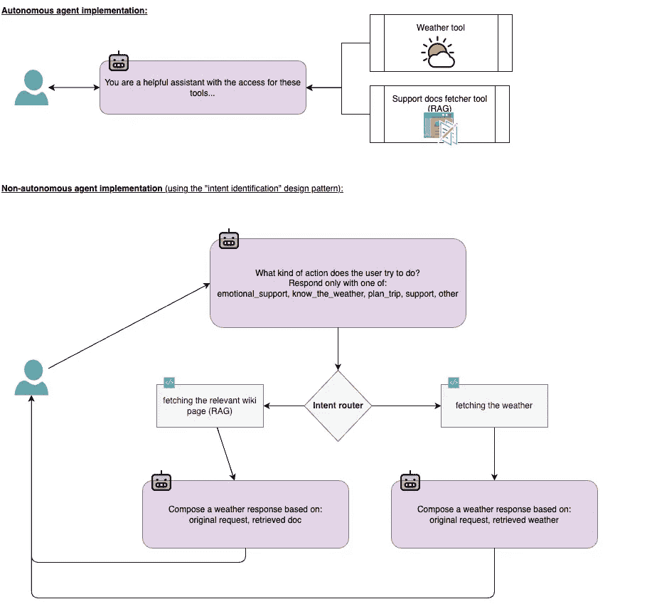

自主代理与触发动作的代理。（图片来自作者）

随着我们提高代理在规划和执行任务中的自主性，我们增强了其决策能力，但可能会降低对输出质量的控制。虽然这看起来像是一种神奇的解决方案，使其变得更加“智能”或“先进”，但这也意味着我们将失去对质量的控制。

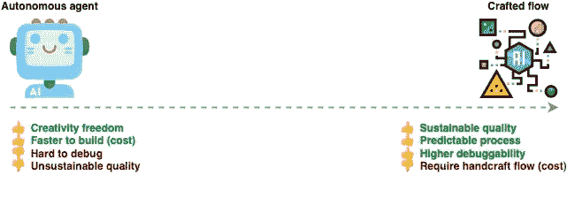

自主代理的权衡。（图片来自作者）

警惕完全自主代理的诱惑。尽管它们的架构看起来可能很有吸引力且更简单，但将其用于一切（或作为初始的 PoC）可能会从“真实生产”案例中产生误导。自主代理很难调试且不可预测（响应质量不稳定），这使得它们无法用于生产。

目前，代理（没有隐式引导）在规划复杂流程方面并不擅长，通常会跳过关键步骤。例如，在我们的“维基百科写作”用例中，它们会直接开始写作，跳过系统化的过程。这使得代理（特别是自主代理）仅能像模型一样好，或者更准确地说——仅能像它们相对于你的任务所训练的的数据一样好。

与其让代理（或一群代理）自由地做所有的端到端任务，不如尝试将它们的任务限定在你的流程/SOP 的特定区域，这些区域需要这种灵活性或创造性。这可以产生更高质量的结果，因为你可以享受两者的优点。

一个很好的例子是[AlphaCodium](https://www.codium.ai/blog/alphacodium-state-of-the-art-code-generation-for-code-contests/)：通过将结构化流程与不同的代理（包括一个迭代编写和测试代码的新型代理）结合，他们将 GPT-4 在 CodeContests 上的准确率（pass@5）从 19%提高到 44%。

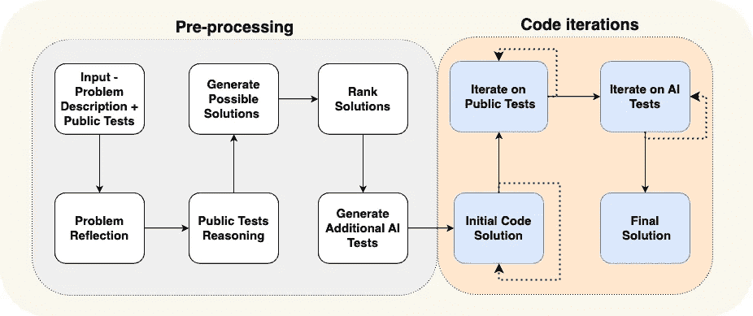

AlphaCodium 的 LLM 架构。（图片由[Codium.ai](https://www.codium.ai/)提供）

虽然工程技术为实施我们的 SOP 和优化 LLM 原生应用奠定了基础，但我们还必须仔细考虑 LLM 三角形中的另一个关键组成部分：模型本身。

# 3\. 模型

我们选择的模型是项目成功的关键组成部分——一个大型模型（如 GPT-4 或 Claude Opus）可能会产生更好的结果，但在大规模应用时成本非常高，而一个较小的模型可能不那么“智能”，但可以帮助节省预算。在思考**模型原则**时，我们应当确定我们的约束和目标，并找出哪种类型的模型可以帮助我们实现这些目标。

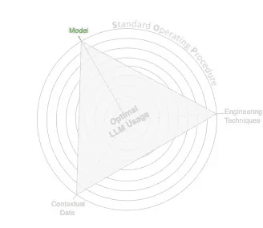

模型原则。（图片由作者提供）

> “并非所有 LLM 都是平等的。将模型与任务匹配。”

事实是，我们并不总是需要最大的模型；这取决于任务。为了找到合适的匹配，我们必须有一个实验过程，并尝试多种变体的解决方案。

借鉴我们的“经验不足的工人”类比——一个非常“聪明”的工人拥有许多学术资质，可能会轻松完成某些任务，但他们可能对这份工作来说资历过高，雇佣一个“更便宜”的候选人将更加具有成本效益。

在考虑一个模型时，我们应根据愿意承受的权衡来定义和比较解决方案：

+   **任务复杂性** — 较简单的任务（如摘要生成）可以用较小的模型更容易完成，而推理通常需要更大的模型。

+   **推理基础设施** — 它应该在云端运行还是在边缘设备上运行？模型的大小可能对小型手机产生影响，但对于云端服务而言可以容忍。

+   **定价** — 我们能够接受什么价格？从商业影响和预测使用角度来看，这是否具有成本效益？

+   **延迟** — 随着模型的增大，延迟也会增加。

+   **标注数据** — 我们是否有可以立即使用的数据，用来通过示例或相关信息丰富模型，而这些数据并未经过训练？

在许多情况下，直到你拥有“内部专业知识”，聘请一个有经验的工作人员可能会有助益 —— 对 LLM 也是如此。

如果你没有*标注数据*，可以从一个更强（更大的）模型开始，*收集数据*，然后利用它通过少量样本或微调来赋能模型。

## 3.1\. 微调模型

在对模型进行微调之前，有几个方面是必须考虑的：

+   **隐私** — 你的数据可能包含必须从模型中隔离的私人信息。如果数据中包含私人信息，你必须对数据进行匿名化，以避免法律责任。

+   **法律、合规性与数据权益** — 在训练模型时可能会出现一些法律问题。例如，OpenAI 的使用条款政策禁止你在没有 OpenAI 的情况下训练一个模型，使用生成的响应。另一个典型的例子是遵守 GDPR 法律，要求提供“撤销权”，用户可以要求公司从系统中删除信息。这就引发了关于是否需要重新训练模型的法律问题。

+   **更新延迟** — 训练模型时，延迟或数据截止时间要高得多。与通过上下文嵌入新信息（见下文“4. 上下文数据”部分）提供即时延迟不同，训练模型是一个需要时间的长期过程。因此，模型的重新训练频率较低。

+   **开发与运维** — 实施一个可重复、可扩展且可监控的微调管道至关重要，同时需要持续评估结果的性能。这个复杂的过程需要不断的维护。

+   **成本** — 由于重新训练的复杂性和每次训练所需的大量资源（如 GPU），重新训练被认为是昂贵的。

LLM 的能力，作为*上下文学习者*，以及新模型支持更大上下文窗口的事实，极大简化了我们的实现，并且即使没有微调也能提供优秀的结果。由于微调的复杂性，建议将其作为最后的手段，或完全跳过。

相反，为特定任务（例如，结构化 JSON 输出）或特定领域语言对模型进行微调可能会非常高效。一个小型的、任务特定的模型可能非常有效，并且在推理时比大型 LLM 更便宜。明智地选择你的解决方案，并在决定进行 LLM 训练之前，评估所有相关的考虑因素。

> “即使是最强大的模型，也需要相关且结构良好的上下文数据才能发挥作用。”

# 4. 上下文数据

***LLMs 是上下文学习者。*** 这意味着通过提供特定任务的信息，LLM 代理可以帮助我们执行任务，*无需*特殊的训练或微调。这使得我们能够轻松地“教授”新知识或技能。在考虑**上下文数据原则**时，我们应该目标是组织和建模可用数据，并在提示中如何组合这些数据。

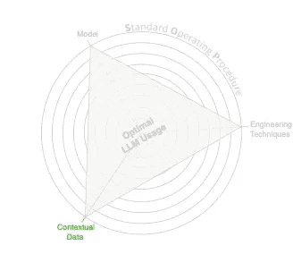

上下文数据原则。（图片由作者提供）

为了构建我们的上下文，我们将相关的（上下文）信息包含在发送给 LLM 的提示中。我们可以使用两种类型的上下文：

+   **嵌入式上下文** — 作为提示的一部分提供的嵌入信息

```py
You are the helpful assistant of <name>, a <role> at <company>
```

+   **附件上下文** — 一组由提示开始/结束连接的信息

```py
Summarize the provided emails while keeping a friendly tone.
---

<email_0>
<email_1>
```

上下文通常使用“提示模板”来实现（例如，[jinja2](https://jinja.palletsprojects.com/en/3.1.x/) 或 [mustache](https://mustache.github.io/) 或简单的原生[格式化字面量字符串](https://docs.python.org/3/reference/lexical_analysis.html#formatted-string-literals)）；这样，我们可以优雅地组合它们，同时保持提示的核心内容：

```py
# Embedded context with an attachment context
prompt = f"""
You are the helpful assistant of {name}. {name} is a {role} at {company}.

Help me write a {tone} response to the attached email.
Always sign your email with:
{signature}

---

{email}
"""
```

## 4.1. 少量学习

少量学习是一种强大的方式，通过示例“教” LLM，而无需进行大量微调。提供一些具有代表性的示例可以指导模型理解期望的格式、风格或任务。

例如，如果我们希望大型语言模型（LLM）生成电子邮件回复，可以在提示中包含一些写得很好的回复示例。这有助于模型学习首选的结构和语气。

我们可以使用多样化的示例，帮助模型捕捉到不同的边界情况或细微差别，并从中学习。因此，包含涵盖应用程序可能遇到的各种场景的多种示例是至关重要的。

随着应用程序的增长，您可能会考虑实现“[动态少量学习](https://arxiv.org/abs/1804.09458)”，该方法涉及程序化地为每个输入选择最相关的示例。虽然这增加了实现的复杂性，但它确保模型为每种情况提供最合适的指导，从而显著提高了在广泛任务中的性能，而无需昂贵的微调。

## 4.2. 检索增强生成

[检索增强生成（RAG）](https://www.promptingguide.ai/techniques/rag)是一种在生成响应之前检索相关文档以提供额外上下文的技术。它就像是给 LLM 一个快速浏览特定参考材料的机会，以帮助它形成答案。这使得响应保持最新且准确，而无需重新训练模型。

例如，在支持聊天应用中，RAG 可以提取相关的帮助台 Wiki 页面来帮助 LLM 回答问题。

这种方法通过将回答建立在检索到的事实基础上，帮助 LLM *保持最新* 并 *减少幻觉*。RAG 对于需要更新或专业知识的任务特别有用，而不需要重新训练整个模型。

例如，假设我们正在为我们的产品构建支持聊天。在这种情况下，我们可以使用 RAG 从帮助台 Wiki 中检索相关文档，然后将其提供给 LLM 代理，并要求它基于问题生成回答并提供文档。

在实现 RAG 时，有三个关键点需要关注：

+   **检索机制**—传统的 RAG 实现方式是通过向量相似度搜索来检索相关文档，但有时使用更简单的方法，如基于关键词的搜索（如[BM-25](https://en.wikipedia.org/wiki/Okapi_BM25)），可能更好或更便宜。

+   **索引数据结构—**天真地索引整个文档，而不进行预处理，可能会限制检索过程的效果。有时，我们需要添加一个数据准备步骤，例如基于文档准备一份问题和答案的列表。

+   **元数据—**存储相关的元数据可以更高效地引用和筛选信息（例如，将 Wiki 页面缩小到仅与用户特定产品查询相关的页面）。这层额外的数据结构可以简化检索过程。

## 4.3\. 提供相关上下文

与您的代理相关的上下文信息可能有所不同。虽然看起来提供过多的信息可能有益，但如果给模型（比如“非熟练工人”）提供太多信息，可能会让其感到不知所措且与任务无关。从理论上讲，这会导致模型学习无关的信息（或令牌连接），从而可能导致混淆和[幻觉](https://en.wikipedia.org/wiki/Hallucination_(artificial_intelligence))。

当 Gemini 1.5 发布并作为一个能够处理最多 1000 万个令牌的 LLM 时，一些从业者质疑上下文是否仍然是一个问题。虽然这是一个了不起的成就，特别是对于某些用例（例如与 PDF 聊天），但它仍然有限，特别是在推理多个文档时。

压缩提示并仅向 LLM 代理提供相关信息至关重要。这可以减少模型在无关令牌上的处理能力，提升质量，优化延迟，并降低成本。

有许多技巧可以提高提供上下文的相关性，其中大多数与如何存储和分类数据有关。

对于 RAG 应用程序，增加一种数据准备方法是非常有用的，它能塑造您存储的信息（例如，基于文档的问答，然后仅向 LLM 代理提供答案；这样，代理获得的是一个总结的、较短的上下文），并在检索到的文档上使用重新排序算法来细化结果。

> “数据为 LLM 原生应用程序提供动力。上下文数据的战略性设计释放了它们的真正潜力。”

# 结论与启示

LLM 三角原则提供了一种结构化的方法，用于开发高质量的 LLM 原生应用程序，解决了 LLM 巨大潜力与实际应用挑战之间的差距。开发人员可以通过关注 3+1 个关键原则——**模型**、**工程技术**和**上下文数据**——并由明确定义的**SOP**指导，来创建更可靠和有效的 LLM 驱动解决方案。

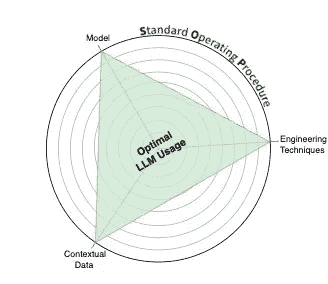

LLM 三角原则。（图片由作者提供）

## 关键要点

1.  **从明确的 SOP 开始**：模拟专家的认知过程，为您的 LLM 应用程序创建一个逐步指南。在考虑其他原则时，使用它作为指导。

1.  **选择合适的模型**：平衡能力与成本，并考虑先使用更大的模型，再可能转向较小的、微调过的模型。

1.  **利用工程技术**：实现 LLM 原生架构，并战略性地使用代理来优化性能和保持控制。尝试不同的提示技术，找到最适合您案例的提示。

1.  **提供相关上下文**：在适当时使用上下文学习，包括 RAG，但要小心不要用无关的信息让模型感到过载。

1.  **迭代和实验**：找到正确的解决方案通常需要测试和完善您的工作。我建议阅读并实施《构建 LLM 应用程序：清晰的逐步指南》，以获得详细的 LLM 原生开发过程指南。

通过应用 LLM 三角原则，组织可以超越简单的概念验证，开发出强大、可投入生产的 LLM 应用程序，真正发挥这一变革性技术的力量。

如果您觉得这篇白皮书对您有帮助，请在 Medium 上给它一些**掌声** 👏，并**分享**给您的 AI 爱好者朋友们。您的支持对我意义重大！🌍

让我们继续交流——随时通过电子邮件或[在 LinkedIn 上联系](https://www.linkedin.com/in/almogbaku/) 🤝

特别感谢[Gal Peretz](https://medium.com/u/532f8dc01db8?source=post_page---user_mention--d3753dd8542e--------------------------------)、[Gad Benram](https://medium.com/u/b45fa95a7293?source=post_page---user_mention--d3753dd8542e--------------------------------)、[Liron Izhaki Allerhand](https://medium.com/u/251cd1007ce8?source=post_page---user_mention--d3753dd8542e--------------------------------)、[Itamar Friedman](https://medium.com/u/bcd07dca5f93?source=post_page---user_mention--d3753dd8542e--------------------------------)、[Lee Twito](https://medium.com/u/241b56ab4bf?source=post_page---user_mention--d3753dd8542e--------------------------------)、[Ofir Ziv](https://medium.com/u/2db20f6d91e8?source=post_page---user_mention--d3753dd8542e--------------------------------)、[Philip Tannor](https://medium.com/u/5c5d2a69bcdb?source=post_page---user_mention--d3753dd8542e--------------------------------)、[Yair Livne](https://medium.com/u/6f8924605cf6?source=post_page---user_mention--d3753dd8542e--------------------------------)和[Shai Alon](https://medium.com/u/fa1f5e83a0c8?source=post_page---user_mention--d3753dd8542e--------------------------------)提供的见解、反馈和编辑意见。
