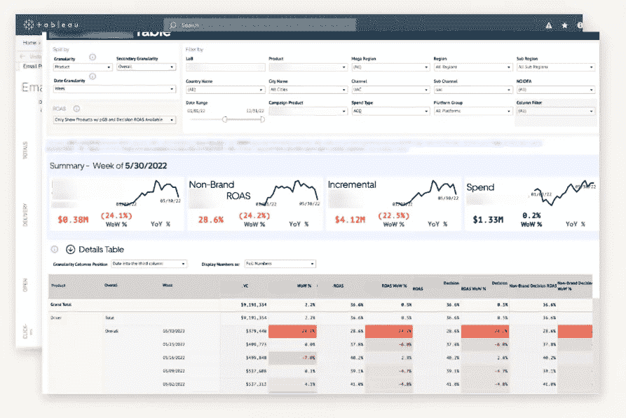
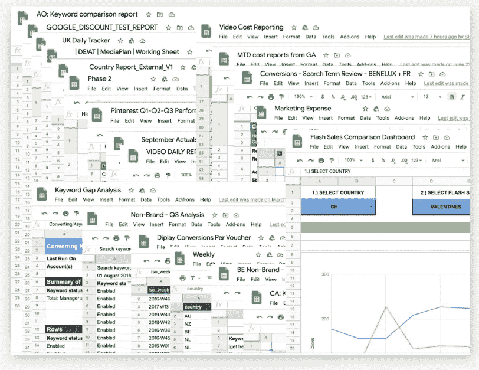
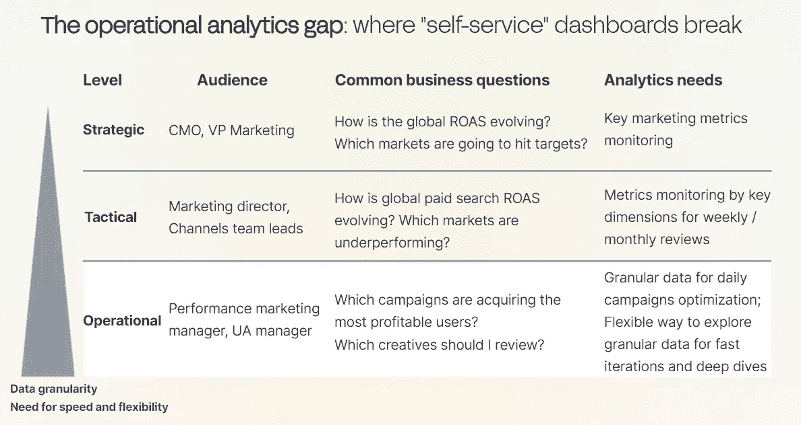
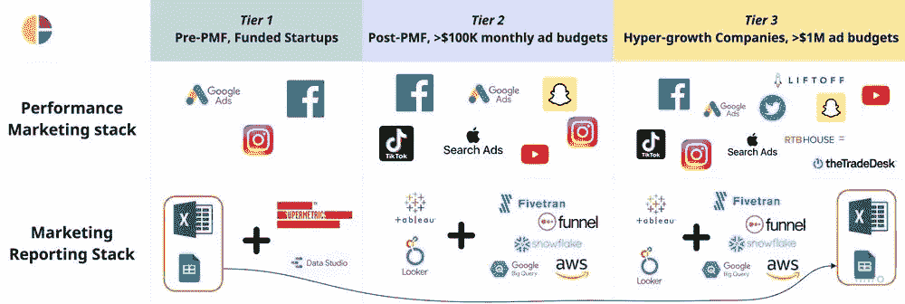

# 营销报告差距

> 原文：[`towardsdatascience.com/the-marketing-reporting-gap-9efc2d2a9ccc?source=collection_archive---------6-----------------------#2024-01-20`](https://towardsdatascience.com/the-marketing-reporting-gap-9efc2d2a9ccc?source=collection_archive---------6-----------------------#2024-01-20)

## 为什么营销人员转向电子表格以及如何弥合这一差距

 [João António Sousa](https://joao-antonio-sousa.medium.com/?source=post_page---byline--9efc2d2a9ccc--------------------------------)

·发表于 [Towards Data Science](https://towardsdatascience.com/?source=post_page---byline--9efc2d2a9ccc--------------------------------) ·阅读时间 5 分钟·2024 年 1 月 20 日

--

注意差距（图像由作者提供）

营销通常是分析的主要应用场景。大多数绩效营销人员都是数据驱动且具有数据素养的。他们希望利用数据来优化营销活动并实现他们的投资回报率目标。

然而，自助分析未能达到预期，尤其是对于那些运行数千个针对不同产品、多个市场和渠道的复杂营销团队来说，情况尤为严重。

让我们分析一下期望与现实之间的差距。

# 期望

期望 — BI 工具仪表板作为营销分析的单一真实数据源（图像由作者提供）

数据团队负责营销仪表板，确定每个团队的需求和要求。他们构建一个包含品牌和类别所有数据的单一真实数据源，并在 BI 仪表板上供营销人员访问。

期望是高层次的仪表板和核心的深度分析就足够了，电子表格将不再使用。

这一期望很容易破裂……

# 现实

现实 — 营销人员在电子表格上运行分析（图像由作者提供）

仪表板缺乏深入分析所需的粒度和灵活性（例如，关键字或创意层面的分析），并且不适合特定的营销分析，如预算或进度管理。此外，营销活动变化非常迅速。分析需求也在很短的时间内发生变化（例如，新的渠道、新的度量标准、新的维度）。

营销人员依赖数据团队提供任何更新，例如度量标准或维度的变化。报告请求需要等待数据团队的优先排序，这通常耗时过长。

营销人员等不及了。他们有预算需要管理，还有 ROAS 目标要实现——赌注很高。

备用解决方案？电子表格。

# 为什么营销团队不断使用电子表格？

> “在我们的 BI 工具中，我们没有营销同事所需要的数据粒度。为了优化他们的活动，他们需要深入到创意和关键词层面。——数据负责人

仪表盘非常适合高层次的指标监控和基本的深度分析，满足管理者、主管和副总裁的需求。日常和每周的操作性决策需要更高的粒度和灵活性。这就是为什么“自助”仪表盘在操作性用例中失效的原因，通常这些用例由表现营销经理和用户获取经理等个人贡献者负责。

操作性分析差距：“自助”仪表盘的瓶颈（图示由作者提供）

在任何公司早期，营销分析都依赖于电子表格。随着数据团队构建现代数据架构，通常预期电子表格会逐渐消失。它们确实会在一段时间内消失。然而，在公司继续发展、扩展到新渠道和市场、启动更多活动等后期阶段，仍然需要更细粒度的分析，以满足业务的速度。这时，电子表格又回来了。

表现营销和报告架构的演变（感谢 Clarisights 提供）

电子表格是进行细粒度分析、快速响应业务需求的首选解决方案。营销人员可以完全控制它们，并通过快速反馈周期来验证他们的假设。

电子表格是现有仪表盘的一个很好的补充。

然而，这种现实存在许多缺点和弊端。

# 这种差距如何导致错失机会

对营销团队来说，这种现实导致了预算浪费和 ROAS 不佳。

**虽然预算是在更高层级决定的，但执行发生在各个贡献者的细粒度层面**。表现营销经理和用户获取经理负责管理这些活动，最终掌控 ROAS 指标。

基于电子表格的分析涉及手动工作流程，即从渠道平台下载数据或使用连接器工具，建模数据并进行分析。这些手动过程和工作流程非常耗时且容易出错。

电子表格还缺乏数据治理，导致多个“真相”来源、信息孤岛和混乱。常见的症状是典型的提问：“为什么数字不匹配？”

在电子表格上管理大量营销预算远非理想。既然我们已经了解了这种现实如何导致错失机会，接下来让我们思考如何弥补这一差距。

# 如何弥补这一差距

弥补这一差距通常需要在四个关键要素（文化、人员、工具、流程）之间开展工作。从哪里开始以及优先处理什么取决于你当前的情况。这就是你应该开始的地方：深入了解你的市场营销团队如何进行分析。不要只是问他们，而是坐到他们旁边，让他们带你了解他们的日常和每周工作流程。这将帮助你了解从哪里开始，并描绘出你当前状况与理想状态之间的差距。

## 你不应如何处理这个挑战

数据团队有时会被这种情况困扰，或者干脆忽视它。这并不是解决问题的正确方式。避免对你所构建的仪表板和解决方案产生情感依赖。同时，避免像“市场营销人员不知道如何使用我们的 BI 工具，因此他们使用电子表格”这样的简单解释。这些陷阱会导致人际摩擦，使问题更加严重。

相反，应该通过接近市场营销团队来了解当前的情况。将这一差距视为一个重大的机会，可以对业务产生深远影响，并提高数据的投资回报率。

以下，我将分享一些应对这一差距的通用最佳实践。

## 最佳实践

尽管具体的行动点取决于你的具体情况，但以下是四个关键要素中的一些最佳实践：

+   **工具**：考虑构建或开发适合市场营销特定操作流程的辅助工具。你应该绘制出哪些需求可以通过你的仪表板来满足，哪些使用案例需要更灵活和精细化的解决方案。理想情况下，你应该力求构建或购买一个综合解决方案，结合电子表格的灵活性与 BI 解决方案的规模和治理。

+   **文化**：促进一种数据文化，强调与营销团队之间的强有力合作，而不是放弃（即典型的回答——“他们不知道如何使用我们的 BI 工具”）。挑战现有的假设，寻求理解背后的原因。提出一个坚实的商业案例来解决这个机会，并获得高层的支持。

+   **人员**：将分析师嵌入到市场营销团队中，以培养业务和领域专长。促进这些数据分析师与市场营销人员之间的紧密关系。推广关于市场营销需求、使用案例和工作流程的知识共享会议。

+   **流程**：围绕理想的工作流程制定最佳实践（例如，“进行关键词分析的最佳方式是什么”）。同时，确保定期与市场营销人员进行接触，收集他们的反馈，并就接下来的工作达成一致。你应将定性反馈（即定期接触点）与定量方法（例如，季度调查）相结合。

— — — — — — — — — — — — — — — — — — — — — — — — — — — — — — — — — — —

*有什么想法？请联系* [*João Sousa*](https://www.linkedin.com/in/joaoantoniosousa/)，*Clarisights 的市场推广负责人* [*Clarisights*](https://clarisights.com/)*。敬请期待更多关于市场营销分析和报告的文章。*
