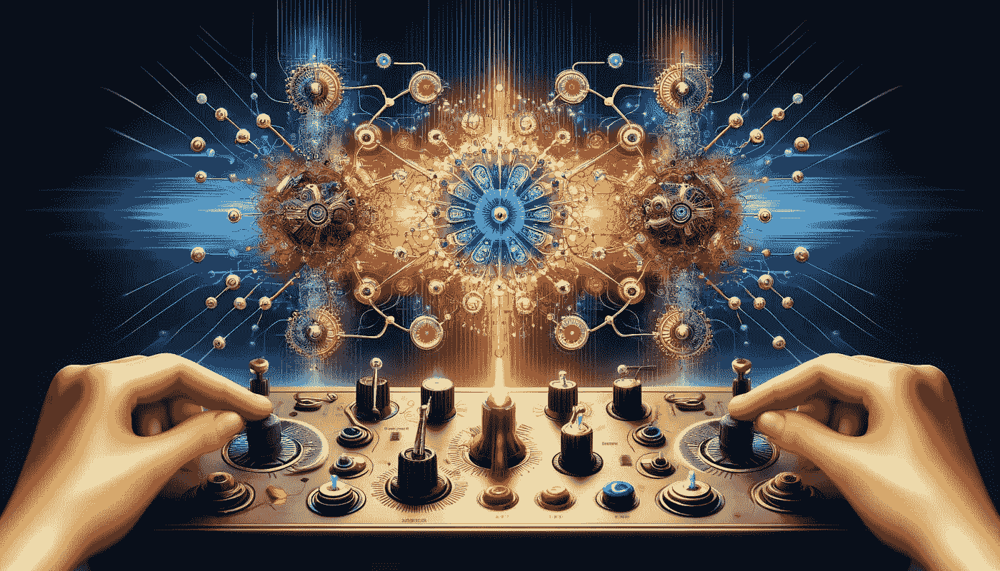

# 深度神经网络微调背后的数学

> 原文：[`towardsdatascience.com/the-math-behind-fine-tuning-deep-neural-networks-8138d548da69?source=collection_archive---------0-----------------------#2024-04-03`](https://towardsdatascience.com/the-math-behind-fine-tuning-deep-neural-networks-8138d548da69?source=collection_archive---------0-----------------------#2024-04-03)

## 深入了解微调神经网络的技术，理解其数学原理，从零开始构建神经网络，并探索其应用。

 [Cristian Leo](https://medium.com/@cristianleo120?source=post_page---byline--8138d548da69--------------------------------)

·发表于 [Towards Data Science](https://towardsdatascience.com/?source=post_page---byline--8138d548da69--------------------------------) ·阅读时间 31 分钟·2024 年 4 月 3 日

--

图片来源：DALL-E

虽然在机器学习中，你可能通过尝试一些模型、选择最佳表现者并调整一些设置来取得进展，但深度学习并不遵循相同的规则。如果你曾经尝试过神经网络，可能会注意到它们的表现有时好有时差。你甚至可能看到像逻辑回归这样的简单方法战胜了你复杂的 200 层深度神经网络。

为什么会发生这种情况呢？深度学习是我们拥有的最先进的 AI 技术之一，但它需要扎实的理解和小心的操作。了解如何微调神经网络、弄清楚它内部发生了什么并掌握其使用方法至关重要。这就是我们今天要深入探讨的内容！

在我们开始这篇文章之前，我建议你打开这个 Jupyter Notebook。它包含了我们今天要讲解的所有代码，随时查看将帮助你更容易跟上内容：
