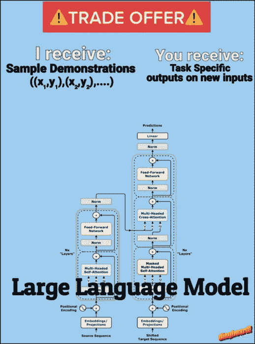
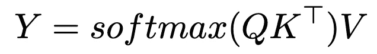
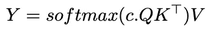
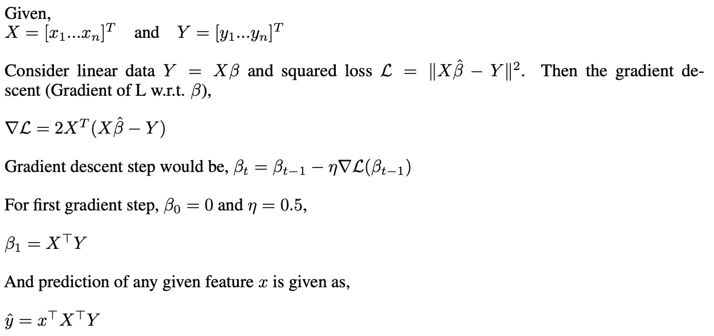
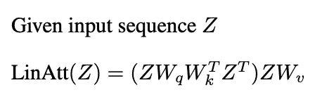
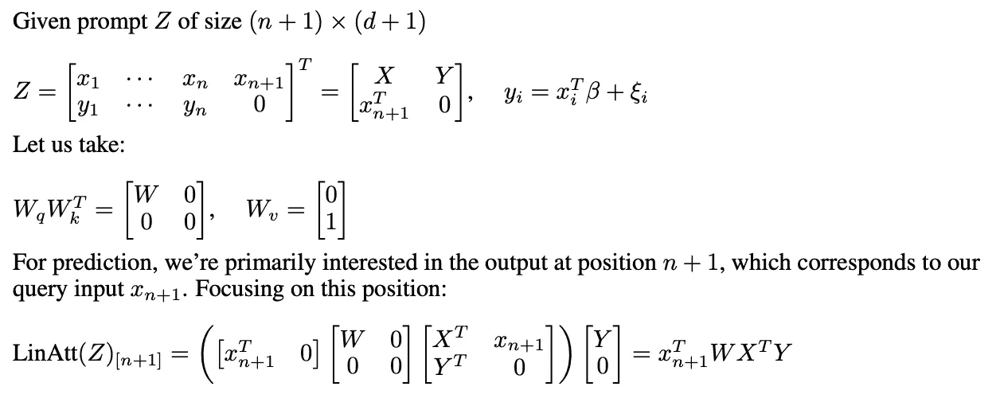
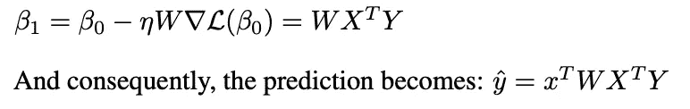

# 上下文学习背后的数学原理

> 原文：[`towardsdatascience.com/the-math-behind-in-context-learning-e4299264be74?source=collection_archive---------4-----------------------#2024-12-31`](https://towardsdatascience.com/the-math-behind-in-context-learning-e4299264be74?source=collection_archive---------4-----------------------#2024-12-31)

## 从注意力到梯度下降：解开变换器如何从示例中学习的奥秘

 [Shitanshu Bhushan](https://medium.com/@shitanshu273?source=post_page---byline--e4299264be74--------------------------------)

·发表于 [Towards Data Science](https://towardsdatascience.com/?source=post_page---byline--e4299264be74--------------------------------) ·阅读时间 6 分钟·5 天前

--

上下文学习（ICL）——一种基于输入提示中提供的示例来调整行为的变换器能力——已成为现代大型语言模型（LLM）应用的基石。少量示例提示，提供几个所需任务的示例，特别有效地向 LLM 展示我们希望它执行的任务。但这里有个有趣的部分：为什么变换器能如此轻松地根据这些示例调整其行为？在本文中，我将为你提供一种直观的理解，说明变换器是如何完成这种学习技巧的。

来源：作者提供的图片（使用 [dingboard](https://dingboard.com) 制作）

这将提供一个关于上下文学习潜在机制的高级介绍，这可能帮助我们更好地理解这些模型如何处理和适应示例。

ICL 的核心目标可以表述为：给定一组示范对（(x,y) 对），我们能否展示注意力机制能够学习/实现一种算法，该算法从这些示范中形成假设，以正确地将新的查询映射到其输出？

# Softmax 注意力

让我们回顾一下基本的 softmax 注意力公式，

来源：作者提供的图片

我们都听说过温度如何影响模型输出，但实际发生了什么呢？关键在于我们如何使用逆温度参数修改标准的 softmax 注意力。这个单一变量会改变模型分配注意力的方式——在通过 softmax 之前缩放注意力分数，会使得分布从平缓逐渐变得尖锐。这会稍微修改注意力公式，如下所示，

来源：图片由作者提供

其中 c 是我们的逆温度参数。考虑一个简单的向量 z = [2, 1, 0.5]。让我们看看 softmax(c*z) 在不同 c 值下的表现：

当 c = 0 时：

+   softmax(0 * [2, 1, 0.5]) = [0.33, 0.33, 0.33]

+   所有 token 都受到相等的关注，完全失去了区分相似性的能力

当 c = 1 时：

+   softmax([2, 1, 0.5]) ≈ [0.59, 0.24, 0.17]

+   注意力根据相似度分配，保持选择和分配之间的平衡

当 c = 10000（接近无穷大）时：

+   softmax(10000 * [2, 1, 0.5]) ≈ [1.00, 0.00, 0.00]

+   注意力会收敛成一个独热向量，完全聚焦于最相似的 token——这正是我们需要的最近邻行为

现在，在上下文学习方面有趣的地方来了：当 c 趋向于无穷大时，我们的注意力机制本质上变成了一个 1-最近邻搜索！想想看——如果我们关注所有的 token 除了我们的查询，我们基本上是在从演示示例中找到最接近的匹配。这为我们提供了一个新的视角来看待 ICL——我们可以将其视为在输入输出对上实现最近邻算法，全部通过注意力机制来完成。

但当 c 是有限的时会发生什么呢？在这种情况下，注意力更像是一个高斯核平滑算法，它根据每个 token 的指数相似度来加权。

我们看到 Softmax 可以执行最近邻操作，很棒，但知道这一点有什么意义呢？如果我们能说 Transformer 可以学习一个“学习算法”（比如最近邻、线性回归等），那么也许我们可以将它应用于 AutoML 领域，只需给它一堆数据，让它找到最佳模型/超参数；[Hollmann 等人](https://arxiv.org/pdf/2207.01848)做了类似的事情，他们训练了一个 Transformer 在许多合成数据集上，来有效学习整个 AutoML 流水线。Transformer 学会了自动确定哪种类型的模型、超参数和训练方法最适合任何给定的数据集。当遇到新数据时，它可以通过一次前向传播来进行预测——本质上将模型选择、超参数调优和训练浓缩成一步。

在 2022 年，Anthropic 发布了一篇论文，展示了[归纳头可能构成 ICL 机制](https://arxiv.org/pdf/2209.11895)的证据。什么是归纳头？正如 Anthropic 所述——“归纳头是通过由不同层次的两个注意力头组成的电路来实现的，这两个注意力头协同工作以复制或完成模式。”简单来说，归纳头的作用是，对于像[…, A, B,…, A]这样的序列，它将使用 B 来完成序列，推理的依据是，如果在上下文中 A 后面跟着 B，那么 A 后面很可能会再次跟着 B。当你有一个像“…A, B…A”这样的序列时，第一个注意力头会将之前的标记信息复制到每个位置，而第二个注意力头则使用这些信息来查找 A 之前出现的位置，并预测其后出现的内容（B）。

最近，许多研究表明，transformer 可能通过梯度下降实现 ICL（[Garg et al. 2022](https://arxiv.org/pdf/2208.01066)，[Oswald et al. 2023](https://arxiv.org/pdf/2212.07677)等），通过展示线性注意力与梯度下降之间的关系。让我们重新审视最小二乘法和梯度下降，

来源：作者提供的图像

现在让我们看看这与线性注意力有何关联

# 线性注意力

在这里，我们将线性注意力视为与 softmax 注意力相同，只是去除了 softmax 操作。基本的线性注意力公式，

来源：作者提供的图像

让我们从单层构建开始，捕捉上下文学习的本质。假设我们有 n 个训练样本（x₁,y₁)…（xₙ,yₙ），并且我们想要为一个新的输入 x_{n+1}预测 y_{n+1}。

来源：作者提供的图像

这看起来与我们在梯度下降中得到的非常相似，除了在线性注意力中我们有一个额外的项‘W’。线性注意力实现的是一种叫做预条件梯度下降（**PGD**）的东西，在这种方法中，我们不是使用标准的梯度步骤，而是通过预处理矩阵 W 来修改梯度，

来源：作者提供的图像

我们在这里展示的是，我们可以构造一个权重矩阵，使得一层线性注意力能够执行一步 PGD。

# 结论

我们看到注意力如何实现“学习算法”，这些算法的基本思路是，如果我们提供大量的示范（x，y），那么模型就能从这些示范中学习，并预测任何新查询的输出。尽管涉及多个注意力层和 MLP 的具体机制非常复杂，但研究人员在理解上下文学习的工作机制方面已取得了一定进展。本文提供了一个直观的高层次介绍，帮助读者理解 transformers 这种新兴能力的内部工作原理。

要了解更多关于这个话题的内容，我建议阅读以下几篇论文：

[上下文学习与引导头](https://transformer-circuits.pub/2022/in-context-learning-and-induction-heads/index.html)

[变换器在上下文中能学到什么？一个简单函数类别的案例研究](https://arxiv.org/pdf/2208.01066)

[变换器通过梯度下降进行上下文学习](https://arxiv.org/pdf/2212.07677)

[变换器学习实现预条件化梯度下降以进行上下文学习](https://arxiv.org/pdf/2306.00297)

# 致谢

这篇博客文章的灵感来源于我在 2024 年秋季于密歇根大学的研究生课程。尽管这些课程提供了探索这些主题的基础知识和动力，但文中任何的错误或误解完全是我个人的责任。这代表了我对相关材料的个人理解和探索。
