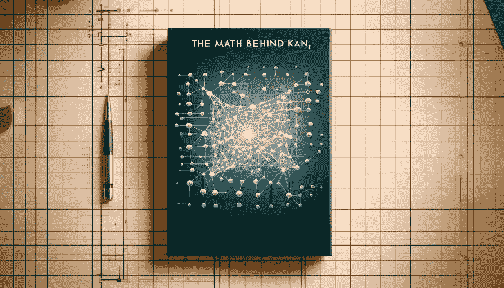

# KAN 背后的数学 — 科尔莫戈罗夫-阿诺德网络

> 原文：[`towardsdatascience.com/the-math-behind-kan-kolmogorov-arnold-networks-7c12a164ba95?source=collection_archive---------0-----------------------#2024-06-12`](https://towardsdatascience.com/the-math-behind-kan-kolmogorov-arnold-networks-7c12a164ba95?source=collection_archive---------0-----------------------#2024-06-12)

## 一种新的替代经典多层感知器的神经网络出现了。为什么它更准确且具有更好的可解释性？深入探讨数学与代码。

 [Cristian Leo](https://medium.com/@cristianleo120?source=post_page---byline--7c12a164ba95--------------------------------)

·发布于 [Towards Data Science](https://towardsdatascience.com/?source=post_page---byline--7c12a164ba95--------------------------------) ·13 分钟阅读·2024 年 6 月 12 日

--

图像由 DALL-E 生成

在当今的人工智能世界中，神经网络推动了无数创新与进步。许多突破的核心是多层感知器（MLP），这是一种以逼近复杂函数能力著称的神经网络。但随着我们不断拓展人工智能的边界，我们不得不问：我们能比经典的多层感知器做得更好吗？

这就是科尔莫戈罗夫-阿诺德网络（KAN），一种受科尔莫戈罗夫-阿诺德表示定理启发的新型神经网络方法。与传统的多层感知器（MLP）不同，后者在每个神经元上使用固定的激活函数，而 KAN 则在网络的边缘（权重）上使用可学习的激活函数。这个简单的变化为准确性、可解释性和效率开辟了新的可能性。

本文探讨了为什么 KAN 是神经网络设计中的革命性进展。我们将深入分析它们的数学基础，强调它们与 MLP 的关键差异，并展示 KAN 如何超越传统方法。

# 1：多层感知器的局限性
