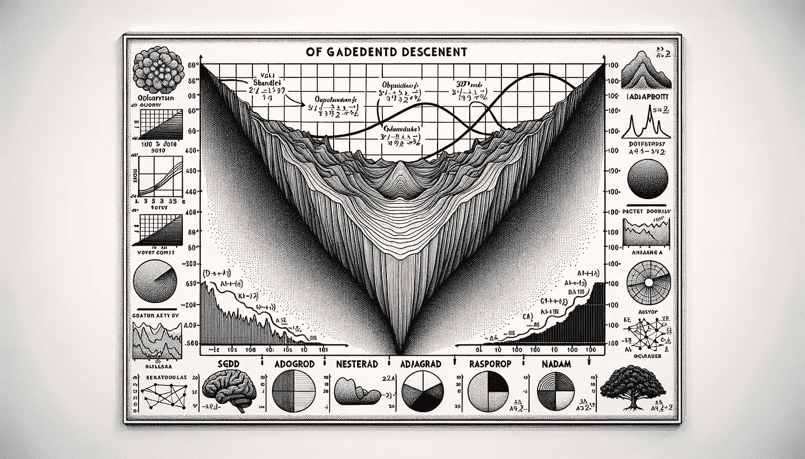

# Keras 3 优化器背后的数学原理：深入理解与应用

> 原文：[`towardsdatascience.com/the-math-behind-keras-3-optimizers-deep-understanding-and-application-2e5ff95eb342?source=collection_archive---------1-----------------------#2024-08-17`](https://towardsdatascience.com/the-math-behind-keras-3-optimizers-deep-understanding-and-application-2e5ff95eb342?source=collection_archive---------1-----------------------#2024-08-17)

## 这与书中所说的有些不同。

 [Peng Qian](https://qtalen.medium.com/?source=post_page---byline--2e5ff95eb342--------------------------------)

·发表于 [Towards Data Science](https://towardsdatascience.com/?source=post_page---byline--2e5ff95eb342--------------------------------) ·9 分钟阅读·2024 年 8 月 17 日

--

Keras 3 优化器背后的数学原理：深入理解与应用。图片来自 DALL-E-3

# 介绍

优化器是每个从事机器学习工作的人必不可少的一部分。

我们都知道，优化器决定了模型在梯度下降过程中如何收敛损失函数。因此，选择合适的优化器可以提升模型训练的性能和效率。

除了经典论文，许多书籍也用简单的语言解释了优化器背后的原理。

然而，我最近发现 Keras 3 的优化器表现并不完全符合这些书中描述的数学算法，这让我有些焦虑。我担心自己误解了某些内容，或者 Keras 最新版本的更新影响了优化器的表现。

所以，我回顾了 Keras 3 中几种常见优化器的源代码，并重新审视了它们的应用场景。现在，我希望分享这些知识，以节省你们的时间，帮助你们更快掌握 Keras 3 优化器。

如果你不太熟悉 Keras 3 的最新变化，下面是一个快速概述：Keras 3 集成了 TensorFlow、PyTorch 和 JAX，使我们能够通过 Keras API 轻松使用前沿的深度学习框架。
