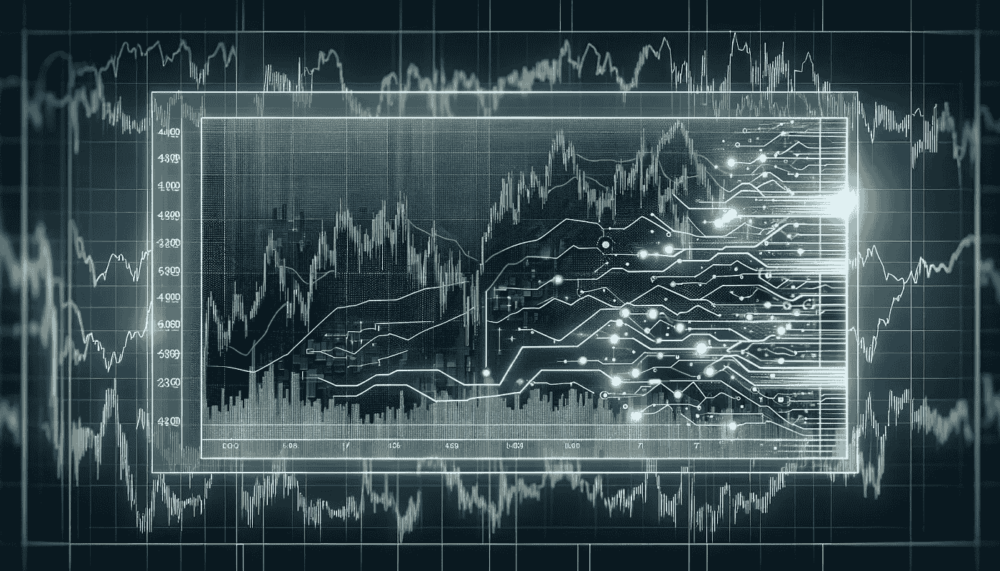

# LSTM 背后的数学

> 原文：[`towardsdatascience.com/the-math-behind-lstm-9069b835289d?source=collection_archive---------4-----------------------#2024-05-01`](https://towardsdatascience.com/the-math-behind-lstm-9069b835289d?source=collection_archive---------4-----------------------#2024-05-01)

## 深入了解 LSTM，理解其数学原理，并从零开始实现它们

 [Cristian Leo](https://medium.com/@cristianleo120?source=post_page---byline--9069b835289d--------------------------------)

·发布于 [Towards Data Science](https://towardsdatascience.com/?source=post_page---byline--9069b835289d--------------------------------) ·阅读时间 25 分钟·2024 年 5 月 1 日

--

图像由 DALL-E 生成

**索引**

**1: 介绍**

**2: LSTM 的架构**

∘ 2.1: LSTM 门控

∘ 2.2: 信息流管理

**3: LSTM 背后的数学**

∘ 3.1\. LSTM 单元中的数学

∘ 3.2: 门控机制

∘ 3.3: 与基本 RNN 单元操作的对比

**4: 使用 Python 从零构建 LSTM**

∘ 4.1: 导入和初步设置

∘ 4:2: LSTM 类

∘ 4.3: 训练与验证

∘ 4.4: 数据预处理

∘ 4.5: 模型训练

**5: 高级 LSTM 模型**

∘ 5.1: 双向 LSTM

∘ 5.2: 堆叠 LSTM

∘ 5.3: 窥视孔连接

**6: 结论**

参考文献

# 1: 介绍

在我们上次讨论循环神经网络（RNN）时，我们探讨了它们的设计如何使得它们能够有效地处理序列。这使得它们非常适合处理...
