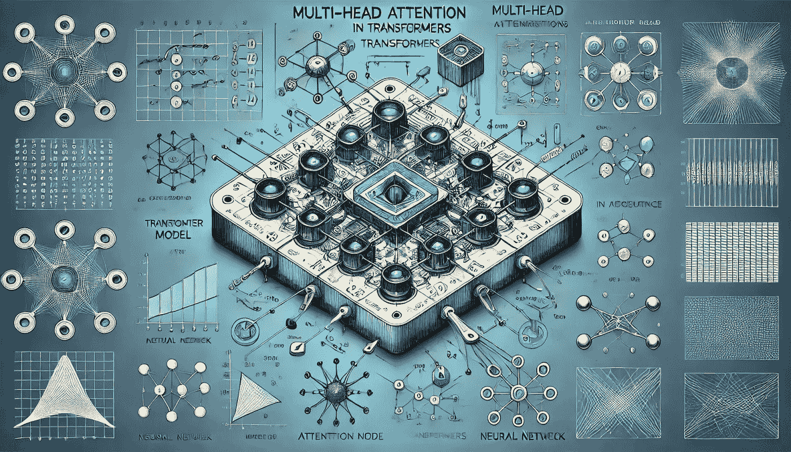
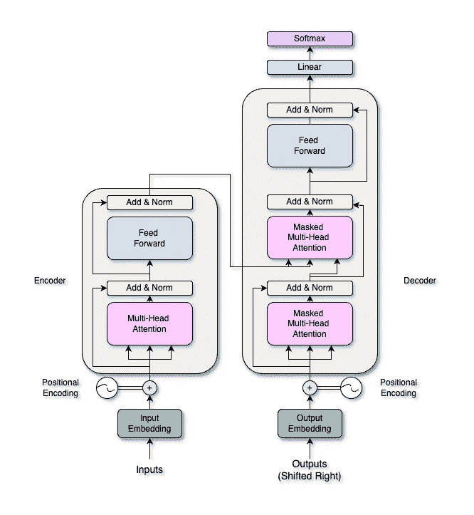

# Transformer 中的多头注意力背后的数学原理

> 原文：[`towardsdatascience.com/the-math-behind-multi-head-attention-in-transformers-c26cba15f625?source=collection_archive---------1-----------------------#2024-07-16`](https://towardsdatascience.com/the-math-behind-multi-head-attention-in-transformers-c26cba15f625?source=collection_archive---------1-----------------------#2024-07-16)

## 深入探讨 Transformer 和 LLM 中的秘密元素——多头注意力。让我们一起探索它的数学原理，并在 Python 中从零开始构建它。

 [Cristian Leo](https://medium.com/@cristianleo120?source=post_page---byline--c26cba15f625--------------------------------)

·发表于[Towards Data Science](https://towardsdatascience.com/?source=post_page---byline--c26cba15f625--------------------------------) ·阅读时间 16 分钟·2024 年 7 月 16 日

--

图片由 DALL-E 生成

# 1：简介

## 1.1：Transformer 概述

Transformer 架构由 Vaswani 等人在他们的论文“[Attention is All You Need](https://arxiv.org/abs/1706.03762)”中提出，彻底改变了深度学习，特别是在自然语言处理（NLP）领域。Transformers 使用自注意力机制，使其能够一次性处理输入序列。这种并行处理使得计算速度更快，同时更好地管理数据中的长距离依赖关系。这听起来不熟悉吗？别担心，文章的最后你会明白的。让我们首先简要了解一下 Transformer 的结构。

Transformer 架构（“[Attention is all you need](https://arxiv.org/abs/1706.03762)”中的架构） — 图片由作者提供

Transformer 由两个主要部分组成：**编码器**和**解码器**。编码器处理输入序列以创建连续表示，而解码器则从这个表示中生成输出序列。编码器和解码器都有多个……
