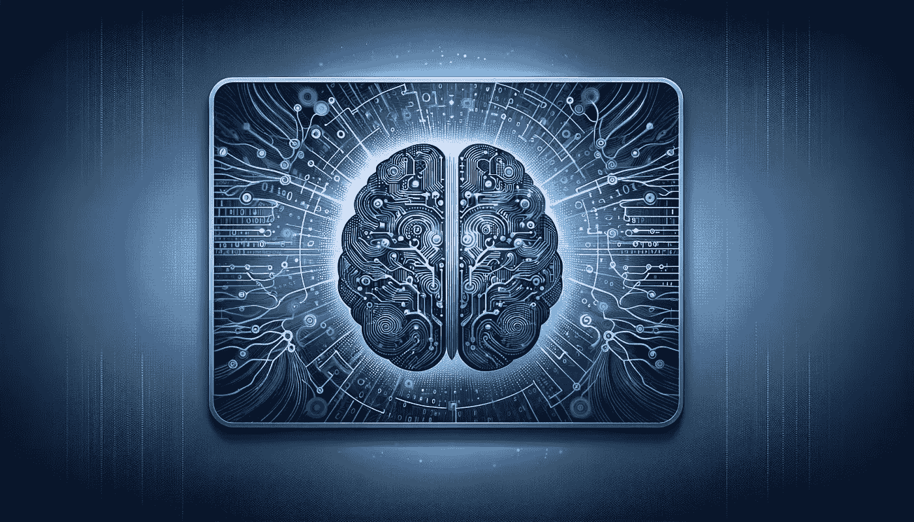

# 神经网络背后的数学原理

> 原文：[`towardsdatascience.com/the-math-behind-neural-networks-a34a51b93873?source=collection_archive---------0-----------------------#2024-03-29`](https://towardsdatascience.com/the-math-behind-neural-networks-a34a51b93873?source=collection_archive---------0-----------------------#2024-03-29)

## 深入了解神经网络——现代人工智能的核心，理解其背后的数学原理，从零开始实现，并探索其应用。

 [Cristian Leo](https://medium.com/@cristianleo120?source=post_page---byline--a34a51b93873--------------------------------)

·发表于 [Towards Data Science](https://towardsdatascience.com/?source=post_page---byline--a34a51b93873--------------------------------) ·28 分钟阅读·2024 年 3 月 29 日

--

图像来自 DALL-E

神经网络是人工智能（AI）的核心，推动了从图像识别到语言翻译等多种应用。在本文中，我们将深入探讨神经网络是什么，它是如何工作的，以及为什么它在当今科技驱动的世界中如此重要。

**索引**

**·** **1: 理解基础知识**

∘ 1.1: 什么是神经网络？

∘ 1.2: 神经网络的类型

**·** **2: 神经网络的架构**

∘ 2.1: 神经元的结构

∘ 2.2: 层

∘ 2.3: 学习中层的作用

**·** **3: 神经网络的数学原理**

∘ 3.1: 加权和

∘ 3.2: 激活函数

∘ 3.3: 反向传播：神经网络学习的核心

∘ 3.4: 步骤示例

∘ 3.5: 改进
