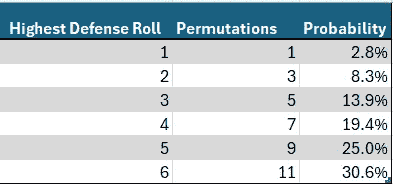

# 风险游戏背后的数学 — 第一部分

> 原文：[`towardsdatascience.com/the-math-behind-risk-part-1-35ed4e1f542d?source=collection_archive---------8-----------------------#2024-06-28`](https://towardsdatascience.com/the-math-behind-risk-part-1-35ed4e1f542d?source=collection_archive---------8-----------------------#2024-06-28)

## 在世界征服游戏中，进攻方真的有优势吗？

 [Menachem Rose](https://medium.com/@menachemrose1?source=post_page---byline--35ed4e1f542d--------------------------------)

·发布于[Towards Data Science](https://towardsdatascience.com/?source=post_page---byline--35ed4e1f542d--------------------------------) ·阅读时间 10 分钟·2024 年 6 月 28 日

--

我的一个好朋友（嘿，Aron）最近问我，在棋盘游戏《风险》中，进攻和防守的概率是多少。我知道亚历山大大帝和成吉思汗的征服不能完全通过《风险》的机制来解释，但这个问题依然很有趣，而且它很好地展示了概率和数据可视化在智能决策中的应用和作用。

图片由[Dave Photoz](https://unsplash.com/@mirapolis?utm_source=medium&utm_medium=referral)提供，发布于[Unsplash](https://unsplash.com/?utm_source=medium&utm_medium=referral)

对于那些不知道的人来说，《风险》是一款世界征服棋盘游戏，进攻方最多可以掷三个骰子，防守方最多掷两个骰子。双方中，掷出最大点数较低的一方失去一名士兵，若点数相同，则由防守方获胜。我们称之为第一次战斗。如果双方都掷至少两个骰子，那么第二高点数较低的一方也会失去一名士兵，再次，平局由防守方获得胜利。我们称之为第二次战斗。

当然，掷 3 个骰子显然比掷 2 个骰子有优势，而平局时获胜的有利条件也同样显而易见。但不那么明显的是，这些优势是如何相互叠加的。

> （[这里](https://github.com/Menachem631/Risk) *你*可以找到我确认以下概率的代码。）

在分析防守和进攻的相对概率之前，我们先分别分析它们。

防御者的回合较为简单，因为他只掷了两个骰子，因此我们从这里开始。共有 11 种排列可以得到最高投掷为 6。我们可以通过考虑所有可能性来计算：{(1,6), (2,6), (3,6), (4,6), (5,6), (6,1), (6,2), (6,3), (6,4), (6,5), (6,6)}。按类似的逻辑，最高投掷为 5、4、3、2 或 1 的排列数分别为 9、7、5、3 和 1。由于两个骰子的所有排列共有 6 x 6 = 36 种，我们只需将每个排列数除以 6² = 36 即可得到概率。此计算将给出每个数值作为防御骰子的最高投掷的概率。以下图形应会有所帮助。请注意，在所有图形中，红色表示攻击，蓝色表示防御，符合《风险》游戏的配色方案。

表 1 — 最高防御投掷的概率（图片来源：作者）

图表 1 — 最高防御投掷的概率（图片来源：作者）

攻击者的最高投掷稍微复杂一些，因为他掷了 3 个骰子。为了计算得到最高投掷为 6 的排列数，我们可以首先固定最高投掷为 6，并假设它出现在骰子 1 上。显然，骰子 2 和骰子 3 可以是任何 1 到 6 之间的数，总共有 6*6 = 36 种结果。如果接下来我们将最高结果 6 固定在骰子 2 上，我们必须限制骰子 1 不得为 6，因为我们已经考虑过这个情况。骰子 3 可以是任何数，总共有 6x5=30 种额外结果。最后，我们可以将最高结果 6 固定在骰子 3 上，并且我们知道，骰子 1 和骰子 2 的结果不能为 6，因为这些情况已经被计入。因此，我们得到 25 种额外结果，总共有 36+30+25 = 91 种可能性。

表 2 — 最高攻击投掷的概率（图片来源：作者）

我们可以将此推广以计算得到最高投掷结果为 x 的可能结果数。如果最高投掷发生在骰子 1 上，第二个和第三个骰子可以取任何结果，最大值为 x，总共有 x² 种结果。如果最高投掷发生在骰子 2 上，骰子 1 的结果可以是 1 到 x-1 之间的任意数（因为我们已经考虑了骰子 1 为 x 的情况），而第三个骰子可以取 1 到 x 之间的任何值，总共有 x(x-1)=x²-x 种额外结果。最后，我们考虑骰子 3 取值为 x 的情况。此时，唯一尚未计入的选项是骰子 1 和骰子 2 的结果各自取值为 1 到 x-1 之间的任意数，结果数为 (x-1)*(x-1) = x²–2x+1。将所有结果加在一起，我们得到共有 3x²–3x+1 种方式可以得到最高投掷为 x 的结果。

图表 2 — 最高攻击投掷的概率（图片来源：作者）

请注意，总排列数为 216，正如预期的那样，因为 6³ = 216，这也让我们更有信心认为这些计算是正确的。

接下来，让我们直接比较进攻方和防守方的机会。

图表 3 — 最高点数的概率（图片由作者提供）

我们可以看到，防守方掷出 1、2、3 和 4 作为最高点数的概率高于进攻方，而进攻方掷出 5 或 6 作为最高点数的概率则高于防守方。这是第三颗骰子对进攻方有利的体现。

不再拖延，我们开始进入战斗部分。

我们必须分别考虑这两场战斗。在第一部分中，我们将分析第一场战斗，即谁将赢得最高点数的掷骰结果，而第二场战斗，即谁将赢得第二高点数的掷骰结果，则留待第二部分分析。

为了计算进攻方获胜的最高点数的概率，我们将首先计算防守方掷出最高点数为 x 的排列，并计算这些排列中有多少会导致防守方直接获胜、平局（由防守方获胜）或进攻方获胜。我们还需要记住，考虑到进攻和防守的骰子，一共可以有 6⁵ = 7776 种排列方式。这是因为共有 5 颗骰子，每颗骰子可以掷出 6 个不同的点数。

例如，正如上面计算的那样，防守方的最高点数为 5 的概率为 9/36，而总共有 6⁵ = 7776 种排列方式，显然（9/36） * 7776 = 1944 种排列将导致防守方的最高点数为 5。为了获胜，进攻方需要掷出最高点数为 6，正如上面计算的那样，其概率为 91/216，因此（91/216） * 1944 = 819 种排列将导致防守方的最高点数为 5，并且进攻方获胜。为了平局，进攻方必须掷出最高点数为 5，其概率为 61/216，因此（61/216） * 1944 = 549 种排列将导致平局，剩余的排列（1944–819–549 = 576）将导致防守方直接获胜。

我们可以对防守方的所有可能结果进行类似的计算。见下表。

表 3 — 获胜排列（图片由作者提供）

然后，我们可以通过将产生所选结果（例如进攻方获胜）的排列数除以更广泛的结果组（例如防守方掷出最高点数为 5）的排列数，来计算防守方胜利、平局和进攻方胜利的条件²概率。

表 4 — 条件概率（图片由作者提供）

我们还可以将条件概率可视化。

图表 4 — 条件概率（图片由作者提供）

图表 4 给出了许多人最初的错误印象，即攻击方总体上有很大优势。但这是因为它忽略了最高防守掷骰本身的概率。实际上，高掷骰比低掷骰的可能性要大得多，正如表 3 所示。

因此，总概率是一个更有效的衡量标准。总概率指的是整个结果的概率，独立于任何条件。例如，攻击方击败最高防守掷骰为 4 的总概率为 13.68%（见表 5）。这个相对较低的数字是合理的，因为最高防守掷骰为 4 的情况本身就很不可能发生（19.4% — 见表 1）。在条件概率中，假设最高防守掷骰已经是 4，攻击方获胜的概率就要高得多（70.37% — 见表 4），因为在此计算中，我们已经假定了最高防守掷骰是 4，而最初发生这种情况的概率则不再重要。

计算每种结果的总概率更为简单。我们只需要将每个排列的数量除以所有可能排列的总数，即 7776。

表 5 — 胜利总概率（图示由作者提供）

然后我们可以计算攻击获胜的所有排列总数（3667），并将其除以总的可能排列数（7776），得到攻击方的胜率为 47.15%。

下方是按最高防守掷骰计算的总胜率图表。为了简便起见，我们将平局视为防守方的胜利。

图表 5 — 防守掷骰的总胜率（图示由作者提供）

最后，我们将计算防守和攻击方每个可能的最高掷骰的联合³概率。由于攻击和防守的最高掷骰是独立的，我们可以简单地将两者的概率相乘，得到联合概率。请注意，下方的两幅图中，红色表示攻击获胜，蓝色表示防守获胜，浅蓝色表示平局，平局判定为防守方获胜。

表 6 — 联合概率（图示由作者提供）

我们还可以通过图形方式直观展示这些数据。请注意下方图表中坐标轴的配置，已优化为最大程度显示数据。

图表 6 — 联合概率（图示由作者提供）

## 结论

1.  攻击获胜的概率为 47.15%。*这一点可以在表 5 中清楚看到。我们将在脚注⁴中详细解释数学推导。*

1.  防守完全获胜的概率为 28.07%。*这一点可以在表 5 中清楚看到。*

1.  平局的概率，当然是判定为防守方获胜的概率，为 24.77%。*这一点可以在表 5 中清楚看到。*

1.  如果防守方的最高点数是 4，他/她只有 29.63%的机会获胜。*这一点可以通过对表 6 中第 4 行的防守胜利概率求和，并除以该行总和来计算。*

1.  为了让防守方有比攻击方更大的获胜几率，他/她需要掷出最高点数 6。*这一点可以在表 3 和表 4 的第 5 行和第 6 行中看到。*

1.  最可能的整体结果是，攻击方和防守方都掷出了最高点数 6，这种情况的概率为 12.87%，从而防守方获得胜利。*这一点在表 6 中可以清楚地看到。*

1.  在所有攻击方获胜的情况下，最常见的方式是防守方掷出了最高点数 4。这种情况占据了攻击方获胜的 29.02%。*这一点可以通过观察表 5 中防守点数为 4 时攻击方的百分比，并除以该列总和来计算。*

1.  仅有 5.86%的攻击胜利发生在防守方的最高点数为 1 的情况下。这里的微妙之处，甚至可以说是几乎是矛盾的观点是，如果防守方的最高点数是 1，你几乎可以肯定（99.54%）攻击方会获胜，但如果攻击方获胜，你仍然可以有信心（94.14%）防守方**没有**掷出最高点数 1，尽管坦率地说，和你在得知攻击方获胜之前的信心（97.2%）相比，信心略有降低。（概率真是太神奇了。）*第一个数字可以从表 5 中计算得出。第二个数字直接来自表 4。第三个是第一个的补集，第四个可以从表 1 中计算得出。*

因此，攻击方在第一次战斗中实际上处于不利地位。那么，成吉思汗是如何在战争中如此有效地击败敌人的呢？也许这预示着第二场战斗中等待我们的是更微妙的情况。或者，这也可能说明《风险》游戏未能有效地解释历史上最伟大的征服。或者，也许，更让人兴奋的是，两者兼有？

第二部分见。

1.  对于有数学背景的人来说，这似乎表明，对于所有小于或等于 k 的 x，3x²-3x+1 的和等于 k³，以满足显然的要求，即对所有 x（小于等于 k）求和得到的排列数，其最大值等于 3 个骰子所能产生的 k 个替代方案的总数。实际上，通过归纳法可以简单证明这一点。显然，对于基本情况 x=1 是成立的，因为 3(1)²-3(1)+1 = 1³。然后，我们必须证明，对于所有小于或等于 k 的 x，3x²-3x+1 的和等于 k³，前提是已知所有小于或等于 k-1 的 x，3x²-3x+1 的和等于(k-1)³。因为(k-1)³ = k³-3k²+3k-1，显然，加上 3k²-3k+1 后结果将是 k³。QED。

1.  条件概率意味着**给定某种条件下的概率**。例如，如果防守方掷出了最高点数 6，则攻击方的胜利条件概率为 0%，因为在这种情况下他无法获胜。但这仅仅是**如果**防守方掷出了最高点数 6。

1.  联合概率仅仅意味着两个事件同时发生的概率。

1.  为了使数学公式形式化，我们需要一些符号。设 A₁ 和 D₁ 分别表示攻击和防御的最高掷骰点数。此外，设 d 表示防御可能的最高掷骰点数，显然它可以取从 1 到 6 之间的任何值。那么，攻击方获胜的概率可以通过计算以下求和公式来得出：

数学公式（图像由作者提供）
