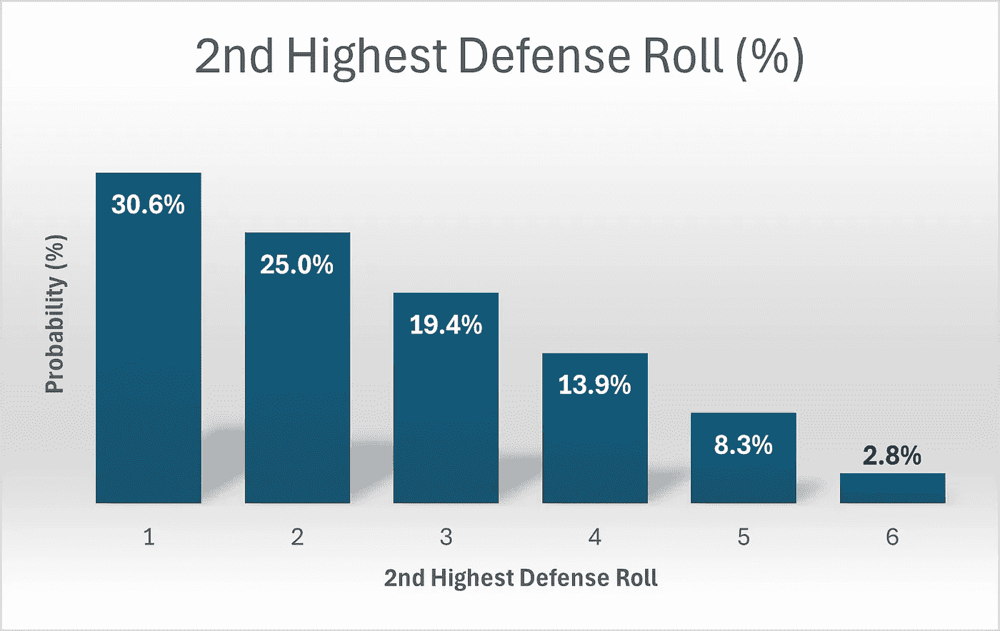

# 《风险背后的数学 — 第二部分》

> 原文：[`towardsdatascience.com/the-math-behind-risk-part-2-4a3ac74eedec?source=collection_archive---------4-----------------------#2024-07-03`](https://towardsdatascience.com/the-math-behind-risk-part-2-4a3ac74eedec?source=collection_archive---------4-----------------------#2024-07-03)

## 攻击方在世界征服游戏中真的占有优势吗？

[](https://medium.com/@menachemrose1?source=post_page---byline--4a3ac74eedec--------------------------------)[](https://towardsdatascience.com/?source=post_page---byline--4a3ac74eedec--------------------------------) [Menachem Rose](https://medium.com/@menachemrose1?source=post_page---byline--4a3ac74eedec--------------------------------)

·发表于[Towards Data Science](https://towardsdatascience.com/?source=post_page---byline--4a3ac74eedec--------------------------------) ·10 分钟阅读·2024 年 7 月 3 日

--

在第一部分中，我们讨论了在世界征服游戏《风险》中攻击和防御的相对机会。在第一部分的结尾，我们得出结论：攻击方在第一名士兵的战斗中有 47.15%的机会获胜，我们也好奇这些著名的征服者在这种情况下是如何实现他们的壮举的。我们将第二名士兵的讨论留到了第二部分。


图片由[Terry Vlisidis](https://unsplash.com/@vlisidis?utm_source=medium&utm_medium=referral)提供，来源于[Unsplash](https://unsplash.com/?utm_source=medium&utm_medium=referral)

为了提醒大家，在《风险》中，攻击方最多可以掷 3 颗骰子，而防御方最多可以掷 2 颗骰子。两者的最高掷骰结果进行比较，失败的一方失去一名士兵，防御方在平局时获胜。接下来，再比较双方的第二高掷骰结果，失败方再次失去一名士兵，防御方再次在平局时获胜。

好的，既然如此，我们开始深入探讨吧。

*(*[这里](https://github.com/Menachem631/Risk)你可以找到我确认以下概率的代码。)*

当然，关于防御方的概率，我们只是计算最低的掷骰结果，因为防御方只有两个骰子。因此，这些概率是我们之前看到的最高掷骰结果的镜像。这次，有 11 种可能性产生第二高的掷骰结果为 1，9 种为 2，7 种为 3，依此类推。这个概率可以通过除以 36 来计算，36 是防御方两个骰子所有可能的排列组合总数。


表 1 — 第二高防御掷骰概率（图片由作者提供）



图表 1 — 第二高防御掷骰的概率（图片由作者提供）

计算攻击方三个骰子的第二高掷骰与第一部分的计算有显著不同。说实话，我在这方面有些困难。在接下来的计算中，必须牢记两点。

1.  我们必须同时考虑可能的结果有多少种**以及**每个结果可能发生的方式有多少种。例如，结果(6, 2, 3)显然是一个单一的结果，但它可以以 6 种方式发生，这与每个值出现在哪个骰子上有关。它可以是{(2, 3, 6), (2, 6, 3), (3, 2, 6), (3, 6, 2), (6, 2, 3), (6, 3, 2)}中的任何一种。因此，这个结果对应于 1*6 = 6 种排列。另一个例子是，结果中**恰好**有两个 1，这实际上是 5 个结果的集合，因为剩余的骰子可以取 2 到 6 之间的任何值。**并且**它可以出现在 3 种方式中，{(1, 1, x), (1, x, 1), (x, 1, 1)}，对应于剩余骰子的 3 个可能位置，因此这个结果实际上对应于 5*3 = 15 种排列。

1.  我们必须小心对待双骰和三骰的情况。这些情况必须单独考虑，因为，虽然获得(1, 2, 3)结果有 6 种方式，但获得(1, 2, 2)只有 3 种方式，获得(2, 2, 2)只有 1 种方式。

在考虑了上述情况之后，我们可以继续进行计算。

考虑获得第二高掷骰为 1 的概率。这是相对直接的。显然，最低的掷骰也是 1。现在，我们将忽略所有 3 个骰子都是 1 的情况。然后，最高的骰子可以取 2 到 6 之间的任何值，并且可以出现在任意一个骰子上，因为我们没有指定哪个骰子包含最高的点数。这就得到了 3*5=15 种排列。加上三骰都是 1 的情况，总共有 16 种排列。通过对称的推理，我们可以计算得出同样的排列数量会得到第二高掷骰为 6 的结果。

接下来，考虑第二高掷骰为 2 的情况。现在，我们将忽略多个 2 的可能性，假设最高掷骰大于 2，最低掷骰小于 2。最高的掷骰可以取 4 个值（3-6），而最低掷骰必须为 1，共有 4 种结果，这些结果可以出现在 6 种骰子位置排列中（最高掷骰的 3 种位置可能性（骰子 1、骰子 2 或骰子 3），以及剩余的 2 种位置可能性），所以总共有 4*6=24 种排列。现在我们将考虑双 2 的情况，但不考虑三 2 的情况。如果恰好有 2 个 2，那么剩余的骰子可以取除 2 之外的 5 个值，而这个剩余的骰子可以是任意 3 个骰子中的一个，因此会增加 5*3=15 种排列。再加上三 2 的情况，总共得到 24+15+1 = 40 种排列。类似的推理结果对于第二高掷骰为 5 的情况也适用。

最后，获得 3 或 4 的概率如何呢？我们从 3 开始。再次忽略多个三的可能性，最高点数可以是三个值中的任意一个（4、5 或 6），而较低点数可以是两个值中的任意一个（1 或 2），因此总共有 6 种结果。这种情况可以在任意六种骰子排列中发生，总共为 6*6 = 36 种排列组合。在恰好两个三的情况下，另一个骰子的点数可以是 5 个值中的任何一个（除 3 以外的任何值），并且可以出现在任意三个骰子中的一个，总共为 5*3 = 15 种排列组合。再加上三个三的可能性，得到的排列组合总数为 36+15+1=52 种。类似的计算可以得出第二高点数为 4 的排列组合也有 52 种。这些结果总结在下面的图示中。


表 2 — 第二高进攻点数的概率（图像由作者提供）


图表 2 — 第二高进攻点数的概率（图像由作者提供）

注意，进攻结果的概率是完全对称的。更精确地说，P(x) = P(6-x)。我们稍后会回到这个点。

接下来，我们直接比较进攻和防守的概率。


图表 3 — 第二高点数的概率（图像由作者提供）

我们可以看到，进攻在这里具有明显的优势。进攻获得 4、5 或 6 的点数的可能性远高于防守。

我们现在准备计算第二个士兵获胜的相对概率。这个部分与我们在第一部分中做的并行计算基本一致。我们需要计算防守取得第二高点数为 x 的排列组合数，然后确定其中有多少排列组合会导致防守直接获胜、平局或进攻获胜。

例如，由于如上所述，防守的第二高点数为 5 的概率是 3/36，并且总共有 6⁵= 7776 种排列组合，显然(3/36) * 7776 = 648 种排列组合会使防守的第二高点数为 5。为了获胜，进攻需要得到第二高点数为 6 的掷骰结果，之前计算过，这一概率为 16/216，因此(16/216) * 648 = 48 种排列组合中，防守的第二高点数为 5 的情况下，进攻将获胜。为了平局，进攻必须掷出第二高点数为 5 的结果，这一概率为 40/216，因此(40/216) * 648 = 120 种排列组合会导致平局，剩下的(648–120–48 = 480)种排列组合将导致防守直接获胜。


表 3 — 排列组合计数（图像由作者提供）

我们还可以计算相应的条件概率，即在**给定**某一防守点数的情况下，计算各队的获胜概率。


表 4 — 条件概率（图像由作者提供）


图表 4 — 条件概率（图片来源：作者）

请注意，上述表格和图表的完全对称性。因此，给定防御掷骰结果为 x 的攻击胜利概率，与给定防御掷骰结果为 6-x 的防御胜利概率相同。此外，给定防御掷骰结果为 x 的平局概率，与给定防御掷骰结果为 6-x 的平局概率相同。这当然是因为上面提到的攻击第二高掷骰结果的对称性。

与第一部分一样，表 4 和图表 4 给人一种误导性的印象。它们暗示攻击和防御处于平等地位，但这些是条件概率，因此忽略了防御掷骰结果较低的情况出现的可能性更大。

另一方面，总概率将允许我们看到这一点。在下表中，我们可以清楚地看到，尽管上面提到的条件对称性，攻击方在防御掷骰为 1 时的胜率明显高于防御方在防御掷骰为 6 时的胜率（以绝对值计）。


表 5 — 胜利总概率（图片来源：作者）

以下是根据第二高防御掷骰结果的总胜率图表。


图表 5 — 总胜率（图片来源：作者）

上述图表最终揭示了我们大多数人凭直觉感觉到的事实，无论是通过玩《风险》游戏的经验，还是通过数学本能，即攻击方具有明显优势。这个优势具体体现在第二轮战斗中。

最后，我们可以计算每种可能的攻击和防御第二高掷骰结果的联合概率。联合概率就是两个或多个事件同时发生的概率。由于攻击和防御的掷骰是独立的，联合概率只是攻击和防御各自掷骰结果的个别概率的乘积。


表 6 — 联合概率（图片来源：作者）

请参见以下图表，以便更好地可视化上述图表。注意坐标轴的配置，它已被选定以便最佳查看。


图表 6 — 联合概率（图片来源：作者）

在我们总结之前，还有一个最终因素需要考虑，那就是攻击方赢得**两名**士兵的概率。然而，与我头脑中计算的 3667 种排列和 4724 种排列（分别导致攻击方赢得第一名和第二名士兵的结果）相比，这个计算需要考虑并求和 36 个独立的排列计数。因为这个计算依赖于**防守方**的两次掷骰结果，而之前的计算只需考虑防守方较高或较低的掷骰结果。我因此不会再为自己或你枯燥地计算和求和这 36 个排列计数，而是依赖 Python 来计算排列数。接下来我将仅提供代码。

```py
from itertools import product
import numpy as np
import pandas as pd

def check_both(result, attack_dice=3):
    """
    Given a result of multiple dice, and a number of attack dice, determine whether the attack will win both soldiers,
    the defense will both soldiers, or each will win a soldier.

    :param result: array of dice results, where the attack dice are declared first
    :param attack_dice: number of dice which represent the attack dice
    :return:
    """
    if np.partition(result[:attack_dice], -1)[-1] > np.partition(result[attack_dice:], -1)[-1] and \
            np.partition(result[:attack_dice], -2)[-2] > np.partition(result[attack_dice:], -2)[-2]:
        return 'attack_both'
    elif np.partition(result[:attack_dice], -1)[-1] > np.partition(result[attack_dice:], -1)[-1] or \
            np.partition(result[:attack_dice], -2)[-2] > np.partition(result[attack_dice:], -2)[-2]:
        return 'one_one'
    else:
        return 'defense_both'

# produce array of all possible permutations of 5 dice
arr = np.array(list(product([1, 2, 3, 4, 5, 6], [1, 2, 3, 4, 5, 6], [1, 2, 3, 4, 5, 6], [1, 2, 3, 4, 5, 6],
                            [1, 2, 3, 4, 5, 6]))).transpose()

# calculate and print counts of various result types
print(pd.Series(np.apply_along_axis(check_both, axis=0, arr=arr)).value_counts())
```

在下面的图示中，停战是指攻守双方各失一名士兵，而攻击是指攻击方赢得两名士兵，防守亦然。


表格 7 — 总体结果概率（作者提供的图片）


图表 6 — 总体结果概率图（作者提供的图片）

> 我曾一度以为我终于可以使用饼图展示上面的图表而不必担心批评，但遗憾的是，概率太过相似。等待仍在继续。

我们可以看到，尽管如第一部分计算所示，防守方在第一次战斗中有些许优势，但总体上，攻击方由于在第二场战斗中占有显著的优势，依然占据上风。

## 结论

1.  攻击方获胜的概率为 60.75%。*这可以在表格 5 中清楚地看到。*

1.  防守方直接获胜的概率为 22.58%。*这可以在表格 5 中清楚地看到。*

1.  平局的概率，或许稍微令人惊讶，恰好是 1/6，或 16.67%。*这可以在表格 5 中清楚地看到。*

1.  如果防守方的第二高掷骰结果是 3，那么他的获胜概率（包括平局的概率）恰好是 50/50。*这可以在表格 4 中看到。*

1.  攻击方第二高掷骰的概率是完全对称的。*这可以在表格 2 中看到。*

1.  条件概率是完全对称的。*这可以在表格 4 中看到。*

1.  最有可能的总体结果，概率为 7.36%，是防守方掷出 1，而攻击方掷出 3 或 4。*这可以在表格 6 中看到。*

1.  攻击方同时赢得两场战斗的概率为 37.17%。*这可以在表格 7 中看到。*

1.  防守方赢得两场战斗的概率为 33.58%。*这可以在表格 7 中看到。*

1.  攻防双方各赢一场战斗的概率为 29.26%。*这可以在表格 7 中看到。*

我们现在已经能够给出对我们最初问题的明确答案。在一个 3 比 2 的骰子对战中，进攻**确实**具有总体优势。

我必须说，我很享受这次对《风险》游戏数学和概率的探讨，如果你也喜欢的话，那就更好了。

下次再见。
