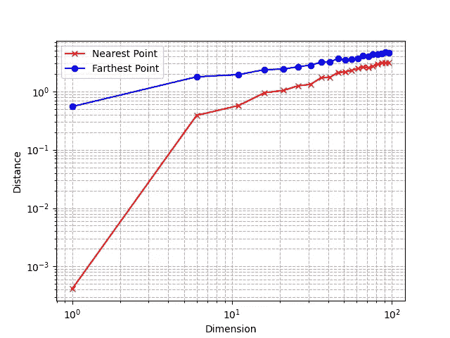
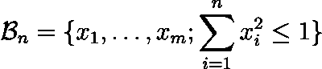
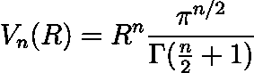
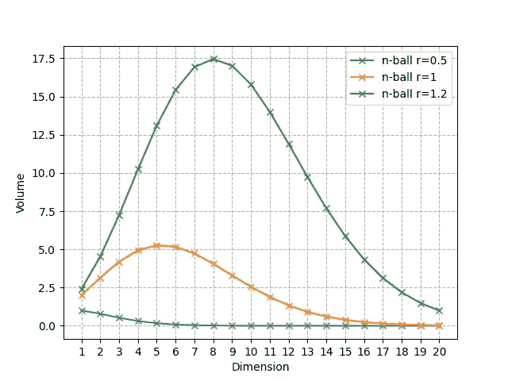
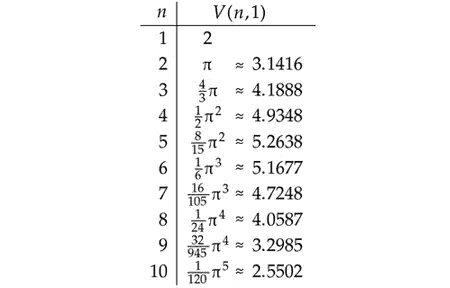
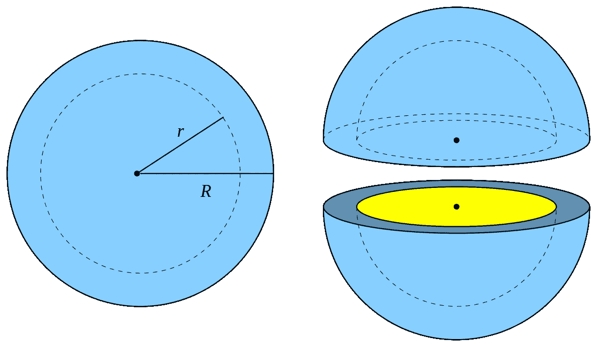
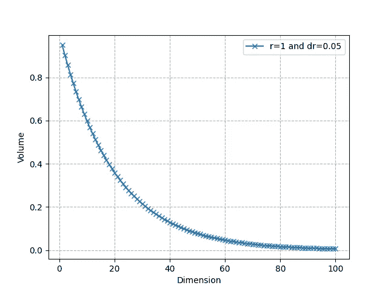

# “维度灾难”背后的数学原理

> 原文：[`towardsdatascience.com/the-math-behind-the-curse-of-dimensionality-cf8780307d74?source=collection_archive---------0-----------------------#2024-04-20`](https://towardsdatascience.com/the-math-behind-the-curse-of-dimensionality-cf8780307d74?source=collection_archive---------0-----------------------#2024-04-20)

## 深入了解“维度灾难”这一概念，并理解所有在高维中出现的惊人现象背后的数学原理。

[](https://medium.com/@maxwolf34?source=post_page---byline--cf8780307d74--------------------------------)[](https://towardsdatascience.com/?source=post_page---byline--cf8780307d74--------------------------------) [Maxime Wolf](https://medium.com/@maxwolf34?source=post_page---byline--cf8780307d74--------------------------------)

·发表于[Towards Data Science](https://towardsdatascience.com/?source=post_page---byline--cf8780307d74--------------------------------) ·阅读时长 9 分钟·2024 年 4 月 20 日

--


图片来源：Dall-E

在机器学习领域，处理高维向量不仅是常见的，而且是至关重要的。这一点可以通过流行模型如 Transformer 的架构来说明。例如，BERT 使用 768 维的向量来编码其处理的输入序列的标记，并更好地捕捉数据中的复杂模式。考虑到我们的大脑难以想象超过三维的任何事物，使用 768 维的向量确实令人震惊！

虽然一些机器学习和深度学习模型在这些高维场景中表现出色，但它们也带来了许多挑战。在本文中，我们将探讨“维度灾难”这一概念，解释与之相关的一些有趣现象，深入研究这些现象背后的数学原理，并讨论它们对你的机器学习模型的普遍影响。

请注意，与本文相关的详细数学证明[可以在我的网站上找到](https://www.maximewolf.com/blog/2024/The-Volume-of-the-nball/)，作为本文的补充延伸。

# 什么是维度灾难？

人们常常认为在三维空间中熟悉的几何概念在更高维空间中也会表现得类似，**但事实并非如此**。随着维度的增加，许多有趣且反直觉的现象会出现。“维度灾难”是著名数学家理查德·贝尔曼（Richard Bellman）提出的术语，用来描述所有这些令人惊讶的效应。

高维空间的特殊之处在于其“体积”（我们很快会更详细地探讨）是**指数增长**的。假设有一条从 1 到 10 的刻度线（1 维），这条线有 10 个整数。将其扩展到 2 维：它现在是一个边长为 10 × 10 = 100 的正方形，包含 100 个整数坐标的点。现在考虑“仅仅”80 维：你将已经有**10⁸⁰个点**，这相当于宇宙中的原子数量。

换句话说，随着维度的增加，空间的体积呈指数增长，导致数据变得**越来越稀疏**。

> 高维空间是“空的”

另一个例子是这样的。我们想计算在一个单位超立方体内两个点之间的最大距离（每条边的长度为 1）：

+   在**1 维**（超立方体是从 0 到 1 的线段）中，最大距离仅为 1。

+   在**2 维**（超立方体形成一个正方形）中，最大距离是对角线两点[0,0]和[1,1]之间的距离，即√2，通过毕达哥拉斯定理计算得出。

+   将这个概念扩展到**n 维**，位于[0,0,…,0]和[1,1,…,1]的两点之间的距离是√n。这个公式产生的原因是每增加一个维度，都为平方根下的和添加一个 1 的平方（再次应用毕达哥拉斯定理）。

有趣的是，随着维度 n 的增加，超立方体内的最大距离以 O(√n)的速度增长。这个现象展示了**递减收益效应**，即维度空间的增加导致空间距离的增益成比例地减少。关于这一效应及其影响的更多细节将在本文接下来的部分中讨论。

# 高维中的距离概念

让我们深入探讨一下在上一节中开始探索的距离概念。

我们第一次看到了高维空间如何使得距离的概念几乎变得**毫无意义**。但这到底意味着什么，我们能否在数学上可视化这种现象呢？

让我们考虑一个实验，使用之前定义的 n 维单位超立方体。首先，我们通过在这个立方体中随机采样许多点来生成一个数据集：我们实际上模拟了一个多变量均匀分布。然后，我们从这个分布中抽取另一个点（一个“查询”点），并观察**其最近邻和最远邻在数据集中的距离**。

这是对应的 Python 代码。

```py
def generate_data(dimension, num_points):
    ''' Generate random data points within [0, 1] for each coordinate in the given dimension '''
    data = np.random.rand(num_points, dimension)
    return data

def neighbors(data, query_point):
    ''' Returns the nearest and farthest point in data from query_point '''
    nearest_distance = float('inf')
    farthest_distance = 0
    for point in data:
        distance = np.linalg.norm(point - query_point)
        if distance < nearest_distance:
            nearest_distance = distance
        if distance > farthest_distance:
            farthest_distance = distance
    return nearest_distance, farthest_distance
```

我们还可以绘制这些距离：



随着 n 增加，最近邻和最远邻的距离（图由作者提供）

使用对数尺度，我们观察到，最近邻和最远邻之间的**相对**差异随着维度的增加而趋于减小。

这是一个非常违反直觉的现象：正如前一部分所解释的那样，由于空间体积的指数增长，点之间的距离非常稀疏，但与此同时，点之间的**相对**距离变得更小。

> 最近邻的概念消失了

这意味着，**距离**的概念随着空间维度的增加变得越来越不相关，也越来越难以区分。正如你可以想象的那样，这会给完全依赖于距离的机器学习算法（如 kNN）带来问题。

# 数学：n-球

现在我们将讨论一些其他有趣的现象。为此，我们需要使用**n-球**。n-球是 n 维空间中球的推广。半径为 R 的 n-球是距离空间中心 0 的点集合，其距离最大为 R。

让我们考虑半径为 1 的情况。1-球是区间[-1, 1]。2-球是由单位圆限定的圆盘，其方程为 x² + y² ≤ 1。3-球（我们通常所说的“球”）的方程是 x² + y² + z² ≤ 1。正如你所理解的，我们可以将这一定义扩展到任意维度：



现在的问题是：这个球的体积是多少？这个问题并不简单，需要用到很多数学知识，我在这里不会详细说明。然而，你可以在我的网站上找到所有的细节，参见[我关于 n-球体积的文章](https://www.maximewolf.com/blog/2024/The-Volume-of-the-nball/)。

经过一番有趣的（积分学）推导后，你可以证明 n-球的体积可以表示为如下形式，其中Γ表示[伽马函数](https://en.wikipedia.org/wiki/Gamma_function)。



例如，对于 R = 1 和 n = 2，体积为πR²，因为Γ(2) = 1。这确实是 2-球的“体积”（在这种情况下也叫做“圆的面积”）。

然而，除了作为一个有趣的数学挑战，n-球的体积还有一些非常惊人的性质。

> 随着维度 n 的增加，n-球的体积趋近于 0。

这一点对于每个半径都适用，但让我们通过几个 R 值来直观地展示这一现象。



随着维度增加，不同半径的 n-球体积（图片来源：作者）

如你所见，它最终趋近于 0，但开始时会增加，之后又下降到 0。对于 R = 1，体积最大的球是 5-球，且随着 R 的增大，达到最大值的 n 值向右移动。

这是单位 n-球体积的前几个值，直到 n = 10。



不同 n 值的单位 n-球体积（图片来源：作者）

> 高维单位球的体积集中在其表面附近。

对于低维度，球的体积看起来相当“均匀”：但在高维度中情况并非如此。



一个球壳

让我们考虑一个半径为 R 的 n-球和另一个半径为 R-dR 的 n-球，其中 dR 非常小。两个球之间的部分被称为“壳”，对应于球体表面附近的部分（见上图中的 3D 可视化）。我们可以计算球体“内部”体积与薄壳体积的比率。



随着 n 增加，比例（内部体积 / 总体积）（作者提供的图像）

正如我们所看到的，它迅速收敛到 0：在高维空间中，几乎所有的体积都集中在表面附近。例如，对于 R = 1，dR = 0.05 和 n = 50，约 92.3% 的体积集中在薄壳中。这表明，在更高维度下，体积集中在“角落”里。这再次与我们之前看到的距离概念的扭曲有关。

注意，单位超立方体的体积（这里指的是一个以零为中心、边长为 2 的立方体）是 2ⁿ。单位球在非常高的维度下基本上是“空的”，而单位超立方体则与之相反，获得了指数级增长的更多点。再一次，这表明了“最近邻”概念的效果失效，因为当维度 n 很大时，查询点 q 周围几乎没有点位于距离 R 内。

# 维度诅咒、过拟合和奥卡姆剃刀

维度诅咒与过拟合原则密切相关。由于空间体积随着维度的指数增长，我们需要非常大的数据集来充分捕捉和建模高维模式。更糟糕的是：我们需要一个随着维度指数增长的样本数量来克服这一局限性。这种情况，特征很多而数据点相对较少，特别**容易过拟合**。

奥卡姆剃刀建议，**更简单的模型通常比复杂的模型更好**，因为它们不太可能过拟合。这个原则在高维上下文中特别重要（维度诅咒发挥作用的地方），因为它鼓励减少模型复杂度。

在高维场景中应用奥卡姆剃刀原则，意味着减少问题本身的维度（通过 PCA、特征选择等方法），从而**缓解维度诅咒的某些影响**。简化模型结构或特征空间有助于管理稀疏的数据分布，并使得距离度量重新变得有意义。例如，降维是应用 kNN 算法之前一个非常常见的**初步步骤**。更近的技术，如**ANNs**（近似最近邻），也作为应对高维场景的一种方法。

# 维度的祝福？


图像由 Dall-E 提供

尽管我们概述了高维设置在机器学习中的挑战，但也有**一些优势**！

+   高维度可以增强**线性可分性**，使得像核方法这样的技术更加有效。

+   此外，深度学习架构**尤其擅长**在高维空间中导航并提取复杂模式。

和机器学习中的常见情况一样，**这是一种权衡**：利用这些优势需要在增加的计算需求与潜在的模型性能提升之间找到平衡。

# 结论

希望这能让你对高维中的“奇异”几何和它对机器学习模型开发所带来的种种挑战有所了解。我们看到，在高维空间中，数据非常稀疏，但也倾向于集中在角落，并且距离失去了它的有效性。如果你想更深入了解 n-球和数学证明，欢迎访问[我网站上的这篇文章的扩展版](https://www.maximewolf.com/blog/2024/The-Volume-of-the-nball/)。

虽然“维度灾难”揭示了高维空间中的重大限制，但看到现代深度学习模型在应对这些复杂性方面越来越娴熟，令人兴奋。例如，考虑嵌入模型或最新的 LLM，它们利用非常高维的向量更有效地识别和建模文本模式。

想了解更多关于 Transformers 以及它们如何在幕后转换你的数据吗？请查看我之前的文章：

[](/transformers-how-do-they-transform-your-data-72d69e383e0d?source=post_page-----cf8780307d74--------------------------------) ## Transformers: 它们如何转换你的数据？

### 深入了解 Transformers 架构及其为何在语言任务中无可匹敌

towardsdatascience.com

+   随时在[LinkedIn](https://www.linkedin.com/in/maxime-wolf/)上与我联系

+   在 [GitHub](https://github.com/maxime7770) 上关注我，获取更多内容

+   访问我的网站：[maximewolf.com](http://maximewolf.com)

参考文献：

+   [1] “n-球的体积。” 维基百科， [`en.wikipedia.org/wiki/Volume_of_an_n-ball`](https://en.wikipedia.org/wiki/Volume_of_an_n-ball)

+   [2] “维度灾难。” 维基百科， [`en.wikipedia.org/wiki/Curse_of_dimensionality#Blessing_of_dimensionality`](https://en.wikipedia.org/wiki/Curse_of_dimensionality#Blessing_of_dimensionality)

+   [3] Peterson, Ivars. “Nth 维的冒险。” 美国科学家， [`www.americanscientist.org/article/an-adventure-in-the-nth-dimension`](https://www.americanscientist.org/article/an-adventure-in-the-nth-dimension)

+   [4] Zhang, Yuxi. “维度灾难。” Geek Culture on Medium，2021 年 7 月，[`medium.com/geekculture/curse-of-dimensionality-e97ba916cb8f`](https://medium.com/geekculture/curse-of-dimensionality-e97ba916cb8f)

+   [5] “近似最近邻（ANN）。” Activeloop, [`www.activeloop.ai/resources/glossary/approximate-nearest-neighbors-ann/`](https://www.activeloop.ai/resources/glossary/approximate-nearest-neighbors-ann/)
